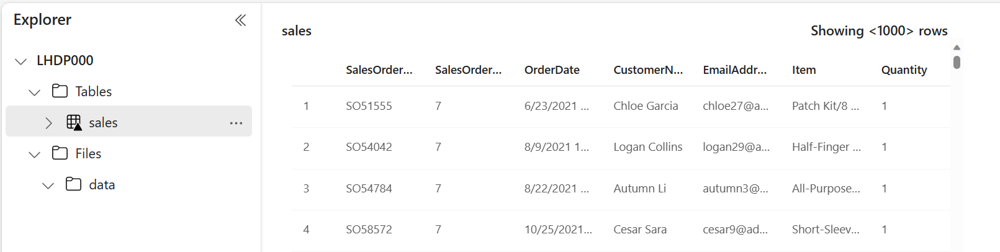
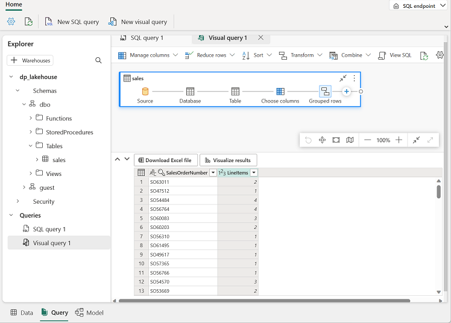

---
lab:
  title: Criar um lakehouse do Microsoft Fabric
  module: Get started with lakehouses in Microsoft Fabric
---

# Criar um Lakehouse

As soluções de análise de dados em grande escala têm sido tradicionalmente criadas em torno de um *data warehouse*, no qual os dados são armazenados em tabelas relacionais e consultados por meio do SQL. O crescimento do "Big Data" (caracterizado por grandes *volumes*, *variedade* e *velocidade* de novos ativos de dados) acompanhado da disponibilidade de armazenamento de baixo custo e tecnologias de computação distribuída em escala de nuvem levou a uma abordagem alternativa para o armazenamento de dados analíticos: o *data lake*. Em um data lake, os dados são armazenados como arquivos sem impor um esquema fixo para o armazenamento. Cada vez mais, os analistas e os engenheiros de dados buscam se beneficiar dos melhores recursos dessas duas abordagens combinando-as em um *data lakehouse*, nos quais os dados são armazenados em arquivos em um data lake e um esquema relacional é aplicado a eles como uma camada de metadados para que possam ser consultados por meio da semântica do SQL tradicional.

No Microsoft Fabric, um lakehouse fornece armazenamento de arquivos altamente escalonável em um armazenamento *OneLake* (criado no Azure Data Lake Store Gen2) com um metastore para objetos relacionais, como tabelas e exibições baseadas no formato de tabela *Delta Lake* de código aberto. O Delta Lake permite que você defina um esquema de tabelas no seu lakehouse que você pode consultar usando o SQL.

Este laboratório leva cerca de **30** minutos para ser concluído.

> **Observação**: Você precisa de uma [avaliação do Microsoft Fabric](https://learn.microsoft.com/fabric/get-started/fabric-trial) para concluir esse exercício.

## Criar um workspace

Antes de trabalhar com os dados no Fabric, crie um workspace com a avaliação do Fabric habilitada.

1. Na [página inicial do Microsoft Fabric](https://app.fabric.microsoft.com/home?experience=fabric) no `https://app.fabric.microsoft.com/home?experience=fabric`, selecione **Engenharia de Dados do Synapse**.
1. Na barra de menus à esquerda, selecione **Workspaces** (o ícone é semelhante a &#128455;).
1. Crie um workspace com um nome de sua escolha, selecionando um modo de licenciamento na seção **Avançado** que inclua a capacidade do Fabric (*Avaliação*, *Premium* ou *Malha*).
1. Quando o novo workspace for aberto, ele estará vazio.

    

## Criar um lakehouse

Agora que você tem um espaço de trabalho, é hora de criar um data lakehouse para seus arquivos de dados.

1. Na home page da **Engenharia de Dados do Synapse**, crie um **Lakehouse** com um nome de sua escolha.

    Após alguns minutos, um lakehouse será criado:

    

1. Veja o novo lakehouse e observe que o painel do **Lakehouse Explorer** à esquerda permite que você navegue pelas tabelas e pelos arquivos no lakehouse:
    - A pasta **Tabelas** contém as tabelas que você pode consultar usando a semântica do SQL. As tabelas de um lakehouse do Microsoft Fabric são baseadas no formato de arquivo *Delta Lake* de código aberto, comumente usado no Apache Spark.
    - A pasta **Arquivos** contém arquivos de dados no armazenamento OneLake para o lakehouse que não estão associados às tabelas delta gerenciadas. Você também pode criar *atalhos* nessa pasta para referenciar os dados armazenados externamente.

    Atualmente, não há tabelas nem arquivos no lakehouse.

## Fazer upload de um arquivo

O Fabric fornece várias maneiras de carregar dados no lakehouse, incluindo suporte interno para pipelines que copiam dados de fontes externas e fluxos de dados (Gen2) que você pode definir por meio de ferramentas visuais baseadas no Power Query. No entanto, uma das maneiras mais simples de ingerir pequenos volumes de dados é carregar arquivos ou pastas do computador local (ou da VM de laboratório, se aplicável).

1. Baixe o arquivo [sales.csv](https://raw.githubusercontent.com/MicrosoftLearning/dp-data/main/sales.csv) de `https://raw.githubusercontent.com/MicrosoftLearning/dp-data/main/sales.csv`, salvando-o como **sales.csv** no computador local (ou na VM do laboratório, se aplicável).

   > **Observação**: para baixar o arquivo, abra uma nova guia no navegador e cole a URL. Clique com o botão direito do mouse em qualquer lugar da página que contém os dados e selecione **Salvar como** para salvar a página como um arquivo CSV.

2. Volte à guia do navegador da Web que contém o lakehouse e, no menu **…** da pasta **Arquivos** no painel do **Lakehouse Explorer**, selecione **Nova subpasta** e crie uma subpasta chamada **data**.
3. No menu **…** da nova pasta **dados**, selecione **Carregar** e **Fazer upload de arquivos** e faça o upload do arquivo **sales.csv** do computador local (ou da VM de laboratório, se aplicável).
4. Depois que o arquivo for carregado, selecione a pasta **Arquivos/dados** e verifique se o arquivo **sales.csv** foi carregado, conforme mostrado aqui:

    

5. Selecione o arquivo **sales.csv** para ver uma visualização do conteúdo dele.

## Explorar atalhos

Em muitos cenários, os dados com os quais você precisa trabalhar no lakehouse podem ser armazenados em algum outro local. Embora haja várias maneiras de ingerir dados no armazenamento OneLake para seu lakehouse, outra opção é criar um *atalho*. Os atalhos permitem que você inclua dados de origem externa na sua solução de análise sem a sobrecarga e o risco de inconsistência de dados associados à cópia deles.

1. No menu **…** da pasta **Arquivos**, selecione **Novo atalho**.
2. Veja os tipos de fontes de dados disponíveis para os atalhos. Em seguida, feche a caixa de diálogo **Novo atalho** sem criar um atalho.

## Carregar dados de arquivo em uma tabela

Os dados de vendas carregados estão em um arquivo, com o qual os analistas e os engenheiros de dados podem trabalhar diretamente usando o código do Apache Spark. No entanto, em muitos cenários, o ideal é carregar os dados do arquivo em uma tabela para que você possa consultá-los usando o SQL.

1. Na **home page**, selecione a pasta **Arquivos/Dados** para que você possa ver o arquivo **sales.csv** que ela contém.
2. No menu **…** do arquivo **sales.csv**, selecione **Carregar em Tabelas**.
3. Na caixa de diálogo **Carregar na tabela**, defina o nome da tabela como **sales** e confirme a operação de carregamento. Em seguida, aguarde até que a tabela seja criada e carregada.

    > **Dica**: se a tabela **sales** não for exibida automaticamente, no menu **…** da pasta **Tabelas**, selecione **Atualizar**.

3. No painel do **Lakehouse Explorer**, selecione a tabela **sales** criada para ver os dados.

    

4. No menu **…** da tabela **sales**, selecione **Exibir arquivos** para ver os arquivos subjacentes dessa tabela

    

    Os arquivos de uma tabela delta são armazenados no formato *Parquet* e incluem uma subpasta chamada **_delta_log**, na qual os detalhes das transações aplicadas à tabela são registrados.

## Usar o SQL para consultar tabelas

Quando você cria um lakehouse e define tabelas nele, um ponto de extremidade SQL é criado automaticamente por meio do qual as tabelas podem ser consultadas usando instruções SQL `SELECT`.

1. No canto superior direito da página do Lakehouse, alterne do **Lakehouse** para o **Ponto de extremidade de análise do SQL**. Em seguida, aguarde um curto período até que o ponto de extremidade de análise SQL do lakehouse seja aberto em uma interface visual na qual você poderá consultar as tabelas.

2. Use o botão **Nova consulta SQL** para abrir um novo editor de consultas e insira a seguinte consulta SQL:

    ```sql
   SELECT Item, SUM(Quantity * UnitPrice) AS Revenue
   FROM sales
   GROUP BY Item
   ORDER BY Revenue DESC;
    ```
> **Observação**: Se você estiver em uma VM de laboratório e tiver problemas ao inserir a consulta SQL, poderá baixar o arquivo [01-Snippets.txt](https://github.com/MicrosoftLearning/mslearn-fabric/raw/main/Allfiles/Labs/01/Assets/01-Snippets.txt) de `https://github.com/MicrosoftLearning/mslearn-fabric/raw/main/Allfiles/Labs/01/Assets/01-Snippets.txt`, salvando-o na VM. Em seguida, você pode copiar a consulta do arquivo de texto.

3. Use o botão **&#9655; Executar** para executar a consulta e ver os resultados, que mostrarão a receita total de cada produto.

    

## Criar uma consulta visual

Embora muitos profissionais de dados estejam familiarizados com o SQL, os analistas de dados com a experiência do Power BI podem aplicar as habilidades do Power Query para criar consultas visuais.

1. Na barra de ferramentas, selecione **Nova consulta visual**.
2. Arraste a tabela **sales** para o novo painel do editor de consultas visuais que será aberto para criar uma Power Query, conforme mostrado aqui: 

    

3. No menu **Gerenciar colunas**, selecione **Escolher colunas**. Em seguida, selecione apenas as colunas **SalesOrderNumber** e **SalesOrderLineNumber**.

    

4. No menu **Transformar**, selecione **Agrupar por**. Em seguida, agrupe os dados usando as seguintes configurações **Básicas**:

    - **Agrupar por**: SalesOrderNumber
    - **Novo nome de coluna**: LineItems
    - **Operação**: Contar valores distintos
    - **Coluna**: SalesOrderLineNumber

    Quando você terminar, o painel de resultados abaixo da consulta visual mostrará o número de itens de linha para cada pedido de vendas.

    

## Criar um relatório

As tabelas em seu lakehouse são adicionadas automaticamente a um modelo semântico padrão para relatórios com o Power BI.


1. Na parte inferior da página ponto de extremidade do SQL, selecione a guia **Modelo**. O esquema de modelo de dados para o modelo semântico é mostrado.

    

    > **Observação 1**: Neste exercício, o modelo semântico consiste em uma só tabela. Em um cenário do mundo real, provavelmente, você criará várias tabelas no lakehouse, cada uma das quais será incluída no modelo. Em seguida, você poderá definir relações entre essas tabelas no modelo.
    
    > **Observação 2**: as exibições **frequently_run_queries**, **long_running_queries**, **exec_sessions_history** e **exec_requests_history** fazem parte do esquema **queryinsights** criado automaticamente pelo Fabric. É um recurso que fornece uma visão holística da atividade de consulta histórica no ponto de extremidade de análise do SQL. Como esse recurso está fora do escopo deste exercício, essas exibições devem ser ignoradas por enquanto.

2. Na faixa de opções do menu, selecione a guia **Relatório**. Em seguida, selecione **Novo relatório**. Sua página atual será alterada para um modo de exibição do designer de relatórios.

    

3. No painel **Dados** à direita, expanda a tabela **sales**. Depois, selecione os seguintes campos:
    - **Item**
    - **Quantidade**

    Uma visualização de tabela será adicionada ao relatório:

    

4. Oculte os painéis **Dados** e **Filtros** para criar mais espaço. Em seguida, verifique se a visualização da tabela está selecionada e, no painel **Visualizações**, altere a visualização para um **Gráfico de barras clusterizado** e redimensione-o conforme mostrado aqui.

    

5. No menu **Arquivo**, selecione **Salvar**. Em seguida, salve o relatório como `Item Sales Report` no workspace criado anteriormente.
6. Em seguida, na barra de menus do hub à esquerda, selecione seu workspace para verificar se ele contém os seguintes itens:
    - Seu lakehouse.
    - O ponto de extremidade de análise do SQL para o lakehouse.
    - Um modelo semântico padrão para as tabelas em seu lakehouse.
    - O relatório **Relatório de Vendas de Itens**.

## Limpar os recursos

Neste exercício, você criou um lakehouse e importou dados para ele. Você viu como um lakehouse consiste em arquivos e tabelas armazenados em um armazenamento de dados OneLake. As tabelas gerenciadas podem ser consultadas por meio do SQL e incluídas em um modelo semântico padrão para dar suporte a visualizações de dados.

Se você tiver terminado de explorar seu lakehouse, exclua o workspace criado para este exercício.

1. Na barra à esquerda, selecione o ícone do workspace para ver todos os itens que ele contém.
2. No menu **…** da barra de ferramentas, selecione **Configurações do workspace**.
3. Na seção **Geral**, selecione **Remover este espaço de trabalho**.
