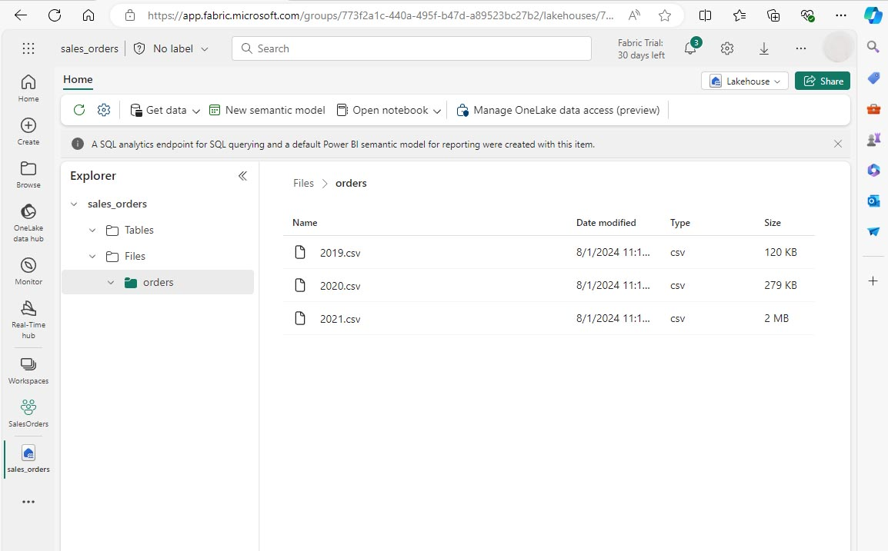
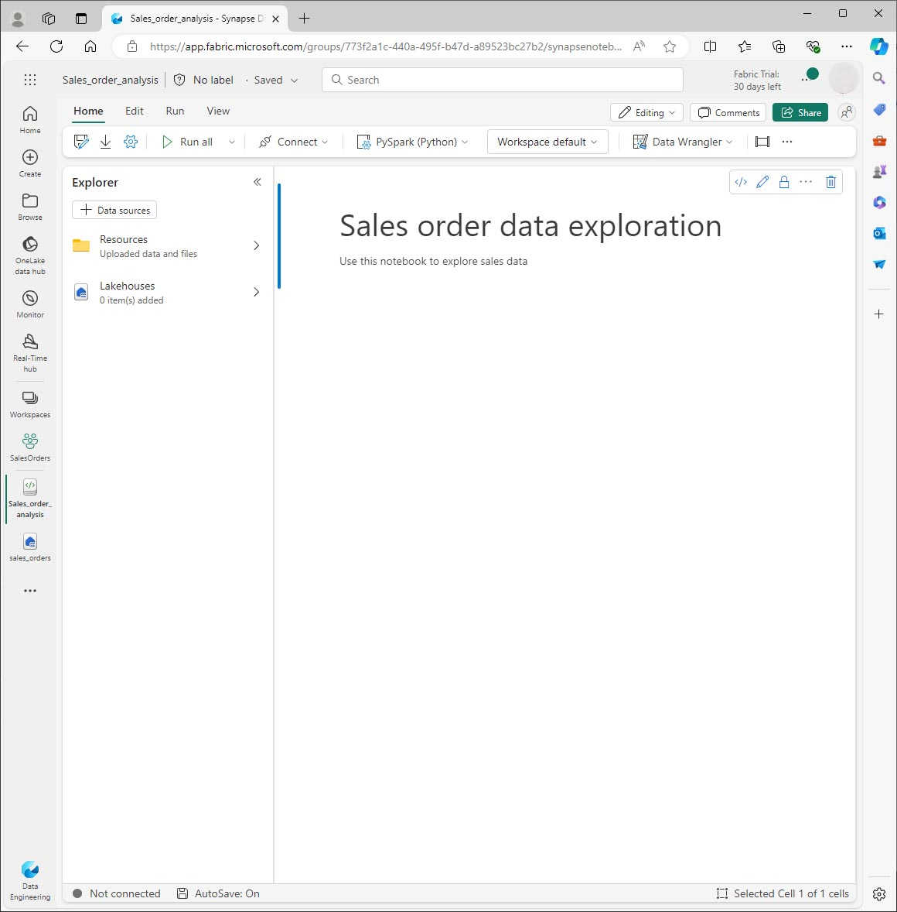
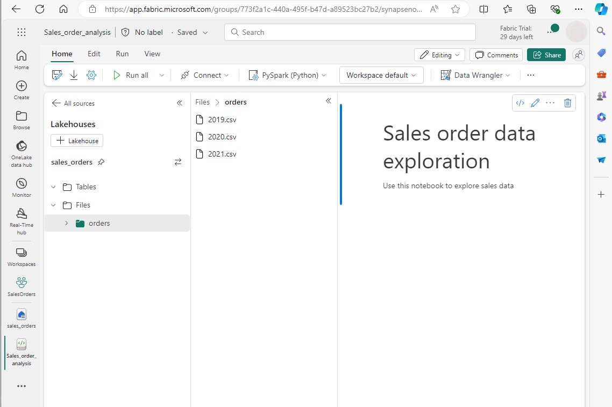
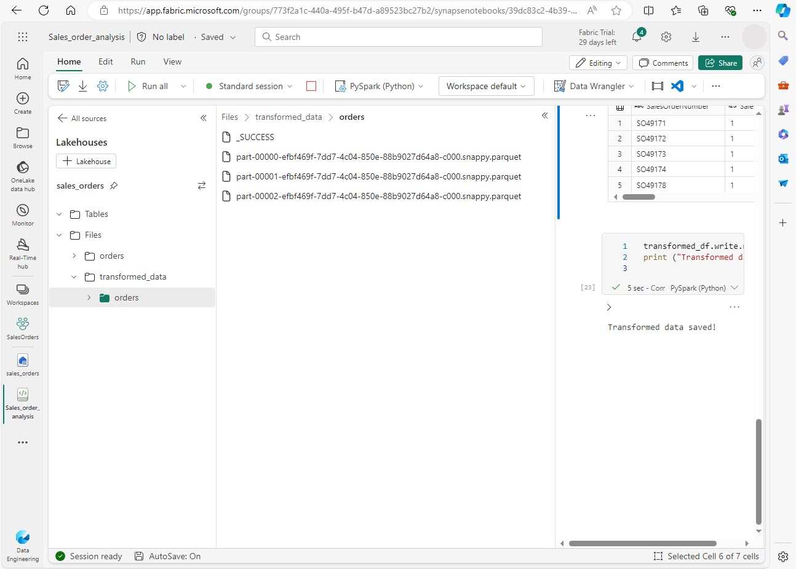

---
lab:
  title: Analisar dados com Apache Spark
  module: Use Apache Spark to work with files in a lakehouse
---

# Analisar dados com Apache Spark no Fabric

Neste laboratório, você ingerirá dados no lakehouse do Fabric e usará o PySpark para ler e analisar os dados.

Este laboratório levará aproximadamente 45 minutos para ser concluído.

## Pré-requisitos

* Uma [avaliação do Microsoft Fabric](https://www.microsoft.com/microsoft-fabric/getting-started).

## Criar um workspace

Antes de trabalhar com dados no Fabric, você precisa criar um espaço de trabalho.

1. Na home page do [Microsoft Fabric](https://app.fabric.microsoft.com) em https://app.fabric.microsoft.com, escolha a experiência **Engenharia de Dados**.
1. Na barra de navegação à esquerda, selecione **Espaços de trabalho** (🗇) e **Novo espaço de trabalho**.
1. Dê um nome ao novo espaço de trabalho e, na seção **Avançado**, escolha o Modo de licenciamento apropriado. Se você tiver iniciado uma avaliação do Microsoft Fabric, escolha Avaliação.
1. Clique em **Aplicar** para criar um espaço de trabalho vazio.
 


## Criar um lakehouse e carregar arquivos

Agora que tem um espaço de trabalho, você pode criar um lakehouse para seus arquivos de dados. No novo workspace, clique em **Novo** e **Lakehouse**. Dê um nome ao lakehouse e clique em **Criar**. Após um pequeno atraso, um novo lakehouse será criado.

Você já pode ingerir dados no lakehouse. Há várias maneiras de fazer isso, mas por ora, você baixará uma pasta de arquivos de texto no computador local (ou na VM de laboratório, se aplicável) e fará seu upload no lakehouse.

1. Baixe os arquivos de dados em https://github.com/MicrosoftLearning/dp-data/raw/main/orders.zip.
1. Extraia o arquivo compactado e verifique se você tem uma pasta chamada *orders* com três arquivos CSV: 2019.csv, 2020.csv e 2021.csv.
1. Volte para o novo lakehouse. No painel do **Explorer**, clique no menu de reticências (**...**) ao lado da pasta **Arquivos** e clique em **Carregar** e **Carregar pasta**. Navegue até a pasta de pedidos em seu computador local (ou VM de laboratório, se aplicável) e clique em **Carregar**.
1. Depois que os arquivos forem carregados, expanda **Arquivos** e clique na pasta **orders**. Verifique se os arquivo CSV foram carregados, conforme mostrado aqui:


## Criar um notebook

Agora você pode criar um notebook do Fabric para trabalhar com seus dados. Os notebooks fornecem um ambiente interativo no qual você pode escrever e executar código.

1. Escolha o seu espaço de trabalho e clique em **Novo** e **Notebook**. Após alguns segundos, um novo notebook que contém uma só célula será aberto. Os notebooks são compostos por uma ou mais células que podem conter um código ou um markdown (texto formatado).
1. O Fabric atribui um nome a cada notebook criado, como Bloco de Notebook 1, Notebook 2, etc. Clique no painel de nome acima da guia **Página Inicial** no menu para alterar o nome para algo mais descritivo.
1. Selecione a primeira célula (que atualmente é uma célula de código) e, na barra de ferramentas no canto superior direito, use o botão **M↓** para convertê-la em uma célula Markdown. O texto contido na célula será então exibido como texto formatado.
1. Use o botão 🖉 (Editar) para alternar a célula para o modo de edição e modifique o Markdown como mostrado abaixo.

```markdown
# Sales order data exploration
Use this notebook to explore sales order data
```


Quando terminar, clique em qualquer lugar no notebook fora da célula para parar de editá-lo e ver o Markdown renderizado.


## Criar um DataFrame

Agora que você criou um espaço de trabalho, um lakehouse e um notebook, você pode trabalhar com seus dados. Você usará o PySpark, que é a linguagem padrão para notebooks do Fabric, e a versão do Python otimizada para o Spark.

**OBSERVAÇÃO:** os notebooks do Fabric aceitam várias linguagens de programação, incluindo Scala, R e Spark SQL.

1. Selecione seu novo espaço de trabalho na barra à esquerda. Você verá uma lista de itens contidos no espaço de trabalho, incluindo seu lakehouse e notebook.
2. Selecione o lakehouse para exibir o painel Explorer, incluindo a pasta **orders**.
3. No menu superior, clique em **Abrir notebook**, **Notebook existente** e, em seguida, abra o notebook criado anteriormente. O notebook abrirá ao lado do painel Explorer. Expanda Lakehouses, expanda a lista Arquivos e selecione a pasta "orders". Os arquivos CSV que você carregou são listados ao lado do editor de notebook, desta maneira:



4. No menu ... de 2019.csv, selecione **Carregar dados** > **Spark**. O código é gerado automaticamente em uma nova célula de código:

```python
df = spark.read.format("csv").option("header","true").load("Files/orders/2019.csv")
# df now is a Spark DataFrame containing CSV data from "Files/orders/2019.csv".
display(df)
```

**Dica:** você pode ocultar os painéis Explorer do lakehouse à esquerda usando os ícones «. Isso dá mais espaço para o notebook.

5. Clique em ▷ **Executar célula** à esquerda da célula para executar o código.

**OBSERVAÇÃO**: como esta é a primeira vez que você executa o código Spark, uma sessão do Spark será iniciada. Isso pode levar alguns segundos ou mais. As execuções subsequentes na mesma sessão serão mais rápidas.

6. Quando o código da célula for concluído, analise a saída abaixo da célula, que deve ser semelhante a:
 


7. A saída mostra os dados do arquivo 2019.csv exibidos em linhas e as colunas.  Perceba que os cabeçalhos das colunas contêm a primeira linha dos dados. Para corrigir isso, você precisa modificar a primeira linha do código da seguinte maneira:

```python
df = spark.read.format("csv").option("header","false").load("Files/orders/2019.csv")
```

8. Execute o código novamente, para que o DataFrame identifique corretamente a primeira linha como dados. Perceba que os nomes das colunas agora mudaram para _c0, _c1, etc.

9. Nomes de coluna descritivos ajudam você a entender os dados. Para criar nomes de coluna significativos, você precisa definir o esquema e os tipos de dados. Você também precisa importar um conjunto padrão de tipos SQL do Spark para definir os tipos de dados. Substitua o código existente pelo seguinte:

```python
from pyspark.sql.types import *

orderSchema = StructType([
    StructField("SalesOrderNumber", StringType()),
    StructField("SalesOrderLineNumber", IntegerType()),
    StructField("OrderDate", DateType()),
    StructField("CustomerName", StringType()),
    StructField("Email", StringType()),
    StructField("Item", StringType()),
    StructField("Quantity", IntegerType()),
    StructField("UnitPrice", FloatType()),
    StructField("Tax", FloatType())
    ])

df = spark.read.format("csv").schema(orderSchema).load("Files/orders/2019.csv")

display(df)

```
10. Execute a célula e analise a saída:


11. Esse DataFrame só inclui os dados do arquivo 2019.csv. Modifique o código para que o caminho do arquivo use um curinga * para ler todos os dados na pasta orders:

```python
from pyspark.sql.types import *

orderSchema = StructType([
    StructField("SalesOrderNumber", StringType()),
    StructField("SalesOrderLineNumber", IntegerType()),
    StructField("OrderDate", DateType()),
    StructField("CustomerName", StringType()),
    StructField("Email", StringType()),
    StructField("Item", StringType()),
    StructField("Quantity", IntegerType()),
    StructField("UnitPrice", FloatType()),
    StructField("Tax", FloatType())
    ])

df = spark.read.format("csv").schema(orderSchema).load("Files/orders/*.csv")

display(df)
```

12. Ao executar o código modificado, você verá as vendas de 2019, 2020 e 2021. Apenas um subconjunto das linhas é exibido, portanto, talvez você não veja as linhas de todos os anos.

**OBSERVAÇÃO:** Você pode ocultar ou exibir a saída de uma célula clicando em ... ao lado do resultado. Isso facilita o trabalho em um notebook.

## Explorar dados em um DataFrame

O objeto DataFrame fornece funcionalidades adicionais, como a capacidade de filtrar, agrupar e manipular dados.

### Filtrar um DataFrame

1. Adicione uma célula de código clicando em **+ Código**, que aparece quando você passa o mouse acima ou abaixo da célula atual ou da respectiva saída. Como alternativa, no menu da faixa de opções, selecione **Editar** e **+ Adicionar** célula de código.

2.  O código a seguir filtrará os dados para que apenas duas colunas sejam retornadas. Ele também usa *count* e *distinct* para resumir o número de registros:

```python
customers = df['CustomerName', 'Email']

print(customers.count())
print(customers.distinct().count())

display(customers.distinct())
```

3. Execute o código e analise a saída:

* O código cria um novo DataFrame chamado **customers**, que contém um subconjunto de colunas do DataFrame **df** original. Ao executar uma transformação DataFrame, você não modifica o DataFrame original, mas retorna um novo.
* Outra maneira de obter o mesmo resultado é usar o método select:

```
customers = df.select("CustomerName", "Email")
```

* As funções *count* e *distinct* do DataFrame são usadas para fornecer totais do número de clientes e de clientes exclusivos.

4. Modifique a primeira linha do código usando *select* com uma função *where* da seguinte maneira:

```python
customers = df.select("CustomerName", "Email").where(df['Item']=='Road-250 Red, 52')
print(customers.count())
print(customers.distinct().count())

display(customers.distinct())
```

5. Execute o código modificado para selecionar apenas os clientes que compraram o produto Road-250 Red, 52. Você pode "encadear" várias funções para que a saída de uma função se torne a entrada da próxima. Nesse caso, o DataFrame criado pelo método *select* é o DataFrame de origem do método **where** usado para aplicar critérios de filtragem.

### Agregar e agrupar dados em um DataFrame

1. Adicione uma célula de código e insira o seguinte código:

```python
productSales = df.select("Item", "Quantity").groupBy("Item").sum()

display(productSales)
```

2. Execute o código. Observe que os resultados mostram a soma das quantidades de pedido agrupadas por produto. O método *groupBy* agrupa as linhas por Item, e a função de agregação *sum* subsequente é aplicada às colunas numéricas restantes, nesse caso, *Quantidade*.

3. Adicione outra célula de código ao notebook e insira o seguinte código nela:

```python
from pyspark.sql.functions import *

yearlySales = df.select(year(col("OrderDate")).alias("Year")).groupBy("Year").count().orderBy("Year")

display(yearlySales)
```

4. Execute a célula. Examine a saída. Os resultados mostram o número de pedidos de vendas por ano:

* A instrução *import* permite que você use a biblioteca SQL do Spark.
* O método *select* é usado com uma função year do SQL para extrair o componente de ano do campo *OrderDate*.
* O método *alias* para atribuir um nome de coluna ao valor de ano extraído.
* O método *groupBy* agrupa os dados pela coluna Year derivada.
* A contagem de linhas em cada grupo é calculada antes de o método *orderBy* ser usado para classificar o DataFrame resultante.


## Usar o Spark para transformar arquivos de dados

Uma tarefa comum para engenheiros e cientistas de dados é transformar os dados para processamento ou análise downstream adicionais.

### Usar métodos e funções de DataFrame para transformar dados

1. Adicione uma célula de código ao notebook e insira o seguinte:

```python
from pyspark.sql.functions import *

# Create Year and Month columns
transformed_df = df.withColumn("Year", year(col("OrderDate"))).withColumn("Month", month(col("OrderDate")))

# Create the new FirstName and LastName fields
transformed_df = transformed_df.withColumn("FirstName", split(col("CustomerName"), " ").getItem(0)).withColumn("LastName", split(col("CustomerName"), " ").getItem(1))

# Filter and reorder columns
transformed_df = transformed_df["SalesOrderNumber", "SalesOrderLineNumber", "OrderDate", "Year", "Month", "FirstName", "LastName", "Email", "Item", "Quantity", "UnitPrice", "Tax"]

# Display the first five orders
display(transformed_df.limit(5))
```

2. Execute a célula. Um novo DataFrame com base nos dados do pedido original com as seguintes transformações:

- Colunas Year e Month adicionadas com base na coluna OrderDate.
- Colunas FirstName e LastName adicionadas com base na coluna CustomerName.
- As colunas são filtradas e reordenadas, e a coluna CustomerName é removida.

3. Analise a saída e verifique se as transformações foram feitas nos dados.

Você pode usar a biblioteca do Spark SQL para transformar os dados filtrando linhas, derivando, removendo, renomeando colunas e aplicando outras modificações de dados.

>[!TIP]
> Confira a documentação do [dataframe do Apache Spark](https://spark.apache.org/docs/latest/api/python/reference/pyspark.sql/dataframe.html) para saber mais sobre o objeto Dataframe.

### Salvar os dados transformados

A esta altura, talvez você queira salvar os dados transformados para usá-los para análise posterior.

O *Parquet* é um formato popular de armazenamento de dados porque armazena dados com eficiência e é compatível com a maioria dos sistemas de análise de dados em grande escala. Na verdade, às vezes, o requisito de transformação de dados é converter dados de um formato, como CSV, em Parquet.

1. Para salvar o DataFrame transformado no formato Parquet, adicione uma célula de código e adicione o seguinte código:  

```python
transformed_df.write.mode("overwrite").parquet('Files/transformed_data/orders')

print ("Transformed data saved!")
```

2. Execute a célula e aguarde a mensagem indicando que os dados foram salvos. Em seguida, no painel do Lakehouses à esquerda, no menu ... do nó Arquivos, clique em **Atualizar**. Escolha a pasta transformed_data para verificar se ela contém uma nova pasta chamada orders, que por sua vez contém um ou mais arquivos Parquet.

3. Adicione uma célula com o seguinte código:

```python
orders_df = spark.read.format("parquet").load("Files/transformed_data/orders")
display(orders_df)
```

4. Execute a célula.  Um novo DataFrame é criado a partir dos arquivos parquet na pasta *transformed_data/orders*. Verifique se os resultados mostram os dados do pedido que foram carregados a partir dos arquivos Parquet.



### Salvar os dados em arquivos particionados

Ao lidar com grandes volumes de dados, o particionamento pode melhorar significativamente o desempenho e facilitar a filtragem de dados.

1. Adicione uma célula com o código para salvar o dataframe, particionando os dados por Year e Month:

```python
orders_df.write.partitionBy("Year","Month").mode("overwrite").parquet("Files/partitioned_data")

print ("Transformed data saved!")
```

2.  Execute a célula e aguarde a mensagem indicando que os dados foram salvos. Em seguida, no painel do Lakehouses à esquerda, no menu ... do nó Arquivos, clique em **Atualizar** e expanda a pasta partitioned_orders para verificar que ela contém uma hierarquia de pastas chamada *Year=xxxx*, cada uma contendo pastas chamadas *Month=xxxx*. Cada pasta mensal contém um arquivo Parquet com os pedidos desse mês.


3. Adicione uma nova célula com o seguinte código para carregar um novo DataFrame a partir do arquivo orders.parquet:

```python
orders_2021_df = spark.read.format("parquet").load("Files/partitioned_data/Year=2021/Month=*")

display(orders_2021_df)
```

4. Execute a célula e verifique se os resultados mostram os dados do pedido de vendas em 2021. Perceba que as colunas de particionamento especificadas no caminho (Year e Month) não estão incluídas no DataFrame.

## Trabalhar com tabelas e o SQL

Como você viu, os métodos nativos do objeto DataFrame permitem que você consulte e analise os dados a partir de um arquivo. No entanto, você pode se sentir mais confortável trabalhando com tabelas usando a sintaxe SQL. O Spark fornece um metastore no qual você pode definir tabelas relacionais. 

A biblioteca do Spark SQL permite o uso de instruções SQL para consultar tabelas no metastore. Isso dá a flexibilidade de um data lake com o esquema de dados estruturado e as consultas baseadas em SQL de um data warehouse relacional, daí o termo "data lakehouse".

### Criar uma tabela

As tabelas em um metastore do Spark são abstrações relacionais em arquivos no data lake. As tabelas podem ser *gerenciadas* pelo metastore ou *externas* e gerenciadas de forma independente do metastore.

1.  Adicione uma célula de código ao notebook e insira o seguinte código, que salva o DataFrame dos dados do pedido de vendas como uma tabela chamada *salesorders*:

```python
# Create a new table
df.write.format("delta").saveAsTable("salesorders")

# Get the table description
spark.sql("DESCRIBE EXTENDED salesorders").show(truncate=False)
```

>[!NOTE]
> Neste exemplo, nenhum caminho explícito é fornecido; portanto, os arquivos da tabela serão gerenciados pelo metastore. Além disso, a tabela é salva no formato delta, que adiciona recursos de banco de dados relacional às tabelas. Isso inclui suporte para transações, controle de versão de linha e outros recursos úteis. A criação de tabelas no formato delta é preferencial para data lakehouses no Fabric.

2. Execute a célula de código e analise a saída, que descreve a definição da nova tabela.

3. No painel **Lakehouses**, no menu ... da pasta Tabelas, clique em **Atualizar**. Em seguida, expanda o nó **Tabelas** e verifique se a tabela **salesorders** foi criada.


4. No menu … da tabela salesorders, clique em **Carregar dados** > **Spark**. Uma nova célula de código que contém um código semelhante ao seguinte exemplo é adicionada:

```pyspark
df = spark.sql("SELECT * FROM [your_lakehouse].salesorders LIMIT 1000")

display(df)
```

5. Execute o novo código, que usa a biblioteca do Spark SQL para inserir uma consulta SQL na tabela *salesorder* no código PySpark e carregar os resultados da consulta em um DataFrame.

### Executar um código SQL em uma célula

Embora seja útil a inserção de instruções SQL em uma célula que contém código PySpark, os analistas de dados muitas vezes preferem trabalhar diretamente com SQL.

1. Adicione uma nova célula de código ao notebook e insira o seguinte código:

```SparkSQL
%%sql
SELECT YEAR(OrderDate) AS OrderYear,
       SUM((UnitPrice * Quantity) + Tax) AS GrossRevenue
FROM salesorders
GROUP BY YEAR(OrderDate)
ORDER BY OrderYear;
```

7. Execute a célula e analise os resultados. Observe que:

* O comando **%%sql** no início da célula (chamado de magic) altera a linguagem para Spark SQL em vez de PySpark.
* O código SQL referencia a tabela *salesorders* que você já criou.
* A saída da consulta SQL é exibida automaticamente como o resultado abaixo da célula.

>[!NOTE]
> Para mais informações sobre o Spark SQL e os dataframes, confira a documentação do [Apache Spark SQL](https://spark.apache.org/sql/).

## Visualizar os dados com o Spark

Os gráficos ajudam você a ver padrões e tendências com mais rapidez do que seria possível verificando milhares de linhas de dados. Os notebooks do Fabric incluem uma exibição de gráfico integrada, mas não foram projetados para gráficos complexos. Para obter mais controle sobre como os gráficos são criados a partir de dados em DataFrames, use bibliotecas gráficas em Python como *matplotlib* ou *seaborn*.

### Exibir os resultados como um gráfico

1. Adicione uma nova célula de código e insira o seguinte código:

```python
%%sql
SELECT * FROM salesorders
```

2. Execute o código para exibir dados da exibição salesorders que você criou anteriormente. Na seção de resultados abaixo da célula, altere a opção **Exibir** de **Tabela** para **Gráfico**.

3.  Use o botão **Personalizar gráfico** no canto superior direito do gráfico para definir as seguintes opções:

* Tipo de gráfico: Gráfico de barras
* Chave: Item
* Valores: Quantidade
* Grupo de Séries: deixe em branco
* Agregação: Soma
* Empilhado: Não selecionado

Ao terminar, clique em **Aplicar**.

4. Seu gráfico será semelhante a este:

 

### Introdução à matplotlib

1. Adicione uma nova célula de código e insira o seguinte código:

```python
sqlQuery = "SELECT CAST(YEAR(OrderDate) AS CHAR(4)) AS OrderYear, \
                SUM((UnitPrice * Quantity) + Tax) AS GrossRevenue \
            FROM salesorders \
            GROUP BY CAST(YEAR(OrderDate) AS CHAR(4)) \
            ORDER BY OrderYear"
df_spark = spark.sql(sqlQuery)
df_spark.show()
```

2. Execute o código. Retornará um DataFrame do Spark contendo a receita anual. Para visualizar os dados como um gráfico, começaremos usando a biblioteca matplotlib em Python. Essa biblioteca é a biblioteca de plotagem principal na qual muitas outras se baseiam e fornece muita flexibilidade na criação de gráficos.

3. Adicione uma nova célula de código e o seguinte código:

```python
from matplotlib import pyplot as plt

# matplotlib requires a Pandas dataframe, not a Spark one
df_sales = df_spark.toPandas()

# Create a bar plot of revenue by year
plt.bar(x=df_sales['OrderYear'], height=df_sales['GrossRevenue'])

# Display the plot
plt.show()
```

4. Execute a célula e analise os resultados, que consistem em um gráfico de colunas com a receita bruta total de cada ano. Examine o código e observe o seguinte:

* A biblioteca matplotlib requer um DataFrame do Pandas; portanto, você precisa converter o DataFrame do Spark retornado pela consulta Spark SQL.
* No núcleo da biblioteca matplotlib está o objeto *pyplot*. Essa é a base para a maioria das funcionalidades de plotagem.
* As configurações padrão resultam em um gráfico utilizável, mas há muitas possibilidades de personalização.

5.  Modifique o código para plotar o gráfico da seguinte maneira:

```python
from matplotlib import pyplot as plt

# Clear the plot area
plt.clf()

# Create a bar plot of revenue by year
plt.bar(x=df_sales['OrderYear'], height=df_sales['GrossRevenue'], color='orange')

# Customize the chart
plt.title('Revenue by Year')
plt.xlabel('Year')
plt.ylabel('Revenue')
plt.grid(color='#95a5a6', linestyle='--', linewidth=2, axis='y', alpha=0.7)
plt.xticks(rotation=45)

# Show the figure
plt.show()
```

6. Execute novamente a célula de código e veja os resultados. Agora está mais fácil de entender o gráfico.
7. Um gráfico está contido com uma Figura. Nos exemplos anteriores, a figura foi criada implicitamente, mas pode ser criada explicitamente. Modifique o código para plotar o gráfico da seguinte maneira:

```python
from matplotlib import pyplot as plt

# Clear the plot area
plt.clf()

# Create a Figure
fig = plt.figure(figsize=(8,3))

# Create a bar plot of revenue by year
plt.bar(x=df_sales['OrderYear'], height=df_sales['GrossRevenue'], color='orange')

# Customize the chart
plt.title('Revenue by Year')
plt.xlabel('Year')
plt.ylabel('Revenue')
plt.grid(color='#95a5a6', linestyle='--', linewidth=2, axis='y', alpha=0.7)
plt.xticks(rotation=45)

# Show the figure
plt.show()
```

8. Execute novamente a célula de código e veja os resultados. A figura determina a forma e o tamanho do gráfico.
9. Uma figura pode conter vários subgráficos, cada um em um eixo próprio. Modifique o código para plotar o gráfico da seguinte maneira:

```python
from matplotlib import pyplot as plt

# Clear the plot area
plt.clf()

# Create a figure for 2 subplots (1 row, 2 columns)
fig, ax = plt.subplots(1, 2, figsize = (10,4))

# Create a bar plot of revenue by year on the first axis
ax[0].bar(x=df_sales['OrderYear'], height=df_sales['GrossRevenue'], color='orange')
ax[0].set_title('Revenue by Year')

# Create a pie chart of yearly order counts on the second axis
yearly_counts = df_sales['OrderYear'].value_counts()
ax[1].pie(yearly_counts)
ax[1].set_title('Orders per Year')
ax[1].legend(yearly_counts.keys().tolist())

# Add a title to the Figure
fig.suptitle('Sales Data')

# Show the figure
plt.show()
```

10. Execute novamente a célula de código e veja os resultados. 

>[!NOTE] 
> Para saber mais sobre plotagem com a matplotlib, confira a documentação da [matplotlib](https://matplotlib.org/).

### Usar a biblioteca seaborn

Embora a *matplotlib* permita que você crie diferentes tipos de gráfico, a biblioteca pode precisar de código complexo para obter os melhores resultados. Por esse motivo, novas bibliotecas foram criadas com base na matplotlib para abstrair a complexidade e aprimorar as funcionalidades. Uma dessas bibliotecas é a seaborn.

1. Adicione uma nova célula de código ao notebook e insira o seguinte código: 

```python
import seaborn as sns

# Clear the plot area
plt.clf()

# Create a bar chart
ax = sns.barplot(x="OrderYear", y="GrossRevenue", data=df_sales)

plt.show()
```

2. Execute o código para exibir um gráfico de barras usando a biblioteca seaborn.
3. Modifique o código da seguinte maneira:

```python
import seaborn as sns

# Clear the plot area
plt.clf()

# Set the visual theme for seaborn
sns.set_theme(style="whitegrid")

# Create a bar chart
ax = sns.barplot(x="OrderYear", y="GrossRevenue", data=df_sales)

plt.show()
```

4.  Execute o código modificado e observe que a seaborn permite que você defina um tema de cor para os gráficos.
5.  Modifique o código novamente da seguinte maneira:

```python
import seaborn as sns

# Clear the plot area
plt.clf()

# Create a line chart
ax = sns.lineplot(x="OrderYear", y="GrossRevenue", data=df_sales)

plt.show()
```

6.  Execute o código modificado para ver a receita anual como um gráfico de linhas.

>[!NOTE]
> Para saber mais sobre plotagem com a seaborn, confira a documentação da [seaborn](https://seaborn.pydata.org/index.html).

## Limpar os recursos

Neste exercício, você aprendeu a usar o Spark para trabalhar com dados no Microsoft Fabric.

Se você tiver terminado de explorar seus dados, encerre a sessão do Spark e exclua o espaço de trabalho criado para este exercício.

1.  No menu do notebook, selecione **Parar sessão** para encerrar a sessão do Spark.
1.  Na barra à esquerda, selecione o ícone do workspace para ver todos os itens que ele contém.
1.  Clique em **Configurações do espaço de trabalho** e, na seção **Geral**, role para baixo e selecione **Remover este espaço de trabalho**.
1.  Clique em **Excluir** para excluir o espaço de trabalho.

