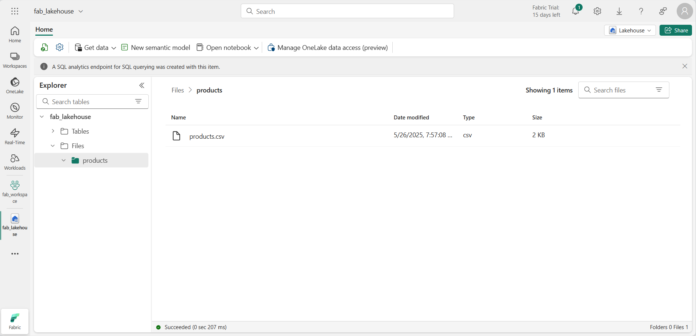
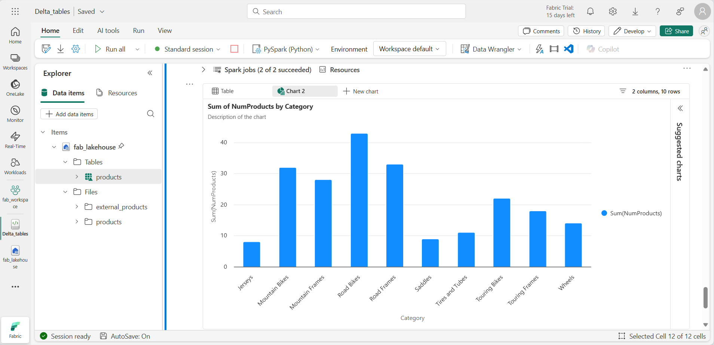

---
lab:
  title: Usar tabelas Delta no Apache Spark
  module: Work with Delta Lake tables in Microsoft Fabric
---

# Usar tabelas Delta no Apache Spark

As tabelas de um lakehouse do Microsoft Fabric são baseadas no formato Delta Lake de código aberto. O Delta Lake adiciona suporte para semântica relacional para dados em lote e de streaming. Neste exercício, você criará tabelas Delta e explorará os dados usando consultas SQL.

Este exercício deve levar aproximadamente **45** minutos para ser concluído

> [!Note] 
> Para concluir este exercício, você precisa de um [locatário do Microsoft Fabric](https://learn.microsoft.com/fabric/get-started/fabric-trial).

## Criar um workspace

Antes de trabalhar com os dados no Fabric, crie um espaço de trabalho em um locatário com a capacidade do Fabric habilitada.

1. Navegue até a [home page do Microsoft Fabric](https://app.fabric.microsoft.com/home?experience=fabric-developer) em `https://app.fabric.microsoft.com/home?experience=fabric-developer` em um navegador e entre com suas credenciais do Fabric.
1. Na barra de menus à esquerda, selecione **Workspaces** (o ícone é semelhante a &#128455;).
1. Crie um workspace com um nome de sua escolha, selecionando um modo de licenciamento na seção **Avançado** que inclua a capacidade do Fabric (*Avaliação*, *Premium* ou *Malha*).
1. Quando o novo workspace for aberto, ele estará vazio.

    

## Criar um lakehouse e carregar arquivos

Agora que você tem um espaço de trabalho, é hora de criar um data lakehouse para seus dados.

1. Na barra de menus à esquerda, selecione **Criar**. Na página *Novo*, na seção *Engenharia de Dados*, selecione **Lakehouse**. Dê um nome exclusivo de sua preferência.

    >**Observação**: se a opção **Criar** não estiver fixada na barra lateral, você precisará selecionar a opção de reticências (**...**) primeiro.

    Após alguns minutos, um lakehouse será criado:

    

1. Visualize o novo lakehouse e observe que o painel do **Explorador** à esquerda permite navegar pelas tabelas e arquivos no lakehouse:

Você já pode ingerir dados no lakehouse. Há várias maneiras de fazer isso, por enquanto, você baixará uma pasta de arquivo de texto no computador local (ou na VM de laboratório, se aplicável) e fará seu upload no lakehouse. 

1. Baixe o [arquivo de dados](https://github.com/MicrosoftLearning/dp-data/raw/main/products.csv) em `https://github.com/MicrosoftLearning/dp-data/raw/main/products.csv`, salvando-o como *products.csv*.
1. Retorne à guia do navegador da Web que contém seu lakehouse e, no painel do Explorer, ao lado da pasta **Arquivos**, clique no menu.  Crie uma **Nova subpasta** chamada *products*.
1. No menu ... da pasta products, **carregue** o arquivo *products.csv* do computador local (ou da VM do laboratório, se aplicável).
1. Depois que o arquivo for carregado, selecione a pasta **products** e verifique se o arquivo foi carregado, conforme mostrado aqui:

    
  
## Explorar dados em um DataFrame

Agora você pode criar um notebook do Fabric para trabalhar com seus dados. Os notebooks fornecem um ambiente interativo no qual você pode escrever e executar código.

1. Na barra de menus à esquerda, selecione **Criar**. Na página *Novo*, na seção *Engenharia de Dados*, selecione **Notebook**.

    Um novo notebook chamado **Notebook 1** é criado e aberto.

    

1. O Fabric atribui um nome a cada notebook criado, como Bloco de Notebook 1, Notebook 2, etc. Clique no painel de nome acima da guia **Página Inicial** no menu para alterar o nome para algo mais descritivo.
1. Selecione a primeira célula (que atualmente é uma célula de código) e, na barra de ferramentas no canto superior direito, use o botão **M↓** para convertê-la em uma célula Markdown. O texto contido na célula será então exibido como texto formatado.
1. Use o botão 🖉 (Editar) para alternar a célula para o modo de edição e modifique o Markdown como mostrado abaixo.

    ```markdown
    # Delta Lake tables 
    Use this notebook to explore Delta Lake functionality 
    ```

1. Clique em qualquer lugar do notebook fora da célula para parar de editá-lo.
1. No painel do **Explorer**, selecione **Adicionar itens de dados** e selecione **Fontes de dados existentes**. Conecte-se ao lakehouse que você criou anteriormente.
1. Adicione uma nova célula de código e o seguinte código para ler os dados de produtos em um DataFrame usando um esquema definido:

    ```python
   from pyspark.sql.types import StructType, IntegerType, StringType, DoubleType

   # define the schema
   schema = StructType() \
   .add("ProductID", IntegerType(), True) \
   .add("ProductName", StringType(), True) \
   .add("Category", StringType(), True) \
   .add("ListPrice", DoubleType(), True)

   df = spark.read.format("csv").option("header","true").schema(schema).load("Files/products/products.csv")
   # df now is a Spark DataFrame containing CSV data from "Files/products/products.csv".
   display(df)
    ```

> [!TIP]
> Oculte ou exiba os painéis do explorador usando o ícone de divisa «. Isso permite que você se concentre no notebook ou em seus arquivos.

1. Use o botão **Executar célula** (▷) à esquerda da célula para executá-la.

> [!NOTE]
> Como esta é a primeira vez que você executa qualquer código Spark neste notebook, uma sessão do Spark precisa ser iniciada. Isso significa que a primeira execução pode levar alguns minutos para ser concluída. As execuções seguintes serão mais rápidas.

1. Quando o código da célula for concluído, analise a saída abaixo da célula, que será semelhante a esta:

    
 
## Criar tabelas Delta

Você pode salvar o DataFrame como uma tabela Delta usando o método *saveAsTable*. O Delta Lake dá suporte à criação de tabelas gerenciadas e externas.

   * As tabelas Delta **gerenciadas** se beneficiam de um desempenho mais alto, uma vez que o Fabric gerencia os metadados do esquema e os arquivos de dados.
   * As tabelas **externas** permitem que você armazene dados externamente, com os metadados gerenciados pelo Fabric.

### Criar uma tabela gerenciada

Os arquivos de dados são criados na pasta **Tabelas**.

1. Nos resultados retornados pela primeira célula de código, use o ícone + Código para adicionar uma nova célula de código.

> [!TIP]
> Para ver o ícone + Código, posicione o mouse um pouco abaixo e à esquerda da saída da célula atual. Como alternativa, na barra de menus, na guia Editar, clique em **+ Adicionar célula de código**.

1. Para criar uma tabela Delta gerenciada, adicione uma célula, insira o código a seguir e execute a célula:

    ```python
   df.write.format("delta").saveAsTable("managed_products")
    ```

1. No painel do Explorador, **atualize** a pasta Tabelas e expanda o nó Tabelas para verificar se a tabela **managed_products** foi criada.

> [!NOTE]
> O ícone de triângulo ao lado do nome do arquivo indica uma tabela Delta.

Os arquivos da tabela gerenciada são armazenados na pasta **Tabelas** no lakehouse. Uma pasta chamada *managed_products* foi criada e armazena os arquivos Parquet e a pasta delta_log da tabela.

### Criar uma tabela externa

Você também pode criar tabelas externas, que podem ser armazenadas em outro lugar que não o lakehouse, com os metadados do esquema armazenados no lakehouse.

1. No painel do Explorador, no menu ... da pasta **Arquivos**, clique em **Copiar caminho do ABFS**. O caminho do ABFS é o caminho totalmente qualificado para a pasta Arquivos do lakehouse.

1. Em uma nova célula de código, cole o caminho do ABFS. Adicione o seguinte código, usando recortar e colar para inserir o abfs_path no local correto no código:

    ```python
   df.write.format("delta").saveAsTable("external_products", path="abfs_path/external_products")
    ```

1. O caminho completo será parecido com este:

    ```python
   abfss://workspace@tenant-onelake.dfs.fabric.microsoft.com/lakehousename.Lakehouse/Files/external_products
    ```

1. **Execute** a célula para salvar o DataFrame como uma tabela externa na pasta Files/external_products.

1. No painel do Explorador, **atualize** a pasta Tabelas, expanda o nó Tabelas e verifique se a tabela external_products foi criada contendo os metadados do esquema.

1. No painel do Explorador, no menu ... da pasta Arquivos, clique em **Atualizar**. Em seguida, expanda o nó Arquivos e verifique se a pasta external_products foi criada para os arquivos de dados da tabela.

### Comparar tabelas gerenciadas e externas

Vamos explorar as diferenças entre as tabelas gerenciadas e externas usando o comando magic %%sql.

1. Em uma nova célula de código, adicione e execute o seguinte código:

    ```python
   %%sql
   DESCRIBE FORMATTED managed_products;
    ```

1. Nos resultados, exiba a propriedade Local da tabela. Clique no valor Local na coluna Tipo de dados para ver o caminho completo. Observe que o local de armazenamento do OneLake termina com /Tables/managed_products.

1. Modifique o comando DESCRIBE para exibir os detalhes da tabela external_products conforme mostrado aqui:

    ```python
   %%sql
   DESCRIBE FORMATTED external_products;
    ```

1. Execute a célula e, nos resultados, exiba a propriedade Local da tabela. Amplie a coluna Tipo de dados para ver o caminho completo e observe que os locais de armazenamento do OneLake terminam com /Files/external_products.

1. Em uma nova célula de código, adicione e execute o seguinte código:

    ```python
   %%sql
   DROP TABLE managed_products;
   DROP TABLE external_products;
    ```

1. No painel do Explorador, **atualize** a pasta Tabelas para verificar se não há tabelas listadas no nó Tabelas.
1. No painel do Explorador, **atualize** a pasta Arquivos e verifique se o arquivo external_products *não* foi excluído. Clique nessa pasta para exibir os arquivos de dados do Parquet e a pasta _delta_log. 

Os metadados da tabela externa foram excluídos, mas não o arquivo de dados.

## Usar o SQL para criar uma tabela Delta

Agora você criará uma tabela Delta usando o comando magic %%sql. 

1. Adicione outra célula de código e execute o seguinte código:

    ```python
   %%sql
   CREATE TABLE products
   USING DELTA
   LOCATION 'Files/external_products';
    ```

1. No painel do Explorador, no menu ... da pasta **Tabelas**, clique em **Atualizar**. Em seguida, expanda o nó Tabelas e verifique se uma nova tabela chamada *products* está listada. Em seguida, expanda a tabela para exibir o esquema.
1. Adicione outra célula de código e execute o seguinte código:

    ```python
   %%sql
   SELECT * FROM products;
    ```

## Explorar o controle de versão de tabela

O histórico de transações das tabelas Delta é armazenado nos arquivos JSON na pasta delta_log. Você pode usar esse log de transações para gerenciar o controle de versão de dados.

1. Adicione uma nova célula de código ao notebook e execute o código a seguir, que implementa uma redução de 10% no preço das mountain bikes:

    ```python
   %%sql
   UPDATE products
   SET ListPrice = ListPrice * 0.9
   WHERE Category = 'Mountain Bikes';
    ```

1. Adicione outra célula de código e execute o seguinte código:

    ```python
   %%sql
   DESCRIBE HISTORY products;
    ```

Os resultados mostram o histórico de transações registradas para a tabela.

1. Adicione outra célula de código e execute o seguinte código:

    ```python
   delta_table_path = 'Files/external_products'
   # Get the current data
   current_data = spark.read.format("delta").load(delta_table_path)
   display(current_data)

   # Get the version 0 data
   original_data = spark.read.format("delta").option("versionAsOf", 0).load(delta_table_path)
   display(original_data)
    ```

Dois conjuntos de resultado são retornados – um contendo os dados após a redução de preço e o outro mostrando a versão original dos dados.

## Analisar os dados da tabela Delta com consultas SQL

Usando o comando magic SQL, você pode usar a sintaxe SQL em vez do Pyspark. Aqui você criará uma exibição temporária da tabela products usando uma instrução `SELECT`.

1. Adicione uma nova célula de código e execute o seguinte código para criar e exibir a exibição temporária:

    ```python
   %%sql
   -- Create a temporary view
   CREATE OR REPLACE TEMPORARY VIEW products_view
   AS
       SELECT Category, COUNT(*) AS NumProducts, MIN(ListPrice) AS MinPrice, MAX(ListPrice) AS MaxPrice, AVG(ListPrice) AS AvgPrice
       FROM products
       GROUP BY Category;

   SELECT *
   FROM products_view
   ORDER BY Category;    
    ```

1. Adicione uma nova célula de código e execute o seguinte código para retornar as dez principais categorias por número de produtos:

    ```python
   %%sql
   SELECT Category, NumProducts
   FROM products_view
   ORDER BY NumProducts DESC
   LIMIT 10;
    ```

1. Quando os dados forem retornados, selecione **+ Novo gráfico** para exibir um dos gráficos sugeridos.

    

Como alternativa, você pode executar uma consulta SQL usando o PySpark.

1. Adicione uma nova célula de código e execute o seguinte código:

    ```python
   from pyspark.sql.functions import col, desc

   df_products = spark.sql("SELECT Category, MinPrice, MaxPrice, AvgPrice FROM products_view").orderBy(col("AvgPrice").desc())
   display(df_products.limit(6))
    ```

## Usar tabelas Delta para streaming de dados.

O Delta Lake permite streaming de dados. As tabelas delta podem ser um coletor ou uma fonte para fluxos de dados criados por meio da API de Streaming Estruturado do Spark. Neste exemplo, você usará uma tabela Delta como um coletor para streaming de dados em um cenário simulado de IoT (Internet das Coisas).

1.  Adicione uma nova célula de código, o código a seguir e execute:

    ```python
    from notebookutils import mssparkutils
    from pyspark.sql.types import *
    from pyspark.sql.functions import *

    # Create a folder
    inputPath = 'Files/data/'
    mssparkutils.fs.mkdirs(inputPath)

    # Create a stream that reads data from the folder, using a JSON schema
    jsonSchema = StructType([
    StructField("device", StringType(), False),
    StructField("status", StringType(), False)
    ])
    iotstream = spark.readStream.schema(jsonSchema).option("maxFilesPerTrigger", 1).json(inputPath)

    # Write some event data to the folder
    device_data = '''{"device":"Dev1","status":"ok"}
    {"device":"Dev1","status":"ok"}
    {"device":"Dev1","status":"ok"}
    {"device":"Dev2","status":"error"}
    {"device":"Dev1","status":"ok"}
    {"device":"Dev1","status":"error"}
    {"device":"Dev2","status":"ok"}
    {"device":"Dev2","status":"error"}
    {"device":"Dev1","status":"ok"}'''

    mssparkutils.fs.put(inputPath + "data.txt", device_data, True)

    print("Source stream created...")
    ```

Verifique que o texto *Fluxo de origem criado…* será exibida. O código que você acabou de executar criou uma fonte de dados de streaming com base em uma pasta na qual alguns dados foram salvos, representando leituras de dispositivos IoT hipotéticos.

1. Em uma nova célula de código, adicione e execute o seguinte código:

    ```python
   # Write the stream to a delta table
   delta_stream_table_path = 'Tables/iotdevicedata'
   checkpointpath = 'Files/delta/checkpoint'
   deltastream = iotstream.writeStream.format("delta").option("checkpointLocation", checkpointpath).start(delta_stream_table_path)
   print("Streaming to delta sink...")
    ```

Esse código grava os dados do dispositivo de streaming no formato Delta em uma pasta chamada iotdevicedata. Como o caminho para o local da pasta na pasta Tabelas, uma tabela será criada automaticamente para ela.

1. Em uma nova célula de código, adicione e execute o seguinte código:

    ```python
   %%sql
   SELECT * FROM IotDeviceData;
    ```

Esse código consulta a tabela IotDeviceData, que contém os dados do dispositivo da fonte de streaming.

1. Em uma nova célula de código, adicione e execute o seguinte código:

    ```python
   # Add more data to the source stream
   more_data = '''{"device":"Dev1","status":"ok"}
   {"device":"Dev1","status":"ok"}
   {"device":"Dev1","status":"ok"}
   {"device":"Dev1","status":"ok"}
   {"device":"Dev1","status":"error"}
   {"device":"Dev2","status":"error"}
   {"device":"Dev1","status":"ok"}'''

   mssparkutils.fs.put(inputPath + "more-data.txt", more_data, True)
    ```

Esse código grava mais dados hipotéticos do dispositivo na fonte de streaming.

1. Execute novamente a célula que contém o seguinte código:

    ```python
   %%sql
   SELECT * FROM IotDeviceData;
    ```

Esse código consulta a tabela IotDeviceData novamente, que agora incluirá os dados extras que foram adicionados à fonte de streaming.

1. Em uma nova célula de código, adicione código para interromper o fluxo e execute a célula:

    ```python
   deltastream.stop()
    ```

## Limpar os recursos

Neste exercício, você aprendeu a trabalhar com tabelas Delta no Microsoft Fabric.

Se você tiver terminado de explorar seu lakehouse, pode excluir o espaço de trabalho criado para este exercício.

1. Na barra à esquerda, selecione o ícone do workspace para ver todos os itens que ele contém.
1. No menu ... da barra de ferramentas, clique em **Configurações do Espaço de Trabalho**.
1. Na seção Geral, clique em **Remover este espaço de trabalho**.
