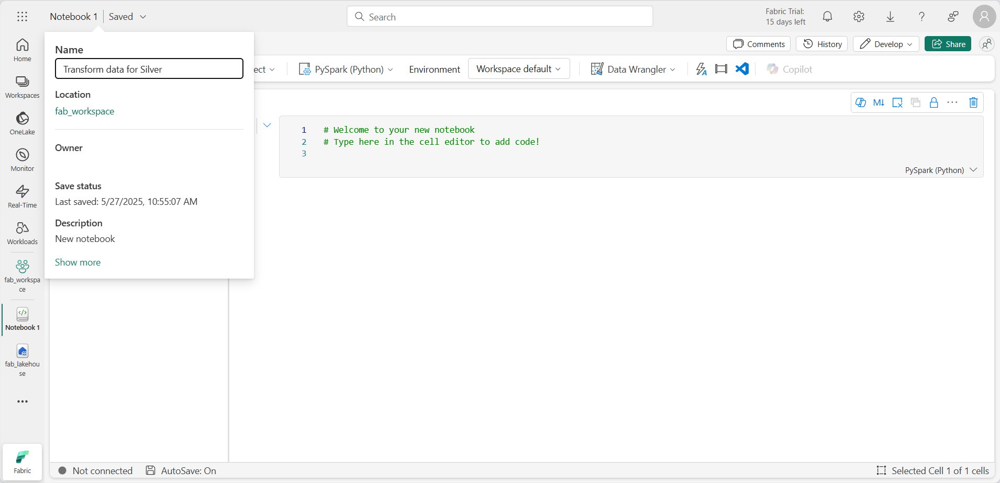

---
lab:
  title: Criar uma arquitetura de medalhão em um lakehouse do Microsoft Fabric
  module: Organize a Fabric lakehouse using medallion architecture design
---

# Criar uma arquitetura de medalhão em um lakehouse do Microsoft Fabric

Neste exercício, você criará uma arquitetura de medalhão em um Fabric Lakehouse usando notebooks. Você criará um workspace, criará um lakehouse, carregará dados na camada bronze, transformará os dados e os carregará na tabela Delta silver, transformará ainda mais os dados e os carregará nas tabelas Delta gold e explorará o conjunto de dados e criará relações.

Este exercício levará aproximadamente **40** minutos para ser concluído

> **Observação**: você precisará ter uma licença do Microsoft Fabric para concluir este exercício. Confira [Introdução ao Fabric](https://learn.microsoft.com/fabric/get-started/fabric-trial) para obter detalhes de como habilitar uma licença de avaliação gratuita do Fabric. Você precisará ter uma conta *corporativa* ou de *estudante* da Microsoft para fazer isso. Caso não tenha uma, [inscreva-se em uma avaliação do Microsoft Office 365 E3 ou superior](https://www.microsoft.com/microsoft-365/business/compare-more-office-365-for-business-plans).

## Criar um workspace e habilitar a edição do modelo de dados

Antes de trabalhar com os dados no Fabric, crie um workspace com a avaliação do Fabric habilitada.

1. Entre no [Microsoft Fabric](https://app.fabric.microsoft.com) em `https://app.fabric.microsoft.com` e selecione **Power BI**.
2. Na barra de menus à esquerda, selecione **Workspaces** (o ícone é semelhante a &#128455;).
3. Crie um workspace com um nome de sua escolha selecionando um modo de licenciamento que inclua a capacidade do Fabric (*Avaliação*, *Premium* ou *Malha*).
4. Quando o novo workspace for aberto, ele deverá estar vazio, conforme mostrado aqui:

    
5. Navegue até as configurações do workspace e habilite o recurso de versão prévia do recurso de **edição do modelo de dados**. Isso permitirá que você crie relações entre tabelas em seu lakehouse.

    

    > **Observação**: talvez seja necessário atualizar a guia do navegador depois de habilitar a versão prévia do recurso.
## Criar um lakehouse e carregar dados na camada bronze

Agora que você tem um workspace, é hora de alternar para a experiência de *Engenharia de dados* no portal do Fabric e criar um data lakehouse para os dados que você vai analisar.

1. No canto inferior esquerdo do portal do Power BI, selecione o ícone do **Power BI** e alterne para a experiência de **Engenharia de Dados**.

2. Na home page da **Engenharia de Dados do Synapse**, crie um **Lakehouse** com um nome de sua escolha.

    Após alguns minutos, um lakehouse vazio. Você precisa ingerir alguns dados no data lakehouse para análise. Há várias maneiras de fazer isso, mas neste exercício, você apenas baixará um arquivo de texto no computador local (ou na VM de laboratório, se aplicável) e o carregará no lakehouse.

3. Baixe o arquivo de dados para este exercício em `https://github.com/MicrosoftLearning/dp-data/blob/main/orders.zip`. Extraia os arquivos e salve-os com seus nomes originais em seu computador local (ou VM de laboratório, se aplicável). Deve haver três arquivos contendo dados de vendas por três anos: 2019.csv, 2020.csv e 2021.csv.

4. Volte à guia do navegador da Web que contém o lakehouse e, no menu **…** da pasta **Arquivos** no painel do **Explorer**, selecione **Nova subpasta** e crie uma pasta chamada **bronze**.

5. No menu **…** da pasta **bronze**, selecione **Carregar** e **Carregar arquivos** e carregue os três arquivos (2019.csv, 2020.csv e 2021.csv) do computador local (ou da VM de laboratório, se aplicável) para o lakehouse. Use a tecla shift para carregar todos os três arquivos ao mesmo tempo.
   
6. Depois que os arquivos forem carregados, expanda a pasta **bronze** e verifique se os arquivos foram carregados, conforme mostrado aqui:

    

## Transformar dados e carregar na tabela Delta silver

Agora que você tem alguns dados na camada bronze do lakehouse, pode usar um notebook para transformar os dados e carregá-los em uma tabela delta na camada silver. 

1. Na **Home page**, ao exibir o conteúdo da pasta **bronze** no data lake, no menu **Abrir notebook**, selecione **Novo notebook**.

    Após alguns segundos, um novo notebook que contém uma só *célula* será aberto. Os notebooks são compostos por uma ou mais células que podem conter um *código* ou um *markdown* (texto formatado).

2. Quando o notebook for aberto, renomeie-o como **Transformar dados para Silver** selecionando o texto **Notebook xxxx** na parte superior esquerda do notebook e inserindo o novo nome.

    

2. Selecione a célula existente no notebook, que contém um código simples com comentários. Realce e exclua essas duas linhas – você não precisará desse código.
   
   > **Observação**: os notebooks permitem que você execute código em uma variedade de linguagens, incluindo Python, Scala e SQL. Neste exercício, você usará o PySpark e o SQL. Você também pode adicionar células de markdown para fornecer texto formatado e imagens para documentar seu código.

3. Cole o seguinte código na célula:

    ```python
    from pyspark.sql.types import *
    
    # Create the schema for the table
    orderSchema = StructType([
        StructField("SalesOrderNumber", StringType()),
        StructField("SalesOrderLineNumber", IntegerType()),
        StructField("OrderDate", DateType()),
        StructField("CustomerName", StringType()),
        StructField("Email", StringType()),
        StructField("Item", StringType()),
        StructField("Quantity", IntegerType()),
        StructField("UnitPrice", FloatType()),
        StructField("Tax", FloatType())
        ])

    # Import all files from bronze folder of lakehouse
    df = spark.read.format("csv").option("header", "true").schema(orderSchema).load("Files/bronze/*.csv")
    
    # Display the first 10 rows of the dataframe to preview your data
    display(df.head(10))
    ```

4. Use o botão **&#9655;** (*Executar célula*) à esquerda da célula para executar o código.

    > **Observação**: como esta é a primeira vez que você executa qualquer código Spark neste notebook, uma sessão do Spark precisa ser iniciada. Isso significa que a primeira execução pode levar alguns minutos para ser concluída. As execuções seguintes serão mais rápidas.

5. Quando o comando de célula for concluído, analise a saída abaixo da célula, que deve ser semelhante a esta:

    | Índice | SalesOrderNumber | SalesOrderLineNumber | OrderDate | CustomerName | Email | Item | Quantidade | UnitPrice | Imposto |
    | -- | -- | -- | -- | -- | -- | -- | -- | -- | -- |
    | 1 | SO49172 | 1 | 01/01/2021 | Brian Howard | brian23@adventure-works.com | Road-250 Red, 52 | 1 | 2443.35 | 195.468 |
    | 2 |  SO49173 | 1 | 01/01/2021 | Linda Alvarez | Mountain-200 Silver, 38 | 1 | 2071.4197 | 165.7136 |
    | ... | ... | ... | ... | ... | ... | ... | ... | ... | ... |

    O código que você executou carregou os dados dos arquivos CSV na pasta **bronze** em um dataframe do Spark e, em seguida, exibiu as primeiras linhas do dataframe.

    > **Observação**: você pode limpar, ocultar e redimensionar automaticamente o conteúdo da saída da célula selecionando o menu **...** na parte superior esquerda do painel de saída.

6. Agora você adicionará colunas para validação e limpeza de dados, usando um dataframe do PySpark para adicionar colunas e atualizar os valores de algumas das colunas existentes. Use o botão + para adicionar um novo bloco de código e adicione o seguinte código à célula:

    ```python
    from pyspark.sql.functions import when, lit, col, current_timestamp, input_file_name
    
    # Add columns FileName, IsFlagged, CreatedTS and ModifiedTS for data validation and tracking
    df = df.withColumn("FileName", input_file_name())
    df = df.withColumn("IsFlagged", when(col("OrderDate") < '2019-08-01',True).otherwise(False))
    df = df.withColumn("CreatedTS", current_timestamp()).withColumn("ModifiedTS", current_timestamp())
    df = df.withColumn("CustomerID", lit(None).cast("BigInt"))
    df = df.withColumn("ItemID", lit(None).cast("BigInt"))
    
    # Update CustomerName to "Unknown" if CustomerName null or empty
    df = df.withColumn("CustomerName", when((col("CustomerName").isNull() | (col("CustomerName")=="")),lit("Unknown")).otherwise(col("CustomerName")))
    ```

    A primeira linha do código que você executou importa as funções necessárias do PySpark. Em seguida, você está adicionando novas colunas ao dataframe para que possa acompanhar o nome do arquivo de origem, se o pedido foi sinalizado como sendo de antes do ano fiscal de interesse e quando a linha foi criada e modificada. 
    
    Você também está adicionando colunas para CustomerID e ItemID, que serão populadas posteriormente.
    
    Por fim, você está atualizando a coluna CustomerName para "Desconhecido" se ela for nula ou vazia.

7. Execute a célula para executar o código usando o botão **&#9655;** (*Executar célula*).

8. Em seguida, você usará a mágica do SQL para criar seu dataframe limpo como uma nova tabela chamada sales_silver no banco de dados de vendas usando o formato Delta Lake. Crie um novo bloco de código e adicione o seguinte código à célula:

    ```python
     %%sql
    
    -- Create sales_silver table 
    CREATE TABLE sales.sales_silver (
        SalesOrderNumber string
        , SalesOrderLineNumber int
        , OrderDate date
        , CustomerName string
        , Email string
        , Item string
        , Quantity int
        , UnitPrice float
        , Tax float
        , FileName string
        , IsFlagged boolean
        , CustomerID bigint
        , ItemID bigint
        , CreatedTS date
        , ModifiedTS date
    ) USING delta;
    ```

    Este código usa o comando magic `%sql` para executar instruções SQL. A primeira instrução cria um novo banco de dados chamado **vendas**. A segunda instrução cria uma nova tabela chamada **sales_silver** no banco de dados de **vendas**, usando o formato Delta Lake e o dataframe que você criou no bloco de código anterior.

9. Execute a célula para executar o código usando o botão **&#9655;** (*Executar célula*).

10. Selecione **...** na seção Tabelas do painel do lakehouse explorer e selecione **Atualizar**. Agora você deve ver a nova tabela **sales_silver** listada. O ícone de triângulo indica que é uma tabela Delta.

    

    > **Observação**: se você não vir a nova tabela, aguarde alguns segundos e selecione **Atualizar** novamente ou atualize a guia inteira do navegador

11. Agora você executará uma operação upsert em uma tabela Delta, atualizando registros existentes com base em condições específicas e inserindo novos registros quando nenhuma correspondência for encontrada. Adicione um novo bloco de código e cole o seguinte código:

    ```python
    # Update existing records and insert new ones based on a condition defined by the columns SalesOrderNumber, OrderDate, CustomerName, and Item.

    from delta.tables import *
    
    deltaTable = DeltaTable.forPath(spark, 'abfss://1daff8bf-a15d-4063-97c2-fd6381bd00b4@onelake.dfs.fabric.microsoft.com/065c411a-27de-4dec-b4fb-e1df9737f0a0/Tables/sales_silver')
    
    dfUpdates = df
    
    deltaTable.alias('silver') \
      .merge(
        dfUpdates.alias('updates'),
        'silver.SalesOrderNumber = updates.SalesOrderNumber and silver.OrderDate = updates.OrderDate and silver.CustomerName = updates.CustomerName and silver.Item = updates.Item'
      ) \
       .whenMatchedUpdate(set =
        {
          
        }
      ) \
     .whenNotMatchedInsert(values =
        {
          "SalesOrderNumber": "updates.SalesOrderNumber",
          "SalesOrderLineNumber": "updates.SalesOrderLineNumber",
          "OrderDate": "updates.OrderDate",
          "CustomerName": "updates.CustomerName",
          "Email": "updates.Email",
          "Item": "updates.Item",
          "Quantity": "updates.Quantity",
          "UnitPrice": "updates.UnitPrice",
          "Tax": "updates.Tax",
          "FileName": "updates.FileName",
          "IsFlagged": "updates.IsFlagged",
          "CustomerID": "updates.CustomerID",
          "ItemID": "updates.ItemID",
          "CreatedTS": "updates.CreatedTS",
          "ModifiedTS": "updates.ModifiedTS"
        }
      ) \
      .execute()
    ```
    Essa operação é importante porque permite que você atualize os registros existentes na tabela com base nos valores de colunas específicas e insira novos registros quando nenhuma correspondência for encontrada. Esse é um requisito comum quando você está carregando dados de um sistema de origem que pode conter atualizações para registros existentes e novos registros.

Agora você tem dados em sua tabela delta silver que estão prontos para transformação e modelagem adicionais.
    

## Transformar dados para a camada ouro

Você extraiu com êxito os dados da camada bronze, transformou-os e carregou-os em uma tabela Delta silver. Agora você usará um novo notebook para transformar ainda mais os dados, modelá-los em um esquema em estrela e carregá-los em tabelas Delta gold.

Observe que você poderia ter feito tudo isso em um único notebook, mas para os fins deste exercício você está usando notebooks separados para demonstrar o processo de transformação de dados de bronze para silver e, em seguida, de silver para ouro. Isso pode ajudar na depuração, solução de problemas e reutilização.

1. Retorne à página inicial da **Engenharia de Dados** e crie um novo notebook chamado **Transformar dados para Ouro**.

2. No painel do Lakehouse Explorer, adicione seu lakehouse de **vendas** selecionando **Adicionar** e, em seguida, selecionando o lakehouse de **vendas** que você criou anteriormente. Você deverá ver a tabela **sales_silver** listada na seção **Tabelas** do painel explorer.

3. No bloco de código existente, remova o texto clichê e adicione o seguinte código para carregar dados no dataframe e começar a compilar o esquema em estrela:

    ```python
    # Load data to the dataframe as a starting point to create the gold layer
    df = spark.read.table("Sales.sales_silver")
    ```

4. Adicione um novo bloco de código e cole o seguinte código para criar sua tabela de dimensões de data:

    ```python
        %%sql
    -- Create Date_gold dimension table
    CREATE TABLE IF NOT EXISTS sales.dimdate_gold (
        OrderDate date
        , Day int
        , Month int
        , Year int
        , `mmmyyyy` string
        , yyyymm string
    ) USING DELTA;
    
    ```
    > **Observação**: você pode executar o comando `display(df)` a qualquer momento para verificar o progresso do seu trabalho. Nesse caso, você executaria "display(dfdimDate_gold)" para ver o conteúdo do dataframe dimDate_gold.

5. Em um novo bloco de código, adicione o seguinte código para atualizar a dimensão de data conforme novos dados são fornecidos:

    ```python
    from delta.tables import *

    deltaTable = DeltaTable.forPath(spark, 'abfss://1daff8bf-a15d-4063-97c2-fd6381bd00b4@onelake.dfs.fabric.microsoft.com/065c411a-27de-4dec-b4fb-e1df9737f0a0/Tables/dimdate_gold')
    
    dfUpdates = dfdimDate_gold
    
    deltaTable.alias('silver') \
      .merge(
        dfUpdates.alias('updates'),
        'silver.OrderDate = updates.OrderDate'
      ) \
       .whenMatchedUpdate(set =
        {
          
        }
      ) \
     .whenNotMatchedInsert(values =
        {
          "OrderDate": "updates.OrderDate",
          "Day": "updates.Day",
          "Month": "updates.Month",
          "Year": "updates.Year",
          "mmmyyyy": "updates.mmmyyyy",
          "yyyymm": "yyyymm"
        }
      ) \
      .execute()
    ```
5. Agora vamos criar nossa tabela de dimensões do cliente. Adicione um novo bloco de código e cole o seguinte código:

    ```python
   %%sql
    -- Create Customer dimension table
    CREATE TABLE sales.dimCustomer_gold (
        CustomerName string
        , Email string
        , First string
        , Last string
        , CustomerID BIGINT
    ) USING DELTA;
    ```
    
6. Em um novo bloco de código, adicione o seguinte código para atualizar a dimensão do cliente conforme novos dados são fornecidos:

    ```python
    from pyspark.sql.functions import col, split

    # Create Customer_gold dataframe

    dfdimCustomer_silver = df.dropDuplicates(["CustomerName","Email"]).select(col("CustomerName"),col("Email")) \
        .withColumn("First",split(col("CustomerName"), " ").getItem(0)) \
        .withColumn("Last",split(col("CustomerName"), " ").getItem(1)) \
    ```

     Aqui, você criou um novo DataFrame dfdimCustomer_silver executando várias transformações, como descartar duplicatas, selecionar colunas específicas e dividir a coluna "CustomerName" para criar colunas de nome "Primeiro" e "Último". O resultado é um DataFrame com dados de cliente limpos e estruturados, incluindo colunas de nome "First" e "Last" separadas extraídas da coluna "CustomerName".

7. Em seguida, criaremos a coluna ID para nossos clientes. Em um novo bloco de código, cole o seguinte:

    ```python
    from pyspark.sql.functions import monotonically_increasing_id, col, when

    dfdimCustomer_temp = spark.sql("SELECT * FROM dimCustomer_gold")
    CustomerIDCounters = spark.sql("SELECT COUNT(*) AS ROWCOUNT, MAX(CustomerID) AS MAXCustomerID FROM dimCustomer_gold")
    MAXCustomerID = CustomerIDCounters.select((when(col("ROWCOUNT")>0,col("MAXCustomerID"))).otherwise(0)).first()[0]
    
    dfdimCustomer_gold = dfdimCustomer_silver.join(dfdimCustomer_temp,(dfdimCustomer_silver.CustomerName == dfdimCustomer_temp.CustomerName) & (dfdimCustomer_silver.Email == dfdimCustomer_temp.Email), "left_anti")
    
    dfdimCustomer_gold = dfdimCustomer_gold.withColumn("CustomerID",monotonically_increasing_id() + MAXCustomerID)
    
    ```
    Aqui você está limpando e transformando dados do cliente (dfdimCustomer_silver) executando uma antijunção esquerda para excluir duplicatas que já existem na tabela dimCustomer_gold e, em seguida, gerando valores customerID exclusivos usando a função monotonically_increasing_id().

8. Agora você garantirá que sua tabela de clientes permaneça atualizada à medida que novos dados forem fornecidos. Em um novo bloco de código, cole o seguinte:

    ```python
    from delta.tables import *

    deltaTable = DeltaTable.forPath(spark, 'abfss://1daff8bf-a15d-4063-97c2-fd6381bd00b4@onelake.dfs.fabric.microsoft.com/065c411a-27de-4dec-b4fb-e1df9737f0a0/Tables/dimcustomer_gold')
    
    dfUpdates = dfdimCustomer_gold
    
    deltaTable.alias('silver') \
      .merge(
        dfUpdates.alias('updates'),
        'silver.CustomerName = updates.CustomerName AND silver.Email = updates.Email'
      ) \
       .whenMatchedUpdate(set =
        {
          
        }
      ) \
     .whenNotMatchedInsert(values =
        {
          "CustomerName": "updates.CustomerName",
          "Email": "updates.Email",
          "First": "updates.First",
          "Last": "updates.Last",
          "CustomerID": "updates.CustomerID"
        }
      ) \
      .execute()
    ```
9. Agora você repetirá essas etapas para criar sua dimensão de produto. Em um novo bloco de código, cole o seguinte:

    ```python
    %%sql
    -- Create Product dimension table
    CREATE TABLE sales.dimProduct_gold (
        Item string
        , ItemID BIGINT
    ) USING DELTA;
    ```    
10. Adicione outro bloco de código para criar o dataframe customer_gold. Você usará isso posteriormente na junção de Vendas.
    
    ```python
    from pyspark.sql.functions import col, split, lit

    # Create Customer_gold dataframe, this dataframe will be used later on on the Sales join
    
    dfdimProduct_silver = df.dropDuplicates(["Item"]).select(col("Item")) \
        .withColumn("ItemName",split(col("Item"), ", ").getItem(0)) \
        .withColumn("ItemInfo",when((split(col("Item"), ", ").getItem(1).isNull() | (split(col("Item"), ", ").getItem(1)=="")),lit("")).otherwise(split(col("Item"), ", ").getItem(1))) \
    
    # display(dfdimProduct_gold)
            ```

11. Now you'll prepare to add new products to the dimProduct_gold table. Add the following syntax to a new code block:

    ```python
    from pyspark.sql.functions import monotonically_increasing_id, col

    dfdimProduct_temp = spark.sql("SELECT * FROM dimProduct_gold")
    Product_IDCounters = spark.sql("SELECT COUNT(*) AS ROWCOUNT, MAX(ItemID) AS MAXProductID FROM dimProduct_gold")
    MAXProduct_ID = Product_IDCounters.select((when(col("ROWCOUNT")>0,col("MAXProductID"))).otherwise(0)).first()[0]
    
    
    dfdimProduct_gold = dfdimProduct_gold.withColumn("ItemID",monotonically_increasing_id() + MAXProduct_ID)
    
    #display(dfdimProduct_gold)

12.  Similar to what you've done with your other dimensions, you need to ensure that your product table remains up-to-date as new data comes in. In a new code block, paste the following:
    
    ```python
    from delta.tables import *
    
    deltaTable = DeltaTable.forPath(spark, 'abfss://Learn@onelake.dfs.fabric.microsoft.com/Sales.Lakehouse/Tables/dimproduct_gold')
    
    dfUpdates = dfdimProduct_gold
    
    deltaTable.alias('silver') \
      .merge(
        dfUpdates.alias('updates'),
        'silver.ItemName = updates.ItemName AND silver.ItemInfo = updates.ItemInfo'
      ) \
       .whenMatchedUpdate(set =
        {
          
        }
      ) \
     .whenNotMatchedInsert(values =
        {
          "ItemName": "updates.ItemName",
          "ItemInfo": "updates.ItemInfo",
          "ItemID": "updates.ItemID"
        }
      ) \
      .execute()
    ```

    Isso calcula a próxima ID do produto disponível com base nos dados atuais na tabela, atribui essas novas IDs aos produtos e exibe as informações atualizadas do produto (se o comando de exibição não for descompactado).

Agora que você criou suas dimensões, a etapa final é criar a tabela de fatos.

13. Em um novo bloco de código, cole o seguinte código para criar a tabela de fatos:

    ```python
       %%sql
    -- Create Date_gold dimension table if not exist
    CREATE TABLE IF NOT EXISTS sales.factsales_gold (
        CustomerID BIGINT
        , ItemID BIGINT
        , OrderDate date
        , Quantity INT
        , UnitPrice float
        , Tax float
    ) USING DELTA;
    ```
14. Em um novo bloco de código, cole o seguinte código para criar um novo dataframe para combinar dados de vendas com informações do cliente e do produto, incluindo ID do cliente, ID do item, data do pedido, quantidade, preço unitário e imposto:

    ```python
    from pyspark.sql.functions import col

    dfdimCustomer_temp = spark.sql("SELECT * FROM dimCustomer_gold")
    dfdimProduct_temp = spark.sql("SELECT * FROM dimProduct_gold")
    
    df = df.withColumn("ItemName",split(col("Item"), ", ").getItem(0)) \
        .withColumn("ItemInfo",when((split(col("Item"), ", ").getItem(1).isNull() | (split(col("Item"), ", ").getItem(1)=="")),lit("")).otherwise(split(col("Item"), ", ").getItem(1))) \
    
    # Create Sales_gold dataframe
    
    dffactSales_gold = df.alias("df1").join(dfdimCustomer_temp.alias("df2"),(df.CustomerName == dfdimCustomer_temp.CustomerName) & (df.Email == dfdimCustomer_temp.Email), "left") \
            .join(dfdimProduct_temp.alias("df3"),(df.ItemName == dfdimProduct_temp.ItemName) & (df.ItemInfo == dfdimProduct_temp.ItemInfo), "left") \
        .select(col("df2.CustomerID") \
            , col("df3.ItemID") \
            , col("df1.OrderDate") \
            , col("df1.Quantity") \
            , col("df1.UnitPrice") \
            , col("df1.Tax") \
        ).orderBy(col("df1.OrderDate"), col("df2.CustomerID"), col("df3.ItemID"))
    
    
    display(dffactSales_gold)
    ```

15. Agora, você garantirá que os dados de vendas permaneçam atualizados executando o seguinte código em um novo bloco de código:
    ```python
    from delta.tables import *

    deltaTable = DeltaTable.forPath(spark, 'abfss://Learn@onelake.dfs.fabric.microsoft.com/Sales.Lakehouse/Tables/factsales_gold')
    
    dfUpdates = dffactSales_gold
    
    deltaTable.alias('silver') \
      .merge(
        dfUpdates.alias('updates'),
        'silver.OrderDate = updates.OrderDate AND silver.CustomerID = updates.CustomerID AND silver.ItemID = updates.ItemID'
      ) \
       .whenMatchedUpdate(set =
        {
          
        }
      ) \
     .whenNotMatchedInsert(values =
        {
          "CustomerID": "updates.CustomerID",
          "ItemID": "updates.ItemID",
          "OrderDate": "updates.OrderDate",
          "Quantity": "updates.Quantity",
          "UnitPrice": "updates.UnitPrice",
          "Tax": "updates.Tax"
        }
      ) \
      .execute()
    ```
     Aqui você está usando a operação de mesclagem do Delta Lake para sincronizar e atualizar a tabela factsales_gold com novos dados de vendas (dffactSales_gold). A operação compara a data do pedido, a ID do cliente e a ID do item entre os dados existentes (tabela silver) e os novos dados (atualiza o DataFrame), atualizando registros correspondentes e inserindo novos registros conforme necessário.

Agora você tem uma camada ouro modelada e coletada que pode ser usada para relatórios e análises.

## Criar um conjunto de dados

No workspace, agora você pode usar a camada gold para criar um relatório e analisar os dados. Você pode acessar o conjunto de dados diretamente em seu workspace para criar relações e medidas para relatórios.

Observe que você não pode usar o conjunto de dados padrão que é criado automaticamente quando você cria um lakehouse. Você deve criar um novo conjunto de dados que inclua as tabelas gold criadas neste exercício, por meio do Lakehouse Explorer.

1. Em seu workspace, navegue até o lakehouse de **vendas**.
2. Selecione **Novo conjunto de dados do Power BI** na faixa de opções da exibição do Lakehouse Explorer.
3. Selecione suas tabelas gold transformadas para incluir no conjunto de dados e selecione **Confirmar**.
   - dimdate_gold
   - dimcustomer_gold
   - dimproduct_gold
   - factsales_gold

    Isso abrirá o conjunto de dados no Fabric, no qual você poderá criar relações e medidas.

4. Renomeie o conjunto de dados para que seja mais fácil de identificar. Selecione o nome do conjunto de dados no canto superior esquerdo da janela. Renomeie o conjunto de dados como **Sales_Gold**.

A partir daqui, você ou outros membros da sua equipe de dados podem criar relatórios e dashboards com base nos dados em seu lakehouse. Esses relatórios serão conectados diretamente à camada gold do seu lakehouse, para que eles sempre reflitam os dados mais recentes.

## Limpar os recursos

Neste exercício, você aprendeu a criar uma arquitetura de medalhão em um lakehouse do Microsoft Fabric.

Se você tiver terminado de explorar seu lakehouse, exclua o workspace criado para este exercício.

1. Na barra à esquerda, selecione o ícone do workspace para ver todos os itens que ele contém.
2. No menu **…** da barra de ferramentas, selecione **Configurações do workspace**.
3. Na seção **Outros**, selecione **Remover este workspace**.
