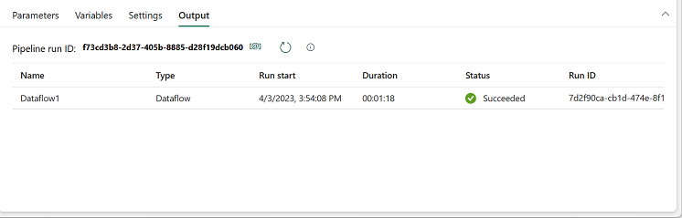

---
lab:
  title: Criar e usar Fluxos de Dados (Gen2) no Microsoft Fabric
  module: Ingest Data with Dataflows Gen2 in Microsoft Fabric
---

# Criar e usar Fluxos de Dados (Gen2) no Microsoft Fabric

No Microsoft Fabric, os Fluxos de Dados (Gen2) se conectam a várias fontes de dados e executam transformações no Power Query Online. Em seguida, eles podem ser usados em pipelines de dados para ingerir dados em um lakehouse ou em outro repositório analítico ou para definir um conjunto de dados para um relatório do Power BI.

Este laboratório foi projetado para introduzir os diferentes elementos dos Fluxos de Dados (Gen2) e não criar uma solução complexa que possa existir em uma empresa. Ele leva **cerca de 30 minutos** para ser concluído.

> **Observação**: Você precisa de uma [avaliação do Microsoft Fabric](https://learn.microsoft.com/fabric/get-started/fabric-trial) para concluir esse exercício.

## Criar um workspace

Antes de trabalhar com os dados no Fabric, crie um workspace com a avaliação do Fabric habilitada.

1. Navegue até a [home page do Microsoft Fabric](https://app.fabric.microsoft.com/home?experience=fabric) em `https://app.fabric.microsoft.com/home?experience=fabric` em um navegador e entre com suas credenciais do Fabric.
1. Na barra de menus à esquerda, selecione **Workspaces** (o ícone é semelhante a &#128455;).
1. Crie um workspace com um nome de sua escolha selecionando um modo de licenciamento que inclua a capacidade do Fabric (*Avaliação*, *Premium* ou *Malha*).
1. Quando o novo workspace for aberto, ele estará vazio.

    

## Criar um lakehouse

Agora que você tem um espaço de trabalho, é hora de criar um data lakehouse no qual você ingerirá os dados.

1. Na barra de menus à esquerda, selecione **Criar**. Na página *Novo*, na seção *Engenharia de Dados*, selecione **Lakehouse**. Dê um nome exclusivo de sua preferência.

    >**Observação**: se a opção **Criar** não estiver fixada na barra lateral, você precisará selecionar a opção de reticências (**...**) primeiro.

    Após alguns minutos, um lakehouse vazio será criado.

 

## Criar um Fluxo de Dados (Gen2) para ingerir dados

Agora que você tem um lakehouse, você precisa ingerir alguns dados nele. Uma forma de fazer isso é definir um fluxo de dados que encapsula um processo de ETL (*extração, transformação e carregamento*).

1. Na home page do lakehouse, selecione **Obter dados** > **Novo fluxo de dados Gen2**. Após alguns segundos, o editor do Power Query do novo fluxo de dados será aberto, conforme mostrado aqui.

 

2. Selecione **Importar de um arquivo de Texto/CSV** e crie uma fonte de dados com as seguintes configurações:
 - **Vincular ao arquivo**: *Selecionado*
 - **Caminho ou URL do arquivo**: `https://raw.githubusercontent.com/MicrosoftLearning/dp-data/main/orders.csv`
 - **Conexão**: crie uma conexão
 - **gateway de dados**: (nenhum)
 - **Tipo de autenticação**: Anônimo

3. Selecione **Avançar** para visualizar os dados do arquivo e **Criar** para criar a fonte de dados. O editor do Power Query mostra a fonte de dados e um conjunto inicial de etapas de consulta para formatar os dados, conforme mostrado aqui:

 

4. Na faixa de opções da barra de ferramentas, selecione a guia **Adicionar coluna**. Em seguida, selecione **Coluna personalizada** e crie uma nova coluna.

5. Defina o *Nome da nova coluna* como `MonthNo`, defina o *Tipo de dados* como **Número inteiro** e adicione a seguinte fórmula: `Date.Month([OrderDate])` – conforme mostrado aqui:

 

6. Selecione **OK** para criar a coluna e observe como a etapa para adicionar a coluna personalizada é adicionada à consulta. A coluna resultante é exibida no painel de dados:

 

> **Dica:** no painel Configurações de Consulta no lado direito, observe que as **Etapas Aplicadas** incluem cada etapa de transformação. Na parte inferior, você também pode ativar o botão **Fluxo de diagrama** para ativar o Diagrama Visual das etapas.
>
> As etapas podem ser movidas para cima ou para baixo e editadas com a seleção do ícone de engrenagem, e você pode selecionar cada etapa para ver as transformações aplicadas no painel de visualização.

7. Verifique e confirme se o tipo de dados da coluna **OrderDate** está definido como **Data** e se o tipo de dados da coluna recém-criada **MonthNo** está definido como **Número inteiro**.

## Adicionar destino de dados ao fluxo de dados

1. Na faixa de opções da barra de ferramentas, selecione a guia **Página Inicial**. Em seguida, no menu suspenso **Adicionar destino de dados**, selecione **Lakehouse**.

   > **Observação:** se essa opção está esmaecida, talvez você já tenha um conjunto de destino de dados. Verifique o destino de dados na parte inferior do painel Configurações de consulta no lado direito do editor do Power Query. Se um destino padrão já estiver definido, você poderá removê-lo e adicionar um novo.

2. Na caixa de diálogo **Conectar-se ao destino de dados**, edite a conexão e conecte-se usando sua conta organizacional do Power BI para definir a identidade usada pelo fluxo de dados para acessar o lakehouse.

 

3. Selecione **Avançar** e, na lista de workspaces disponíveis, localize seu workspace e selecione o lakehouse que você criou nele no início deste exercício. Em seguida, especifique uma nova tabela chamada **orders**:

   

4. Selecione **Avançar** e, na página **Escolher configurações de destino**, desabilite a opção **Usar configurações automáticas**, clique em **Anexar** e, em seguida, **Salvar configurações**.
    > **Observação:** sugerimos usar o editor do *Power Query* para atualizar tipos de dados, mas você também pode fazer isso nesta página, se preferir.

    

5. Na barra de menus, abra **Exibir** e selecione **Exibição de diagrama**. Observe que o destino **Lakehouse** é indicado como um ícone na consulta no editor do Power Query.

   

6. Na faixa de opções da barra de ferramentas, selecione a guia **Página Inicial**. Em seguida, selecione **Salvar e executar** e aguarde até que o **Fluxo de Dados 1** seja criado em seu workspace.

## Adicionar um fluxo de dados a um pipeline

Você pode incluir um fluxo de dados como uma atividade em um pipeline. Os pipelines são usados para orquestrar as atividades de ingestão e processamento de dados, permitindo que você combine fluxos de dados com outros tipos de operação em um processo agendado unificado. Os pipelines podem ser criados em algumas experiências diferentes, incluindo a experiência do Data Factory.

1. No workspace habilitado para Fabric, selecione **+ Novo item** > **Pipeline de dados** e, quando solicitado, crie um novo pipeline com o nome **Carregar dados**.

   O editor de pipeline será aberto.

   

   > **Dica**: se o assistente Copiar Dados for aberto automaticamente, feche-o.

2. Selecione **Atividade de pipeline** e adicione uma atividade **Fluxo de dados** ao pipeline.

3. Com a nova atividade **Fluxo de dados1** selecionada, na guia **Configurações**, na lista suspensa **Fluxo de dados**, selecione **Fluxo de dados 1** (o fluxo de dados já criado)

   

4. Na guia **Página Inicial**, salve o pipeline usando o ícone **&#128427;** (*Salvar*).
5. Use o botão **&#9655; Executar** para executar o pipeline e aguarde até que ele seja concluído. Isso pode levar alguns minutos.

   

6. Na barra de menus na borda esquerda, selecione o lakehouse.
7. No menu **…** de **Tabelas**, selecione **Atualizar**. Em seguida, expanda **Tabelas** e selecione a tabela **orders**, que foi criada pelo fluxo de dados.

   

> **Dica**: no Power BI Desktop, use o conector de *fluxos de dados do Power BI (Herdado)* para se conectar diretamente às transformações de dados feitas com o fluxo de dados.
>
> Você também pode fazer transformações adicionais, publicá-las como um novo conjunto de dados e distribuí-las com o público-alvo pretendido para conjuntos de dados especializados.
>
>

## Limpar os recursos

Se você terminou de explorar os fluxos de dados no Microsoft Fabric, exclua o workspace criado para este exercício.

1. Navegue até o Microsoft Fabric no navegador.
1. Na barra à esquerda, selecione o ícone do workspace para ver todos os itens que ele contém.
1. Clique em **Configurações do espaço de trabalho** e, na seção **Geral**, role para baixo e selecione **Remover este espaço de trabalho**.
1. Clique em **Excluir** para excluir o espaço de trabalho.
