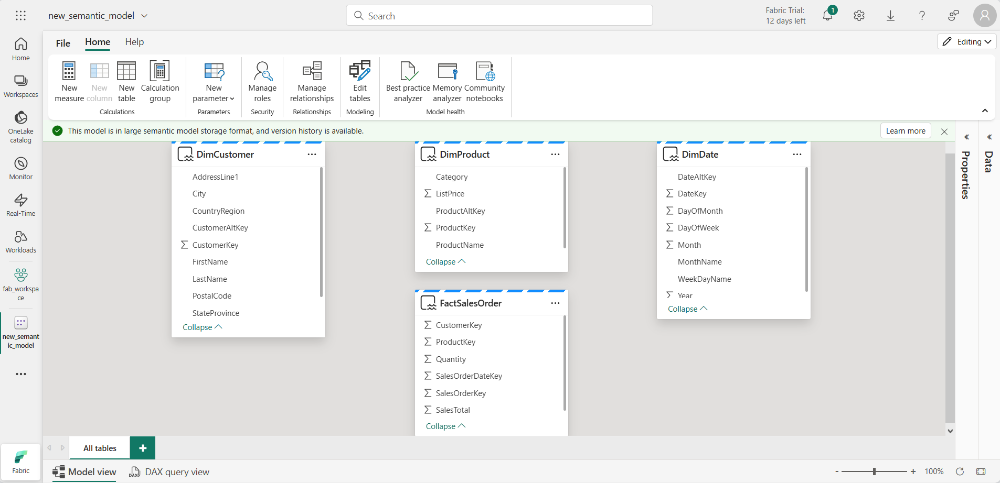
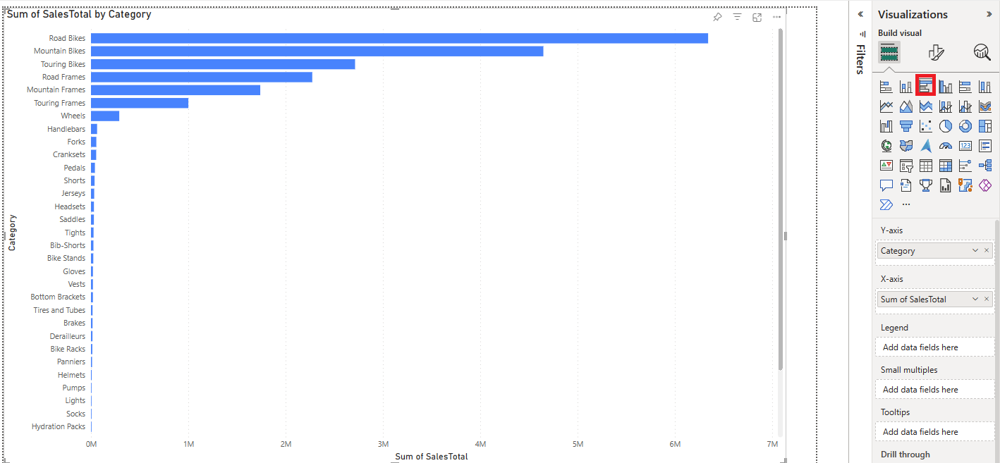
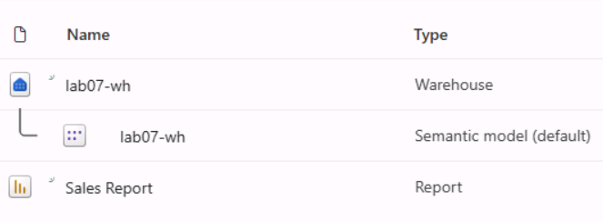

---
lab:
  title: Analisar os dados em um data warehouse
  module: Get started with data warehouses in Microsoft Fabric
---

# Analisar os dados em um data warehouse

No Microsoft Fabric, um data warehouse fornece um banco de dados relacional para análise em larga escala. Ao contrário do ponto de extremidade SQL somente leitura padrão para tabelas definido em um lakehouse, um data warehouse fornece a semântica completa do SQL, incluindo a capacidade de inserir, atualizar e excluir dados nas tabelas.

Este laboratório levará aproximadamente **30** minutos para ser concluído.

> **Observação**: Você precisará uma [avaliação gratuita do Microsoft Fabric](https://learn.microsoft.com/fabric/get-started/fabric-trial) para concluir esse exercício.

## Criar um workspace

Antes de trabalhar com os dados no Fabric, crie um workspace com a avaliação do Fabric habilitada.

1. Navegue até a [home page do Microsoft Fabric](https://app.fabric.microsoft.com/home?experience=fabric) em `https://app.fabric.microsoft.com/home?experience=fabric` em um navegador e entre com suas credenciais do Fabric.
1. Na barra de menus à esquerda, selecione **Workspaces** (o ícone é semelhante a &#128455;).
1. Crie um workspace com um nome de sua escolha selecionando um modo de licenciamento que inclua a capacidade do Fabric (*Avaliação*, *Premium* ou *Malha*).
1. Quando o novo workspace for aberto, ele estará vazio.

    

## Criar um data warehouse

Agora que você tem um espaço de trabalho, é hora de criar um data warehouse. A página inicial do Data Warehouse do Synapse inclui um atalho para criar um novo warehouse:

1. Na barra de menus à esquerda, selecione **Criar**. Na página *Novo*, na seção *Data Warehouse*, selecione **Warehouse**. Dê um nome exclusivo de sua preferência.

    >**Observação**: se a opção **Criar** não estiver fixada na barra lateral, você precisará selecionar a opção de reticências (**...**) primeiro.

    Após alguns minutos, um warehouse será criado:

    

## Criar tabelas e inserir dados

Um warehouse é um banco de dados relacional no qual você pode definir tabelas e outros objetos.

1. Em seu novo warehouse, clique no bloco **T-SQL** e use a seguinte instrução CREATE TABLE:

    ```sql
   CREATE TABLE dbo.DimProduct
   (
       ProductKey INTEGER NOT NULL,
       ProductAltKey VARCHAR(25) NULL,
       ProductName VARCHAR(50) NOT NULL,
       Category VARCHAR(50) NULL,
       ListPrice DECIMAL(5,2) NULL
   );
   GO
    ```

2. Use o botão **&#9655; Executar** para executar o script SQL, que cria uma tabela chamada **DimProduct** no esquema **dbo** do data warehouse.
3. Use o botão **Atualizar** da barra de ferramentas para atualizar a exibição. Em seguida, no painel do **Explorer**, expanda**Esquemas** > **dbo** > **Tabelas** e verifique se a tabela **DimProduct** foi criada.
4. Na guia do menu **Página Inicial**, use o botão **Nova Consulta SQL** para criar uma consulta e insira a seguinte instrução INSERT:

    ```sql
   INSERT INTO dbo.DimProduct
   VALUES
   (1, 'RING1', 'Bicycle bell', 'Accessories', 5.99),
   (2, 'BRITE1', 'Front light', 'Accessories', 15.49),
   (3, 'BRITE2', 'Rear light', 'Accessories', 15.49);
   GO
    ```

5. Execute a nova consulta para inserir três linhas na tabela **DimProduct**.
6. Quando a consulta for concluída, no painel do **Explorer**, selecione a tabela **DimProduct** e verifique se as três linhas foram adicionadas a ela.
7. Na guia do menu **Página Inicial**, use o botão **Nova Consulta SQL** para criar uma consulta. Em seguida, copie e cole o código Transact-SQL de `https://raw.githubusercontent.com/MicrosoftLearning/dp-data/main/create-dw.txt` no novo painel de consulta.
8. Execute a consulta, que criará um esquema de data warehouse simples e carregará alguns dados. O script levará cerca de 30 segundos para ser executado.
9. Use o botão **Atualizar** da barra de ferramentas para atualizar a exibição. Em seguida, no painel do **Explorer**, verifique se o esquema **dbo** no data warehouse já contém as quatro seguintes tabelas:
    - **DimCustomer**
    - **DimDate**
    - **DimProduct**
    - **FactSalesOrder**

    > **Dica**: se o esquema demorar um pouco para ser carregado, basta atualizar a página do navegador.

## Definir um modelo de dados

Um data warehouse relacional normalmente consiste em tabelas de *fatos* e de *dimensões*. As tabelas de fatos contêm medidas numéricas que você pode agregar para analisar o desempenho dos negócios (por exemplo, receita de vendas), e as tabelas de dimensões contêm atributos das entidades pelas quais você pode agregar os dados (por exemplo, produto, cliente ou hora). Em um data warehouse do Microsoft Fabric, você pode usar essas chaves para definir um modelo de dados que encapsula as relações entre as tabelas.

1. Clique no botão **Layouts do modelo** na barra de ferramentas.
2. No painel de modelo, reorganize as tabelas no data warehouse para que a tabela **FactSalesOrder** fique no meio, desta forma:

    

> **Observação**: as exibições **frequently_run_queries**, **long_running_queries**, **exec_sessions_history** e **exec_requests_history** fazem parte do esquema **queryinsights** criado automaticamente pelo Fabric. É um recurso que fornece uma visão holística da atividade de consulta histórica no ponto de extremidade de análise do SQL. Como esse recurso está fora do escopo deste exercício, essas exibições devem ser ignoradas por enquanto.

3. Arraste o campo **ProductKey** da tabela **FactSalesOrder** e solte-o no campo **ProductKey** da tabela **DimProduct**. Em seguida, confirme os seguintes detalhes da relação:
    - **Da tabela**: FactSalesOrder
    - **Coluna**: ProductKey
    - **Para a tabela **: DimProduct
    - **Coluna**: ProductKey
    - **Cardinalidade**: Muitos para um (*:1)
    - **Direção do filtro cruzado**: Única
    - **Ativar esta relação**: Selecionado
    - **Pressupor integridade referencial**: Desmarcado

4. Repita o processo para criar relações muitos para um entre as seguintes tabelas:
    - **FactSalesOrder.CustomerKey** &#8594; **DimCustomer.CustomerKey**
    - **FactSalesOrder.SalesOrderDateKey** &#8594; **DimDate.DateKey**

    Quando todas as relações forem definidas, o modelo terá esta aparência:

    

## Consultar tabelas de data warehouse

Como o data warehouse é um banco de dados relacional, você pode usar o SQL para consultar as tabelas dele.

### Consultar tabelas de fatos e tabelas de dimensões

A maioria das consultas de um data warehouse relacional envolve a agregação e o agrupamento de dados (por meio de funções de agregação e cláusulas GROUP BY) entre tabelas relacionadas (usando as cláusulas JOIN).

1. Crie uma consulta SQL e execute o seguinte código:

    ```sql
   SELECT  d.[Year] AS CalendarYear,
            d.[Month] AS MonthOfYear,
            d.MonthName AS MonthName,
           SUM(so.SalesTotal) AS SalesRevenue
   FROM FactSalesOrder AS so
   JOIN DimDate AS d ON so.SalesOrderDateKey = d.DateKey
   GROUP BY d.[Year], d.[Month], d.MonthName
   ORDER BY CalendarYear, MonthOfYear;
    ```

    Perceba que os atributos na dimensão de data permitem agregar as medidas na tabela de fatos em vários níveis hierárquicos, nesse caso, ano e mês. Esse é um padrão comum em data warehouses.

2. Modifique a consulta, conforme mostrado a seguir, para adicionar uma segunda dimensão à agregação.

    ```sql
   SELECT  d.[Year] AS CalendarYear,
           d.[Month] AS MonthOfYear,
           d.MonthName AS MonthName,
           c.CountryRegion AS SalesRegion,
          SUM(so.SalesTotal) AS SalesRevenue
   FROM FactSalesOrder AS so
   JOIN DimDate AS d ON so.SalesOrderDateKey = d.DateKey
   JOIN DimCustomer AS c ON so.CustomerKey = c.CustomerKey
   GROUP BY d.[Year], d.[Month], d.MonthName, c.CountryRegion
   ORDER BY CalendarYear, MonthOfYear, SalesRegion;
    ```

3. Execute a consulta modificada e analise os resultados, que já incluem a receita de vendas agregada por ano, mês e região de vendas.

## Criar uma exibição

Um data warehouse no Microsoft Fabric tem várias das mesmas funcionalidades que você pode ter usado em bancos de dados relacionais. Por exemplo, você pode criar objetos de banco de dados, como *exibições* e *procedimentos armazenados* para encapsular a lógica do SQL.

1. Modifique a consulta que você já criou, conforme mostrado a seguir, para criar uma exibição (observe que você precisa remover a cláusula ORDER BY para criar uma exibição).

    ```sql
   CREATE VIEW vSalesByRegion
   AS
   SELECT  d.[Year] AS CalendarYear,
           d.[Month] AS MonthOfYear,
           d.MonthName AS MonthName,
           c.CountryRegion AS SalesRegion,
          SUM(so.SalesTotal) AS SalesRevenue
   FROM FactSalesOrder AS so
   JOIN DimDate AS d ON so.SalesOrderDateKey = d.DateKey
   JOIN DimCustomer AS c ON so.CustomerKey = c.CustomerKey
   GROUP BY d.[Year], d.[Month], d.MonthName, c.CountryRegion;
    ```

2. Execute a consulta para criar a exibição. Em seguida, atualize o esquema do data warehouse e verifique se a nova exibição está listada no painel do **Explorer**.
3. Crie uma consulta SQL e execute a seguinte instrução SELECT:

    ```SQL
   SELECT CalendarYear, MonthName, SalesRegion, SalesRevenue
   FROM vSalesByRegion
   ORDER BY CalendarYear, MonthOfYear, SalesRegion;
    ```

### Criar uma consulta visual

Em vez de escrever um código SQL, você pode usar o designer de consultas gráficas para consultar as tabelas no data warehouse. Essa experiência é semelhante ao Power Query Online, em que você pode criar etapas de transformação de dados sem código. Para tarefas mais complexas, use a linguagem M (Mashup) do Power Query.

1. No menu **Início**, expanda as opções em **Nova consulta SQL** e clique em **Nova consulta visual**.

1. Arraste **FactSalesOrder** para a **tela**. Observe que uma visualização da tabela é exibida no painel **Visualização** abaixo.

1. Arraste **DimProduct** para a **tela**. Agora temos duas tabelas na consulta.

2. Use o botão **(+)** da tabela **FactSalesOrder** na tela para **Mesclar consultas**.


1. Na janela **Mesclar consultas**, selecione **DimProduct** como a tabela certa para mesclagem. Selecione **ProductKey** em ambas as consultas, deixe o tipo de junção **Externa esquerda** padrão e clique em **OK**.

2. Na **Visualização**, observe que a nova coluna **DimProduct** foi adicionada à tabela FactSalesOrder. Expanda a coluna clicando na seta à direita do nome da coluna. Selecione **ProductName** e clique em **OK**.

    

1. Caso tenha interesse em analisar os dados de um só produto, de acordo com a solicitação da gerência, você já pode usar a coluna **ProductName** para filtrar os dados na consulta. Filtre a coluna **ProductName** para analisar somente os dados do **Cabo Cadeado**.

1. Nela, você pode analisar os resultados dessa única consulta selecionando **Visualizar resultados** ou **Baixar arquivo Excel**. Agora você pode ver exatamente o que a gerência estava solicitando, ou seja, não precisamos analisar mais os resultados.

### Visualize seus dados

Você pode visualizar com facilidade os dados em uma só consulta ou no data warehouse. Antes de visualizá-los, oculte as colunas e/ou as tabelas que não são amigáveis aos designers de relatório.

1. Clique no **Layouts de modelo**. 

1. Oculte as colunas a seguir nas tabelas de Fatos e de Dimensão que não são necessárias para criar um relatório. Observe que isso não remove as colunas do modelo, simplesmente as oculta da exibição na tela do relatório.
   1. FactSalesOrder
      - **SalesOrderDateKey**
      - **CustomerKey**
      - **ProductKey**
   1. DimCustomer
      - **CustomerKey**
      - **CustomerAltKey**
   1. DimDate
      - **DateKey**
      - **DateAltKey**
   1. DimProduct
      - **ProductKey**
      - **ProductAltKey** 

1. Agora você está pronto para criar um relatório e disponibilizar esse conjunto de dados para outras pessoas. No menu Relatório, clique em **Novo relatório**. Isso abrirá uma nova janela, na qual você poderá criar um relatório do Power BI.

1. No painel **Dados**, expanda **FactSalesOrder**. Observe que as colunas que você escondeu não estão mais visíveis. 

1. Selecione **SalesTotal**. Isso adicionará a coluna à **tela do Relatório**. Como a coluna é um valor numérico, o visual padrão é um **gráfico de colunas**.
1. Verifique se o gráfico de colunas na tela está ativo (com uma borda cinza e alças) e selecione **Categoria** na tabela **DimProduct** para adicionar uma categoria ao gráfico de colunas.
1. No painel **Visualizações**, altere o tipo de gráfico de um gráfico de colunas para um **gráfico de barras clusterizado**. Em seguida, redimensione o gráfico conforme necessário para garantir que as categorias sejam legíveis.

    

1. No painel **Visualizações**, selecione a guia **Formatar o visual** e, na subguia **Geral**, na seção **Título**, altere o **Texto** para **Total de Vendas por Categoria**.

1. No menu **Arquivo**, selecione **Salvar**. Em seguida, salve o relatório como **Relatório de Vendas** no workspace já criado.

1. No hub de menus à esquerda, navegue de volta para o workspace. Agora você tem três itens salvos no seu workspace: o data warehouse, o modelo semântico padrão e o relatório que você criou.

    

## Limpar os recursos

Neste exercício, você criou um data warehouse que contém várias tabelas. Você usou o SQL para inserir dados nas tabelas e consultá-las. e usou a ferramenta de consulta visual. Por fim, você aprimorou o modelo de dados para o conjunto de dados padrão do data warehouse e o usou como a fonte de um relatório.

Se você tiver terminado de explorar seu data warehouse, exclua o workspace criado para este exercício.

1. Na barra à esquerda, selecione o ícone do workspace para ver todos os itens que ele contém.
2. No menu **…** da barra de ferramentas, selecione **Configurações do workspace**.
3. Na seção **Geral**, selecione **Remover este espaço de trabalho**.
