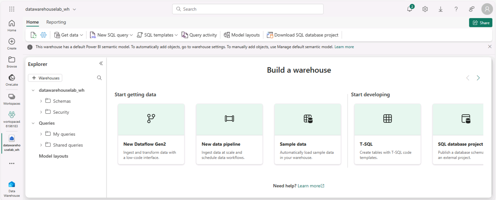

---
lab:
  title: Carregar dados em um warehouse usando T-SQL
  module: Load data into a warehouse in Microsoft Fabric
---

# Carregar dados em um warehouse

No Microsoft Fabric, um data warehouse fornece um banco de dados relacional para análise em larga escala. Ao contrário do ponto de extremidade SQL somente leitura padrão para tabelas definido em um lakehouse, um data warehouse fornece a semântica completa do SQL, incluindo a capacidade de inserir, atualizar e excluir dados nas tabelas.

Este laboratório levará aproximadamente **30** minutos para ser concluído.

> **Observação**: Você precisará uma [avaliação gratuita do Microsoft Fabric](https://learn.microsoft.com/fabric/get-started/fabric-trial) para concluir esse exercício.

## Criar um workspace

Antes de trabalhar com os dados no Fabric, crie um workspace com a avaliação do Fabric habilitada.

1. Na [página inicial do Microsoft Fabric](https://app.fabric.microsoft.com), selecione **Data Warehouse do Synapse**.
1. Na barra de menus à esquerda, selecione **Workspaces** (o ícone é semelhante a &#128455;).
1. Crie um workspace com um nome de sua escolha selecionando um modo de licenciamento que inclua a capacidade do Fabric (*Avaliação*, *Premium* ou *Malha*).
1. Quando o novo workspace for aberto, ele estará vazio.

    

## Criar um lakehouse e carregar arquivos

Em nosso cenário, como não temos dados disponíveis, devemos ingerir dados a serem usados para carregar o warehouse. Você criará um data lakehouse para os arquivos de dados que você usará para carregar o armazém.

1. Na home page da **Engenharia de Dados do Synapse**, crie um **Lakehouse** com um nome de sua escolha.

    Após alguns minutos, um lakehouse vazio será criado. Você precisa ingerir alguns dados no data lakehouse para análise. Há várias maneiras de fazer isso, mas neste exercício, você baixará um arquivo CVS no computador local (ou na VM de laboratório, se aplicável) e o carregará no lakehouse.

1. Baixe o arquivo para este exercício em `https://github.com/MicrosoftLearning/dp-data/raw/main/sales.csv`.

1. Retorne à guia do navegador da Web que contém o seu Lakehouse e, no menu **...** da pasta **Arquivos** no painel **Explorer**, selecione **Carregar** e **Carregar arquivos** e, em seguida, carregue o arquivo **sales.csv** do seu computador local (ou VM do laboratório, se for o caso) para o Lakehouse.

1. Depois que os arquivos forem carregados, selecione **Arquivos**. Verifique se o arquivo CSV foi carregado, conforme mostrado aqui:

    

## Criar uma tabela no lakehouse

1. No menu **...** do arquivo **sales.csv** no painel **Explorer**, selecione **Carregar em tabelas**e **Nova tabela**.

1. Forneça as informações a seguir na caixa de diálogo **Carregar arquivo para a nova tabela**.
    - **Novo nome da tabela:** staging_sales
    - **Usar cabeçalho para nomes de colunas:** Selecionado
    - **Separador:** ,

1. Selecione **Carregar**.

## Criar um warehouse

Agora que você tem um workspace, um lakehouse e a tabela de vendas com os dados necessários, é hora de criar um data warehouse. A página inicial do Data Warehouse do Synapse inclui um atalho para criar um novo warehouse:

1. Na página inicial do **Data Warehouse do Synapse**, crie um novo **Warehouse** com um nome de sua escolha.

    Após alguns minutos, um warehouse será criado:

    

## Criar tabela de fatos, dimensões e exibição

Vamos criar as tabelas de fatos e as dimensões para os dados de Vendas. Você também criará uma exibição apontando para um lakehouse, o que simplifica o código no procedimento armazenado que usaremos para carregar.

1. No workspace, selecione o armazém que você criou.

1. No warehouse **Explorer**, selecione **Nova consulta SQL** e copie e execute a consulta a seguir.

    ```sql
    CREATE SCHEMA [Sales]
    GO
        
    IF NOT EXISTS (SELECT * FROM sys.tables WHERE name='Fact_Sales' AND SCHEMA_NAME(schema_id)='Sales')
        CREATE TABLE Sales.Fact_Sales (
            CustomerID VARCHAR(255) NOT NULL,
            ItemID VARCHAR(255) NOT NULL,
            SalesOrderNumber VARCHAR(30),
            SalesOrderLineNumber INT,
            OrderDate DATE,
            Quantity INT,
            TaxAmount FLOAT,
            UnitPrice FLOAT
        );
    
    IF NOT EXISTS (SELECT * FROM sys.tables WHERE name='Dim_Customer' AND SCHEMA_NAME(schema_id)='Sales')
        CREATE TABLE Sales.Dim_Customer (
            CustomerID VARCHAR(255) NOT NULL,
            CustomerName VARCHAR(255) NOT NULL,
            EmailAddress VARCHAR(255) NOT NULL
        );
        
    ALTER TABLE Sales.Dim_Customer add CONSTRAINT PK_Dim_Customer PRIMARY KEY NONCLUSTERED (CustomerID) NOT ENFORCED
    GO
    
    IF NOT EXISTS (SELECT * FROM sys.tables WHERE name='Dim_Item' AND SCHEMA_NAME(schema_id)='Sales')
        CREATE TABLE Sales.Dim_Item (
            ItemID VARCHAR(255) NOT NULL,
            ItemName VARCHAR(255) NOT NULL
        );
        
    ALTER TABLE Sales.Dim_Item add CONSTRAINT PK_Dim_Item PRIMARY KEY NONCLUSTERED (ItemID) NOT ENFORCED
    GO
    ```

    > **Importante:** Em um data warehouse, restrições de chave de referência nem sempre são necessárias no nível da tabela. Embora restrições de chave de referência possam ajudar a garantir a integridade dos dados, elas também podem adicionar sobrecarga ao processo ETL (extração, transformação e carregamento) e reduzir o carregamento de dados. A decisão de usar restrições de chave de referência em um data warehouse deve ser baseada em uma consideração cuidadosa das compensações entre a integridade e o desempenho dos dados.

1. No **Explorer**, navegue até **Esquemas >> Vendas >> Tabelas**. Observe as tabelas *Fact_Sales*, *Dim_Customer* e *Dim_Item* que você acabou de criar.

1. Abra um novo editor de **Nova consulta SQL** e copie e execute a consulta a seguir. Atualize *<your lakehouse name>* com o lakehouse que você criou.

    ```sql
    CREATE VIEW Sales.Staging_Sales
    AS
    SELECT * FROM [<your lakehouse name>].[dbo].[staging_sales];
    ```

1. No **Explorer**, navegue até **Esquemas >> Vendas >> Exibições**. Observe a exibição *Staging_Sales* que você criou.

## Carregar dados no warehouse

Agora que as tabelas de fatos e dimensões são criadas, vamos criar um procedimento armazenado para carregar os dados de nosso lakehouse no armazém. Devido ao ponto de extremidade SQL automático criado quando criamos o lakehouse, você pode acessar diretamente os dados em seu lakehouse do warehouse usando consultas T-SQL e entre bancos de dados.

Para simplificar neste estudo de caso, você usará o nome do cliente e o nome do item como as chaves primárias.

1. Crie um novo editor de **Nova consulta SQL** e copie e execute a consulta a seguir.

    ```sql
    CREATE OR ALTER PROCEDURE Sales.LoadDataFromStaging (@OrderYear INT)
    AS
    BEGIN
        -- Load data into the Customer dimension table
        INSERT INTO Sales.Dim_Customer (CustomerID, CustomerName, EmailAddress)
        SELECT DISTINCT CustomerName, CustomerName, EmailAddress
        FROM [Sales].[Staging_Sales]
        WHERE YEAR(OrderDate) = @OrderYear
        AND NOT EXISTS (
            SELECT 1
            FROM Sales.Dim_Customer
            WHERE Sales.Dim_Customer.CustomerName = Sales.Staging_Sales.CustomerName
            AND Sales.Dim_Customer.EmailAddress = Sales.Staging_Sales.EmailAddress
        );
        
        -- Load data into the Item dimension table
        INSERT INTO Sales.Dim_Item (ItemID, ItemName)
        SELECT DISTINCT Item, Item
        FROM [Sales].[Staging_Sales]
        WHERE YEAR(OrderDate) = @OrderYear
        AND NOT EXISTS (
            SELECT 1
            FROM Sales.Dim_Item
            WHERE Sales.Dim_Item.ItemName = Sales.Staging_Sales.Item
        );
        
        -- Load data into the Sales fact table
        INSERT INTO Sales.Fact_Sales (CustomerID, ItemID, SalesOrderNumber, SalesOrderLineNumber, OrderDate, Quantity, TaxAmount, UnitPrice)
        SELECT CustomerName, Item, SalesOrderNumber, CAST(SalesOrderLineNumber AS INT), CAST(OrderDate AS DATE), CAST(Quantity AS INT), CAST(TaxAmount AS FLOAT), CAST(UnitPrice AS FLOAT)
        FROM [Sales].[Staging_Sales]
        WHERE YEAR(OrderDate) = @OrderYear;
    END
    ```
1. Crie um novo editor de **Nova consulta SQL** e copie e execute a consulta a seguir.

    ```sql
    EXEC Sales.LoadDataFromStaging 2021
    ```

    > **Observação:** Nesse caso, estamos carregando apenas dados do ano de 2021. No entanto, você tem a opção de modificá-lo para carregar dados de anos anteriores.

## Executar consultas analíticas

Vamos executar algumas consultas analíticas para validar os dados no warehouse.

1. No menu superior, selecione **Nova consulta SQL** e, em seguida, copie e execute a consulta a seguir.

    ```sql
    SELECT c.CustomerName, SUM(s.UnitPrice * s.Quantity) AS TotalSales
    FROM Sales.Fact_Sales s
    JOIN Sales.Dim_Customer c
    ON s.CustomerID = c.CustomerID
    WHERE YEAR(s.OrderDate) = 2021
    GROUP BY c.CustomerName
    ORDER BY TotalSales DESC;
    ```

    > **Observação:** Essa consulta mostra os clientes pelo total de vendas para o ano de 2021. O cliente com as vendas totais mais altas do ano especificado é **Jordan Turner**, com vendas totais de **14686,69**. 

1. No menu superior, selecione **Nova consulta SQL** ou reutilize o mesmo editor e copie e execute a consulta a seguir.

    ```sql
    SELECT i.ItemName, SUM(s.UnitPrice * s.Quantity) AS TotalSales
    FROM Sales.Fact_Sales s
    JOIN Sales.Dim_Item i
    ON s.ItemID = i.ItemID
    WHERE YEAR(s.OrderDate) = 2021
    GROUP BY i.ItemName
    ORDER BY TotalSales DESC;

    ```

    > **Observação:** Essa consulta mostra os itens mais vendidos em vendas totais para o ano de 2021. Esses resultados sugerem que o modelo de bicicleta *Mountain-200*, nas cores preto e prata, foi o item mais popular entre os clientes em 2021.

1. No menu superior, selecione **Nova consulta SQL** ou reutilize o mesmo editor e copie e execute a consulta a seguir.

    ```sql
    WITH CategorizedSales AS (
    SELECT
        CASE
            WHEN i.ItemName LIKE '%Helmet%' THEN 'Helmet'
            WHEN i.ItemName LIKE '%Bike%' THEN 'Bike'
            WHEN i.ItemName LIKE '%Gloves%' THEN 'Gloves'
            ELSE 'Other'
        END AS Category,
        c.CustomerName,
        s.UnitPrice * s.Quantity AS Sales
    FROM Sales.Fact_Sales s
    JOIN Sales.Dim_Customer c
    ON s.CustomerID = c.CustomerID
    JOIN Sales.Dim_Item i
    ON s.ItemID = i.ItemID
    WHERE YEAR(s.OrderDate) = 2021
    ),
    RankedSales AS (
        SELECT
            Category,
            CustomerName,
            SUM(Sales) AS TotalSales,
            ROW_NUMBER() OVER (PARTITION BY Category ORDER BY SUM(Sales) DESC) AS SalesRank
        FROM CategorizedSales
        WHERE Category IN ('Helmet', 'Bike', 'Gloves')
        GROUP BY Category, CustomerName
    )
    SELECT Category, CustomerName, TotalSales
    FROM RankedSales
    WHERE SalesRank = 1
    ORDER BY TotalSales DESC;
    ```

    > **Observação:** Os resultados dessa consulta mostram o principal cliente para cada uma das categorias: Bicicleta, Capacete e Luvas, com base no total de vendas. Por exemplo, **Carson Butler** é o principal cliente da categoria **Bicicleta**.
    >
    > As informações sobre as categorias foram extraídas da coluna `ItemName` usando manipulação de cadeia de caracteres, pois não há nenhuma coluna de categoria separada na tabela de dimensões. Essa abordagem pressupõe que os nomes dos itens seguem uma convenção de nomenclatura consistente. Se os nomes dos itens não seguirem uma convenção de nomenclatura consistente, os resultados poderão não refletir com precisão a verdadeira categoria de cada item.

Neste exercício, você criou um lakehouse e um data warehouse com várias tabelas. Você ingeriu dados e usou consultas entre bancos de dados para carregar dados do lakehouse para o warehouse. Além disso, você usou a ferramenta de consulta para executar consultas analíticas.

## Limpar os recursos

Se você tiver terminado de explorar seu data warehouse, exclua o workspace criado para este exercício.

1. Na barra à esquerda, selecione o ícone do workspace para ver todos os itens que ele contém.
2. No menu **…** da barra de ferramentas, selecione **Configurações do workspace**.
3. Na seção **Outros**, selecione **Remover este workspace**.
