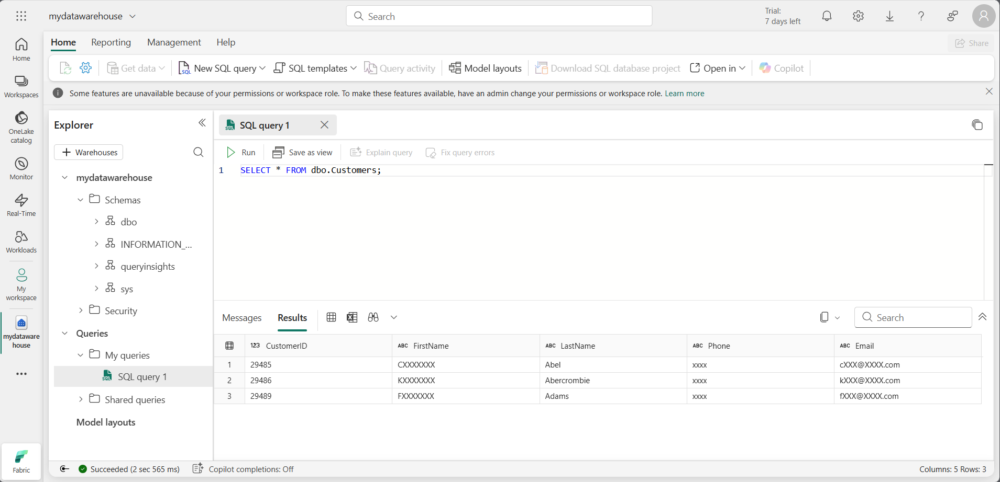

---
lab:
  title: "Proteger um data warehouse\_do Microsoft Fabric"
  module: Secure a Microsoft Fabric data warehouse
---

# Proteger um data warehouse do Microsoft Fabric

As permissões do Microsoft Fabric e as permissões granulares do SQL trabalham em conjunto para controlar o acesso ao Warehouse e as permissões de usuário. Neste exercício, você protegerá os dados usando permissões granulares, segurança em nível de coluna, segurança em nível de linha e máscara dinâmica de dados.

> **Observação**: para concluir totalmente os exercícios neste laboratório, você precisará de dois usuários: um usuário deve receber a função de Administrador do Workspace e o outro deve ter a função Visualizador do Workspace. Para atribuir funções a workspaces, confira [ Conceder acesso ao seu workspace ](https://learn.microsoft.com/fabric/get-started/give-access-workspaces). Se você não tiver acesso a uma segunda conta na mesma organização, ainda poderá fazer o exercício como Administrador do Workspace e ignorar as etapas realizadas como uma conta do Visualizador de Workspace consultando as capturas de tela do exercício para ver a que uma conta do Visualizador do Workspace tem acesso.

Esse laboratório leva cerca de **45** minutos para ser concluído.

## Criar um workspace

Antes de trabalhar com os dados no Fabric, crie um workspace com a avaliação do Fabric habilitada.

1. Navegue até a [home page do Microsoft Fabric](https://app.fabric.microsoft.com/home?experience=fabric) em `https://app.fabric.microsoft.com/home?experience=fabric` em um navegador e entre com suas credenciais do Fabric.
1. Na barra de menus à esquerda, selecione **Workspaces** (o ícone é semelhante a &#128455;).
1. Crie um workspace com um nome de sua escolha selecionando um modo de licenciamento que inclua a capacidade do Fabric (*Avaliação*, *Premium* ou *Malha*).
1. Quando o novo workspace for aberto, ele estará vazio.

    

> **Observação**: Ao criar um workspace, você se torna automaticamente um membro da função de Administrador do Workspace. Você pode adicionar um segundo usuário do seu ambiente à função Visualizador do Workspace para testar a funcionalidade configurada nesses exercícios. Isso pode ser feito selecionando **Gerenciar Acesso** no workspace e, em seguida, **Adicionar pessoas ou grupos**. Isso permitirá que o segundo usuário exiba o conteúdo do workspace.

## Criar um data warehouse

Em seguida, crie um data warehouse no workspace que você criou:

1. Na barra de menus à esquerda, selecione **Criar**. Na página *Novo*, na seção *Data Warehouse*, selecione **Warehouse**. Dê um nome exclusivo de sua preferência.

    >**Observação**: se a opção **Criar** não estiver fixada na barra lateral, você precisará selecionar a opção de reticências (**...**) primeiro.

    Após alguns minutos, um warehouse será criado:

    

## Aplicar regras de máscara dinâmica de dados a colunas em uma tabela

As regras de máscara dinâmica de dados são aplicadas em colunas individuais no nível da tabela, de modo que todas as consultas são afetadas pela máscara. Os usuários que não tiverem permissões explícitas para exibir dados confidenciais verão os valores mascarados nos resultados da consulta, enquanto os usuários com permissão explícita para exibir os dados os verão sem máscara. Há quatro tipos de máscaras: padrão, email, aleatória e cadeia de caracteres personalizada. Neste exercício, você aplicará uma máscara padrão, uma máscara de email e uma máscara de cadeia de caracteres personalizada.

1. No depósito, selecione o bloco **T-SQL** e use as seguintes instruções T-SQL para criar uma tabela e para inserir e exibir os dados.  

    ```T-SQL
   CREATE TABLE dbo.Customers
   (   
       CustomerID INT NOT NULL,   
       FirstName varchar(50) MASKED WITH (FUNCTION = 'partial(1,"XXXXXXX",0)') NULL,     
       LastName varchar(50) NOT NULL,     
       Phone varchar(20) MASKED WITH (FUNCTION = 'default()') NULL,     
       Email varchar(50) MASKED WITH (FUNCTION = 'email()') NULL   
   );
   
   INSERT dbo.Customers (CustomerID, FirstName, LastName, Phone, Email) VALUES
   (29485,'Catherine','Abel','555-555-5555','catherine0@adventure-works.com'),
   (29486,'Kim','Abercrombie','444-444-4444','kim2@adventure-works.com'),
   (29489,'Frances','Adams','333-333-3333','frances0@adventure-works.com');
   
   SELECT * FROM dbo.Customers;
    ```

    Quando usuários que estão restritos a ver dados desmascarados consultam a tabela, a coluna **FirstName** mostra a primeira letra da cadeia de caracteres com XXXXXXX e nenhum dos últimos caracteres. A coluna **Telefone** mostrará xxxx. A coluna **Email** mostrará a primeira letra do endereço de email seguida por `XXX@XXX.com`. Essa abordagem garante que os dados confidenciais permaneçam confidenciais, permitindo que os usuários restritos consultem a tabela.

2. Use o botão **&#9655; Execute** para executar o script SQL, que cria uma nova tabela chamada **Clientes** no esquema **dbo** do data warehouse.

3. Em seguida, no painel **Explorador**, expanda **Esquemas** > **dbo** > **Tabelas** e verifique se a tabela **Cliente** foi criada. A instrução `SELECT` retorna dados desmascarados para você porque, como o criador do workspace, você é membro da função Administrador do Workspace que pode ver dados desmascarados.

    >**Observação**: se você se conectar como um usuário de teste que é membro da função de workspace de **Visualizador** e executar uma instrução `SELECT` na tabela **Clientes**, verá os seguintes resultados para os dados mascarados.
   
    
 
    O usuário de teste não recebeu a permissão UNMASK, portanto, os dados retornados para as colunas FirstName, Telefone e Email estão mascarados porque essas colunas foram definidas com uma máscara na instrução `CREATE TABLE`.

## Aplicar segurança em nível de linha

A segurança em nível de linha (RLS) pode ser usada para limitar o acesso às linhas com base na identidade ou função do usuário que executa uma consulta. Neste exercício, você restringirá o acesso às linhas criando uma política de segurança e um predicado de segurança definido como uma função com valor de tabela embutida.

1. No depósito que você criou no último exercício, selecione a lista suspensa **Nova consulta SQL** e selecione **Nova consulta SQL**.

2. Crie uma tabela e insira dados nela. Para que possa testar a segurança em nível de linha em uma etapa posterior, substitua `username1@your_domain.com` por um nome de usuário do seu ambiente e substitua `username2@your_domain.com` pelo seu nome de usuário.

    ```T-SQL
   CREATE TABLE dbo.Sales  
   (  
       OrderID INT,  
       SalesRep VARCHAR(60),  
       Product VARCHAR(10),  
       Quantity INT  
   );
    
   --Populate the table with 6 rows of data, showing 3 orders for each test user. 
   INSERT dbo.Sales (OrderID, SalesRep, Product, Quantity) VALUES
   (1, '<username1>@<your_domain>.com', 'Valve', 5),   
   (2, '<username1>@<your_domain>.com', 'Wheel', 2),   
   (3, '<username1>@<your_domain>.com', 'Valve', 4),  
   (4, '<username2>@<your_domain>.com', 'Bracket', 2),   
   (5, '<username2>@<your_domain>.com', 'Wheel', 5),   
   (6, '<username2>@<your_domain>.com', 'Seat', 5);  
    
   SELECT * FROM dbo.Sales;  
    ```

3. Use o botão **&#9655; Executar** para executar o script SQL, que cria uma nova tabela chamada **Vendas** no esquema **dbo** do data warehouse.

4. Em seguida, no painel **Explorador**, expanda **Esquemas** > **dbo** > **Tabela** e verifique se a tabela **Vendas** foi criada.
5. Crie um esquema, um predicado de segurança definido como uma função e uma política de segurança.  

    ```T-SQL
   --Create a separate schema to hold the row-level security objects (the predicate function and the security policy)
   CREATE SCHEMA rls;
   GO
   
   /*Create the security predicate defined as an inline table-valued function.
   A predicate evaluates to true (1) or false (0). This security predicate returns 1,
   meaning a row is accessible, when a row in the SalesRep column is the same as the user
   executing the query.*/   
   --Create a function to evaluate who is querying the table
   CREATE FUNCTION rls.fn_securitypredicate(@SalesRep AS VARCHAR(60)) 
       RETURNS TABLE  
   WITH SCHEMABINDING  
   AS  
       RETURN SELECT 1 AS fn_securitypredicate_result   
   WHERE @SalesRep = USER_NAME();
   GO   
   /*Create a security policy to invoke and enforce the function each time a query is run on the Sales table.
   The security policy has a filter predicate that silently filters the rows available to 
   read operations (SELECT, UPDATE, and DELETE). */
   CREATE SECURITY POLICY SalesFilter  
   ADD FILTER PREDICATE rls.fn_securitypredicate(SalesRep)   
   ON dbo.Sales  
   WITH (STATE = ON);
   GO
    ```

6. Use o botão **&#9655; Executar** para executar o script SQL
7. No painel **Explorador**, expanda **Esquemas** > **rls** > **Funções** > **Funções com valor de tabela** e verifique se a função foi criada.
8. Faça logon no Fabric como o usuário que você substituiu `<username1>@<your_domain>.com`, na instrução da tabela Vendas `INSERT`. Confirme se você está conectado como esse usuário executando o T-SQL a seguir.

    ```T-SQL
   SELECT USER_NAME();
    ```

9. Consulte a tabela **Vendas** para confirmar que a segurança em nível de linha funciona como esperado. Você só deve ver dados que atendam às condições no predicado de segurança definidos para o usuário como o qual você está conectado:

    ```T-SQL
   SELECT * FROM dbo.Sales;
    ```

    

## Implementar a segurança em nível de coluna

A segurança em nível de coluna permite designar quais usuários podem acessar colunas específicas em uma tabela. Ela é implementada emitindo uma instrução `GRANT` ou `DENY` em uma tabela especificando uma lista de colunas e o usuário ou função que pode (ou não) lê-las. Para simplificar o gerenciamento de acesso, atribua permissões a funções em vez de usuários individuais. Neste exercício, você criará uma tabela, concederá acesso a um subconjunto de colunas na tabela e testará se as colunas restritas não podem ser exibidas por um usuário diferente de você mesmo.

1. No depósito que você criou no exercício anterior, selecione a lista suspensa **Nova consulta SQL** e, em seguida, selecione **Nova consulta SQL**.  

2. Crie uma tabela e insira dados nela.

    ```T-SQL
   CREATE TABLE dbo.Orders
   (   
       OrderID INT,   
       CustomerID INT,  
       CreditCard VARCHAR(20)      
   );   
   INSERT dbo.Orders (OrderID, CustomerID, CreditCard) VALUES
   (1234, 5678, '111111111111111'),
   (2341, 6785, '222222222222222'),
   (3412, 7856, '333333333333333');   
   SELECT * FROM dbo.Orders;
    ```

3. Negue a permissão para exibir uma coluna na tabela. A instrução T-SQL impede `<username1>@<your_domain>.com` de ver a coluna CreditCard na tabela Orders. Na instrução `DENY`, substitua `<username1>@<your_domain>.com` por um nome de usuário em seu sistema que tenha permissões de **Visualizador** no workspace.

    ```T-SQL
   DENY SELECT ON dbo.Orders (CreditCard) TO [<username1>@<your_domain>.com];
    ```

4. Teste a segurança no nível da coluna fazendo logon no Fabric como o usuário ao qual você negou as permissões de seleção.

5. Consulte a tabela Pedidos para confirmar que a segurança em nível de coluna funciona como esperado:

    ```T-SQL
   SELECT * FROM dbo.Orders;
    ```

    

    Você receberá um erro porque o acesso à coluna CreditCard foi restrito. Tente selecionar apenas os campos OrderID e CustomerID e a consulta terá êxito.

    ```T-SQL
   SELECT OrderID, CustomerID from dbo.Orders
    ```

## Configurar permissões granulares de SQL usando T-SQL

O Fabric tem um modelo de permissões que permite controlar o acesso aos dados no nível do workspace e no nível do item. Quando você precisar de um controle mais granular do que os usuários podem fazer com os objetos seguros em um warehouse do Fabric, poderá usar os comandos padrão da linguagem de controle de dados SQL (DCL) `GRANT`,`DENY` e `REVOKE`. Neste exercício, você criará objetos, os protegerá usando `GRANT` e `DENY` e, em seguida, executará consultas para exibir o efeito da aplicação de permissões granulares.

1. No depósito que você criou no exercício anterior, selecione o menu suspenso **Nova Consulta SQL**. Selecione **Nova Consulta SQL**.  

2. Crie um procedimento armazenado e uma tabela. Em seguida, execute o procedimento e consulte a tabela.

    ```T-SQL
   CREATE PROCEDURE dbo.sp_PrintMessage
   AS
   PRINT 'Hello World.';
   GO   
   CREATE TABLE dbo.Parts
   (
       PartID INT,
       PartName VARCHAR(25)
   );
   
   INSERT dbo.Parts (PartID, PartName) VALUES
   (1234, 'Wheel'),
   (5678, 'Seat');
    GO
   
   /*Execute the stored procedure and select from the table and note the results you get
   as a member of the Workspace Admin role. Look for output from the stored procedure on 
   the 'Messages' tab.*/
   EXEC dbo.sp_PrintMessage;
   GO   
   SELECT * FROM dbo.Parts
    ```

3. Em seguida, dê permissões `DENY SELECT` na tabela a um usuário que seja membro da função **Visualizador do Workspace** e `GRANT EXECUTE` no procedimento para o mesmo usuário. Substitua `<username1>@<your_domain>.com` por um nome de usuário do seu ambiente que seja membro da função **Visualizador do Workspace**.

    ```T-SQL
   DENY SELECT on dbo.Parts to [<username1>@<your_domain>.com];

   GRANT EXECUTE on dbo.sp_PrintMessage to [<username1>@<your_domain>.com];
    ```

4. Entre no Fabric como o usuário especificado nas instruções `DENY` e `GRANT` no lugar de `<username1>@<your_domain>.com`. Teste as permissões granulares que você aplicou executando o procedimento armazenado e consultando a tabela:

    ```T-SQL
   EXEC dbo.sp_PrintMessage;
   GO
   
   SELECT * FROM dbo.Parts;
    ```

    

## Limpar os recursos

Neste exercício, você aplicou regras de máscara dinâmica de dados às colunas de uma tabela, aplicou a segurança em nível de linha, implementou a segurança em nível de coluna e configurou as permissões granulares do SQL usando o T-SQL.

1. Na barra de navegação à esquerda, selecione o ícone do workspace para ver todos os itens que ele contém.
2. No menu da barra de ferramentas superior, selecione **Configurações do workspace**.
3. Na seção **Geral**, selecione **Remover este espaço de trabalho**.
