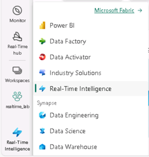

---
lab:
  title: Introdução à inteligência em tempo real no Microsoft Fabric
  module: Get started with Real-Time Intelligence in Microsoft Fabric
---

# Introdução à inteligência em tempo real no Microsoft Fabric

O Microsoft Fabric fornece um runtime que você pode usar para armazenar e consultar dados usando o KQL (Linguagem de Consulta Kusto). O Kusto é otimizado para dados que incluem um componente de série temporal, como dados em tempo real de arquivos de log ou de dispositivos IoT.

Este laboratório leva cerca de **30** minutos para ser concluído.

> **Observação**: Você precisa de uma [avaliação do Microsoft Fabric](https://learn.microsoft.com/fabric/get-started/fabric-trial) para concluir esse exercício.

## Criar um workspace

Antes de trabalhar com os dados no Fabric, crie um workspace com a avaliação do Fabric habilitada.

1. Na [home page do Microsoft Fabric](https://app.fabric.microsoft.com), selecione **Inteligência em Tempo Real**.
1. Na barra de menus à esquerda, selecione **Workspaces** (o ícone é semelhante a &#128455;).
1. Crie um workspace com um nome de sua escolha selecionando um modo de licenciamento que inclua a capacidade do Fabric (*Avaliação*, *Premium* ou *Malha*).
1. Quando o novo workspace for aberto, ele estará vazio.

    

## Baixar arquivo para o banco de dados KQL

Agora que você tem um espaço de trabalho, é hora de fazer o download do arquivo de dados que será analisado.

1. Baixe o arquivo de dados deste exercício de [https://raw.githubusercontent.com/MicrosoftLearning/dp-data/main/sales.csv](https://raw.githubusercontent.com/MicrosoftLearning/dp-data/main/sales.csv), salvando-o como **sales.csv** no computador local (ou na VM de laboratório, se aplicável)
1. Retorne à janela do navegador com a Experiência do **Microsoft Fabric**.

## Criar um banco de dados KQL

O KQL (Linguagem de Consulta Kusto) é usada para consultar dados estáticos ou de streaming em uma tabela definida em um banco de dados KQL. Para analisar os dados de vendas, você precisa criar uma tabela em um banco de dados KQL e ingerir os dados do arquivo.

1. No canto inferior esquerdo do portal, alterne para a experiência de Inteligência em Tempo Real.

    

2. Na página inicial da Inteligência em Tempo Real, crie um novo **Eventhouse** com um nome de sua escolha.

   

   O Eventhouse é usado para agrupar e gerenciar seus bancos de dados entre projetos. Um banco de dados KQL vazio é automaticamente criado com o nome do eventhouse.
   
3. Quando o banco de dados for criado, selecione a opção para obter dados de um **Arquivo Local**. Em seguida, use o assistente para importar os dados para uma nova tabela selecionando as seguintes opções:
    - **Destino**:
        - **Banco de dados**: *o banco de dados que você criou já está selecionado*
        - **Table**: *Crie uma nova tabela chamada* **vendas** clicando no sinal + à esquerda de ***Nova tabela***

        

        - Agora você verá o hiperlink **Arrastar arquivos aqui ou Procurar arquivos** aparecer na mesma janela.

        

        - navegue ou arraste sua tabela **sales.csv** para a tela e aguarde até que a caixa Statustatus mude para uma caixa de seleção verde e, em seguida, selecione **Avançar**

        

        - Nesta tela, você verá que os cabeçalhos de coluna estão na primeira linha; embora o sistema os tenha detectado, ainda precisamos mover o controle deslizante acima dessas linhas **A primeira linha é o cabeçalho da coluna** para evitar a obtenção de erros.
        
        

        - Depois de selecionar este controle deslizante e constatar que tudo parece estar correto, selecione o botão **Concluir** na parte inferior direita do painel.

        

        - Aguarde a conclusão das etapas na tela de resumo, que incluem:
            - Criar tabela (vendas)
            - criar mapeamento (sales_mapping)
            - Enfileiramento de dados
            - Ingestão
        - Selecione o botão **Fechar**

        

> **Dica**: neste exemplo, você importou um volume muito pequeno de dados estáticos de um arquivo, o que é útil para os propósitos do exercício. Na realidade, você pode usar o Kusto para analisar volumes muito maiores de dados, incluindo dados em tempo real de uma fonte de streaming como os Hubs de Eventos do Azure.

## Usar o KQL para consultar a tabela de vendas

Agora que você tem uma tabela de dados no seu banco de dados, use o código KQL para consultá-la.

1. Verifique se a tabela **sales** está realçada. Na barra de menus, selecione a lista suspensa **Consultar tabela** e, nela, selecione **Mostrar quaisquer 100 registros**.

2. Um novo painel será aberto com a consulta e o resultado. 

3. Modifique a consulta conforme o seguinte exemplo:

    ```kusto
   sales
   | where Item == 'Road-250 Black, 48'
    ```

4. Executa a consulta. Em seguida, analise os resultados, que devem conter apenas as linhas dos pedidos de vendas para o produto *Road-250 Black, 48*.

5. Modifique a consulta conforme o seguinte exemplo:

    ```kusto
   sales
   | where Item == 'Road-250 Black, 48'
   | where datetime_part('year', OrderDate) > 2020
    ```

6. Execute a consulta e analise os resultados, que conterão apenas os pedidos de vendas de *Road-250 Black, 48* feitos após 2020.

7. Modifique a consulta conforme o seguinte exemplo:

    ```kusto
   sales
   | where OrderDate between (datetime(2020-01-01 00:00:00) .. datetime(2020-12-31 23:59:59))
   | summarize TotalNetRevenue = sum(UnitPrice) by Item
   | sort by Item asc
    ```

8. Execute a consulta e analise os resultados, que conterão a receita líquida total de cada produto entre 1º de janeiro e 31 de dezembro de 2020 em ordem ascendente de nome do produto.
9. Selecione **Salvar como um conjunto de consultas KQL** e salve a consulta como **Receita por Produto**.

## Criar um relatório do Power BI com base em um conjunto de consultas KQL

Use o conjunto de consultas KQL como base para um relatório do Power BI.

1. No editor do workbench de consulta do conjunto de consultas, execute a consulta e aguarde os resultados.
2. Selecione **Criar relatório do Power BI** e aguarde até que o editor de relatório seja aberto.
3. No editor de relatório, no painel **Dados**, expanda **Resultado da Consulta Kusto** e selecione os campos **Item** e **TotalRevenue**.
4. Na tela de design do relatório, selecione a visualização de tabela que foi adicionada e, no painel **Visualizações**, selecione **Gráfico de barras clusterizado**.

    

5. Na janela do **Power BI**, no menu **Arquivo**, selecione **Salvar**. Em seguida, salve o relatório como **Receita por Item.pbix** no workspace em que o lakehouse e o banco de dados KQL estão definidos usando um rótulo de confidencialidade **Não comercial**.
6. Feche a janela do **Power BI** e, na barra à esquerda, selecione o ícone do workspace.

    Atualize a página Workspace, se necessário, para ver todos os itens que ela contém.

7. Na lista de itens do workspace, observe que o relatório **Receita por Item** está listado.

## Limpar os recursos

Neste exercício, você criou um lakehouse, um banco de dados KQL para analisar os dados carregados no lakehouse. Você usou o KQL para consultar os dados e criar um conjunto de consultas, que foi usado para criar um relatório do Power BI.

Se você tiver terminado de explorar seu banco de dados KQL, exclua o workspace criado para este exercício.

1. Na barra à esquerda, selecione o ícone do workspace.
2. No menu **…** da barra de ferramentas, selecione **Configurações do workspace**.
3. Na seção **Geral**, selecione **Remover este espaço de trabalho**.
