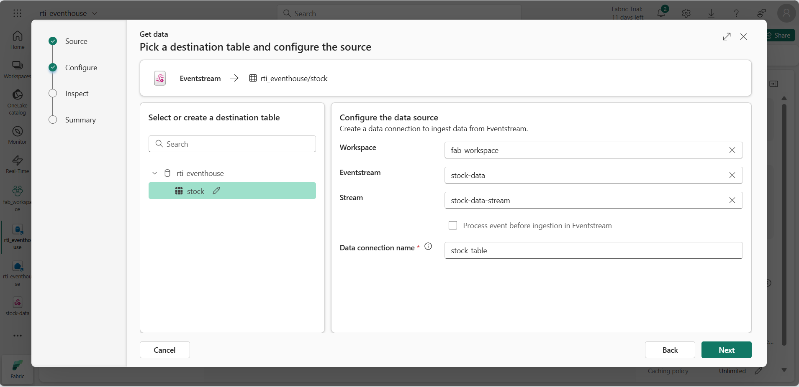

---
lab:
  title: Introdução à inteligência em tempo real no Microsoft Fabric
  module: Get started with Real-Time Intelligence in Microsoft Fabric
---

# Introdução à inteligência em tempo real no Microsoft Fabric

O Microsoft Fabric fornece um Hub em tempo real no qual você pode criar soluções analíticas para fluxos de dados em tempo real. Neste exercício, você explorará algumas das principais funcionalidades dos recursos de Inteligência em tempo real no Microsoft Fabric para se familiarizar com elas.

Este laboratório leva cerca de **30** minutos para ser concluído.

> **Observação**: para concluir este exercício, você precisa de um [locatário do Microsoft Fabric](https://learn.microsoft.com/fabric/get-started/fabric-trial).

## Criar um workspace

Antes de trabalhar com os dados no Fabric, você precisa criar um espaço de trabalho em um locatário com a funcionalidade do Fabric habilitada.

1. Na [home page do Microsoft Fabric](https://app.fabric.microsoft.com/home?experience=fabric), em `https://app.fabric.microsoft.com/home?experience=fabric`, selecione **Inteligência em Tempo Real**.
1. Na barra de menus à esquerda, selecione **Workspaces** (o ícone é semelhante a &#128455;).
1. Crie um workspace com um nome de sua escolha selecionando um modo de licenciamento que inclua a capacidade do Fabric (*Avaliação*, *Premium* ou *Malha*).
1. Quando o novo workspace for aberto, ele estará vazio.

    

## Criar uma eventhouse

Agora que você tem um espaço de trabalho, pode começar a criar os itens do Fabric necessários para sua solução de inteligência em tempo real. Começaremos criando um eventhouse, que contém um banco de dados KQL os seus dados em tempo real.

1. Na barra de menus à esquerda, selecione **Página Inicial**; em seguida, na página inicial da Inteligência em Tempo Real, crie um **Eventhouse** e dê um nome exclusivo de sua escolha.
1. Feche todas as dicas ou prompts exibidos até ver o novo eventhouse vazio.

    

1. No painel à esquerda, o eventhouse contém um banco de dados KQL com o mesmo nome do eventhouse. Você pode criar tabelas para seus dados em tempo real neste banco de dados ou criar bancos de dados adicionais conforme necessário.
1. Selecione o banco de dados e observe que há um *queryset* associado. Esse arquivo contém algumas consultas KQL de exemplo que você pode usar para começar a consultar as tabelas em seu banco de dados.

    No entanto, atualmente não há tabelas para consultar. Vamos resolver esse problema usando um eventstream para ingerir alguns dados no banco de dados.

## Criar um eventstream

1. Na página principal do banco de dados KQL, selecione **Obter dados**.
2. Para a fonte de dados, selecione **Eventstream** > **Novo eventstream**. Nomeie o eventstream `stock-stream`.

    A criação do novo eventstream será concluída em apenas alguns instantes. Depois de estabelecido, você será redirecionado automaticamente para o editor primário, pronto para começar a integrar fontes ao fluxo de eventos.

    

1. Na tela do eventstream, selecione **Usar dados de exemplo**.
1. Nomeie a origem `Stock` e selecione os dados de amostra do **Mercado de Ações**.

    Seu fluxo será mapeado e você aparecerá automaticamente na **tela do eventstream**.

   

1. Na lista suspensa **Transformar eventos ou adicionar destino**, na seção **Destinos**, selecione **Eventhouse**.
1. No painel **Eventhouse**, defina as seguintes opções de configuração.
   - **Modo de ingestão de dados:** processamento de eventos antes da ingestão
   - **Nome do destino:**`stock-table`
   - **Workspace:***selecione o workspace que você criou no início deste exercício*
   - **Eventhouse**: *selecione o eventhouse*
   - **Banco de dados KQL:***selecione o banco de dados KQL do eventhouse*
   - **Tabela de destino:** crie uma nova tabela chamada `stock`
   - **Formato de dados de entrada:** JSON

   

1. No painel **Eventhouse**, selecione **Salvar**.
1. Na barra de ferramentas, selecione **Publicar**.
1. Aguarde cerca de um minuto para que o destino de dados se torne ativo.

    Neste exercício, você criou um eventstream muito simples que captura dados em tempo real e os carrega em uma tabela. Em uma solução real, você normalmente adicionaria transformações para agregar os dados em janelas temporais (por exemplo, para capturar o preço médio de cada ação em períodos de cinco minutos).

    Agora vamos explorar como você pode consultar e analisar os dados capturados.

## Consultar os dados capturados

O eventstream captura dados do mercado de ações em tempo real e os carrega em uma tabela em seu banco de dados KQL. Você pode consultar esta tabela para ver os dados capturados.

1. Na barra de menus à esquerda, selecione o banco de dados da sua casa de eventos.
1. Selecione o *queryset* do banco de dados.
1. No painel de consulta, modifique a primeira consulta de exemplo, conforme mostrado aqui:

    ```kql
    stock
    | take 100
    ```

1. Selecione o código de consulta e execute-o para ver 100 linhas de dados na tabela.

    

1. Revise os resultados e modifique a consulta para recuperar o preço médio de cada símbolo de ação nos últimos cinco minutos:

    ```kql
    stock
    | where ["time"] > ago(5m)
    | summarize avgPrice = avg(todecimal(bidPrice)) by symbol
    | project symbol, avgPrice
    ```

1. Realce a consulta modificada e execute-a para ver os resultados.
1. Aguarde alguns segundos e execute-a novamente, observando que a média de preços muda à medida que novos dados são adicionados à tabela a partir do fluxo em tempo real.

## Criar um painel em tempo real

Agora que você tem uma tabela que está sendo preenchida por fluxo de dados, pode usar um painel em tempo real para visualizar os dados.

1. No editor de consultas, selecione a consulta KQL usada para recuperar os preços médios das ações nos últimos cinco minutos.
1. Selecione **Fixar no painel** na barra de ferramentas. Em seguida, fixe a consulta **em um novo painel** com as seguintes configurações:
    - **Nome do painel**: `Stock Dashboard`
    - **Nome do bloco**: `Average Prices`
1. Crie o painel e abra-o. O resultado deve ser assim:

    

1. Na parte superior do painel, alterne do modo de **Visualização** para o modo de **Edição**.
1. Clique no ícone **Editar** (*lápis*) do bloco **Preços médios**.
1. No painel **Formatação visual**, altere **Visual** de *Tabela* para *Coluna*:

    

1. Na parte superior do painel, selecione **Aplicar alterações** e exiba o painel modificado:

    

    Agora você tem uma visualização ao vivo de seus dados de ações em tempo real.

## Criar um alerta

A Inteligência em tempo real no Microsoft Fabric inclui uma tecnologia chamada *Ativador*, que pode disparar ações com base em eventos em tempo real. Vamos usá-la para alertar você quando o preço médio das ações aumentar em um valor específico.

1. Na janela do painel que contém a visualização do preço das ações, na barra de ferramentas, selecione **Definir alerta**.
1. No painel **Definir alerta**, crie um alerta com as seguintes configurações:
    - **Executar consulta a cada**: cinco minutos.
    - **Verificar**: em cada evento agrupado por
    - **Campo de agrupamento**: símbolo
    - **Quando**: avgPrice
    - **Condição**: Aumenta em
    - **Valor**: 100
    - **Ação**: enviar um email para mim
    - **Salvar localização**
        - **Workspace**: *seu workspace*
        - **Item**: criar item
        - **Nome de novo item**: *um nome exclusivo de sua preferência*

    

1. Crie o alerta e aguarde até que ele seja salvo. Em seguida, feche o painel confirmando que ele foi criado.
1. Na barra de menus à esquerda, selecione a página do workspace (salvando as alterações não salvas no painel, se solicitado).
1. Na página do workspace, exiba os itens que você criou neste exercício, incluindo o ativador do alerta.
1. Abra o ativador e, em sua página, no nó **avgPrice** , selecione o identificador exclusivo para o alerta. Em seguida, exiba aguia **Histórico** .

    Seu alerta pode não ter sido disparado, caso em que o histórico não conterá dados. Se o preço médio das ações mudar em mais de 100, o ativador enviará um e-mail e o alerta será registrado no histórico.

## Limpar os recursos

Neste exercício, você criou um eventhouse, ingeriu dados em tempo real usando um eventstream, consultou os dados ingeridos em uma tabela de banco de dados KQL, criou um painel em tempo real para visualizar os dados em tempo real e configurou um alerta usando o Ativador.

Se você terminou de explorar a Inteligêmcia em tempo real no Fabric, exclua o workspace criado para este exercício.

1. Na barra à esquerda, selecione o ícone do seu workspace.
2. Na barra de ferramentas, clique em **Configurações do workspace**.
3. Na seção **Geral**, selecione **Remover este espaço de trabalho**.
