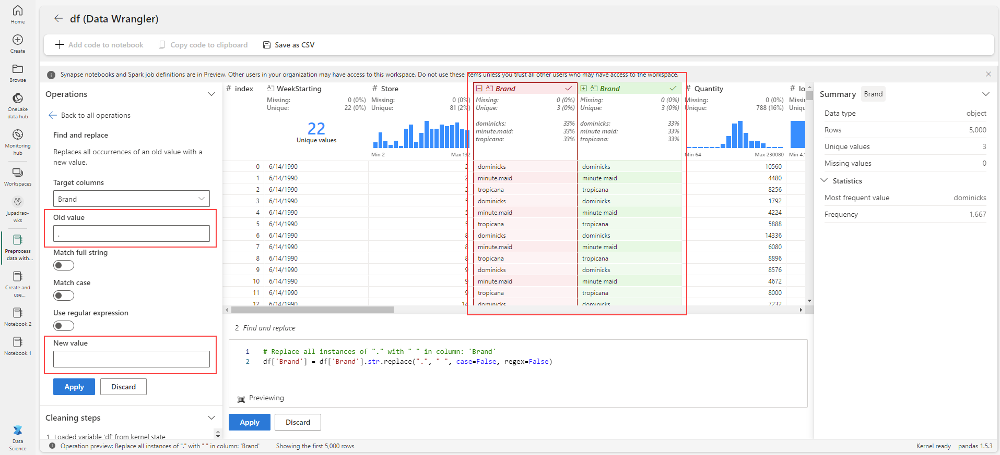

---
lab:
  title: Executar o pré-processamento de dados com Data Wrangler no Microsoft Fabric
  module: Preprocess data with Data Wrangler in Microsoft Fabric
---

# Usar notebooks para treinar um modelo no Microsoft Fabric

Neste laboratório, você aprenderá a usar o Data Wrangler no Microsoft Fabric para pré-processar dados e gerar código usando uma biblioteca de operações comuns de ciência de dados.

Este laboratório levará aproximadamente **30** minutos para ser concluído.

> **Observação**: você precisará ter uma licença do Microsoft Fabric para concluir este exercício. Confira [Introdução ao Fabric](https://learn.microsoft.com/fabric/get-started/fabric-trial) para obter detalhes de como habilitar uma licença de avaliação gratuita do Fabric. Você precisará ter uma conta *corporativa* ou de *estudante* da Microsoft para fazer isso. Caso não tenha uma, [inscreva-se em uma avaliação do Microsoft Office 365 E3 ou superior](https://www.microsoft.com/microsoft-365/business/compare-more-office-365-for-business-plans).

## Criar um workspace

Antes de trabalhar com os dados no Fabric, crie um workspace com a avaliação do Fabric habilitada.

1. Entre no [Microsoft Fabric](https://app.fabric.microsoft.com) em `https://app.fabric.microsoft.com` e selecione **Power BI**.
2. Na barra de menus à esquerda, selecione **Workspaces** (o ícone é semelhante a &#128455;).
3. Crie um workspace com um nome de sua escolha selecionando um modo de licenciamento que inclua a capacidade do Fabric (*Avaliação*, *Premium* ou *Malha*).
4. Quando o novo workspace for aberto, ele deverá estar vazio, conforme mostrado aqui:

    

## Criar um lakehouse e carregar arquivos

Agora que você tem um workspace, é hora de alternar para a experiência de *Ciência de dados* no portal e criar um data lakehouse para os arquivos de dados que você vai analisar.

1. No canto inferior esquerdo do portal do Power BI, selecione o ícone do **Power BI** e alterne para a experiência de **Engenharia de Dados**.
1. Na home page de **Engenharia de dados**, crie um **Lakehouse** com um nome de sua escolha.

    Após alguns minutos, um lakehouse sem **Tabelas** nem **Arquivos** será criado. Você precisa ingerir alguns dados no data lakehouse para análise. Há várias maneiras de fazer isso, mas neste exercício, você apenas baixará e extrairá uma pasta de arquivos de texto no computador local (ou na VM de laboratório, se aplicável) e os carregará no lakehouse.

1. TODO: baixe e salve o arquivo CSV `dominicks_OJ.csv` para este exercício de [https://raw.githubusercontent.com/MicrosoftLearning/dp-data/main/XXXXX.csv](https://raw.githubusercontent.com/MicrosoftLearning/dp-data/main/XXXXX.csv).


1. Volte à guia do navegador da Web que contém o lakehouse e, no menu **…** do nó **Arquivos** no painel **Exibição do lake**, selecione **Carregar** e **Carregar arquivos** e carregue o arquivo **dominicks_OJ.csv** do computador local (ou da VM de laboratório, se aplicável) no lakehouse.
6. Depois que os arquivos forem carregados, expanda **Arquivos** e verifique se o arquivo CSV foi carregado.

## Criar um notebook

Para treinar um modelo, você pode criar um *notebook*. Os notebooks fornecem um ambiente interativo no qual você pode escrever e executar um código (em várias linguagens) como *experimentos*.

1. No canto inferior esquerdo do portal do Power BI, selecione o ícone **Engenharia de dados** e alterne para a experiência de **Ciência de dados**.

1. Na home page de **Ciência de dados**, crie um **Notebook**.

    Após alguns segundos, um novo notebook que contém uma só *célula* será aberto. Os notebooks são compostos por uma ou mais células que podem conter um *código* ou um *markdown* (texto formatado).

1. Selecione a primeira célula (que atualmente é uma célula de *código*) e na barra de ferramentas dinâmica no canto superior direito, use o botão **M&#8595;** para converter a célula em uma célula *markdown*.

    Quando a célula for alterada para uma célula markdown, o texto que ela contém será renderizado.

1. Use o botão **&#128393;** (Editar) para alternar a célula para o modo de edição, exclua o conteúdo e insira o seguinte texto:

    ```text
   # Train a machine learning model and track with MLflow

   Use the code in this notebook to train and track models.
    ``` 

## Carregar dados em um dataframe

Agora você está pronto para executar o código para preparar dados e treinar um modelo. Para trabalhar com os dados, você usará *dataframes*. Os dataframes no Spark são semelhantes aos dataframes do Pandas no Python e fornecem uma estrutura comum para trabalhar com os dados em linhas e colunas.

1. No painel **Adicionar lakehouse**, selecione **Adicionar** para adicionar um lakehouse.
1. Selecione **Lakehouse existente** e selecione **Adicionar**.
1. Selecione o lakehouse que você criou em uma seção anterior.
1. Expanda a pasta **Arquivos** para que o arquivo CSV seja listado ao lado do editor do notebook.
1. No menu **…** de **churn.csv**, selecione **Carregar dados** > **Pandas**. Uma nova célula de código que contém o seguinte código deve ser adicionada ao notebook:

    ```python
    import pandas as pd
    df = pd.read_csv("/lakehouse/default/" + "Files/dominicks_OJ.csv") 
    display(df.head(5))
    ```

    > **Dica**: oculte o painel que contém os arquivos à esquerda usando o ícone **<<** . Isso ajudará você a se concentrar no notebook.

1. Use o botão **&#9655; Executar célula** à esquerda da célula para executá-la.

    > **Observação**: como esta é a primeira vez que você executa qualquer código Spark nesta sessão, o Pool do Spark precisa ser iniciado. Isso significa que a primeira execução na sessão pode levar um minuto para ser concluída. As execuções seguintes serão mais rápidas.

## Exibir estatísticas resumidas

Quando o Data Wrangler é iniciado, ele gera uma visão geral descritiva do dataframe no painel Resumo. 

1. Selecione **Dados** no menu superior e, em seguida, **Data Wrangler** no menu suspenso para procurar o conjunto de dados `df`.

    

1. Selecione a coluna **Large HH** e observe a facilidade com que é possível determinar a distribuição de dados desse recurso.

    

    Observe que esse recurso segue uma distribuição normal.

1. Verifique o painel lateral Resumo e observe os intervalos de percentil. 

    

    É possível visualizar que a maioria dos dados está entre **0,098** e **0,132** e que 50% dos valores de dados estão dentro desse intervalo.

## Formatar dados de texto

Agora, vamos aplicar algumas transformações ao recurso **Marca**.

1. Na página **Data Wrangler**, selecione o recurso `Brand`.

1. Navegue até o painel **Operações**, **expanda Localizar e substituir** e selecione **Localizar e substituir**.

1. No painel **Localizar e substituir**, altere as seguintes propriedades:
    
    - **Valor antigo:** "."
    - **Novo valor:** " " (caractere de espaço)

    

    É possível ver os resultados da operação mostrados automaticamente na grade de exibição.

1. Escolha **Aplicar**.

1. Volte ao painel **Operações**, expanda **Formatar**.

1. Selecione **Converter texto em maiúsculas**.

1. No painel **Converter texto em maiúsculas**, selecione **Aplicar**.

1. Selecione **Adicionar código ao notebook**. Além disso, também é possível salvar o conjunto de dados transformado como um arquivo .csv.

    O código é copiado automaticamente para a célula do notebook e está pronto para uso.

1. Execute o código.

> **Importante:** o código gerado não substitui o dataframe original. 

Você aprendeu a gerar código facilmente e manipular dados de texto com as operações do Data Wrangler. 

## Aplicar transformação de codificador one-hot

Agora, vamos gerar o código para aplicar a transformação de codificador one-hot como uma etapa de pré-processamento.

1. Selecione **Dados** no menu superior e, em seguida, **Data Wrangler** no menu suspenso para procurar o conjunto de dados `df`.

1. No painel **Operações**, expanda **Fórmulas**.

1. Selecione **Codificação one-hot**.

1. No painel **Codificação one-hot**, selecione **Aplicar**.

    Navegue até o final da grade de exibição do Data Wrangler. Observe que ele adicionou três novos recursos e removeu o recurso `Brand`.

1. Selecione **Adicionar código ao notebook**.

1. Execute o código.

## Operações de classificação e filtro

1. Selecione **Dados** no menu superior e, em seguida, **Data Wrangler** no menu suspenso para procurar o conjunto de dados `df`.

1. No painel **Operações**, expanda **Classificar e filtrar**.

1. Selecione **Filtrar**.

1. No painel **Filtro**, adicione a seguinte condição:
    
    - **Coluna de destino:** Store
    - **Operação:** igual a
    - **Valor:** 2

1. Escolha **Aplicar**.

    Observe as alterações na grade de exibição do Data Wrangler.

1. Volte ao painel **Operações**, expanda **Classificar e filtrar**.

1. Selecione **Classificar valores**

1. No painel **Preço**, adicione a seguinte condição:
    
    - **Nome da coluna:** preço
    - **Ordem de classificação:** decrescente

1. Escolha **Aplicar**.

    Observe as alterações na grade de exibição do Data Wrangler.

## Agregação de dados

1. Volte ao painel **Operações**, selecione **Agrupar por e agregar**.

1. Na propriedade **Colunas a serem agrupadas por:** , selecione o recurso `Store`.

1. Selecione **Adicionar agregação**.

1. Na propriedade **Coluna a ser agregada**, selecione o recurso `Quantity`.

1. Selecione **Contagem** para a propriedade **Tipo de agregação**.

1. Escolha **Aplicar**. 

    Observe as alterações na grade de exibição do Data Wrangler.

## Procurar e remover etapas

Suponha que você tenha cometido um erro e precise remover a agregação criada na etapa anterior. Siga estas etapas para removê-la:

1. Expanda o painel **Etapas de limpeza**.

1. Selecione a etapa **Agrupar por e agregar**.

1. Selecione o ícone excluir para que ele seja removido.

    

    > **Importante:** a exibição e o resumo da grade são limitados à etapa atual.

    Observe que as alterações são revertidas para a etapa anterior, que é a etapa **Classificar valores**.

1. Selecione **Adicionar código ao notebook**.

1. Execute o código.

Você gerou o código para algumas das operações de pré-processamento e salvou de volta no notebook como uma função, que poderá reutilizar ou modificar conforme necessário.

## Salvar o notebook e encerrar a sessão do Spark

Agora que terminou de pré-processar os dados para modelar, salve o notebook com um nome significativo e encerre a sessão do Spark.

1. Na barra de menus do notebook, use o ícone ⚙️ de **Configurações** para ver as configurações do notebook.
2. Defina o **Nome** do notebook como **Pré-processar dados com o Data Wrangler** e feche o painel de configurações.
3. No menu do notebook, selecione **Parar sessão** para encerrar a sessão do Spark.

## Limpar os recursos

Neste exercício, você criou um notebook e usou o Data Wrangler para explorar e pré-processar dados para um modelo de machine learning.

Caso tenha terminado de explorar as etapas de pré-processamento, exclua o workspace criado para este exercício.

1. Na barra à esquerda, selecione o ícone do workspace para ver todos os itens que ele contém.
2. No menu **…** da barra de ferramentas, selecione **Configurações do workspace**.
3. Na seção **Outros**, selecione **Remover este workspace**.
