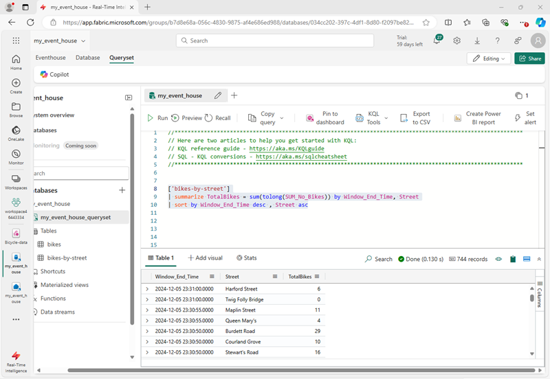

---
lab:
  title: Introdução ao Eventstream no Microsoft Fabric
  module: Get started with Eventstream in Microsoft Fabric
---
# Introdução ao Eventstream no Microsoft Fabric

O Eventstream é um recurso do Microsoft Fabric que captura, transforma e roteia eventos em tempo real para diversos destinos com uma experiência sem código. Você pode adicionar fontes de dados de evento, destinos de roteamento e o processador de eventos ao fluxo de eventos quando a transformação for necessária. O EventStore do Microsoft Fabric é uma opção de monitoramento que mantém os eventos do cluster e fornece uma maneira de entender o estado do cluster ou da carga de trabalho em um determinado momento. O serviço EventStore pode ser consultado para eventos que estão disponíveis para cada entidade e tipo de entidade em seu cluster. Isso significa que você pode consultar eventos em diferentes níveis, como clusters, nós, aplicativos, serviços, partições e réplicas de partição. O serviço EventStore também tem a capacidade de correlacionar eventos em seu cluster. Ao observar eventos que foram gravados ao mesmo tempo de diferentes entidades que podem ter impactado umas às outras, o serviço EventStore pode vincular esses eventos para ajudar a identificar as causas das atividades em seu cluster. Outra opção de monitoramento e diagnóstico de clusters do Microsoft Fabric é agregar e coletar eventos usando o fluxo de eventos.

Este laboratório leva cerca de **30** minutos para ser concluído.

> **Observação**: Você precisa de uma [avaliação do Microsoft Fabric](https://learn.microsoft.com/fabric/get-started/fabric-trial) para concluir esse exercício.

## Criar um workspace

Antes de trabalhar com os dados no Fabric, crie um workspace com a avaliação do Fabric habilitada.

1. Entre na [home page do Microsoft Fabric](https://app.fabric.microsoft.com/home?experience=fabric) em `https://app.fabric.microsoft.com/home?experience=fabric` e selecione **Power BI**.
2. Na barra de menus à esquerda, selecione **Workspaces** (o ícone é semelhante a &#128455;).
3. Crie um workspace com um nome de sua escolha selecionando um modo de licenciamento que inclua a capacidade do Fabric (*Avaliação*, *Premium* ou *Malha*).
4. Quando o novo workspace for aberto, ele deverá estar vazio, conforme mostrado aqui:

   
5. No canto inferior esquerdo do portal do Power BI, selecione o ícone do **Power BI** e alterne para a experiência de **Inteligência em Tempo Real**.

## Criar um Eventhouse de Inteligência em Tempo Real

1. Na home page da Inteligência em Tempo Real do Microsoft Fabric, crie um novo **Eventhouse** com um nome de sua escolha.
1. Feche todas as dicas ou prompts exibidos até ver o novo eventhouse vazio.

    

## Criar um banco de dados KQL

1. No Painel **Eventhouse de Inteligência em Tempo Real**, selecione a caixa **Banco de Dados KQL +**.
1. Você terá a opção de criar um **Novo banco de dados (padrão)** ou criar um **Novo banco de dados de atalho (seguidor)**.

    >**Observação:** o recurso de banco de dados seguidor permite anexar um banco de dados localizado em outro cluster ao cluster do Azure Data Explorer. O banco de dados seguidor é anexado no modo somente leitura, possibilitando exibir os dados e executar consultas sobre os dados que foram ingeridos no banco de dados líder. O banco de dados seguidor sincroniza as alterações nos bancos de dados líderes. Devido à sincronização, há um atraso de dados de alguns segundos a alguns minutos na disponibilidade dos dados. O tamanho do atraso depende do tamanho geral dos metadados do banco de dados líder. Os bancos de dados líder e seguidor usam a mesma conta de armazenamento para buscar os dados. O armazenamento pertence ao banco de dados líder. O banco de dados seguidor visualiza os dados sem precisar ingeri-los. Como o banco de dados anexado é um banco de dados somente leitura, os dados, as tabelas e as políticas do banco de dados não podem ser modificados, exceto a política de cache, as entidades de segurança e as permissões.

1. Crie um novo banco de dados e nomeie-o `Eventhouse-DB`

## Criar um fluxo de eventos

1. Na página principal do banco de dados KQL, selecione **Obter dados**.
2. Para a fonte de dados, selecione **Eventstream** > **Novo eventstream**. Nomear o eventstream `bicycle-data`.

    A criação do novo fluxo de eventos no workspace será concluída em apenas alguns instantes. Depois de estabelecido, você será redirecionado automaticamente para o editor primário, pronto para começar a integrar fontes ao fluxo de eventos.

    

## Estabelecer uma origem para um eventstream

1. Na tela do Eventstream, selecione **Usar dados de exemplo**.
2. Nomeie a fonte `Bicycles` e selecione os dados de exemplo **Bicycles**.

    Seu fluxo será mapeado e você aparecerá automaticamente na **tela do eventstream**.

   

## Adicionar um destino

1. Na lista suspensa **Transformar eventos ou adicionar destino**, selecione **Eventhouse**.
1. No painel **Eventhouse**, defina as seguintes opções de configuração.
   - **Modo de ingestão de dados:** processamento de eventos antes da ingestão
   - **Nome do destino:**`Bicycle-database`
   - **Workspace:***selecione o workspace que você criou no início deste exercício*
   - **Eventhouse**: *selecione o eventhouse*
   - **Banco de dados KQL:** Eventhouse-DB
   - **Tabela de destino:** crie uma nova tabela chamada `bike-count`
   - **Formato de dados de entrada:** JSON

   

1. No painel **Eventhouse**, selecione **Salvar**. 
1. Na barra de ferramentas, selecione **Publicar**.
1. Aguarde cerca de um minuto para que o destino de dados se torne ativo.

## Exibir dados capturados

O eventstream que você criou pega dados da fonte de amostra de dados de bicicleta e os carrega no banco de dados do eventhouse. Você pode exibir os dados capturados consultando a tabela no banco de dados.

1. Na barra de menus à esquerda, selecione o banco de dados **Eventhouse-DB**.
1. No menu **...** do banco de dados KQL **Eventhouse-DB**, selecione **Consultar dados**.
1. No painel de consulta, modifique a primeira consulta de exemplo, conforme mostrado aqui:

    ```kql
    ['bike-count']
    | take 100
    ```

1. Selecione o código de consulta e execute-o para ver 100 linhas de dados na tabela.

    

## Transformar dados do evento

Os dados que você capturou não são alterados a partir da fonte. Em muitos cenários, talvez você queira transformar os dados no fluxo de eventos antes de carregá-los em um destino.

1. Na barra de menus à esquerda, selecione o eventstream **Bicycle-data**.
1. Na barra de ferramentas, selecione **Editar** para editar o eventstream.

1. No menu **Transformar eventos**, selecione **Agrupar por** para adicionar um novo nó **Agrupar por** ao eventstream.
1. Arraste uma conexão da saída do nó **Dados da bicicleta** para a entrada do novo nó **Agrupar por**. Em seguida, use o ícone de *lápis* no nó **Agrupar por** para editá-lo.

   

1. Configure as propriedades da seção de configurações **Agrupar por**:
    - **Nome da operação:** GroupByStreet
    - **Tipo de agregação:***Selecione* Soma
    - **Campo:***selecione* No_Bikes. *Em seguida, selecione **Adicionar** para criar a função* SUM_No_Bikes
    - **Agregações de grupo por (opcional):** Rua
    - **Janela de tempo**: em cascata
    - **Duração**: 5 segundo
    - **Deslocamento**: 0 segundos

    > **Observação**: essa configuração fará com que o eventstream calcule o número total de bicicletas em cada rua a cada cinco segundos.
      
1. Salve a configuração e retorne à tela do eventstream, onde um erro é indicado (porque você precisa armazenar a saída do grupo por transformação em algum lugar!).

1. Use o ícone **+** à direita do nó **GroupByStreet** para adicionar um novo nó **Eventhouse**.
1. Configure o novo nó do eventhouse com as seguintes opções:
   - **Modo de ingestão de dados:** processamento de eventos antes da ingestão
   - **Nome do destino:**`Bicycle-database`
   - **Workspace:***selecione o workspace que você criou no início deste exercício*
   - **Eventhouse**: *Selecione seu eventhouse*
   - **Banco de dados KQL:** Eventhouse-DB
   - **Tabela de destino:** crie uma nova tabela chamada `bikes-by-street`
   - **Formato de dados de entrada:** JSON

   

1. No painel **Eventhouse**, selecione **Salvar**. 
1. Na barra de ferramentas, selecione **Publicar**.
1. Aguarde cerca de um minuto para que as alterações fiquem ativas.

## Ver os dados transformados

Agora você pode visualizar os dados da bicicleta que foram transformados e carregados em uma tabela pelo seu eventstream

1. Na barra de menus à esquerda, selecione o banco de dados **Eventhouse-DB**.
1. No menu **...** do banco de dados KQL **Eventhouse-DB**, selecione **Consultar dados**.
1. No painel de consulta, modifique uma consulta de exemplo, conforme mostrado aqui:

    ```kql
    ['bikes-by-street']
    | take 100
    ```

1. Selecione o código de consulta e execute-o para ver as primeiras 100 linhas na tabela.

    

    > **Dica**: você também pode consultar a tabela usando a sintaxe SQL. Por exemplo, a consulta `SELECT TOP 100 * FROM bikes-by-street`.

## Limpar os recursos

Neste exercício, você criou um eventhouse e preencheu tabelas em seu banco de dados usando um eventstream.

Depois de explorar o banco de dados KQL, exclua o workspace criado para este exercício.

1. Na barra à esquerda, selecione o ícone do seu workspace.
2. Na barra de ferramentas, clique em **Configurações do workspace**.
3. Na seção **Geral**, selecione **Remover este espaço de trabalho**.
.
