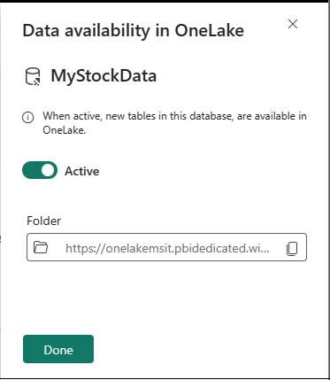

---
lab:
  title: Introdução ao Eventstream no Microsoft Fabric
  module: Get started with Eventstream in Microsoft Fabric
---
# Comece a usar o Eventstream no Real-Time Analytics (RTA)

O Eventstream é um recurso do Microsoft Fabric que captura, transforma e roteia eventos em tempo real para diversos destinos com uma experiência sem código. Você pode adicionar fontes de dados de evento, destinos de roteamento e o processador de eventos ao fluxo de eventos quando a transformação for necessária. O EventStore do Microsoft Fabric é uma opção de monitoramento que mantém os eventos do cluster e fornece uma maneira de entender o estado do cluster ou da carga de trabalho em um determinado momento. O serviço EventStore pode ser consultado para eventos que estão disponíveis para cada entidade e tipo de entidade em seu cluster. Isso significa que você pode consultar eventos em diferentes níveis, como clusters, nós, aplicativos, serviços, partições e réplicas de partição. O serviço EventStore também tem a capacidade de correlacionar eventos em seu cluster. Ao observar eventos que foram gravados ao mesmo tempo de diferentes entidades que podem ter impactado umas às outras, o serviço EventStore pode vincular esses eventos para ajudar a identificar as causas das atividades em seu cluster. Outra opção de monitoramento e diagnóstico de clusters do Microsoft Fabric é agregar e coletar eventos usando o fluxo de eventos.

Este laboratório leva cerca de **30** minutos para ser concluído.

> **Observação**: Você precisa de uma [avaliação do Microsoft Fabric](https://learn.microsoft.com/fabric/get-started/fabric-trial) para concluir esse exercício.

## Criar um workspace

Antes de trabalhar com os dados no Fabric, crie um workspace com a avaliação do Fabric habilitada.

1. Entre no [Microsoft Fabric](https://app.fabric.microsoft.com) em `https://app.fabric.microsoft.com` e selecione **Power BI**.
2. Na barra de menus à esquerda, selecione **Workspaces** (o ícone é semelhante a &#128455;).
3. Crie um workspace com um nome de sua escolha selecionando um modo de licenciamento que inclua a capacidade do Fabric (*Avaliação*, *Premium* ou *Malha*).
4. Quando o novo workspace for aberto, ele deverá estar vazio, conforme mostrado aqui:

   
5. No canto inferior esquerdo do portal do Power BI, selecione o ícone do **Power BI** e alterne para a experiência de **Análise em tempo real**.

## Cenário

Com os fluxos de eventos do Fabric, é possível gerenciar facilmente dados de eventos em um só lugar. Você pode coletar, transformar e enviar dados de eventos em tempo real para destinos diferentes no formato desejado. Também é possível conectar fluxos de eventos com Hubs de Eventos do Azure, bancos de dados KQL e Lakehouses com facilidade.

Este laboratório se baseia em dados de streaming de exemplo chamados Dados do Mercado de Ações. Os dados de exemplo de Mercado de Ações são um conjunto de dados de uma bolsa de valores com uma coluna de esquema predefinida, como hora, símbolo, preço, volume, entre outros. Você usará esses dados de exemplo para simular eventos em tempo real de preços de ações e analisá-los com vários destinos, como o banco de dados KQL.

Use os recursos de streaming e consulta da análise em tempo real para responder às principais perguntas sobre as estatísticas de estoque. Nesse cenário, vamos aproveitar ao máximo o assistente em vez de criar manualmente alguns componentes de maneira independente, como o Banco de Dados KQL.

Neste tutorial, você aprenderá como:

- Criar um banco de dados KQL
- Habilitar a cópia de dados para o OneLake
- Criar um fluxo de eventos
- Transmitir dados de um fluxo de eventos para o banco de dados KQL
- Explorar dados com o KQL e o SQL

## Criar um banco de dados KQL

1. Na **Análise em Tempo Real**, selecione a caixa **Banco de Dados KQL**.

   

2. Você precisará **Nomear** o banco de dados KQL

   

3. Dê ao banco de dados KQL um nome do qual você se lembrará, como **MyStockData**, e pressione **Criar**.

1. No painel **Detalhes do banco de dados**, selecione o ícone de lápis para ativar a disponibilidade no OneLake.

   

2. Alterne o botão para **Ativo** e selecione **Concluído**.

 > **Observação:** Você não precisa selecionar uma pasta, o Fabric a criará para você.

   

## Criar um fluxo de eventos

1. Na barra de menus, selecione **Análise em Tempo Real** (o ícone é semelhante ao )
2. Em **Novo**, selecione **Fluxo de Eventos (Versão Prévia)**

   

3. Será solicitado a você **Nomear** o fluxo de eventos. Dê ao EventStream um nome de que você se lembrará, como **MyStockES**, e pressione o botão **Criar**.

   

## Estabelecer uma origem e um destino para um fluxo de eventos

1. Na tela do Fluxo de eventos, selecione **Nova fonte** na lista suspensa e selecione **Dados de Exemplo**.

   

2. Insira os valores dos Dados de Amostra conforme mostrado na tabela a seguir e, em seguida, selecione **Adicionar**.

   | Campo       | Valor recomendado |
   | ----------- | ----------------- |
   | Nome de origem | StockData         |
   | Dados de exemplo | Mercado de Ações      |

3. Agora, adicione um destino selecionando **Novo destino** e clique em **Banco de dados KQL**.

   

4. Na configuração do Banco de Dados KQL, use a tabela a seguir para concluir a configuração.

   | Campo            | Valor recomendado                              |
   | ---------------- | ---------------------------------------------- |
   | Nome do destino | MyStockData                                    |
   | Workspace        | O workspace em que você criou um banco de dados KQL |
   | Banco de dados KQL     | MyStockData                                    |
   | Tabela de destino| MyStockData                                    |
   | Formato de dados de entrada| Json                                           |

3. Selecione **Adicionar**.

> **Observação**: A ingestão de dados começará imediatamente.

Aguarde até que todas as etapas sejam marcadas com marcas de seleção verde. Você verá o título da página **Ingestão contínua do fluxo de eventos estabelecida.** Depois disso, selecione **Fechar** para voltar à página Fluxo de eventos.

> **Observação**: Pode ser necessário atualizar a página para exibir a tabela depois que a conexão do fluxo de eventos for criada e estabelecida.

## Consultas KQL

O KQL (Linguagem de Consulta Kusto) é uma solicitação somente leitura para processar dados e retornar resultados. A solicitação é declarada em texto sem formatação que é fácil de ler, criar e automatizar. As consultas sempre são executadas no contexto de uma tabela ou de um banco de dados específico. No mínimo, uma consulta consiste em uma referência de dados de origem e em um ou mais operadores de consulta aplicados em sequência, indicados visualmente pelo uso de um caractere de barra vertical (|) para delimitar os operadores. Para saber mais sobre a Linguagem de Consulta Kusto, confira [Visão geral do KQL (Linguagem de Consulta Kusto)](https://learn.microsoft.com/en-us/azure/data-explorer/kusto/query/?context=%2Ffabric%2Fcontext%2Fcontext)

> **Observação**: o editor KQL é fornecido com realce de sintaxe e Inellisense, o que permite conhecer rapidamente a KQL (Linguagem de Consulta Kusto).

1. Navegue até o banco de dados KQL recém-criado e hidratado chamado **MyStockData**.
2. Na árvore Dados, selecione o menu Mais […] na tabela MyStockData. Em seguida, selecione Tabela de consulta > Mostrar quaisquer 100 registros.

   

3. A consulta de exemplo será aberta no painel **Explorar seus dados** com o contexto de tabela já preenchido. Essa primeira consulta usa o operador take para retornar um exemplo de número de registros e é útil para dar uma primeira olhada na estrutura de dados e nos valores possíveis. Os exemplos de consultas preenchidas automaticamente são executados automaticamente. Você poderá ver os resultados da consulta no painel de resultados.

   

4. Volte à árvore de dados para selecionar a próxima consulta, que usa o operador where e o operador between para retornar os registros ingeridos nas últimas 24 horas.

   

> **Observação**: Você poderá ver um aviso de que excedeu os limites de consulta. Esse comportamento vai variar conforme o volume de dados transmitidos para o banco de dados.

Você pode continuar navegando com as funções de consulta internas para se familiarizar com seus dados.

## Exemplos de consultas SQL

O editor de consultas dá suporte ao uso do T-SQL, além do KQL (Linguagem de Consulta Kusto) de consulta primária. O T-SQL pode ser útil para ferramentas que não podem usar o KQL. Para obter mais informações, confira [Consultar dados usando o T-SQL](https://learn.microsoft.com/en-us/azure/data-explorer/t-sql)

1. De volta à árvore Dados, selecione o **menu Mais** […] na tabela MyStockData. Selecione **Consultar tabela > SQL > Mostrar quaisquer 100 registros**.

   

2. Coloque o cursor em algum lugar dentro da consulta e selecione **Executar** ou pressione **SHIFT + ENTER**.

   

Você pode continuar navegando usando as funções de build e se familiarizar com os dados usando o SQL ou o KQL. Isso encerra a lição.

## Limpar os recursos

Neste exercício, você criou um banco de dados KQL e configurou o streaming contínuo com fluxo de eventos. Depois disso, você consultou os dados usando o KQL e o SQL. Depois de explorar o banco de dados KQL, exclua o workspace criado para este exercício.
1. Na barra à esquerda, selecione o ícone do seu workspace.
2. No menu **…** da barra de ferramentas, selecione **Configurações do workspace**.
3. Na seção **Geral**, selecione **Remover este workspace**.
