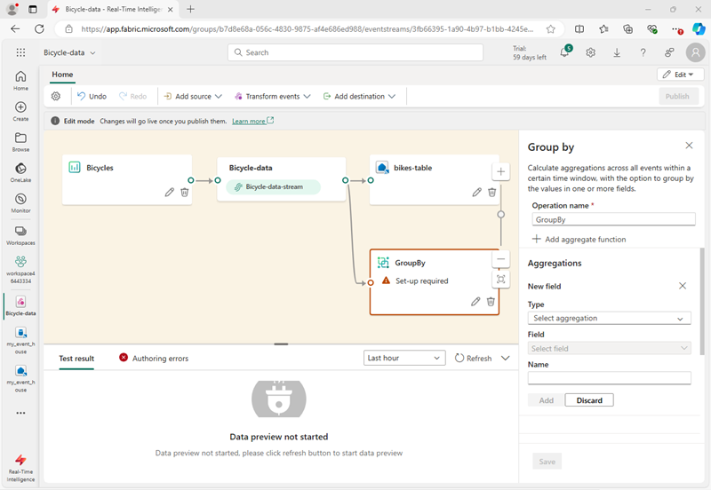
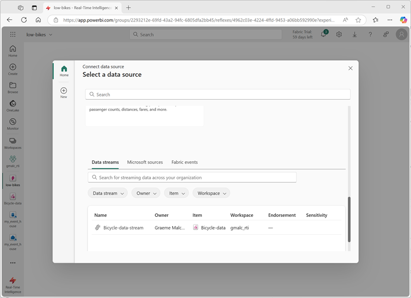

---
lab:
  title: Trabalhar com dados em tempo real em um Eventstream no Microsoft Fabric
  module: Ingest real-time data with Eventstream in Microsoft Fabric
---
# Trabalhar com dados em tempo real em um Eventstream no Microsoft Fabric

O Eventstream é um recurso do Microsoft Fabric que captura, transforma e roteia eventos em tempo real para diversos destinos. Você pode adicionar fontes de dados de eventos, destinos e transformações ao eventstream.

Neste exercício, você ingerirá dados de uma fonte de dados de exemplo que emite um fluxo de eventos relacionados a observações de pontos de coleta de bicicletas em um sistema de compartilhamento de bicicletas no qual as pessoas podem alugar bicicletas dentro de uma cidade.

Este laboratório leva cerca de **30** minutos para ser concluído.

> **Observação**: para concluir este exercício, você precisa de um [locatário do Microsoft Fabric](https://learn.microsoft.com/fabric/get-started/fabric-trial).

## Criar um workspace

Antes de trabalhar com os dados no Fabric, você precisa criar um espaço de trabalho em um locatário com a funcionalidade do Fabric habilitada.

1. Na [home page do Microsoft Fabric](https://app.fabric.microsoft.com/home?experience=fabric), em `https://app.fabric.microsoft.com/home?experience=fabric`, selecione **Inteligência em Tempo Real**.
1. Na barra de menus à esquerda, selecione **Workspaces** (o ícone é semelhante a &#128455;).
1. Crie um workspace com um nome de sua escolha selecionando um modo de licenciamento que inclua a capacidade do Fabric (*Avaliação*, *Premium* ou *Malha*).
1. Quando o novo workspace for aberto, ele estará vazio.

    

## Criar uma eventhouse

Agora que você tem um espaço de trabalho, pode começar a criar os itens do Fabric necessários para sua solução de inteligência em tempo real. Começaremos criando um eventhouse.

1. Na barra de menus à esquerda, selecione **Página Inicial**; em seguida, na página inicial da Inteligência em Tempo Real, crie um **Eventhouse** e dê um nome exclusivo de sua escolha.
1. Feche todas as dicas ou prompts exibidos até ver o novo eventhouse vazio.

    

1. No painel à esquerda, o eventhouse contém um banco de dados KQL com o mesmo nome do eventhouse.
1. Selecione o banco de dados KQL para visualizá-lo.

    Atualmente, não há tabelas no banco de dados. No restante deste exercício, você usará um eventstream para carregar dados de uma fonte em tempo real em uma tabela.

## Criar um fluxo de eventos

1. Na página principal do banco de dados KQL, selecione **Obter dados**.
2. Para a fonte de dados, selecione **Eventstream** > **Novo eventstream**. Nomear o eventstream `Bicycle-data`.

    A criação do novo fluxo de eventos no workspace será concluída em apenas alguns instantes. Depois de estabelecido, você será redirecionado automaticamente para o editor primário, pronto para começar a integrar fontes ao fluxo de eventos.

    

## Adicionar uma fonte

1. Na tela do Eventstream, selecione **Usar dados de exemplo**.
2. Nomeie a fonte `Bicycles` e selecione os dados de exemplo **Bicycles**.

    Seu fluxo será mapeado e você aparecerá automaticamente na **tela do eventstream**.

   

## Adicionar um destino

1. Use o ícone **+** à direita do nó **Bicycle-data** para adicionar um novo nó **Eventhouse**.
1. Use o ícone de *lápis* no novo nó do eventhouse para editá-lo.
1. No painel **Eventhouse**, defina as seguintes opções de configuração.
   - **Modo de ingestão de dados:** processamento de eventos antes da ingestão
   - **Nome do destino:**`bikes-table`
   - **Workspace:***selecione o workspace que você criou no início deste exercício*
   - **Eventhouse**: *selecione o eventhouse*
   - **Banco de dados KQL:***selecione seu banco de dados KQL*
   - **Tabela de destino:** crie uma nova tabela chamada `bikes`
   - **Formato de dados de entrada:** JSON

   

1. No painel **Eventhouse**, selecione **Salvar**. 
1. Na barra de ferramentas, selecione **Publicar**.
1. Aguarde cerca de um minuto para que o destino de dados se torne ativo. Em seguida, selecione o nó **bikes-table** na tela de design e exiba o painel **Visualização de dados** abaixo para ver os dados mais recentes que foram ingeridos:

   

1. Aguarde alguns minutos e use o botão **Atualizar** para atualizar o painel Visualização**Visualização de dados**. O fluxo é executado perpetuamente, portanto, novos dados podem ter sido adicionados à tabela.
1. Abaixo da tela de design do fluxo de eventos, visualize a guia **Insights de dados** para ver os detalhes dos eventos de dados que foram capturados.

## Consultar dados capturados

O eventstream que você criou pega dados da fonte de amostra de dados de bicicleta e os carrega no banco de dados do eventhouse. Você pode analisar os dados capturados consultando a tabela no banco de dados.

1. Na barra de menu à esquerda, selecione seu banco de dados KQL.
1. Na guia do **banco de dados**, na barra de ferramentas do banco de dados KQL, use o botão **Atualizar** para atualizar a exibição até ver a tabela **bikes** no banco de dados. Em seguida, selecione a tabela **bikes**.

   

1. No menu **...** para a tabela **bikes**, selecione ** Consultar tabela** > **Registros ingeridos nas últimas 24 horas**.
1. No painel de consulta, observe que a seguinte consulta foi gerada e executada, com os resultados mostrados abaixo:

    ```kql
    // See the most recent data - records ingested in the last 24 hours.
    bikes
    | where ingestion_time() between (now(-1d) .. now())
    ```

1. Selecione o código de consulta e execute-o para ver 100 linhas de dados na tabela.

    

## Transformar dados do evento

Os dados que você capturou não são alterados a partir da fonte. Em muitos cenários, talvez você queira transformar os dados no fluxo de eventos antes de carregá-los em um destino.

1. Na barra de menus à esquerda, selecione o eventstream **Bicycle-data**.
1. Na barra de ferramentas, selecione **Editar** para editar o eventstream.
1. No menu **Transformar eventos**, selecione **Agrupar por** para adicionar um novo nó **Agrupar por** ao eventstream.
1. Arraste uma conexão da saída do nó **Dados da bicicleta** para a entrada do novo nó **Agrupar por**. Em seguida, use o ícone de *lápis* no nó **Agrupar por** para editá-lo.

   

1. Configure as propriedades da seção de configurações **Agrupar por**:
    - **Nome da operação:** GroupByStreet
    - **Tipo de agregação:***Selecione* Soma
    - **Campo:***selecione* No_Bikes. *Em seguida, selecione **Adicionar** para criar a função* SUM of No_Bikes
    - **Agregações de grupo por (opcional):** Rua
    - **Janela de tempo**: em cascata
    - **Duração**: 5 segundo
    - **Deslocamento**: 0 segundos

    > **Observação**: essa configuração fará com que o eventstream calcule o número total de bicicletas em cada rua a cada cinco segundos.
      
1. Salve a configuração e retorne à tela do eventstream, onde um erro é indicado (porque você precisa armazenar a saída da transformação em algum lugar!).

1. Use o ícone **+** à direita do nó **GroupByStreet** para adicionar um novo nó **Eventhouse**.
1. Configure o novo nó do eventhouse com as seguintes opções:
   - **Modo de ingestão de dados:** processamento de eventos antes da ingestão
   - **Nome do destino:**`bikes-by-street-table`
   - **Workspace:***selecione o workspace que você criou no início deste exercício*
   - **Eventhouse**: *selecione o eventhouse*
   - **Banco de dados KQL:***selecione seu banco de dados KQL*
   - **Tabela de destino:** crie uma nova tabela chamada `bikes-by-street`
   - **Formato de dados de entrada:** JSON

    

1. No painel **Eventhouse**, selecione **Salvar**. 
1. Na barra de ferramentas, selecione **Publicar**.
1. Aguarde cerca de um minuto para que as alterações fiquem ativas.
1. Na tela de design, selecione o nó **bikes-by-street-table** e exiba o painel **visualização de dados** abaixo da tela.

    

    Observe que os dados transformados incluem o campo de agrupamento que você especificou (**Street**), a agregação que você especificou (**SUM_no_Bikes**) e um campo de carimbo de data/hora indicando o fim da janela em cascata de 5 segundos em que o evento ocorreu (**Window_End_Time**).

## Consultar os dados transformados

Agora você pode consultar os dados da bicicleta que foram transformados e carregados em uma tabela pelo seu eventstream

1. Na barra de menu à esquerda, selecione seu banco de dados KQL.
1. 1. Na guia **banco de dados**, na barra de ferramentas do seu banco de dados KQL, use o botão **Atualizar** para atualizar a visualização até ver a tabela **bikes-by-street** abaixo do banco de dados.
1. No menu **...** para a tabela **bikes-by-street**, selecione **Consultar dados** > **Mostrar quaisquer 100 registros**.
1. No painel de consulta, observe que a seguinte consulta é gerada e executada:

    ```kql
    ['bikes-by-street']
    | take 100
    ```

1. Modifique a consulta KQL para recuperar o número total de bicicletas por rua em cada janela de 5 segundos:

    ```kql
    ['bikes-by-street']
    | summarize TotalBikes = sum(tolong(SUM_No_Bikes)) by Window_End_Time, Street
    | sort by Window_End_Time desc , Street asc
    ```

1. Selecione a consulta modificada e execute-a.

    Os resultados mostram o número de bicicletas observadas em cada rua a cada período de 5 segundos.

    

<!--
## Add an Activator destination

So far, you've used an eventstream to load data into tables in an eventhouse. You can also direct streams to an activator and automate actions based on values in the event data.

1. In the menu bar on the left, return to the **Bicycle-data** eventstream. Then in the eventstream page, on the toolbar, select **Edit**.
1. In the **Add destination** menu, select **Activator**. Then drag a connection from the output of the **Bicycle-data** stream to the input of the new Activator destination.
1. Configure the new Activator destination with the following settings:
    - **Destination name**: `low-bikes-activator`
    - **Workspace**: *Select your workspace*
    - **Activator**: *Create a **new** activator named `low-bikes`*
    - **Input data format**: Json

    

1. Save the new destination.
1. In the menu bar on the left, select your workspace to see all of the items you have created so far in this exercise - including the new **low-bikes** activator.
1. Select the **low-bikes** activator to view its page, and then on the activator page select **Get data**.
1. On the **select a data source** dialog box, scroll down until you see **Data streams** and then select the **Bicycle-data-stream**.

    

1. Use the **Next**,  **Connect**, and **Finish** buttons to connect the stream to the activator.

    > **Tip**: If the data preview obscures the **Next** button, close the dialog box, select the stream again, and click **Next** before the preview is rendered.

1. When the stream has been connected, the activator page displays the **Events** tab:

    

1. Add a new rule, and configure its definition with the following settings:
    - **Monitor**:
        - **Event**: Bicycle-data-stream-event
    - **Condition**
        - **Condition 1**:
            - **Operation**: Numeric state: Is less than or equal to
            - **Column**: No_Bikes
            - **Value**: 3
            - **Default type**: Same as window size
    - **Action**:
        - **Type**: Email
        - **To**: *The email address for the account you are using in this exercise*
        - **Subject**: `Low bikes`
        - **Headline**: `The number of bikes is low`
        - **Message**: `More bikes are needed.`
        - **Context**: *Select the **Neighborhood**, **Street**, and **No-Bikes** columns.

    

1. Save and start the rule.
1. View the **Analytics** tab for the rule, which should show each instance if the condition being met as the stream of events is ingested by your eventstream.

    Each instance will result in an email being sent notifying you of low bikes, which will result in a large numbers of emails, so...

1. On the toolbar, select **Stop** to stop the rule from being processed.

-->

## Limpar os recursos

Neste exercício, você criou um eventhouse e preencheu tabelas em seu banco de dados usando um eventstream.

Depois de explorar o banco de dados KQL, exclua o workspace criado para este exercício.

1. Na barra à esquerda, selecione o ícone do seu workspace.
2. Na barra de ferramentas, selecione **Configurações do espaço de trabalho**.
3. Na seção **Geral**, selecione **Remover este espaço de trabalho**.
.
