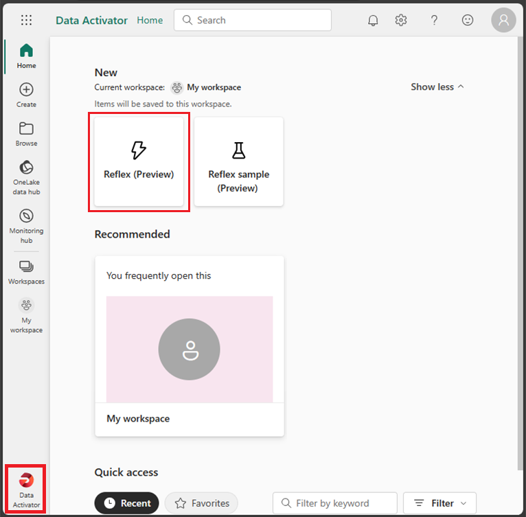
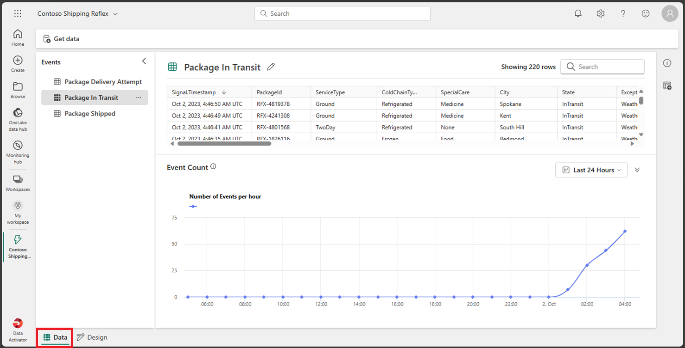
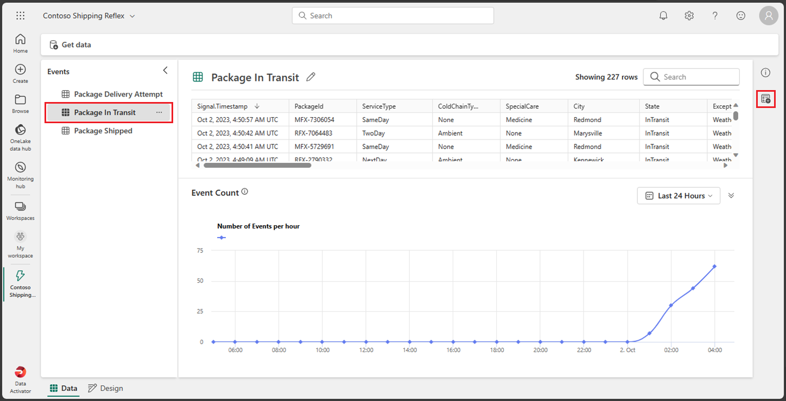
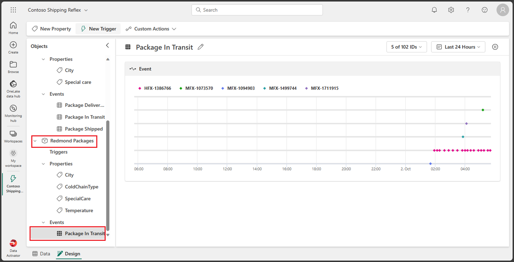
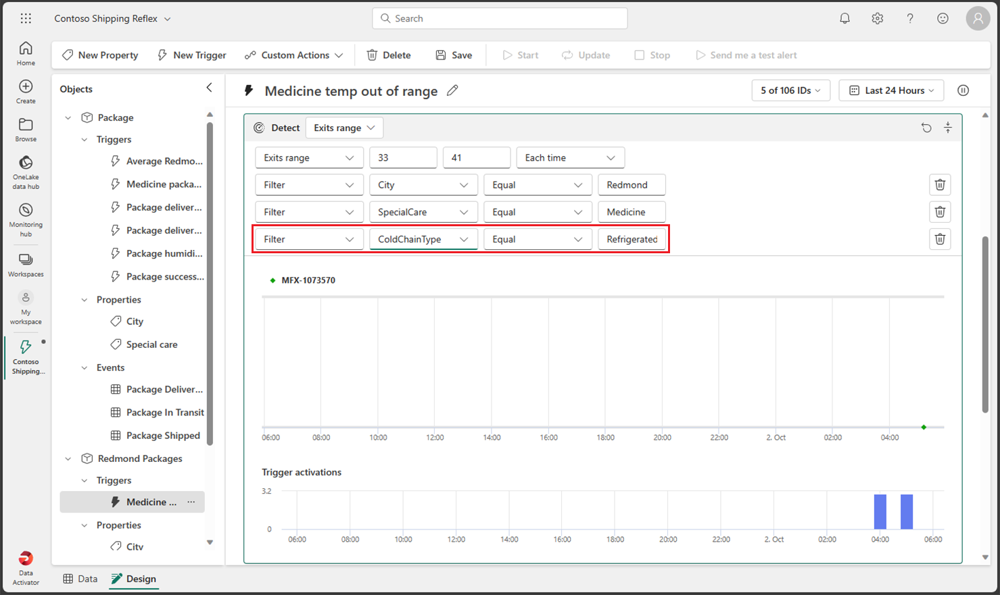
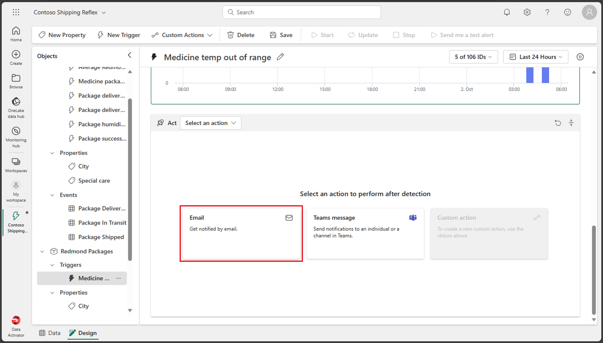

---
lab:
  title: Usar o Data Activator no Fabric
  module: Get started with Data Activator in Microsoft Fabric
---

# Usar o Data Activator no Fabric

O Data Activator no Microsoft Fabric executa uma ação com base no que está acontecendo em seus dados. O Data Activator permite monitorar seus dados e criar gatilhos para reagir às alterações de dados.

Este laboratório leva cerca de **30** minutos para ser concluído.

> **Observação**: Você precisa de uma [avaliação do Microsoft Fabric](https://learn.microsoft.com/fabric/get-started/fabric-trial) para concluir esse exercício.

## Criar um workspace

Antes de trabalhar com os dados no Fabric, crie um workspace com a avaliação do Fabric habilitada.

1. Na [página inicial do Microsoft Fabric](https://app.fabric.microsoft.com), selecione **Data Activator**.
1. Na barra de menus à esquerda, selecione **Workspaces** (o ícone é semelhante a &#128455;).
1. Crie um workspace com um nome de sua escolha selecionando um modo de licenciamento que inclua a capacidade do Fabric (*Avaliação*, *Premium* ou *Malha*).
1. Quando o novo workspace for aberto, ele estará vazio.

    

Neste laboratório, você usará o Data Activator no Fabric para criar um *reflex*. O Data Activator fornece convenientemente um conjunto de dados de amostra que você pode utilizar para explorar as capacidades do Data Activator. Você utilizará esses dados de amostra para criar um *reflex* que analise alguns dados em tempo real e crie um gatilho para enviar um email quando uma condição for atendida.

> **OBSERVAÇÃO**: o processo de amostra do Ativador de Dados gera alguns dados aleatórios em segundo plano. Quanto mais complexas forem suas condições e filtros, mais tempo será necessário para dispará-los. Se você não vir nenhum dado no grafo, aguarde alguns minutos e atualize a página. Dito isso, você não precisa esperar que os dados sejam exibidos nos grafos para continuar com o laboratório.

## Cenário

Nesse cenário, você é analista de dados de uma empresa que vende e envia uma variedade de produtos.  Você é responsável pelos dados de todas as remessas e vendas para a cidade de Redmond. Você deve criar um reflex que monitore os pacotes que estão prontos para entrega. Uma categoria de produtos que você envia são prescrições médicas que precisam ser refrigeradas a uma temperatura específica durante o trânsito. Você deseja criar um reflex que envie um email para o departamento de remessa se a temperatura de um pacote contendo uma receita médica for maior ou menor do que um determinado limite. A temperatura ideal deve estar entre 33 graus e 41 graus. Como os eventos do reflex já contêm um gatilho de modo semelhante, você deve criar um especificamente para os pacotes enviados para a cidade de Redmond. Vamos começar!

## Criar um reflex

1. Certifique-se de estar na tela inicial do Data Activator, verificando se o ícone no canto inferior direito reflete o Data Activator. Vamos criar um novo reflex selecionando o botão **reflex (versão prévia)** .

    

1. Em um ambiente de produção real, você usaria seus próprios dados. No entanto, para este laboratório, você usa os dados de exemplo fornecidos pelo Data Activator. Selecione o botão **Usar Dados de Amostra** para terminar de criar seu reflex.

    

1. Por padrão, o Data Activator cria seu Reflex com o nome *Reflex AAAA-MM-DD hh:mm:ss*. Como você pode ter vários reflexes em seu espaço de trabalho, deve alterar o nome do reflex padrão para um mais descritivo. Selecione o botão de menu suspenso ao lado do nome do reflexo atual no canto superior esquerdo e altere o nome para ***Contoso Shipping Reflex*** para o nosso exemplo.

    

Nosso reflex já foi criado e podemos começar a adicionar gatilhos e ações a ele.

## Familiarize-se com a tela inicial do reflex

A tela inicial do reflex é dividida em duas seções, o modo *Design* e o modo *Dados*. Você pode selecionar o modo selecionando a respectiva guia na parte inferior esquerda da tela.  A guia do modo *Design* é onde você define seus objetos com seus gatilhos, propriedades e eventos. A guia modo de *Dados* é o local em que você pode adicionar suas fontes de dados e exibir os dados que seu reflex processa. Vamos dar uma olhada na guia do modo *Design*, que será aberta por padrão quando você criar seu reflex.

### Modo Design

Se você não estiver no modo *Design* no momento, selecione a guia **Design** na parte inferior esquerda da tela.

Para se familiarizar com o modo *Design*, selecione as diferentes seções da tela, gatilhos, propriedades e eventos. Abordamos cada seção mais detalhadamente nas seções a seguir.

### Modo de dados

Se você não estiver no modo *Dados* no momento, selecione a guia **Dados** na parte inferior esquerda da tela. Em um exemplo do mundo real, você adicionaria suas próprias fontes de dados de seus visuais do EventStreams e Power BI aqui. Para este laboratório, você deve usar os dados de amostra fornecidos pelo Data Activator. Essa amostra já está configurada com três EventStreams que estão monitorando o status de entrega do pacote.

Selecione cada um dos diferentes eventos e observe os dados que estão sendo utilizados no fluxo.

É hora de adicionar um gatilho ao nosso reflex, mas, primeiro, vamos criar um novo objeto.

## Criar um objeto 

Em um cenário do mundo real, talvez não seja necessário criar um novo objeto para esse reflex, pois a amostra do Data Activator já inclui um objeto chamado *Pacote*. Mas para este laboratório, criamos um novo objeto para demonstrar como criar um. Vamos criar um novo objeto chamado *Pacotes para Redmond*.

1. Se você não estiver no modo *Dados* no momento, selecione a guia **Dados** na parte inferior esquerda da tela.

1. Selecione o evento ***Pacote em trânsito***. Preste muita atenção aos valores nas colunas *PackageId*, *Temperatura*, *ColdChainType*, *Cidade* e *SpecialCare*. Você utilizará essas colunas para criar seu gatilho.

1. Se a caixa de diálogo *Atribuir seus dados* ainda não estiver aberta no lado direito, selecione o botão **Atribuir seus dados** à direita da tela.

    

1. Na caixa de diálogo *Atribuir seus dados*, selecione a guia ***Atribuir a um novo objeto*** e insira os seguintes valores:

    - **Nome do objeto**: *Pacotes para Redmond*
    - **Atribuir coluna de chave**: *PackageId*
    - **Atribuir propriedades**: *City, ColdChainType, SpecialCare, Temperature*

    

1. Selecione **Salvar** e, em seguida, selecione **Salvar e ir para o modo de design**.

1. Agora você deve estar de volta ao modo *Design*. Um novo objeto chamado ***Pacotes para Redmond*** foi adicionado. Selecione esse novo objeto, expanda seus *Eventos* e selecione o evento **Pacote em trânsito**.

    

Hora de criar o gatilho.

## Criar um gatilho

Vamos analisar o que você deseja que seu gatilho faça: *você deseja criar um reflex que envie um email para o departamento de envio se a temperatura de um pacote contendo uma receita médica for maior ou menor que um determinado limite. A temperatura ideal deve estar entre 33 graus e 41 graus. Como os eventos do reflex já contêm um gatilho de modo semelhante, você criará um especificamente para os pacotes enviados para a cidade de Redmond*.

1. No evento *Pacote Em Transito* do objeto **Pacotes Redmond**, selecione o botão **Novo Gatilho** no menu superior. Um novo gatilho é criado com o nome padrão *Sem título*, altere o nome para ***Temperatura dos medicamentos fora do intervalo*** para definir melhor o gatilho.

    

1. É hora de selecionar a propriedade ou a coluna de evento que dispara seu reflex. Como você criou várias propriedades quando criou o objeto, selecione o botão **Propriedade existente** e selecione a propriedade ***Temperatura***. 

    

    A seleção dessa propriedade deve retornar um grafo com um exemplo de valores de histórico de temperatura.

    

1. Agora você precisa decidir que tipo de condição você deseja disparar dessa propriedade. Nesse caso, você deseja disparar seu reflex quando a temperatura estiver acima de 41 ou abaixo de 33 graus. Como estamos procurando um intervalo numérico, selecione o botão **Numérico** e selecione a condição **Fora do intervalo**.

    

1. Agora você precisa inserir os valores para sua condição. Insira ***33*** e ***41*** como os valores de intervalo. Como você escolheu a condição *fora do intervalo numérico*, o gatilho deve ser acionado quando a temperatura estiver abaixo de *33* ou acima de *41* graus.

    

1. Até agora, você definiu a propriedade e a condição em que deseja que o gatilho seja disparado, mas isso ainda não inclui todos os parâmetros de que você precisa. Você ainda precisa ter certeza de que o gatilho só dispara para a *cidade* de **Redmond** e para o tipo *cuidados especiais* de **Medicamentos**. Vamos em frente e vamos adicionar alguns filtros para essas condições.  Selecione o botão **Adicionar filtro**, defina a propriedade como ***Cidade*** , defina o relacionamento como ***Igual*** e insira ***Redmond*** como valor. Em seguida, adicione um novo filtro com a propriedade ***SpecialCare***, defina-a como ***Igual*** e insira ***Medicina*** como valor.

    

1. Vamos adicionar mais um filtro só para garantir que o medicamento seja refrigerado. Selecione o botão **Adicionar filtro**, defina a propriedade ***ColdChainType***, defina-a como ***Igual*** e insira ***Refrigerado*** como valor.

    

1. Você está quase lá! Você só precisa definir qual ação deseja executar quando o gatilho é acionado. Nesse caso, você deseja enviar um email para o departamento de remessa. Selecione o botão **Email**.

    

1. Insira os seguintes valores para sua ação de email:

    - **Enviar para**: sua conta de usuário atual deve ser selecionada por padrão, o que deve ser bom para este laboratório.
    - **Assunto**: *Pacote de medicamentos para Redmond fora do intervalo de temperatura aceitável*
    - **Título**: *Temperatura muito alta ou muito baixa*
    - **Informações adicionais**: selecione a propriedade *Temperatura* na lista de caixas de seleção.

    

1. Selecione **Salvar** e **Iniciar** no menu superior.

Agora você criou e iniciou um gatilho no Data Activator.

## Atualizações e interrupção de um gatilho

O único problema com esse gatilho é que, embora o gatilho tenha enviado um email com a temperatura, o gatilho não enviou o *PackageId* do pacote. Vamos atualizar o gatilho para incluir o *PackageId*.

1. Selecione o evento **Pacotes em trânsito** no objeto **Pacotes para Redmond** e selecione **Nova propriedade** no menu superior.

    

1. Vamos adicionar a propriedade **PackageId** selecionando a coluna no evento *Pacotes em trânsito*. Não se esqueça de alterar o nome da propriedade de *Sem título* para *PackageId*.

    

1. Vamos atualizar nossa ação de gatilho. Selecione o gatilho **Temperatura dos medicamentos fora do intervalo**, role até a seção **Ato** na parte inferior, selecione **Informações adicionais** e adicione a propriedade **PackageId**. NÃO selecione o botão **Salvar** ainda.

    

1. Como você atualizou o gatilho, a ação correta deve ser atualizar e não salvar o gatilho, mas para este laboratório fazemos o oposto e selecionamos o botão **Salvar** em vez do botão **Atualizar** para ver também o que acontece. O motivo pelo qual você deve ter selecionado o botão *Atualizar* é porque quando você seleciona a opção de *atualizar* o gatilho, ele salva o gatilho e atualiza o gatilho em execução com as novas condições. Se você selecionar apenas o botão *Salvar*, o gatilho em execução não aplicará as novas condições até que você selecione atualizar o gatilho. Vamos em frente e vamos selecionar o botão **Salvar**.

1. Como você selecionou *Salvar* em vez de *Atualizar*, você deve ter notado que a mensagem *Há uma atualização de propriedade disponível. Atualize agora para garantir que o gatilho tenha as alterações mais recentes exibidas* na parte superior da tela. Além disso, a mensagem tem o botão *Atualizar*. Vamos em frente e vamos selecionar o botão **Atualizar**.

    

1. Interrompa o disparo selecionando o botão **Parar** no menu superior.

## Limpar os recursos

Neste exercício, você criou um reflex com um gatilho no Data Activator. Agora você deve estar familiarizado com a interface do Data Activator e como criar um reflex e seus objetos, gatilho e propriedades.

Se tiver concluído a exploração do reflex do Data Activator, você poderá excluir o espaço de trabalho criado para este exercício.

1. Na barra à esquerda, selecione o ícone do workspace para ver todos os itens que ele contém.
2. No menu **…** da barra de ferramentas, selecione **Configurações do workspace**.
3. Na seção **Geral**, selecione **Remover este workspace**.
