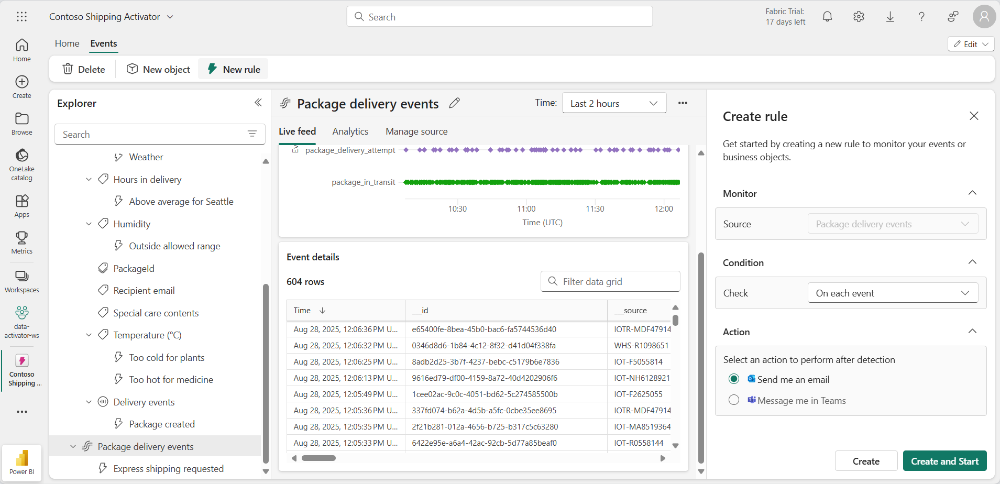

# Usar o Data Activator no Fabric

O Data Activator no Microsoft Fabric executa uma ação com base no que está acontecendo em seus dados. Um Activator permite monitorar seus dados e criar gatilhos para reagir às alterações de dados.

Este laboratório leva cerca de **30** minutos para ser concluído.

> **Observação**: Você precisa de uma [avaliação do Microsoft Fabric](https://learn.microsoft.com/fabric/get-started/fabric-trial) para concluir esse exercício.

## Cenário

Nesse cenário, você é analista de dados de uma empresa que vende e envia uma variedade de produtos.  Você é responsável pelos dados de todas as remessas e vendas para a cidade de Redmond. Você deve criar uma regra de alerta que monitore os pacotes que estão prontos para entrega. Uma categoria de produtos que você envia são prescrições médicas que precisam ser refrigeradas a uma temperatura específica durante o trânsito. Você deseja criar um alerta que envie um email para o departamento de remessa se a temperatura de um pacote contendo uma receita médica for maior ou menor do que um determinado limite. A temperatura ideal deve estar entre 33 graus e 41 graus. Como os eventos do Activator já contêm um gatilho de modo semelhante, você deve criar um especificamente para os pacotes enviados para a cidade de Redmond. Vamos começar!

## Criar um workspace

Antes de trabalhar com os dados no Fabric, crie um workspace com a avaliação do Fabric habilitada.

1. Navegue até a [home page do Microsoft Fabric](https://app.fabric.microsoft.com/home?experience=fabric-developer) em `https://app.fabric.microsoft.com/home?experience=fabric-developer` em um navegador e entre com suas credenciais do Fabric.
1. Na barra de menus à esquerda, selecione **Workspaces** (o ícone é semelhante a &#128455;).
1. Crie um workspace com um nome de sua escolha selecionando um modo de licenciamento que inclua a capacidade do Fabric (*Avaliação*, *Premium* ou *Malha*).
1. Quando o novo workspace for aberto, ele estará vazio.

    

Neste laboratório, você usará o Activator no Fabric para criar gatilhos com base em alterações de dados. O Activator do Fabric fornece convenientemente um conjunto de dados de amostra que você pode utilizar para explorar as capacidades do Activator. Você usará esses dados de exemplo para analisar alguns fluxos de dados em tempo real e criar um gatilho para enviar um email quando uma condição for atendida.

> **Observação**: O processo de amostra do Activator gera alguns dados aleatórios em segundo plano. Quanto mais complexas forem suas condições e filtros, mais tempo será necessário para dispará-los. Se você não vir nenhum dado no grafo, aguarde alguns minutos e atualize a página. Dito isso, você não precisa esperar que os dados sejam exibidos nos grafos para continuar com o laboratório.

## Criar um Activador

Em seguida, crie um Activator no workspace que você criou:

1. Na barra de menus à esquerda, selecione **Criar**. Na página *Novo*, na seção *Inteligência em Tempo Real*, selecione **Activator**.

    >**Observação**: se a opção **Criar** não estiver fixada na barra lateral, você precisará selecionar a opção de reticências (**...**) primeiro.

    Após um minuto ou mais, um novo Activator será criado:

    

    Em um ambiente de produção real, você usaria seus próprios dados. No entanto, para este laboratório, você irá usar os dados de exemplo fornecidos pelo Activator. 

1. Selecione o bloco **Experimentar exemplo** para preencher seu Activator com dados de exemplo.

    Por padrão, o Activator é criado com o nome *Activator AAAA-MM-DD hh:mm:ss*. Como você pode ter vários Activators em seu workspace, deve alterar o nome padrão para um mais descritivo.

1. Selecione o botão de menu suspenso ao lado do nome do Activator atual no canto superior esquerdo e altere o nome para ***Contoso Shipping Activator*** para o nosso exemplo.

    

Nosso projeto do Activator agora está criado e podemos começar a navegar por seus objetos, propriedades e regras.

## Familiarizar-se com a tela inicial do Activator

Vamos explorar os dados de eventstream nos quais este exemplo foi criado.

1. No painel **Explorer**, role para baixo e selecione o fluxo de **Eventos de entrega de pacote**.

    Esses eventos mostram o status em tempo real dos pacotes que estão em processo de entrega.

    

1. Examine os dados na tabela ao vivo de **Detalhes do evento**. Cada ponto de dados contém informações sobre os eventos de entrada. Talvez seja necessário rolar para ver tudo.

    O painel **Explorer** exibe objetos que usam dados de eventstreams. Esses objetos possuem propriedades a partir das quais regras podem ser criadas. Neste exemplo, **Pacote** é o objeto criado a partir do eventstream **Entrega de pacote**.

1. No painel **Explorer**, na propriedade **Temperatura**, selecione a regra **Muito quente para medicamentos**.
1. No painel **Definição**, examine como a regra funciona. Na seção **Monitorar**, a propriedade **Temperatura** é selecionada como atributo que está sendo monitorado. Os valores de temperatura vêm da coluna Temperatura na tabela de **Detalhes do evento** que vimos anteriormente no eventstream. 

     

1. Na seção **Condição**, você verá a condição da regra para monitorar temperaturas acima de 20 graus Celsius.
1. Na seção **Filtro de propriedade**, você verá um filtro personalizado que garante que nossa regra se aplique apenas a pacotes que contêm medicamentos. Na tabela eventstream, a regra analisa a coluna chamada **SpecialCare**, aqui representada como a propriedade *Conteúdo de cuidados especiais*. Na propriedade *Conteúdo de cuidados especiais*, alguns dos pacotes têm um valor de Medicamento.
1. Por fim, temos a seção **Ação**. Nossa regra está configurada para enviar uma mensagem no Teams se a condição for atendida. Você também pode configurá-la para enviar um email.
1. Selecione o tipo de ação que você prefere, verifique se você é o destinatário e, em seguida, selecione **Enviar uma ação de teste para mim**. Você deve receber a mensagem definida no campo **Mensagem** com detalhes sobre o gatilho, como tempo de ativação e ID do pacote.

## Criar um objeto 

Em um cenário do mundo real, talvez não seja necessário criar um novo objeto para esse eventstream, pois a amostra do Activator já inclui um objeto chamado *Pacote*. Mas para este laboratório, criamos um novo objeto para demonstrar como criar um. Vamos criar um novo objeto chamado *Pacotes para Redmond*.

1. Selecione o eventstream **Eventos de entrega de pacote** e selecione **Novo objeto** na faixa de opções.

1. No painel à direita **Criar objeto**, insira os seguintes valores:
    - **Nome do objeto**: `Redmond Packages`
    - **Identificador exclusivo**: **IdPacote**
    - **Propriedades**: **Cidade**, **ColdChainType**, **SpecialCare**, **Temperatura**

1. Selecione **Criar**.

    

No painel **Explorer**, um novo objeto chamado **Pacotes de Redmond** foi adicionado. Hora de criar sua regra.

## Criar uma regra

Vamos examinar o que você quer que sua regra faça: *Você deseja criar uma regra de alerta que envie um email para o departamento de remessa se a temperatura de um pacote contendo uma receita médica for maior ou menor do que um determinado limite. A temperatura ideal deve estar abaixo de 20 graus. Como o objeto Pacote já contém uma regra semelhante, você criará uma especificamente para os pacotes enviados para a cidade de Redmond*.

1. Selecione a propriedade **Temperatura** dentro do objeto *Pacotes para Redmond* e selecione o botão **Nova Regra** na faixa de opções, se ainda não estiver selecionado.
1. No painel **Criar regra**, insira os seguintes valores:
    - **Condição**: Aumentos acima de
    - **Valor**: `20`
    - **Ocorrência**: Toda vez que a condição for atendida
    - **Ação**: enviar um email para mim

1. Selecione **Criar**.
1. Uma nova regra é criada com o nome padrão de *Alerta de temperatura*. Altere o nome para ***Temperatura do medicamento fora do intervalo*** selecionando o ícone de lápis ao lado do nome da regra no painel central.

    

    Até agora, você definiu a propriedade e a condição em que deseja que a regra seja disparada, mas isso ainda não inclui todos os parâmetros de que você precisa. Você ainda precisa ter certeza de que o gatilho só dispara para a *cidade* de **Redmond** e para o tipo *cuidados especiais* de **Medicamentos**. Vamos em frente e vamos adicionar alguns filtros para essas condições.  

1. No painel **Definição**, expanda a seção **Filtro de propriedade**.
1. Na caixa **Filtro 1**, defina o atributo como **Cidade**, defina a operação como **É igual a** e selecione **Redmond** como o valor.
1. Selecione **Adicionar filtro** e, em seguida, adicione um novo filtro com o atributo **SpecialCare**, defina-o como **É igual a** e insira **Medicamento** como o valor.
1. Vamos adicionar mais um filtro só para garantir que o medicamento seja refrigerado. Selecione o botão **Adicionar filtro**, defina o atributo ***ColdChainType***, defina-a como **É igual a** e insira **Refrigerado** como valor.

    

    Você está quase lá! Você só precisa definir qual ação deseja executar quando o gatilho é acionado. Nesse caso, você deseja enviar um email para o departamento de remessa.

1. Na seção **Ação**, insira os seguintes valores:
    - **Tipo**: Email
    - **Para**: Sua conta de usuário atual deve estar selecionada por padrão, o que é adequado para este laboratório.
    - **Assunto**: *Pacote de medicamentos para Redmond fora do intervalo de temperatura aceitável*
    - **Título**: *Temperatura muito alta*
    - **Contexto**: Selecione a propriedade *Temperatura* na lista da caixa de seleção.

    

1. Selecione **Salvar e iniciar**.

    Agora você criou e iniciou uma regra em seu Activator. A regra deve ser disparada várias vezes a cada hora.

1. Depois de verificar se a regra funciona, você pode desativá-la usando o botão **Parar** na faixa de opções.

## Limpar os recursos

Neste exercício, você criou um Activator com uma regra de alerta. Agora você deve estar familiarizado com a interface do Activator e como criar objetos, propriedades e regras.

Se você tiver terminado de explorar seu Activator, exclua o workspace criado para este exercício.

1. Na barra de navegação à esquerda, selecione o ícone do workspace para ver todos os itens que ele contém.
2. No menu da barra de ferramentas superior, selecione **Configurações do workspace**.
3. Na seção **Geral**, selecione **Remover este espaço de trabalho**.
