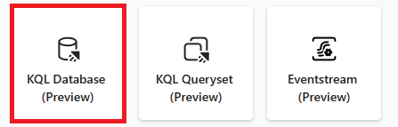

## ***RASCUNHO DE TRABALHO**
---
lab:
  title: Painéis em tempo real
  module: Query data from a Kusto Query database in Microsoft Fabric
---

# Introdução à consulta de um banco de dados Kusto no Microsoft Fabric

Os painéis em tempo real permitem obter insights de dentro do Microsoft Fabric usando a Linguagem de Consulta Kusto (KQL) para recuperar dados estruturados e não estruturados e renderizá-los em gráficos, dispersões, tabelas e muito mais dentro de painéis que permitem vincular dados semelhantes a segmentações de dados no Power BI. 

Este laboratório leva cerca de **25** minutos para ser concluído.

> **Observação**: Você precisa de uma [avaliação gratuita do Microsoft Fabric](https://learn.microsoft.com/fabric/get-started/fabric-trial) para concluir esse exercício.

## Criar um workspace

Antes de trabalhar com os dados no Fabric, crie um workspace com a avaliação do Fabric habilitada.

1. Na [página inicial do Microsoft Fabric](https://app.fabric.microsoft.com), selecione **Análise em Tempo Real**.
1. Na barra de menus à esquerda, selecione **Workspaces** (o ícone é semelhante a &#128455;).
1. Crie um workspace com um nome de sua escolha selecionando um modo de licenciamento que inclua a capacidade do Fabric (*Avaliação*, *Premium* ou *Malha*).
1. Quando o novo workspace for aberto, ele estará vazio.

    

Nesse laboratório, você usa a Análise de Dados em Tempo Real (RTA) do Fabric para criar um banco de dados KQL a partir de uma amostra de fluxo de eventos. A Análise de Dados em Tempo Real convenientemente fornece uma amostra de conjunto de dados que você pode usar para explorar os recursos da RTA. Você usa esses dados de amostra para criar consultas KQL | SQL e conjuntos de consultas que analisam dados em tempo real e permitem outros usos em processos downstream.

## Criar um banco de dados KQL

1. Na **Análise em Tempo Real**, selecione a caixa **Banco de Dados KQL**.

   

2. Você é solicitado a **Nomear** o banco de dados KQL

   

3. Dê ao banco de dados KQL um nome do qual você se lembrará, como **MyStockData**, e pressione **Criar**.

4. No painel **Detalhes do banco de dados**, selecione o ícone de lápis para ativar a disponibilidade no OneLake.

   

5. Selecione a caixa de **dados de exemplo** nas opções de ***Iniciar obtendo dados***.
 
   

6. Escolha a caixa **Análise de Métricas Automotivas** nas opções de dados de exemplo.

   

7. Depois que os dados terminarem de ser carregados, podemos verificar se o Banco de Dados KQL está preenchido.

   

7. Depois que os dados forem carregados, verifique se eles foram carregados no banco de dados KQL. Realize essa operação selecionando as reticências (…) à direita da tabela, navegando até **Tabela de consulta** e selecionando **Mostrar quaisquer 100 registros**.

    

   > **OBSERVAÇÃO**: na primeira vez que você executar isso, pode levar vários segundos para alocar recursos de computação.

    


## Cenário
Nesse cenário, você criará um painel em tempo real com base nos dados de exemplo fornecidos pelo Microsoft Fabric que permitirão exibir dados em uma variedade de métodos, criar uma variável e usar essa variável para vincular os painéis e obter informações mais profundas sobre o que está acontecendo nos sistemas de origem. Neste módulo, usamos o conjunto de dados de táxi de NY para examinar os detalhes atuais das viagens por bairro e afins.

1. Navegue até **Análise em tempo real** e selecione **Painel em tempo real** na página principal do Fabric.

    

1. Pressione o botão **Adicionar novo bloco**.

```kusto

Trips
| summarize ["Total Trip Distance"] = sum(trip_distance) by pickup_boroname
| project Borough = case(isempty(pickup_boroname) or isnull(pickup_boroname), "Unidentified", pickup_boroname), ["Total Trip Distance"]
| sort by Borough asc 

```
3. Pressione o botão **Executar** e verifique se a consulta não tem erros.
4. No lado direito do painel, selecione a guia **Formatação visual** e conclua o ***Nome do bloco*** e o ***Tipo de objeto visual***.

   

