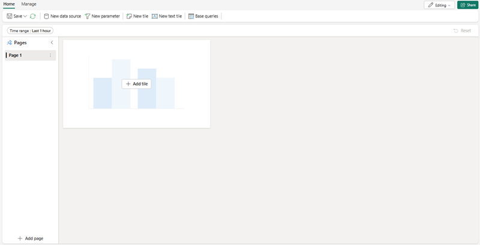
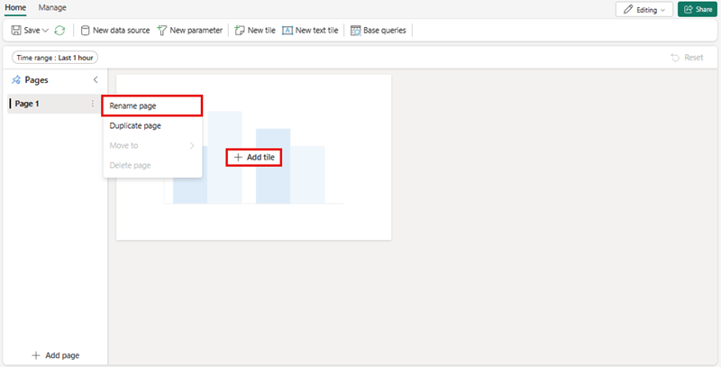
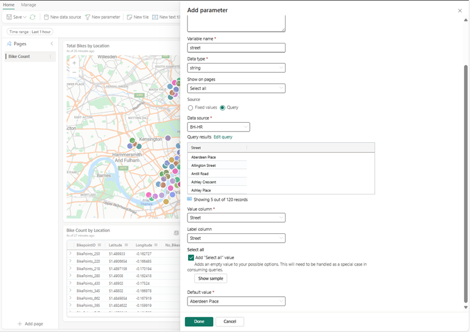

---
lab:
  title: Painéis em tempo real no Microsoft Fabric
  module: Get Started with Real-Time Dashboards in Microsoft Fabric
---

# Introdução aos painéis em tempo real no Microsoft Fabric

Os painéis em tempo real permitem obter insights de dentro do Microsoft Fabric usando a Linguagem de Consulta Kusto (KQL) para recuperar dados estruturados e não estruturados e renderizá-los em gráficos, dispersões, tabelas e muito mais dentro de painéis que permitem vincular dados semelhantes a segmentações de dados no Power BI. 

Este laboratório leva cerca de **25** minutos para ser concluído.

> **Observação**: Você precisa de uma [avaliação do Microsoft Fabric](https://learn.microsoft.com/fabric/get-started/fabric-trial). para concluir este exercício.

## Criar um workspace

Antes de trabalhar com os dados no Fabric, crie um workspace com a avaliação do Fabric habilitada.

1. Na [home page do Microsoft Fabric](https://app.fabric.microsoft.com), selecione **Inteligência em Tempo Real**.
1. Na barra de menus à esquerda, selecione **Workspaces** (o ícone é semelhante a &#128455;).
1. Crie um workspace com um nome de sua escolha selecionando um modo de licenciamento que inclua a capacidade do Fabric (*Avaliação*, *Premium* ou *Malha*). Ou, então, você pode usar um workspace existente para criar um painel em tempo real.
1. Quando o novo workspace for aberto, ele estará vazio.

    

Neste laboratório, você usará a Inteligência em Tempo Real no Fabric para criar um painel em tempo real. A Inteligência em Tempo Real fornece um exemplo de conjunto de dados para sua conveniência, que você pode usar para explorar as funcionalidades da Inteligência em Tempo Real. Você usa esses dados de amostra para criar consultas KQL | SQL e conjuntos de consultas que analisam dados em tempo real e permitem outros usos em processos downstream.

## Crie um dashboard em tempo real

1. Em **Inteligência em Tempo Real**, selecione a caixa **Painel em Tempo Real**.

   

2. Você precisará **nomear** o painel em tempo real.

   

3. Dê ao painel em tempo real um nome fácil de lembrar, como algo derivado da fonte primária, e pressione **Criar**.

4. No painel **Detalhes do banco de dados**, selecione o ícone de lápis para ativar a disponibilidade no OneLake.

   [ ](./Images/real-time-dashboard-details-large.png#lightbox)

## Adicionar uma fonte de dados

As fontes de dados servem como referências reutilizáveis a consultas ou bancos de dados específicos no mesmo workspace do painel em tempo real, permitindo que vários blocos utilizem fontes de dados distintas para as respectivas necessidades de dados.

1. Selecione a guia **Gerenciar** e escolha **Nova fonte de dados** na ***barra de menus***.
1. Escolha o botão **+ Adicionar** no painel **Fontes de dados**.

    [  ](./Images/add-data-source-to-real-time-dashboard-large.png#lightbox)

1. Escolha uma das duas principais opções: **hub de dados do OneLake** ou **Azure Data Explorer**.

    

1. Escolha a **fonte de dados** que atende às suas necessidades comerciais e, em seguida, selecione o botão **Conectar**.

    [  ](./Images/select-onelake-data-hub-large.png#lightbox)

    > **Observação** Depois de se conectar a uma fonte de dados, você terá a capacidade de confirmar e criar fluxos de dados adicionais no local selecionado.

1. Confirme sua conexão de **fonte de dados** no painel **Criar fonte de dados** e selecione **Criar**.

    [  ](./Images/conected-now-create-datasource-large.png#lightbox)

1. Neste ponto, o ideal é selecionar as reticências **…** à direita da **Página n** e escolher **Renomear página** com um nome apropriado para uso do bloco.
1. Selecione **+ Adicionar bloco**

    [  ](./Images/rename-page-add-tile-large.png#lightbox)

1. Você será redirecionado para o **painel de consulta de bloco**, no qual poderá adicionar parâmetros e efetuar pull de consultas base para dar suporte ao bloco. 

    [  ](./Images/write-query-for-tile-large.png#lightbox)

    > **Observação** Você terá a opção de adicionar uma nova fonte de dados na janela suspensa na mesma janela. Essa origem pode estar no seu workspace pessoal ou em qualquer workspace ao qual você pode ter outro banco de dados KQL armazenado em um eventhouse ao qual você tem acesso.

## Gravar consultas

Como os blocos do Painel em Tempo Real usam snippets da Linguagem de Consulta Kusto para recuperar dados e renderizar visuais. Cada bloco/consulta pode dar suporte a apenas um visual.

1. Em cada bloco, você poderá escrever ou colar do **Copilot** se optar por fixá-los em um bloco novo ou existente e modificá-los de acordo com suas necessidades. Em uma consulta simples apenas, podemos criar uma visualização de mapa que usa tamanhos no mapa com base no número de bicicletas.

```kusto

['Bike-count']
BikepointID, Latitude, Longitude, No_Bikes

```

## Criar visualizações

Quando estiver satisfeito com a visualização, basta selecionar **Aplicar alterações** e adicionar mais visualizações para dar suporte ao Painel em Tempo Real ou realizar outras etapas, como **Parâmetros** ou **Agendamentos**.

   [  ](./Images/create-visual-in-tiles-large.png#lightbox)

Depois que as alterações forem aplicadas, você verá os dados e poderá fazer ajustes para simplificar para os usuários.

   [  ](./Images/first-published-visual-large.png#lightbox)

Você pode continuar criando **blocos** que têm informações de tabela e informações de visualização, a fim de facilitar a compreensão para a comunidade de usuários. Você também tem a capacidade, conforme mostrado anteriormente de **adicionar páginas** e adicionar uma **Nova fonte de dados**. Em seguida, nosso foco será adicionar um parâmetro para ajudar na navegação e na redução do volume de informações apresentadas a um usuário.

## Adicionar parâmetros
Os parâmetros aprimoram a eficiência da renderização do painel e permitem a utilização de valores de filtro na fase mais antiga do processo de consulta. A inclusão de parâmetros na consulta vinculada aos blocos ativa as funcionalidades de filtragem. Um parâmetro pode ser utilizado em um painel e vários parâmetros podem filtrar os dados representados nas visualizações subjacentes, incluindo tabelas.

A criação de um parâmetro começa com facilidade: 

1. Selecione o botão Novos parâmetros no menu superior. O painel Parâmetros será aberto.
1. Na parte superior do painel direito, selecione o botão + Adicionar.

    [  ](./Images/add-new-parameter-large.png#lightbox)

1. Preencha as propriedades relevantes do parâmetro.

    [  ](./Images/configure-parameter-large.png#lightbox)

1. Um dos recursos mais importantes de um parâmetro é a capacidade de **Adicionar uma consulta** para dar ao usuário apenas opções relevantes para as informações subjacentes.

    

1. Selecione Concluído para criar o parâmetro.

    [  ](./Images/complete-parameter-settings-large.png#lightbox)

### Propriedades dos parâmetros

| Campo            | Descrição |
|------------------|-------------|
| **Rótulo**        | O nome do parâmetro exibido no painel ou no cartão de edição. |
| **Tipo de parâmetro** | Um dos seguintes tipos: <ul><li>Seleção única: Somente um valor pode ser selecionado no filtro como entrada para o parâmetro.</li><li>Seleção múltipla: um ou mais valores podem ser selecionados no filtro como entradas para o parâmetro.</li><li>Intervalo de tempo: Permite a criação de parâmetros adicionais para filtrar consultas e painéis com base no tempo. Cada painel tem um seletor de intervalo de tempo padrão.</li><li>Texto livre: Permite que os usuários digitem ou colem um valor no campo de filtro sem valores preenchidos previamente, mantendo os valores recentes usados.</li></ul> |
| **Descrição**  | Uma descrição opcional do parâmetro. |
| **Nome da variável** | O nome usado para o parâmetro dentro da consulta. |
| **Data type**    | O tipo de dados que os valores de parâmetro representam. |
| **Mostrar em páginas** | As páginas em que o parâmetro será exibido, com uma opção para selecionar todas as páginas. |
| **Origem**       | A origem dos valores de parâmetro, que pode ser: <ul><li>Valores fixos: Valores de filtro estático inseridos manualmente.</li><li>Consulta: Valores dinâmicos introduzidos por meio de uma consulta KQL.</li></ul> |
| **Adicionar valor "Selecionar tudo"** | Aplicável aos tipos de parâmetro de seleção única e múltipla, essa opção recupera dados de todos os valores de parâmetro e precisa ser integrada à consulta para permitir a funcionalidade. |
| **Valor padrão** | O valor padrão do filtro, que é definido na renderização inicial do painel. |

6. Certifique-se de adicionar o parâmetro a cada uma das consultas dentro dos blocos e, em seguida, selecione **Aplicar alterações**.

**Antes da consulta KQL**
```kusto
//Add the street parameter to each tile's query
['bike-count']
| where No_Bikes > 0
| project BikepointID, Latitude, Longitude, No_Bikes

```

**Após a consulta KQL**
```kusto
//Add the street parameter to each tile's query
['bike-count']
| where No_Bikes > 0 and Street == street
| project BikepointID, Latitude, Longitude, No_Bikes

```
   [  ](./Images/update-each-query-large.png#lightbox)

## Habilitar atualização automática

A atualização automática é uma funcionalidade que permite a atualização automática dos dados do painel sem a necessidade de recarregar ou pressionar um botão de atualização manual. A frequência inicial da atualização automática pode ser configurada por um editor de banco de dados. Tanto os editores quanto os visualizadores têm a capacidade de modificar a taxa real de atualização automática durante a exibição do painel. Os editores de banco de dados têm autoridade para estabelecer uma taxa de atualização mínima para reduzir a carga excessiva no cluster. Depois que essa taxa mínima for definida, os usuários do banco de dados serão impedidos de selecionar uma taxa de atualização inferior ao mínimo especificado. Isso garante que o desempenho do sistema seja mantido sem sobrecarregar os recursos.

1. Selecione a guia Gerenciar > Atualização automática.

    [  ](./Images/enable-auto-refresh-large.png#lightbox)

1. Alterne a opção para que a atualização automática fique habilitada.
1. Selecione valores para Intervalo de tempo mínimo e Taxa de atualização padrão.
1. Selecione Aplicar e Salvar para salvar o painel.

    [  ](./Images/enable-and-configure-refresh-rate-large.png#lightbox)

## Limpar os recursos

Neste exercício, você criou um banco de dados KQL e configurou um conjunto de dados de exemplo para consulta. Depois disso, você consultou os dados usando o KQL e o SQL. Depois de explorar o banco de dados KQL, exclua o workspace criado para este exercício.
1. Na barra à esquerda, selecione o **ícone** do seu workspace.
2. No ... menu da barra de ferramentas, selecione **Configurações do Espaço de Trabalho**.
3. Na seção **Geral**, selecione **Remover este espaço de trabalho**.

