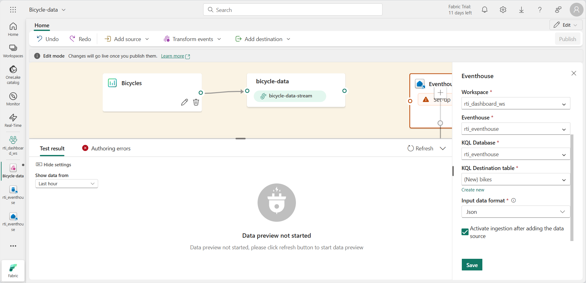

---
lab:
  title: Introdução aos Painéis em tempo real no Microsoft Fabric
  module: Get started with Real-Time Dashboards in Microsoft Fabric
---

# Introdução aos painéis em tempo real no Microsoft Fabric

Os painéis em tempo real no Microsoft Fabric permitem que você visualize e explore dados de streaming usando a KQL (Linguagem de Consulta Kusto).  Neste exercício, você explorará como criar e usar um painel em tempo real com base em uma fonte de dados em tempo real.

Este laboratório leva cerca de **25** minutos para ser concluído.

> **Observação**: para concluir este exercício, você precisa de um [locatário do Microsoft Fabric](https://learn.microsoft.com/fabric/get-started/fabric-trial).

## Criar um workspace

Antes de trabalhar com os dados no Fabric, você precisa criar um espaço de trabalho em um locatário com a funcionalidade do Fabric habilitada.

1. Navegue até a [home page do Microsoft Fabric](https://app.fabric.microsoft.com/home?experience=fabric) em `https://app.fabric.microsoft.com/home?experience=fabric` em um navegador e entre com suas credenciais do Fabric.
1. Na barra de menus à esquerda, selecione **Workspaces** (o ícone é semelhante a &#128455;).
1. Crie um workspace com um nome de sua escolha selecionando um modo de licenciamento que inclua a capacidade do Fabric (*Avaliação*, *Premium* ou *Malha*).
1. Quando o novo workspace for aberto, ele estará vazio.

    

## Criar uma eventhouse

Agora que você tem um espaço de trabalho, pode começar a criar os itens do Fabric necessários para sua solução de inteligência em tempo real. Começaremos criando um eventhouse.

1. Na barra de menus à esquerda, selecione **Criar**. Na página *Novo*, na seção *Inteligência em tempo real*, selecione **Eventhouse**. Dê um nome exclusivo de sua preferência.

    >**Observação**: se a opção **Criar** não estiver fixada na barra lateral, você precisará selecionar a opção de reticências (**...**) primeiro.

1. Feche todas as dicas ou prompts exibidos até ver o novo eventhouse vazio.

    

1. No painel à esquerda, o eventhouse contém um banco de dados KQL com o mesmo nome do eventhouse.
1. Selecione o banco de dados KQL para visualizá-lo.

## Criar um fluxo de eventos

Atualmente, não há tabelas no banco de dados. Usaremos um eventstream para carregar dados de uma fonte em tempo real em uma tabela.

1. Na página principal do banco de dados KQL, selecione **Obter dados**.
2. Para a fonte de dados, selecione **Eventstream** > **Novo eventstream**. Nomeie o eventstream como `Bicycle-data`.

    

    A criação do novo fluxo de eventos no workspace será concluída em apenas alguns instantes. Uma vez estabelecido, você será redirecionado automaticamente para selecionar uma fonte de dados para seu eventstream.

1. Selecione **Usar dados de amostra**.
1. Nomeie o nome da fonte como `Bicycles` e selecione os dados de amostra **Bicycles**.

    Seu fluxo será mapeado e você aparecerá automaticamente na **tela do eventstream**.

   

1. Na lista suspensa **Adicionar destino**, selecione **Eventhouse**.
1. No painel **Eventhouse**, defina as seguintes opções de configuração.
   - **Modo de ingestão de dados:** processamento de eventos antes da ingestão
   - **Nome do destino:**`bikes-table`
   - **Workspace:***selecione o workspace que você criou no início deste exercício*
   - **Eventhouse**: *selecione o eventhouse*
   - **Banco de dados KQL:***selecione seu banco de dados KQL*
   - **Tabela de destino:** crie uma nova tabela chamada `bikes`
   - **Formato de dados de entrada:** JSON

   

1. No painel **Eventhouse**, selecione **Salvar**. 
1. Conecte a saída do nó **Bicycles-data** ao nó **bikes-table** e selecione **Publish**.
1. Aguarde cerca de um minuto para que o destino de dados se torne ativo. Em seguida, selecione o nó **bikes-table** na tela de design e exiba o painel **Visualização de dados** abaixo para ver os dados mais recentes que foram ingeridos:

   

1. Aguarde alguns minutos e use o botão **Atualizar** para atualizar o painel Visualização**Visualização de dados**. O fluxo é executado perpetuamente, portanto, novos dados podem ter sido adicionados à tabela.

## Criar um painel em tempo real

Agora que você tem um fluxo de dados em tempo real sendo carregado em uma tabela na eventhouse, você pode visualizá-lo com um painel em tempo real.

1. Na barra de menu à esquerda, selecione o hub **Home**. Em seguida, na home page, crie um novo **Painel em Tempo Real** chamado `bikes-dashboard`.

    Um novo painel vazio é criado.


    

1. Na barra de ferramentas, selecione **Nova fonte de dados** e adicione uma nova fonte de dados **One lake data hub**. Em seguida, selecione seu eventhouse e crie uma nova fonte de dados com as seguintes configurações:
    - **Nome de exibição**: `Bike Rental Data`
    - **Banco de dados**: *o banco de dados padrão em seu eventhouse*.
    - **Identidade de passagem**: *selecionado*

1. Feche o painel **Fontes de dados** e, em seguida, na tela de design do painel, selecione **Adicionar bloco**.
1. No editor de consultas, certifique-se de que a fonte **Dados de Aluguel de Bicicleta** esteja selecionada e insira o seguinte código KQL:

    ```kql
    bikes
        | where ingestion_time() between (ago(30min) .. now())
        | summarize latest_observation = arg_max(ingestion_time(), *) by Neighbourhood
        | project Neighbourhood, latest_observation, No_Bikes, No_Empty_Docks
        | order by Neighbourhood asc
    ```

1. Execute a consulta, que mostra o número de bicicletas e docas de bicicletas vazias observadas em cada bairro nos últimos 30 minutos.
1. Aplique as alterações para ver os dados mostrados em uma tabela no bloco do painel.

   

1. No bloco, selecione o ícone **Editar** (que se parece com um lápis). Em seguida, no painel **Formatação Visual**, defina as seguintes propriedades:
    - **Nome do bloco**: bicicletas e docas
    - **Tipo visual**: gráfico de barras
    - **Formato visual**: gráfico de barras empilhadas
    - **Colunas Y**: No_Bikes, No-Empty_Docks
    - **Coluna X**: bairro
    - **Colunas de série**: inferir
    - **Localização da legenda**: inferior

    Seu tempo editado deve ser assim:

   

1. Aplique as alterações e redimensione o bloco para ocupar toda a altura do lado esquerdo do painel.

1. Na barra de ferramentas, selecione **Novo bloco**
1. No editor de consultas, certifique-se de que a fonte **Dados de Aluguel de Bicicleta** esteja selecionada e insira o seguinte código KQL:

    ```kql
    bikes
        | where ingestion_time() between (ago(30min) .. now())
        | summarize latest_observation = arg_max(ingestion_time(), *) by Neighbourhood
        | project Neighbourhood, latest_observation, Latitude, Longitude, No_Bikes
        | order by Neighbourhood asc
    ```

1. Execute a consulta, que mostra a localização e o número de bicicletas observadas em cada bairro nos últimos 30 minutos.
1. Aplique as alterações para ver os dados mostrados em uma tabela no bloco do painel.
1. No bloco, selecione o ícone **Editar** (que se parece com um lápis). Em seguida, no painel **Formatação Visual**, defina as seguintes propriedades:
    - **Nome do bloco**: locais de bicicleta
    - **Tipo visual**: mapa
    - **Definir localização por**: latitude e longitude
    - **Coluna de latitude**: latitude
    - **Coluna de longitude**: longitute
    - **Coluna de rótulo**: bairro
    - **Tamanho**: mostrar
    - **Coluna de tamanho**: No_Bikes

1. Aplique as alterações e, em seguida, redimensione a peça de mapa para preencher o lado direito do espaço disponível no painel:

   

## Criar uma consulta de base

Seu painel contém dois visuais baseados em consultas semelhantes. Para evitar a duplicação e tornar seu painel mais sustentável, você pode consolidar os dados comuns em uma única *consulta base*.

1. Na barra de ferramentas do painel, selecione **Consultas base**. Em seguida, selecione **+Adicionar**.
1. No editor de consulta base, defina o **Nome da variável** como `base_bike_data` e certifique-se de que a fonte **Dados de Aluguel de Bicicleta** esteja selecionada. Então, insira a consulta a seguir:

    ```kql
    bikes
        | where ingestion_time() between (ago(30min) .. now())
        | summarize latest_observation = arg_max(ingestion_time(), *) by Neighbourhood
    ```
1. Execute a consulta e verifique se ela retorna todas as colunas necessárias para ambos os visuais no dashboard (e alguns outros).

   

1. Selecione **Concluído** e feche o painel **Consultas base**.
1. Edite o visual do gráfico de barras **Bicicletas e Docas** e altere a consulta para o seguinte código:

    ```kql
    base_bike_data
    | project Neighbourhood, latest_observation, No_Bikes, No_Empty_Docks
    | order by Neighbourhood asc
    ```

1. Aplique as alterações e verifique se o gráfico de barras ainda exibe dados para todos os bairros.

1. Edite o visual do mapa **Localizações de Bicicleta** e altere a consulta para o seguinte código:

    ```kql
    base_bike_data
    | project Neighbourhood, latest_observation, No_Bikes, Latitude, Longitude
    | order by Neighbourhood asc
    ```

1. Aplique as alterações e verifique se o mapa ainda exibe dados para todos os bairros.

## Adicionar um parâmetro

Seu painel atualmente mostra os dados mais recentes de bicicleta, doca e localização para todos os bairros. Agora vamos adicionar um parâmetro para que você possa selecionar um bairro específico.

1. Na barra de ferramentas do painel, na guia **Gerenciar**, selecione **Parâmetros**.
1. Observe todos os parâmetros existentes que foram criados automaticamente (por exemplo, um parâmetro de *intervalo de tempo*). Em seguida, **exclua-os**.
1. Selecione **+ Adicionar**.
1. Adicione um parâmetro com as seguintes configurações:
    - **Rótulo:** `Neighbourhood`
    - **Tipo de parâmetro**: seleção múltipla
    - **Descrição**: `Choose neighbourhoods`
    - **Nome da variável**: `selected_neighbourhoods`
    - **Tipo de dados**: cadeia de caracteres
    - **Mostrar nas páginas**: selecionar tudo
    - **Origem**: Consulta
    - **Fonte de dados**: dados de aluguel de bicicletas
    - **Editar consulta**:

        ```kql
        bikes
        | distinct Neighbourhood
        | order by Neighbourhood asc
        ```

    - **Coluna de valor**: bairro
    - **Coluna de rótulo**: seleção de valor de correspondência
    - **Adicionar valor "Selecionar tudo"**: *selecionado*
    - **"Selecionar tudo" envia cadeia caracteres vazia**: *selecionado*
    - **Redefinição automática para o valor padrão**: selecionado
    - **Valor padrão**: selecionar tudo

1. Selecione **Concluído** para criar o parâmetro.

    Agora que você adicionou um parâmetro, é necessário modificar a consulta base para filtrar os dados com base nos bairros escolhidos.

1. Na barra de ferramentas, selecione **Consultas base**. Em seguida, selecione a consulta **base_bike_data** e edite-a para adicionar uma condição **and** à cláusula **where** para filtrar com base nos valores dos parâmetros selecionados, conforme mostrado no seguinte código:

    ```kql
    bikes
        | where ingestion_time() between (ago(30min) .. now())
          and (isempty(['selected_neighbourhoods']) or Neighbourhood  in (['selected_neighbourhoods']))
        | summarize latest_observation = arg_max(ingestion_time(), *) by Neighbourhood
    ```

1. Selecione **Concluído** para salvar a consulta base.

1. No painel, use o parâmetro **Bairro** para filtrar os dados com base nos bairros selecionados.

   

1. Selecione **Redefinir** para remover os filtros de parâmetros selecionados.

## Adicionar uma página

Seu painel atualmente consiste em uma única página. Você pode adicionar mais páginas para fornecer mais dados.

1. No lado esquerdo do painel, expanda o painel **Páginas**; e selecione **+ Adicionar página**.
1. Nomeie a nova página **Página 2**. Em seguida, selecione-a.
1. Na nova página, selecione **+ Adicionar bloco**
1. No editor de consultas do novo bloco, insira a seguinte consulta:

    ```kql
    base_bike_data
    | project Neighbourhood, latest_observation
    | order by latest_observation desc
    ```

1. Aplique as alterações. Em seguida, redimensione o bloco para preencher a altura do painel.

   

## Configurar a atualização automática

Os usuários podem atualizar manualmente o painel, mas pode ser útil que ele atualize automaticamente os dados em um intervalo definido.

1. Na barra de ferramentas do painel, na guia **Gerenciar**, selecione **Atualização automática**.
1. No painel **Atualizar automaticamente**, defina as seguintes configurações:
    - **Habilitado**: *selecionado*
    - **Intervalo de tempo mínimo**: permitir todos os intervalos de atualização
    - **Taxa de atualização padrão**: 30 minutos
1. Aplique as configurações de atualização automática.

## Salvar e compartilhar o painel

Agora que você tem um painel útil, pode salvá-lo e compartilhá-lo com outros usuários.

1. Na barra de ferramentas do painel, selecione **Salvar**.
1. Quando o painel for salvo, selecione **Compartilhar**.
1. Na caixa de diálogo **Compartilhar**, selecione **Copiar link** e copie o link para o painel para a área de transferência.
1. Abra uma nova guia do navegador e cole o link copiado para navegar até o painel compartilhado. Faça login novamente com suas credenciais do Fabric, se solicitado.
1. Explore o painel, usando-o para ver as informações mais recentes sobre bicicletas e docas de bicicletas vazias em toda a cidade.

## Limpar os recursos

Quando terminar de explorar seu painel, você pode excluir o espaço de trabalho que criou para este exercício.

1. Na barra à esquerda, selecione o **ícone** do seu workspace.
2. Na barra de ferramentas, selecione **Configurações do Espaço de Trabalho**.
3. Na seção **Geral**, selecione **Remover este espaço de trabalho**.
