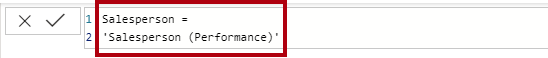
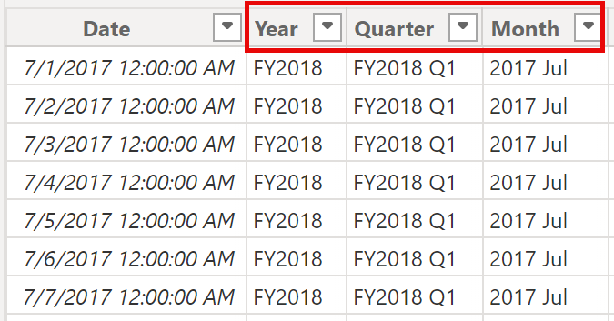
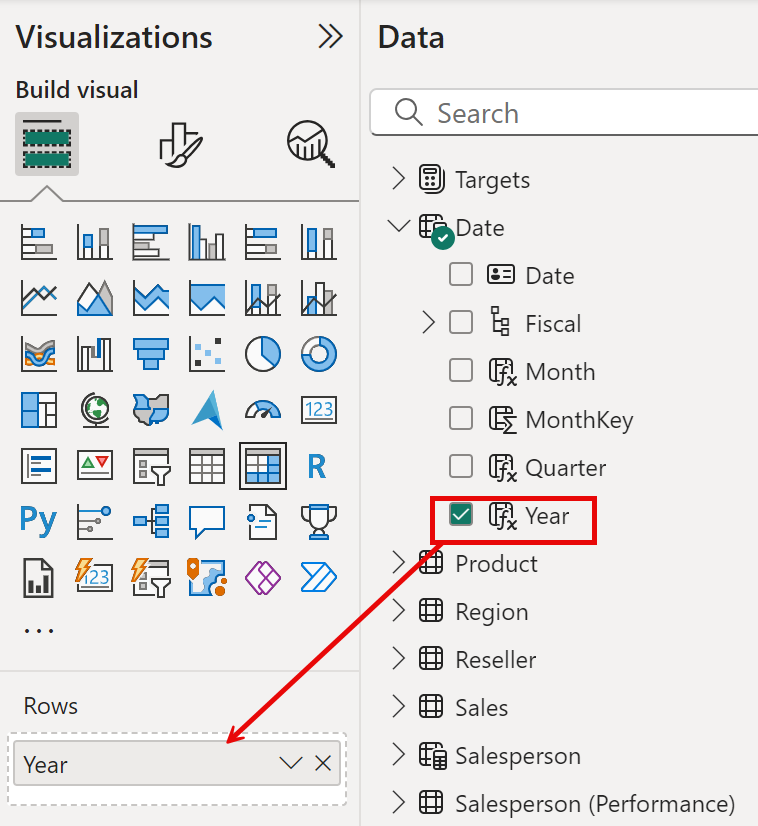
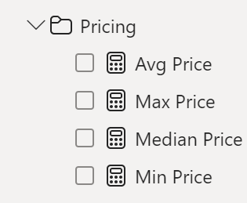

---
lab:
  title: Criar Cálculos DAX no Power BI Desktop
  module: Create DAX calculations in Power BI Desktop
---

# Criar Cálculos DAX no Power BI Desktop

## **História do laboratório**

Neste laboratório, você criará tabelas e colunas calculadas, além de medidas simples usando o DAX (Data Analysis Expressions).

Neste laboratório, você aprenderá a:

- Criar tabelas calculadas
- Criar colunas calculadas
- Criar medidas

**Este laboratório levará aproximadamente 45 minutos.**

## Introdução

Para concluir este exercício, primeiro abra um navegador da Web e insira a seguinte URL para baixar a pasta zip:

`https://github.com/MicrosoftLearning/mslearn-fabric/raw/main/Allfiles/Labs/14/14-create-dax.zip`

Extraia a pasta para a pasta **C:\Usuários\[Estudante]\Downloads\14-create-dax**.

Abra o arquivo **14-Starter-Sales Analysis.pbix**.

> ***Observação**: você pode ignorar a entrada clicando em **Cancelar**. Feche todas as janelas informativas. Caso precise aplicar as alterações, clique em **Aplicar depois**.*

## Criar a tabela calculada Vendedor

Nesta tarefa, você criará a tabela calculada **Vendedor** (relação direta com **Vendas**).

Uma tabela calculada é criada inserindo primeiro o nome da tabela, seguido pelo símbolo de igual (=), seguido por uma fórmula DAX que retorna uma tabela. O nome da tabela não pode existir no modelo de dados.

A barra de fórmulas dá suporte à inserção de uma fórmula DAX válida. Ela inclui recursos como preenchimento automático, IntelliSense e codificação por cores, permitindo que você insira a fórmula com rapidez e precisão.

1. No Power BI Desktop, na exibição de Relatório, na faixa de opções **Modelagem** no grupo **Cálculos**, selecione **Nova Tabela**.

     

2. Na barra de fórmulas (que é aberta diretamente abaixo da faixa de opções ao criar ou editar cálculos), digite **Vendedor =**, pressione **Shift+Enter**, digite **"Vendedor (Desempenho)"** e pressione **Enter**.

    > **Observação**: *para sua conveniência, todas as definições DAX neste laboratório podem ser copiadas do arquivo de snippets, localizado em **14-create-dax\Snippets.txt**.*

     

    > *Essa definição de tabela cria uma cópia da tabela **Vendedor (Desempenho)**. Ela copia apenas os dados, no entanto, as propriedades do modelo, como visibilidade, formatação, etc. não são copiadas.*

1. No painel **Dados**, observe que o ícone de tabela tem um ícone de calculadora adicional na frente dele (indicando uma tabela calculada).

    

    > ***Observação**: as tabelas calculadas são definidas usando uma fórmula DAX que retorna uma tabela. É importante entender que as tabelas calculadas aumentam o tamanho do modelo de dados, pois materializam e armazenam valores. Elas são recalculadas sempre que as dependências de fórmulas são atualizadas, como será o caso neste modelo de dados, quando novos (futuros) valores de data forem carregados nas tabelas.*
    >
    > *Ao contrário das tabelas originadas pelo Power Query, as tabelas calculadas não podem ser usadas para carregar dados de fontes de dados externas. Eles só podem transformar dados com base no que já foi carregado no modelo de dados.*

1. Alterne para o modo de exibição Modelo e observe que a tabela **Vendedor** está disponível (talvez seja necessário redefinir o modo de exibição para localizar a tabela).

1. Crie um relacionamento da coluna **Vendedor \| EmployeeKey** com a coluna **Vendas \| EmployeeKey**.

1. Clique com o botão direito do mouse no relacionamento inativo entre as tabelas **Vendedor (Desempenho)** e **Vendas** e selecione **Excluir**. Quando precisar confirmar a exclusão, selecione **Sim**.

1. Na tabela **Vendedor**, faça a multisseleção das seguintes colunas e oculte-as (defina a propriedade **Está oculto** como **Sim**):

    - EmployeeID
    - EmployeeKey
    - UPN

1. No diagrama do modelo, selecione a tabela **Salesperson**.

1. No painel **Propriedades**, na caixa **Descrição**, insira: **Vendedor relacionado a Vendas**
    
    > *Lembre-se de que descrições aparecem como dicas de ferramentas no painel **Dados** quando o usuário passa o cursor sobre uma tabela ou um campo.*

1. Para a tabela **Vendedor (Desempenho)**, defina a descrição como: **Vendedor relacionado às regiões**

*O modelo de dados agora oferece duas alternativas ao analisar vendedor. A tabela **Vendedor** permite analisar as vendas feitas por um vendedor, enquanto a tabela **Vendedor (Desempenho)** permite analisar as vendas realizadas nas regiões de vendas atribuídas ao vendedor.*

## Criar a tabela Dados

Nesta tarefa, você criará a tabela **Data**.

1. Alternar para a exibição de Tabela. Na guia de faixa de opções **Página Inicial**, no grupo **Cálculos**, selecione **Nova Tabela**.

    

1. Na barra de fórmulas, insira este DAX:

    ```DAX
    Date =  
    CALENDARAUTO(6)
    ```

    

    > *A função CALENDARAUTO() retorna uma tabela de coluna única que consiste em valores de dados. O comportamento "automático" verifica todas as colunas de data do modelo de dados para determinar os valores de data mais antigos e mais recentes armazenados no modelo de dados. Em seguida, ele cria uma linha para cada data dentro desse intervalo, estendendo o intervalo em qualquer direção para garantir que anos completos de dados sejam armazenados.*
    >
    > *Essa função pode usar um único argumento opcional que é o último número de mês de um ano. Quando omitido, o valor é 12, o que significa que dezembro é o último mês do ano. Neste caso, 6 é inserido, o que significa que junho é o último mês do ano.*

1. Observe a columa de valores de data, que são formatadas com as configurações regionais dos EUA (ou seja, mm/dd/aaaa).

    

1. No canto inferior esquerdo, na barra de status, observe as estatísticas de tabela, confirmando que foram geradas 1.826 linhas de dados, o que representa cinco anos completos de dados.

    

## Criar colunas calculadas

Nesta tarefa, você adicionará mais colunas para habilitar a filtragem e o agrupamento por períodos diferentes. Você também criará uma coluna calculada para controlar a ordem de classificação de outras colunas.

> **Observação**: *para sua conveniência, todas as definições DAX neste laboratório podem ser copiadas do arquivo **Snippets.txt**.*

1. Na faixa de opções contextual **Ferramentas de Tabela**, no grupo **Cálculos**, selecione **Nova Coluna**.

    > *Uma coluna calculada é criada inserindo primeiro o nome da coluna, seguido pelo símbolo de igual (=), seguido por uma fórmula DAX que retorna um resultado de valor único. O nome da coluna não pode já existir na tabela.*

    

1. Na barra de fórmulas, digite o seguinte (ou copie do arquivo de snippets) e pressione **Enter**:
    > *A fórmula usa o valor de ano da data, mas adiciona um ao valor de ano quando o mês é posterior a junho. É assim que os anos fiscais são calculados no Adventure Works.*

   ```DAX
   Year =
   "FY" & YEAR('Date'[Date]) + IF(MONTH('Date'[Date]) > 6, 1)
   ```


1. Use as definições de arquivo de snippets para criar estas duas colunas calculadas para a tabela **Data**:

    - Trimestre
    - Mês

1. Verifique se as novas colunas foram adicionadas.

    

1. Para validar os cálculos, alterne para a exibição Relatório.

1. Para criar uma nova página de relatório, selecione o ícone de adição ao lado da Página 1.

    

1. Para adicionar um visual da matriz à nova página de relatório, no painel **Visualizações**, selecione o tipo de visual da matriz.

    > *Dicas: você pode passar o cursor sobre cada ícone para revelar uma dica de ferramenta que descreve o tipo de visual.*

    

1. No painel **Dados**, de dentro da tabela **Data**, arraste o campo **Ano** na área **Linhas**.

    

1. Arraste o campo **Mês** até a área **Linhas**, diretamente abaixo do campo **Ano**.

1. No canto superior direito do visual da matriz (ou inferior, dependendo da localização do visual), selecione o ícone de seta bifurcada (que expandirá todos os anos para baixo um nível).

    

1. Observe que os anos se expandem para meses e que os meses são classificados em ordem alfabética, em vez de cronologicamente.

    

    > *Por padrão, os valores de texto são classificados em ordem alfabética, os números são classificados do menor para o maior, e as datas são classificadas da mais antiga para a mais recente.*

1. Para personalizar a ordem de classificação do campo **Mês**, alterne para a exibição Tabela.

1. Adicione a coluna **ChaveMês** à tabela **Data**.

    ```DAX
    MonthKey =
    (YEAR('Date'[Date]) * 100) + MONTH('Date'[Date])
    ```

    > *Essa fórmula calcula um valor numérico para cada combinação de ano/mês.*

1. Na exibição Tabela, verifique se a nova coluna contém valores numéricos (por exemplo, 201707 para julho de 2017 etc.).

    

1. Alterne novamente para a exibição de Relatório. No painel **Dados**, selecione **Mês**.

1. Na faixa de opções contextual **Ferramentas de Coluna**, no grupo **Classificar**, selecione **Classificar por Coluna** e escolha **MonthKey**.

    

1. No visual da matriz, observe que os meses agora estão classificados cronologicamente.

    

## Concluir a tabela Data

Nesta tarefa, você concluirá o design da tabela **Data** ocultando uma coluna e criando uma hierarquia. Em seguida, você criará relacionamentos para as tabelas **Vendas** e **Destinos**.

1. Alterne para a exibição de Modelo. Na tabela **Data**, oculte a coluna **MonthKey** (defina **Está Oculto** como **Sim**).

1. No painel direito **Data**, selecione a tabela **Data**, clique com o botão direito do mouse na coluna **Ano** e selecione **criar hierarquia**.

1. Renomeie a hierarquia recém-criada para **Fiscal** clicando com o botão direito do mouse e em **Renomear**.

1. Adicione os dois campos restantes a seguir à hierarquia Fiscal selecionando-os no painel **Data**, clicando com o botão direito do mouse e selecionando **Adicionar à hierarquia** -> **Fiscal**.

    - Trimestre
    - Mês

    

1. Crie estas duas relações de modelo:

    - **Data \| Data** para **Vendas \| OrderDate**
    - **Data \| Data** para **Destinos \| TargetMonth**


    > *Os laboratórios usam uma notação abreviada para fazer referência a um campo. Ficará assim: **Vendas \| Preço Unitário**. Neste exemplo, **Vendas** é o nome da tabela e **Preço Unitário** é o nome do campo.*

1. Oculte estas duas colunas:

    - Vendas \| OrderDate
    - Destinos \| TargetMonth

## Marcar a tabela Data

Nesta tarefa, você marcará a tabela **Data** como uma tabela de data.

1. Alterne para a exibição de Relatório. No painel **Data**, selecione a tabela **Data** (não o campo **Data**).

1. Na faixa de opções contextual **Ferramentas de Tabela**, dentro do grupo **Calendários**, clique em **Marcar como Tabela de Data**.

1. Na janela **Marcar como uma tabela de data**, arraste a propriedade **Marcar como uma tabela de data** para **Sim** e, na lista suspensa **Escolher uma coluna de data**, selecione **Data**. Selecione **Salvar**.

    

1. Salve o arquivo do Power BI Desktop.

> *O Power BI Desktop agora entende que esta tabela define a data (hora). Essa abordagem de design para uma tabela de data é adequada quando você não tem uma tabela de data em sua fonte de dados. Se você tiver um data warehouse, seria apropriado carregar os dados de data da tabela de dimensão de data dele em vez de "redefinir" a lógica de data no modelo de dados.*

## Criar medidas simples

Nesta tarefa, você criará medidas simples. Medidas simples agregam valores em uma única coluna ou contam linhas de uma tabela.

1. Na exibição Relatório, na **Página 2**, no painel **Data**, arraste o campo **Vendas \| Preço Unitário** no visual da matriz.

    

1. No painel de campos de visuais (localizado abaixo do painel **Visualizações**), na caixa **Valores**, observe que **Preço Unitário** está listado como o **Preço Unitário Médio**. Escolha a seta para baixo de **Unit Price** e observe as opções de menu disponíveis.

    

    > *As colunas numéricas visíveis permitem que os autores de relatório em tempo de design do relatório decidam como os valores de coluna serão resumidos (ou não). Isso pode resultar em relatórios inadequados. Alguns modeladores de dados não gostam de deixar as coisas ao acaso, no entanto, e optam por ocultar essas colunas e, em vez disso, expor a lógica de agregação definida em medidas. É a abordagem que você agora adotará neste laboratório.*

1. Para criar uma medida, no painel **Data**, clique com o botão direito do mouse na tabela **Vendas** e selecione **Nova Medida**.

1. Na barra de fórmulas, adicione a seguinte definição de medida:

    ```DAX
    Avg Price =  
    AVERAGE(Sales[Unit Price])
    ```

1. Adicione a medida **Preço médio** ao visual de matriz e observe que ela produz o mesmo resultado que a coluna **Preço Unitário** (mas com formatação diferente).

1. Na caixa **Valores**, abra o menu de contexto do campo **Preço Médio** e observe que não é possível alterar a técnica de agregação.

    

    > *Não é possível modificar o comportamento de agregação de uma medida.*

1. Use as definições de arquivo de snippets para criar as cinco medidas a seguir para a tabela **Vendas**:

    - Preço Mediano
    - Preço Mín.
    - Preço Máx.
    - Ordens
    - Linhas de Pedidos

    > *A função DISTINCTCOUNT() usada na medida **Pedidos** contará pedidos apenas uma vez (ignorando duplicatas). A função COUNTROWS() usada na medida **Linhas de Pedidos** opera sobre uma tabela.*
    >
    > *Nesse caso, o número de pedidos é calculado contando os valores distintos da coluna **SalesOrderNumber**, enquanto o número de linhas do pedido é simplesmente o número de linhas da tabela (cada linha é uma linha de um pedido).*

1. Alterne para a visualização Modelo e selecione várias vezes as quatro medidas de preço: **Preço Médio**, **Preço Máx.**, **Preço Médio** e **Preço Mínimo**.

11. Para a seleção de várias medidas, configure os seguintes requisitos:

    - Definir o formato para duas casas decimais

    - Atribuir uma pasta de exibição chamada **Preços**

    

12. Oculte a coluna **Preço Unitário**.

    > *A coluna **Preço Unitário** agora não está disponível para autores de relatórios. Eles devem usar as medidas de preços que você adicionou ao modelo. Essa abordagem de design garante que os autores de relatórios não agreguem preços inadequadamente, por exemplo, somando-os.*

13. Faça a seleção múltipla de medidas de **Linhas de Pedidos** e **Pedidos** e configure os seguintes requisitos:

    - Definir o formato para usar o separador de milhar

    - Atribuir a uma pasta de exibição chamada **Contagens**

    

14. Na exibição de Relatório, na caixa **Valores** do visual de matriz, no campo **Preço Unitário**, selecione **X** para removê-lo.

15. Aumente o tamanho do visual da matriz para preencher a largura e a altura da página.

16. Adicione estas cinco medidas ao visual da matriz:

    - Preço Mediano
    - Preço Mín.
    - Preço Máx.
    - Ordens
    - Linhas de Pedidos

17. Verifique se os resultados parecem razoáveis e se estão formatados corretamente.

    

## Criar medidas adicionais

Nesta tarefa, você criará mais medidas que usam fórmulas mais complexas.

1. Na visualização Relatório, selecione **Página 1** e revise o visual da tabela, observando o total da coluna **Destino**.

    

1. Selecione o visual de tabela e, no painel **Visualizações**, remova o campo **Meta**.

1. Renomeie a coluna **Destinos \| Destino** como **Destinos \| TargetAmount**.

    > *Dica: há várias maneiras de renomear a coluna no modo de exibição Relatório: no painel **Dados** , você pode clicar com o botão direito do mouse na coluna e selecionar **Renomear** ou clicar duas vezes na coluna ou pressionar **F2**.*

1. Crie a seguinte medida na tabela **Destinos**:

    ```DAX
    Target =
    IF(
    HASONEVALUE('Salesperson (Performance)'[Salesperson]),
    SUM(Targets[TargetAmount])
    )
    ```

    > *A função HASONEVALUE() testa se um único valor na coluna **Vendedor** é filtrado. Quando true, a expressão retorna a soma dos valores de destino (apenas para esse vendedor). Quando false, BLANK é retornado.*

1. Formate a medida de **Destino** para zero casas decimais.

    > *Dica: você pode usar a faixa de opções contextual **Ferramentas de Medida**.*

1. Oculte a coluna **ValorDestino**.

    > *Dica: clique com o botão direito do mouse na coluna no painel **Dados** e selecione **Ocultar**.*

1. Adicione a medida **Destino** ao visual da tabela.

1. Observe que o total da coluna **Destino** está EM BRANCO agora.

    

1. Use as definições de arquivo de snippets para criar as duas medidas a seguir para a tabela **s**:

    - Variação
    - Margem de variância

1. Formate a medida de **Variância** para zero casas decimais.

1. Formate a medida **Margem de variância** como uma porcentagem com duas casas decimais.

1. Adicione as medidas **Variância** e **Margem de variância** ao visual da tabela.

1. Redimensione o visual de tabela para que todas as colunas e linhas possam ser exibidas.

    

    > *Embora pareça que todos os vendedores não estão atingindo a meta, lembre-se de que o visual da tabela ainda não foi filtrado por um período de tempo.*

1. No canto superior direito do painel **Dados**, recolha e então expanda o painel.

    > *Recolher e reabrir o painel redefine o conteúdo.*

1. Observe que a tabela **Destinos** agora aparece na parte superior da lista.

    

    *As tabelas que compõem apenas as medidas visíveis são listadas automaticamente na parte superior da lista.*

## Laboratório concluído
