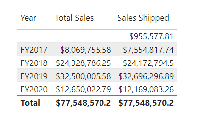
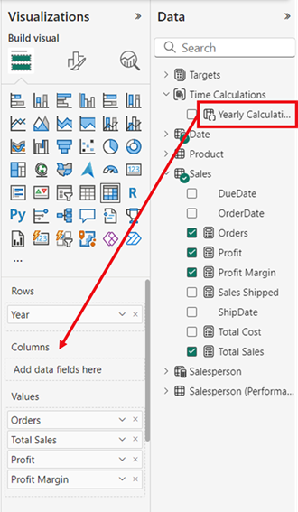

---
lab:
  title: Projetar modelos semânticos escalonáveis
  module: Design scalable semantic models
---

# Projetar modelos semânticos escalonáveis

Neste exercício, você trabalhará com funções DAX para aumentar a flexibilidade e a eficiência dos modelos de dados, especialmente por meio de recursos como grupos de cálculo e parâmetros de campo. Usando esses recursos juntos, você pode criar relatórios interativos sem precisar de vários visuais ou expressões DAX complexas, criando modelos semânticos altamente flexíveis e escalonáveis.

Neste exercício, você aprenderá a:

- Use funções DAX para modificar o comportamento do relacionamento.
- Crie grupos de cálculo e aplique-os em cálculos de inteligência de dados temporais.
- Crie parâmetros de campo para selecionar e exibir dinamicamente diferentes campos e medidas.

Este laboratório leva cerca de **30** minutos para ser concluído.

## Antes de começar

1. Faça o download do arquivo [Sales Analysis starter](https://github.com/MicrosoftLearning/mslearn-fabric/raw/main/Allfiles/Labs/15/15-scalable-semantic-models.zip) de `https://github.com/MicrosoftLearning/mslearn-fabric/raw/main/Allfiles/Labs/15/15-scalable-semantic-models.zip` e salve-o localmente.

2. Extraia a pasta para a pasta **C:\Users\Student\Downloads\15-scalable-semantic-models**.

3. Abra o arquivo **15-Starter-Sales Analysis.pbix**.

    > Ignore e feche todos os avisos solicitando a aplicação das alterações – não selecione *Descartar alterações*.

## Trabalhar com relacionamentos

Nesta tarefa, você abrirá uma solução pré-desenvolvida do Power BI Desktop para aprender sobre o modelo de dados. Em seguida, você explorará o comportamento de relações de modelo ativo.

1. No Power BI Desktop, alterne para a exibição de **Modelo** à esquerda.

    

2. Use o diagrama de modelo para examinar o design do modelo.

    

3. Observe que há três relações entre as tabelas **Date****Sales**

    

    > A coluna **Date** na tabela **Date** é uma coluna exclusiva que representa o lado "um" das relações. Os filtros aplicados a qualquer coluna da tabela **Date** se propagam para a tabela **Sales** usando uma das relações.*

4. Passe o cursor sobre cada uma das três relações para realçar a coluna lateral "muitas" na tabela **Vendas**.

5. Observe que a relação entre **Date** e **OrderDate** está ativa. O design do modelo atual indica que a tabela **Date** é uma dimensão com função múltipla. Essa dimensão pode desempenhar a função de data do pedido, data de conclusão ou data de remessa. A função que desempenha depende dos requisitos analíticos do relatório.

> Usaremos o DAX posteriormente para usar essas relações inativas sem criar outra tabela apenas para obter duas relações ativas para colunas de data diferentes.

### Visualizar dados de vendas por data

Nesta tarefa, você visualizará o total de vendas por ano e usará relacionamentos inativos.

1. Alterne para a exibição de **Relatório**.

    

2. Para adicionar um visual de tabela, no painel **Visualizações**, selecione o ícone do visual de **Tabela**.

    

3. Para adicionar colunas ao visual da tabela, no painel **Dados** (localizado à direita), primeiro expanda a tabela **Date**.

4. Arraste a coluna **Year** e solte-a no visual da tabela.

5. Abra a tabela **Sales** e arraste e solte a coluna **Total Sales** no visual da tabela.

6. Examine o visual da tabela.


> O visual da tabela mostra a soma da coluna **Total Sales** agrupada por ano. Mas o que **Year** significa? Como há uma relação ativa entre as tabelas **Date** e **Sales** com a coluna **OrderDate**, **Year** significa o ano fiscal em que os pedidos foram feitos.

### Usar relações inativas

Nesta tarefa, você usará a função `USERELATIONSHIP` para ativar uma relação inativa.

1. No painel **Dados**, clique com o botão direito do mouse na tabela **Sales** e selecione **Nova medida**.

    

2. Na barra de fórmulas (localizada abaixo da faixa de opções), substitua o texto pela definição de medida a seguir e pressione **Enter**.

    ```DAX
    Sales Shipped =
    CALCULATE (
    SUM ('Sales'[Sales]),
    USERELATIONSHIP('Date'[Date], 'Sales'[ShipDate])
    )
    ```

    > Usar a função CALCULATE para modificar o contexto de filtro. É a função USERELATIONSHIP que torna a relação **ShipDate** ativa, somente para essa medida.

3. Adicione a medida **Vendas Enviadas** ao visual da tabela.

4. Amplie o visual da tabela para que todas as colunas fiquem totalmente visíveis. Observe que a linha **Total** é a mesma, mas o valor das vendas para cada ano em **Total Sales** e **Sales Shipped** é diferente. Essa diferença se deve ao fato de os pedidos serem recebidos em um determinado ano, enquanto são enviados apenas no ano seguinte ou que ainda nem foram enviados.



> Criar medidas que definam temporariamente as relações como ativas é uma maneira de trabalhar com dimensões multi-função. No entanto, pode se tornar tedioso quando há a necessidade de criar versões multi-função para muitas medidas. Por exemplo, se houvesse 10 medidas relacionadas a vendas e três datas multi-função, isso pode significar a criação de 30 medidas. Criá-las com grupos de cálculo facilita o processo.

## Criar grupos de cálculo

Nesta tarefa, você criará um grupo de cálculo para análise de Inteligência de dados temporais.

1. Alterne para a exibição de **Modelo**.

2. Na visualização Modelo, selecione **Grupo de cálculo** para criar uma nova tabela de grupo de cálculo, coluna de grupo e item. Se uma janela de aviso for exibida, selecione **Sim** para confirmar a criação do grupo de cálculo.

   

    > Observação: uma medida implícita ocorre quando, no modo de exibição Relatório, você usa uma coluna de dados do painel Dados diretamente no visual. O visual permite agregar como uma SUM, AVERAGE, MIN, MAX ou alguma outra agregação básica, que se torna uma medida implícita. Depois de criar um grupo de cálculo, o Power BI Desktop não criará mais medidas implícitas, o que significa que você deve criar medidas explicitamente para agregar colunas de dados.

3. Renomeie o grupo de cálculo para *Time Calculations* e a coluna de cálculo para *Yearly Calculations*.

4. Na guia **Modelo** do painel **Dados**, selecione o item de cálculo criado automaticamente com seu grupo de cálculo.

5. Substitua e confirme a fórmula do item pelo seguinte:

    ```DAX
   Year-to-Date (YTD) = CALCULATE(SELECTEDMEASURE(), DATESYTD('Date'[Date]))
    ```

6. Clique com o botão direito do mouse no campo **Items de cálculo** e selecione **Novo item de cálculo**.

7. Use a seguinte fórmula DAX para o novo item:

    ```DAX
   Previous Year (PY) = CALCULATE(SELECTEDMEASURE(), PREVIOUSYEAR('Date'[Date]))
    ```

8. Crie um terceiro item com a seguinte fórmula DAX:

    ```DAX
   Year-over-Year (YoY) Growth = 
   VAR MeasurePriorYear =
   CALCULATE(
       SELECTEDMEASURE(),
       SAMEPERIODLASTYEAR('Date'[Date])
   )
   RETURN
   DIVIDE(
       (SELECTEDMEASURE() - MeasurePriorYear),
       MeasurePriorYear
   )
    ```

O último item de cálculo deve retornar valores apenas em porcentagem, portanto, ele precisa de uma cadeia de caracteres de formato dinâmico para alterar o formato das medidas afetadas.

9. No painel **Propriedades** do item YoY, habilite o recurso **Cadeia de caracteres de formato dinâmico**.

10. Na barra de fórmulas DAX, verifique se o campo à esquerda está definido como **Formato** e escreva a seguinte cadeia de caracteres de formato: `"0.##%"`

11. Confirme se o grupo de cálculo tem a seguinte aparência:

    

### Aplicar um grupo de cálculo a medidas

Nesta tarefa, você visualizará como os itens de cálculo afetam as medidas em um visual.

1. Alterne para a exibição de **Relatório**.

2. Na parte inferior da tela, selecione a guia **Visão geral**.

3. Selecione o visual de matriz já criado na tela e arraste a coluna de cálculo **Yearly Calculations** do painel **Dados** para o campo **Colunas** no painel **Visualizações**.

    

4. Observe que agora a matriz tem um conjunto de valores de vendas para cada item de cálculo. 

   

> Ter todas essas informações em um visual de uma só vez pode ser difícil de ler e, portanto, seria conveniente limitar o visual a um número de vendas por vez. Para fazer isso, podemos usar um parâmetro de campo.

## Criar parâmetros de campo

Nesta tarefa, você criará parâmetros de campo para alterar os visuais.

1. Selecione a guia **Modelagem** na faixa de opções superior, expanda o botão **Novo parâmetro** e selecione **Campos**.

    

2. Na janela Parâmetros, renomeie o parâmetro para **Número de vendas**, verifique se a opção **Adicionar segmentação de dados a esta página** está marcada e adicione os seguintes campos da tabela **Sales**:

   - Total de vendas
   - Lucro
   - Margem de Lucro
   - Ordens

    

3. Selecione **Criar**.

4. Depois que a segmentação for criada, você poderá selecionar a matriz e remover todos os campos de **Valores** no painel Visualizações e adicionar o parâmetro de campo Número de vendas.

    

5. Verifique os diferentes números de vendas na segmentação e como a matriz muda quando cada um deles é selecionado.

6. Veja como o campo Lucro é selecionado usando a segmentação de dados para o parâmetro de campo Números de vendas. Esta é a mesma matriz acima, para que você possa ver os três itens de cálculo (PY, YoY, YTD), mas aplicados apenas ao Lucro por causa da segmentação.

    

### Editar parâmetros de campo

Nesta tarefa, você editará o parâmetro de campo **Números de vendas** modificando diretamente sua expressão DAX.

1. Selecione a guia **Desempenho do Vendedor** na parte inferior da tela. Observe que o gráfico de barras cluterizado alterna o gráfico entre Vendas por Mês e Meta por Mês.

    > Embora a criação dos botões de indicador permita alterar o tipo de visual com cada opção, se você precisar alternar entre muitas medidas, terá que criar um botão de indicador para cada uma delas e isso pode levar muito tempo. Em vez disso, podemos usar um parâmetro de campo com todas as medidas que queremos analisar e alternar rapidamente entre elas.

    

2. Selecione o visual de gráfico de barras e substitua o campo **Total de vendas** no eixo **X** pelo parâmetro de campo **Números de vendas**.

3. Crie um visual de **segmentação** de dados e arraste o parâmetro **Números de vendas** para a área **Campo**.

Para esse visual, você ainda precisa avaliar a Meta por Mês, que não está no parâmetro de campo.

4. Selecione o parâmetro **Número de vendas** no painel Dados e adicione o campo Meta na expressão DAX do parâmetro, conforme abaixo:

    ```DAX
   Sales Figures = {
    ("Total Sales", NAMEOF('Sales'[Total Sales]), 0),
    ("Profit", NAMEOF('Sales'[Profit]), 1),
    ("Profit Margin", NAMEOF('Sales'[Profit Margin]), 2),
    ("Orders", NAMEOF('Sales'[Orders]), 3),
    ("Target", NAMEOF('Targets'[Target]), 4)
   }
    ```

5. Confirme as alterações e verifique se o visual muda à medida que você seleciona os diferentes números de vendas.

6. Exclua os botões de indicador e observe o estado final da página do relatório.

    

## Laboratório concluído

Para concluir o exercício, feche o Power BI Desktop - não é necessário salvar o arquivo.
