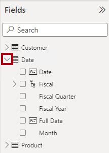
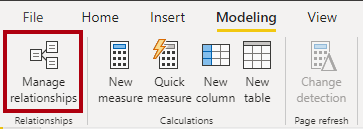
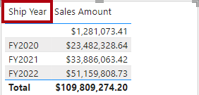
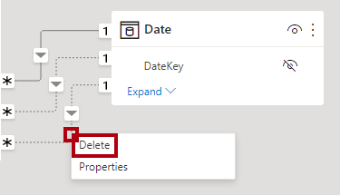
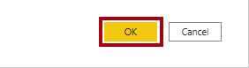
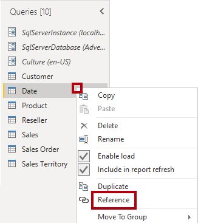
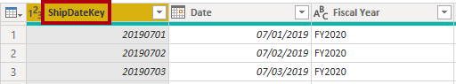
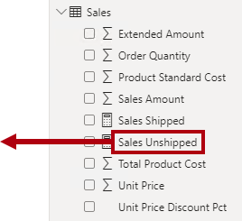

---
lab:
  title: Trabalhar com relações de modelo
  module: Design and build tabular models
---

# Trabalhar com relações de modelo

Neste exercício, você trabalhará com relações de modelo especificamente para atender à necessidade de dimensões com função múltipla. Isso envolverá trabalhar com relacionamentos ativos e inativos, e também funções DAX (Data Analysis Expressions) que modificam o comportamento do relacionamento.

Neste exercício, você aprenderá a:

- Interpretar propriedades de relacionamento no diagrama de modelo.
- Definir propriedades de relação.
- Use funções DAX que modificam o comportamento do relacionamento.

Este laboratório leva cerca de **45** minutos para ser concluído.

> **Observação**: Você precisará de uma [avaliação do Microsoft Fabric](https://learn.microsoft.com/fabric/get-started/fabric-trial) para concluir esse exercício.

## Explorar relações de modelo

Neste exercício, você abrirá uma solução pré-desenvolvida do Power BI Desktop para aprender sobre o modelo de dados. Em seguida, você explorará o comportamento de relações de modelo ativo.

### Baixar o arquivo inicial

1. Baixe o [arquivo inicial da Análise de Vendas](https://aka.ms/fabric-relationships-starter) de `https://aka.ms/fabric-relationships-starter` e salve-o no computador local (em qualquer pasta).

1. Navegue até o arquivo baixado e abra-o no Power BI Desktop.
    >Observação: ignore e feche o aviso solicitando que as alterações sejam aplicadas.

### Examinar o modelo de dados

1. No Power BI Desktop, alterne para a exibição de **Modelo** à esquerda.

    
2. Use o diagrama de modelo para examinar o design do modelo.

    

    *O modelo é composto por seis tabelas dimensionais e uma tabela de fatos. A tabela de fatos **Vendas** armazena os detalhes da ordem de venda do cliente. É um design clássico de esquema de estrelas.*

3. Observe que há três relações entre as tabelas **Data** **Vendas**

    

    *A coluna **DateKey** na tabela **Data** é uma coluna exclusiva que representa o lado "um" das relações. Os filtros aplicados a qualquer coluna da tabela **Data** se propagam para a tabela **Vendas** usando uma das relações.*

4. Passe o cursor sobre cada uma das três relações para realçar a coluna lateral "muitas" na tabela **Vendas**.

5. Observe que a relação com a coluna **OrderDateKey** é uma linha sólida, enquanto as outras relações são representadas por uma linha pontilhada.

    *Uma linha sólida representa uma relação ativa. Só pode haver um caminho de relação ativa entre duas tabelas modelo, e o caminho é usado por padrão para propagar filtros entre tabelas. Por outro lado, uma linha pontilhada representa uma relação inativa. Relações inativas são usadas​somente quando invocadas explicitamente por fórmulas DAX.*

    *O design do modelo atual indica que a tabela **Data** é uma dimensão de role-playing. Essa dimensão pode desempenhar a função de data do pedido, data de vencimento ou data de remessa. Qual função depende dos requisitos analíticos do relatório.*

    *Neste laboratório, você aprenderá a projetar um modelo para dar suporte a dimensões de interpretação de funções.*

### Visualizar dados da data

Nesta tarefa, você visualizará os dados de vendas por data e alternará o status ativo das relações.

1. Alterne para a exibição de **Relatório**.

    

2. Para adicionar um visual de tabela, no painel **Visualizações**, selecione o ícone do visual de **Tabela**.

    

3. Para adicionar colunas ao visual da tabela, no painel **Dados** (localizado à direita), primeiro expanda a tabela **Data**.

    

4. Arraste a coluna **Ano Fiscal** e solte-a no visual da tabela.

    

5. Abra a tabela **Vendas** e arraste e solte a coluna **Valores de vendas** no visual da tabela.

    

6. Examine o visual da tabela.

    

    *O visual da tabela mostra a soma da coluna **Valor de Vendas** agrupada por ano. Mas o que significa **Ano Fiscal**? Como existe uma relação ativa entre as tabelas **Data** e **Vendas** com a coluna **OrderDateKey**, **Ano Fiscal** significa o ano fiscal em que os pedidos foram feitos.*

    *Para esclarecer qual ano fiscal, é uma boa ideia renomear o campo visual (ou adicionar um título ao visual).*

7. No painel **Visualizações** para o visual da tabela, de dentro da caixa **Valores**, selecione a seta para baixo e **Renomeie para este visual**.

    

8. Substitua o texto por **Ano do Pedido** e pressione **Enter**.

    

    *Observação: É mais rápido renomear um campo visual clicando duas vezes em seu nome.*

9. Observe que o cabeçalho da coluna visual da tabela é atualizado para o novo nome.

    

### Modificar o status ativo da relação

Nesta tarefa, você modificará o status ativo de duas relações.

1. Na faixa de opções **Modelagem**, selecione **Gerenciar relações**.

    

2. Na janela **Gerenciar Relações**, para a relação entre as tabelas **Vendas** e **Data** da coluna **OrderDateKey** (terceira na lista), desmarque a caixa de seleção **Ativo**.

    

3. Marque a caixa de seleção **Ativo** para a relação entre as tabelas **Vendas** e **Data** na coluna **ShipDateKey** (última na lista).

    

4. Selecione **Fechar**.

    

    *Essas configurações mudaram a relação ativa entre as tabelas **Data** e **Vendas** para a coluna **ShipDateKey**.*

5. Examine o visual da tabela que agora mostra os valores de vendas agrupados por anos de remessa.

    

6. Renomeie a primeira coluna como **Ano de Remessa**.

    

    *A primeira linha representa um grupo em branco porque alguns pedidos ainda não foram enviados. Em outras palavras, há BLANKs na coluna **ShipDateKey** da tabela **Vendas**.*

7. Na janela **Gerenciar relações**, reverta a relação **OrderDateKey** de volta para ativa com as seguintes etapas:

    - Abra a janela **Gerenciar relações**.

    - Desmarque a caixa de seleção **Ativo** para a relação **ShipDateKey** (última da lista)

    - Marque a caixa de seleção **Ativo** para a relação **OrderDateKey** (terceira da lista).

    - Feche a janela **Gerenciar relações**.

    - Renomear o primeiro campo no visual da tabela como **Ano do pedido**

    

    *No próximo exercício, você aprenderá como tornar uma relação ativa em uma fórmula DAX.*

## Usar relações inativas

Neste exercício, você aprenderá como tornar uma relação ativa em uma fórmula DAX.

### Usar relações inativas

Nesta tarefa, você usará a função USERELATIONSHIP para ativar uma relação inativa.

1. No painel **Dados**, clique com o botão direito do mouse na tabela **Vendas** e selecione **Nova medida**.

    

2. Na barra de fórmulas (localizada abaixo da faixa de opções), substitua o texto pela definição de medida a seguir e pressione **Enter**.

    ```DAX
    Sales Shipped =
    CALCULATE (
    SUM ( 'Sales'[Sales Amount] ),
    USERELATIONSHIP ( 'Date'[DateKey], 'Sales'[ShipDateKey] )
    )
    ```

    *Essa fórmula usa a função CALCULATE para modificar o contexto do filtro. É a função USERELATIONSHIP que, para fins deste cálculo, ativa a relação **ShipDateKey**.*

3. Nas faixa de opções contextual **Ferramentas de Medida**, dentro do grupo **Formatação**, defina o número de casas decimais como **2**.

    

4. Adicione a medida **Vendas Enviadas** ao visual da tabela.

    

5. Amplie o visual da tabela para que todas as colunas fiquem totalmente visíveis.

    

    *Criar medidas que definam temporariamente as relações como ativas é uma forma de trabalhar com dimensões de role-playing. No entanto, pode tornar-se entediante quando há necessidade de criar versões de role-playing para muitas medidas. Por exemplo, se houvesse 10 medidas relacionadas com vendas e três datas de role-playing, isso poderia significar a criação de 30 medidas. Criá-las com grupos de cálculo poderia facilitar o processo.*

    *Outra abordagem é criar uma tabela modelo diferente para cada dimensão do role-playing. Você fará isso no próximo exercício.*

6. Para remover a medida do visual da tabela, no painel **Visualizações**, de dentro da caixa**Valores**, para o campo **Vendas Enviadas**, pressione **X**.

    

## Adicionar outra tabela Data

Neste exercício, você adicionará uma tabela de data para dar suporte à análise de data de remessa.

### Remova as relações inativas

Nesta tarefa, você removerá a relação existente com a coluna **ShipDateKey**.

1. Alterne para a exibição de **Modelo**.

    

2. No diagrama do modelo, clique com o botão direito na relação **ShipDateKey** e selecione **Excluir**.

    

3. Quando precisar confirmar a exclusão, selecione **Sim**.

    *A exclusão da relação resulta em um erro com a medida **Vendas Enviadas**. Você reescreverá a fórmula de medida mais tarde neste laboratório.*

### Desabilitar opções de relação

Nesta tarefa, você desabilitará opções de relação.

1. Na guia **Arquivo** da faixa de opções, Selecione **Opções e configurações** e, em seguida, selecione **Opções**.

    

2. Na janela **Opções**, na parte inferior esquerda, no grupo **CURRENT FILE**, selecione **Carregamento de Dados**.

    

3. Na seção **Relações**, desmarque as duas opções habilitadas.

    

    *Geralmente, no seu dia a dia de trabalho, não há problema em manter essas opções ativadas. No entanto, para este laboratório, você criará relações explicitamente.*

4. Selecione **OK**.

    

### Adicionar outra tabela Data

Nesta tarefa, você criará uma consulta para adicionar outra tabela de data ao modelo.

1. Na guia de faixa de opções **Página Inicial**, no grupo **Consultas**, selecione o ícone **Transformar Dados**, que abre o **Editor do Power Query**.

    

    *Se o sistema solicitar que você especifique como se conectar, **Editar Credenciais**.*

    

    *Deixe as configurações de conexão padrão do Windows com "Usar minhas credenciais atuais" e, em seguida, selecione **Conectar**.*

      *Selecione **Sim** para fechar a mensagem de aviso.*

2. Na janela do **Editor do Power Query**, no painel **Consultas** (localizado à esquerda), clique com o botão direito do mouse na consulta **Data** e selecione **Referência**.

    

    *Uma consulta de referência é aquela que usa outra consulta como origem. Portanto, essa nova consulta origina a data da consulta **Data**.*

3. No painel **Configurações de Consulta** (localizado à direita), na caixa **Nome**, substitua o texto por **Data de Remessa**.

    

4. Para renomear a coluna **DateKey**, clique duas vezes no cabeçalho da coluna **DateKey**.

5. Substitua o texto por **ShipDateKey** e pressione **Enter**.

    

6. Além disso, renomeie a coluna **Ano Fiscal** como **Ano de Remessa**.

    *Se possível, é uma boa ideia renomear todas as colunas para que elas descrevam a função que estão desempenhando. Neste laboratório, para manter as coisas simples, você renomeará apenas duas colunas.*

7. Para carregar a tabela no modelo, na guia **Página Inicial** da faixa de opções, selecione o ícone **Fechar &amp; Aplicar**.

    

8. Quando a tabela for adicionada ao modelo, para criar uma relação, na tabela **Data de Remessa**, arraste a coluna **ShipDateKey** para a coluna **ShipDateKey** da tabela **Vendas**.

    

9. Observe que agora existe uma relação ativa entre as tabelas **Data da Remessa** e **Vendas**.

### Visualizar dados da data de remessa

Nesta tarefa, você visualizará os dados da data de remessa em um novo visual de tabela.

1. Alterne para a exibição de **Relatório**.

    

2. Para clonar o visual da tabela, primeiro selecione o visual.

3. Na guia **Página Inicial** da faixa de opções, dentro do grupo **Área de transferência**, selecione **Copiar**.

    

4. Para colar o visual copiado, na guia **Página Inicial** da faixa de opções, dentro do grupo **Área de transferência**, clique em **Colar**.

    *Dica: você também pode usar os **atalhos Ctrl+C** e **Ctrl+V** .*

    

5. Mova o novo visual da tabela para a direita do visual da tabela existente.

6. Selecione o novo visual da tabela e, no painel **Visualizações**, de dentro da caixa **Valores**, remova o campo **Ano do Pedido**.

    

7. No painel **Dados**, abra e expanda a tabela **Data de Remessa**.

8. Para adicionar um novo campo ao novo visual de tabela, na tabela **Data de Remessa**, arraste o campo **Ano da Remessa** para a caixa **Valores**, acima do campo **Valor de Vendas**.

    

9. Verifique se o novo visual da tabela mostra o valor das vendas agrupadas por ano de remessa.

    

    *O modelo agora tem duas tabelas de data, cada uma com uma relação ativa com a  tabela **Vendas**. O benefício dessa abordagem de design é que ela é flexível. Agora é possível usar todas as medidas e campos somáveis com qualquer tabela de data.*

    *Existem, no entanto, algumas desvantagens. Cada tabela de role-playing contribuirá para um tamanho de modelo maior, embora as tabelas de dimensão normalmente não sejam grandes em termos de linhas. Cada tabela de role-playing também exigirá a duplicação de configurações do modelo, como marcação da tabela de datas, criação de hierarquias e outras configurações. Além disso, tabelas adicionais contribuem para um possível número esmagador de campos. Os usuários podem achar mais difícil encontrar os recursos do modelo de que precisam.*

    *Por último, não é possível conseguir uma combinação de filtros num único visual. Por exemplo, não é possível combinar vendas encomendadas e vendas enviadas no mesmo visual sem criar uma medida. Você criará essa medida no próximo exercício.*

## Explorar outras funções de relação

Neste exercício, você trabalhará com outras funções de relação do DAX.

### Explorar outras funções de relação

Nesta tarefa, você trabalhará com as funções CROSSFILTER e TREATAS para modificar o comportamento do relação durante os cálculos.

1. No painel **Dados**, dentro da tabela **Vendas**, selecione a medida **Vendas Enviadas**.

    

2. Na base da fórmula, substitua o texto pela seguinte definição:

    ```dax
    Sales Shipped =
    CALCULATE (
    SUM ( 'Sales'[Sales Amount] ),
    CROSSFILTER ( 'Date'[DateKey], 'Sales'[OrderDateKey], NONE ),
    TREATAS (
    VALUES ( 'Date'[DateKey] ),
    'Ship Date'[ShipDateKey]
        )
    )
    ```

    *Esta fórmula usa a função CALCULATE para somar a coluna **Valor de Vendas **usando comportamentos de relação modificados. A função CROSSFILTER desabilita a relação ativa com a coluna **OrderDateKey** (esta função também pode modificar a direção do filtro). A função TREATAS cria uma relação virtual aplicando os valores **DateKey** no contexto à coluna **ShipDateKey**.*

3. Adicione a medida **Vendas Enviadas** revisada ao visual da primeira tabela.

    

4. Examine o visual da primeira tabela.

    

5. Observe que não há nenhum grupo BLANK.

    *Como não há BLANKs na coluna **OrderDateKey**, um grupo BLANK não foi gerado. Mostrar vendas não enviadas exigirá uma abordagem diferente.*

### Mostrar vendas não enviadas

Nesta tarefa, você criará uma medida para mostrar o valor das vendas não enviadas.

1. Crie uma medida chamada **Vendas Não Enviadas** na tabela **Vendas** usando a seguinte definição:

    ```DAX
    Sales Unshipped =
    CALCULATE (
    SUM ( 'Sales'[Sales Amount] ),
    ISBLANK ( 'Sales'[ShipDateKey] )
    )
    ```

    *Esta fórmula soma a coluna **Valor de Vendas** em que a Coluna **ShipDateKey** é BLANK.*

2. Formate a medida para usar duas casas decimais.

3. Para adicionar um novo visual à página, primeiro selecione uma área em branco da página do relatório.

4. No painel de **Visualizações**, selecione o ícone de visual **Cartão**.

    

5. Arraste a medida **Vendas não Enviadas** ao visual do cartão.

    

6. Verifique se o layout da página do relatório final é semelhante ao seguinte.

    

### Conclusão

Para concluir o exercício, feche o Power BI Desktop - não é necessário salvar o arquivo.
