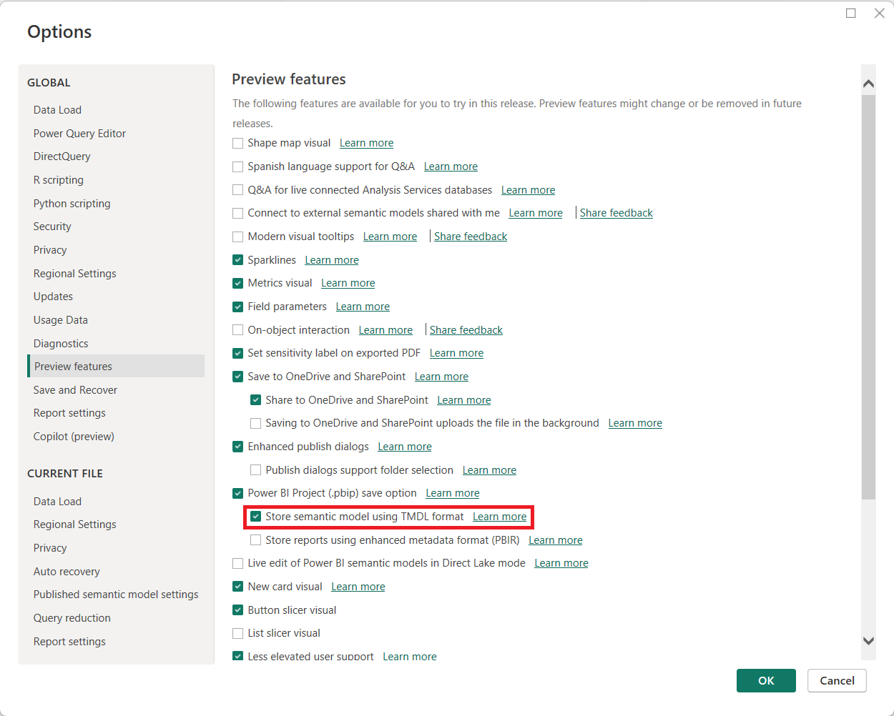

---
lab:
  title: Criar ativos reutilizáveis do Power BI
  module: Create reusable Power BI assets
---

# Criar ativos reutilizáveis do Power BI

Neste exercício, você criará ativos reutilizáveis para dar suporte ao modelo semântico e ao desenvolvimento de relatórios. Esses ativos incluem arquivos de projeto e modelo do Power BI e modelos semânticos compartilhados. No final, a exibição de linhagem mostrará como esses itens se relacionam entre si no serviço do Power BI.

   > Observação: este exercício não requer uma licença do Fabric e pode ser concluído em um ambiente do Power BI ou do Microsoft Fabric.

Este exercício deve levar aproximadamente **30** minutos para ser concluído.

## Antes de começar

Antes de começar este exercício, primeiro abra um navegador da Web e insira a seguinte URL para baixar a pasta zip:

`https://github.com/MicrosoftLearning/mslearn-fabric/raw/refs/heads/main/Allfiles/Labs/16b/16-reusable-assets.zip`

Extraia a pasta para a pasta **C:\Users\Student\Downloads\16-reusable-assets**.

## Criar um novo projeto do Power BI

Nesta tarefa, você irá salvar um relatório como um arquivo de projeto do Power BI (*.pbip*). Os arquivos de projeto do Power BI armazenam os detalhes do relatório e do modelo semântico em arquivos simples que funcionam com o controle do código-fonte. Você pode usar o Visual Studio Code para modificar esses arquivos ou o Git para controlar as alterações.

1. Abra o arquivo **16-Starter-Sales Analysis.pbix** na pasta **16-reusable-assets**.

1. Selecione **Arquivo** > **Opções e configurações** > **Opções** > **Versão prévia dos recursos** e escolha a opção **Armazenar modelo semântico usando o formato TMDL**, depois clique em **OK.**.

    > Isso habilita a opção de salvar o modelo semântico usando TMDL (Tabular Model Definition Language), que atualmente é um recurso em versão prévia. Se receber uma solicitação para reiniciar o Power BI Desktop, faça isso antes de continuar o exercício.

    

1. Selecione **Salvar como** e escolha o tipo de arquivo selecionando a seta no menu suspenso ao nomear o arquivo.

1. Selecione a extensão de arquivo **.*.pbip***, escolha um nome para o relatório e salve-o em uma pasta da qual você lembrará.

    

1. Observe na parte superior da janela do Power BI Desktop que o nome do relatório tem **(Projeto do Power BI)** ao lado.

1. **Salve** o arquivo novamente.

### Revisar detalhes do arquivo de projeto do Power BI

Vejamos como as alterações no Power BI Desktop são refletidas nos arquivos .tmdl.

1. Na área de trabalho, use o Explorador de Arquivos para navegar até a pasta em que você salvou o arquivo **. pbip****.
1. Você verá os seguintes itens:

    - Arquivo YourReport.pbip
    - A pasta SeuRelatório.Relatório
    - A pasta SeuRelatório.ModeloSemântico
    - O Arquivo de origem Git Ignore .gitignore

## Adicionar uma nova tabela ao relatório

Nesta tarefa, você adicionará uma nova tabela porque o modelo semântico não tem todos os dados necessários.

1. No Power BI Desktop, navegue até **Obter dados > Web** para adicionar os novos dados.

1. A caixa de diálogo Da Web aparecerá quando se conectar. Mantenha o botão de opção **Básico** selecionado. Insira o seguinte caminho de arquivo como o caminho da URL.

    `C:\Users\Student\Downloads\16-reusable-assets\us-resident-population-estimates-2020.html`

1. Marque a caixa **Tabelas HTML > Tabela 2** e selecione **Transformar Dados** para continuar.

    

1. Uma nova janela do Editor do Power Query será aberta com a visualização dos dados da Tabela 2.
1. Renomeie a **Tabela 2** para *População dos EUA*.
1. Renomeie ESTADO para **Estado** e NÚMERO para **População**.
1. Remova a coluna CLASSIFICAÇÃO.
1. Selecione **Fechar e Aplicar** para carregar os dados transformados no modelo semântico.
1. Selecione **OK** se for apresentada uma caixa de diálogo para *Risco de segurança potencial*.
1. **Salve** seu arquivo.
1. Se solicitado, **não atualize** para o formato de Relatório aprimorado do Power BI.

### Criar um relacionamento

Nesta tarefa, faremos alterações no relatório no Power BI Desktop e veremos as alterações nos arquivos .tmdl simples.

1. No Explorador de arquivos, localize a pasta de arquivos ***SeuRelatório*. ModeloSemântico**.
1. Abra a pasta de definição e observe os diferentes arquivos.
1. Abra o arquivo **relacionamentos.tmdl** em um Bloco de Notas e observe que há nove relacionamentos listados. Feche o arquivo .
1. No Power BI Desktop, vá para a guia **Modelagem** na faixa de opções.
1. Selecione **Gerenciar relacionamentos** e observe que há nove relacionamentos.
1. Crie um novo relacionamento da seguinte forma:
    - **De**: revendedor com Estado-Província como coluna de chave
    - **Para**: População dos EUA com Estado como coluna de chave
    - **Cardinalidade**: muitos para um (*:1)
    - **Direção do filtro cruzado**: Ambas

    

1. **Salve** seu arquivo.
1. Verifique novamente no arquivo **relacionamentos.tmdl** e observe que uma nova relação foi adicionada.

> Essas alterações em arquivos simples são rastreáveis em sistemas de controle do código-fonte, ao contrário dos arquivos *.pbix*, que são binários.

## Adicionar uma medida e um visual ao relatório

Nesta tarefa, você adicionará uma medida e um visual para estender o modelo semântico e usar a medida em um visual.

1. No Power BI Desktop, navegue até o painel Dados e selecione a tabela Vendas.
1. Selecione **Nova medida** na faixa de opções de ferramentas da Tabela contextual.
1. Na barra de fórmulas, insira e confirme o seguinte código:

    ```DAX
    Sales per Capita =
    DIVIDE(
        SUM(Sales[Sales]),
        SUM('US Population'[Population])
    )
    ```

1. Localize a nova medida **Vendas per Capita** e arraste-a para a tela.
1. Arraste os campos **Vendas \| Vendas**, **População dos EUA \| Estado** e **População dos EUA \| População** para o mesmo visual.

   > *Os laboratórios usam uma notação abreviada para fazer referência a um campo. Ficará assim: **Vendas \| Preço Unitário**. Neste exemplo, **Vendas** é o nome da tabela e **Preço Unitário** é o nome do campo.*

1. Selecione o visual e altere-o para uma **Tabela**.
1. Observe a formatação inconsistente para os dados de Vendas per Capita e População.
1. Selecione cada campo no painel Dados e altere o formato e as casas decimais.
    - Vendas per capita: Moeda \| 4 casas decimais
    - População: número inteiro \| separado por vírgula \| 0 casas decimais

    

    > Dica: se você acidentalmente criar uma medida na tabela errada, poderá alterar facilmente a tabela Início, conforme mostrado na imagem anterior.

1. Salve seu arquivo.

> Sua tabela deve se parecer com a imagem a seguir com quatro colunas e números formatados corretamente.


## Configurar um arquivo de modelo do Power Bi (.pbit)

Nesta tarefa, você criará um arquivo de modelo para que possa compartilhar um arquivo leve com outras pessoas objetivando uma melhor colaboração.

1. Vá para a guia Inserir na faixa de opções do Power BI Desktop e selecione **Imagens**. Navegue até a pasta downloads e selecione o arquivo `AdventureWorksLogo.jpg`.
1. Posicione esta imagem no canto superior esquerdo.
1. Selecione um novo visual e adicione a ele **Vendas \| Lucro** e **Produto \| Categoria**.

    > Usamos um gráfico de rosca para nossa captura de tela a seguir.

    

1. Observe que existem quatro cores diferentes na legenda.
1. Navegue até a guia **Exibir** na faixa de opções.
1. Selecione a seta ao lado de **Temas** para expandir e ver todas as opções.
1. Selecione um dos **Temas acessíveis** para aplicar a este relatório.

    > Esses temas são criados especificamente para serem mais acessíveis para os visualizadores de relatórios.

1. Expanda os Temas novamente e selecione **Personalizar tema atual**.

    

1. Na janela Personalizar tema, navegue até a guia **Texto**. Altere a família de fontes para uma fonte Segoe UI em cada uma das seções.

    

1. **Aplique** as alterações depois de concluídas.
1. Observe as diferentes cores nos visuais com o novo tema aplicado.

    

1. Selecione **Arquivo > Salvar como** para criar o arquivo *.pbit*.
1. Altere o tipo de arquivo para *.pbit* e salve-o no mesmo local que o arquivo *.pbip* .
1. Insira uma descrição sobre o que os usuários podem esperar desse modelo ao usá-lo e selecione OK.
1. Volte para o Explorador de Arquivos, abra o arquivo *.pbit* e veja que ele se parece exatamente com o arquivo *.pbip*.

    > Neste exercício, queremos apenas um modelo de tema de relatório padrão sem um modelo semântico.

1. Nesse mesmo novo arquivo, exclua os dois visuais da tela.
1. Selecione **Transformar Dados** na faixa de opções página inicial.
1. No Editor do Power Query, selecione a consulta **População dos EUA** e clique com o botão direito do mouse para excluí-la.
1. Selecione configurações da Fonte de dados na faixa de opções, exclua a fonte de dados **DirectQuery para AS – Modelo Semântico do Power BI** e **Feche**.
1. **Fechar e Aplicar**
1. Navegue de volta para os Temas e veja que o tema acessível modificado ainda está aplicado ao relatório.
1. Observe também a mensagem de que *você ainda não carregou nenhum dado* no painel Dados.
1. **Salve como** um arquivo *.pbit* com o mesmo nome usado anteriormente para substituir o arquivo.
1. Feche o arquivo sem título sem salvar. Você ainda deve ter seu outro arquivo *.pbip* aberto.

> Agora você tem um modelo com um tema consistente sem nenhum dado pré-carregado.

### Revisar o estado final

Nesta tarefa, você irá examinar a captura de tela a seguir do resultado final das tarefas executadas neste exercício. Para alcançar esse estado, você criou seu arquivo de projeto do Power BI e o publicou em um workspace. Em seguida, você navegou até o workspace no serviço Power BI e mudou para o **modo de exibição de Linhagem** para ver como seu novo relatório depende de outras fontes de dados.

Da esquerda para a direita, os seguintes itens são visíveis:

- Fontes de dados: 2 arquivos de texto/csv e uma conexão com o SQL Server.
- Modelo semântico de análise de vendas de 16 iniciadores, que está conectado às fontes de dados.
- Relatório de Análise de Vendas de 16 Iniciadores, que está conectado ao modelo semântico de Análise de Vendas de 16 Iniciadores.
- Meu novo modelo semântico de relatório, que está conectado ao modelo semântico de Análise de Vendas de 16 Iniciantes.
- Meu novo relatório de relatório, que está conectado ao modelo semântico do Meu novo relatório.

> Quando modelos semânticos se relacionam com outros modelos semânticos, isso é chamado de **encadeamento**. Neste laboratório, o modelo semântico inicial é encadeado ao modelo semântico recém-criado, permitindo sua reutilização para uma finalidade especializada.


## Limpar

Você concluiu esse exercício com sucesso. Você criou arquivos de projeto e modelo do Power BI e modelos semânticos e relatórios especializados. Você pode excluir com segurança o workspace e todos os ativos locais.
