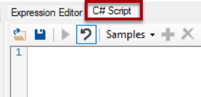
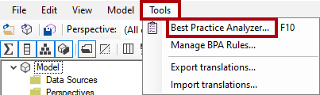
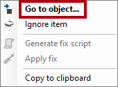
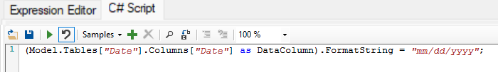
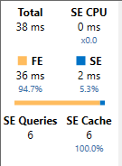

---
lab:
  title: Usar ferramentas para otimizar o desempenho do Power BI
  module: Optimize enterprise-scale tabular models
---

# Usar ferramentas para otimizar o desempenho do Power BI

## Visão geral

**O tempo estimado para concluir o laboratório é de 30 minutos**

Neste laboratório, você aprenderá a usar duas ferramentas externas para ajudá-lo a desenvolver, gerenciar e otimizar modelos de dados e consultas DAX.

Neste laboratório, você aprenderá a usar:

- O Analisador de Melhor Prática (BPA) no Editor Tabular.

- DAX Studio.

## Introdução

Neste laboratório, você instalará e usará o Editor Tabular e o Estúdio DAX para otimizar um modelo semântico.

## Usar o Analisador de Práticas Recomendadas

Neste exercício, você instalará o Editor de Tabela 2 e carregará as regras do Analisador de Práticas Recomendadas (BPA). Você revisará as regras do BPA e abordará problemas específicos encontrados no modelo de dados.

*O BPA é uma ferramenta gratuita de terceiros que notifica você sobre possíveis erros de modelagem ou alterações que você pode fazer para melhorar o design e o desempenho do modelo. Ele inclui recomendações de nomenclatura, experiência do usuário e otimizações comuns que você pode aplicar para melhorar o desempenho. Para obter mais informações, veja as [Regras de práticas recomendadas para melhorar o desempenho do modelo](https://powerbi.microsoft.com/blog/best-practice-rules-to-improve-your-models-performance/).*

### Baixar e instalar o Editor de Tabela 2

Baixe e instale o Editor de Tabela 2 para habilitar a criação de grupos de cálculo.

***Importante**: Se você já tiver instalado o Editor Tabular 2 em seu ambiente de VM, passe para a próxima tarefa.*

*O Editor de Tabela é uma ferramenta alternativa para criar modelos de tabela para Analysis Services e Power BI. O Editor de Tabelas 2 é um projeto de código aberto que pode editar um arquivo BIM sem acessar nenhum dado no modelo.*

1. Verifique se o Power BI Desktop está fechado.

1. No Microsoft Edge, navegue até a página Versão do Editor de Tabela.

    ```https://github.com/TabularEditor/TabularEditor/releases```

1. Role para baixo até a seção **Ativos** e selecione o arquivo **TabularEditor.Installer.msi** Isso iniciará a instalação do arquivo.

1. Após a conclusão, selecione **Abrir arquivo** para executar o instalador.

1. Na janela do instalador do Editor de Tabelas, selecione **Avançar**.

1. Leia o **Contrato de Licença**. Se você concordar, escolha **Aceito** e, em seguida, selecione **Avançar**.

1. Na etapa **Selecionar Pasta de Instalação**, selecione **Avançar**.

1. Na etapa **Atalhos de aplicativo**, selecione **Avançar**.

1. Na etapa **Confirmar Instalação**, selecione **Avançar**.

    *Se solicitado, selecione **Sim** para permitir que o aplicativo faça alterações.*

1. Quando a instalação for concluída, selecione **Fechar**.

    *O Editor de Tabela agora está instalado e registrado como uma ferramenta externa do Power BI Desktop.*

### Configurar o Power BI Desktop

Nesta tarefa, você abrirá uma solução pré-desenvolvida do Power BI Desktop.

1. Faça o download do [Arquivo inicial de Análise de Vendas](https://aka.ms/fabric-optimize-starter) de `https://aka.ms/fabric-optimize-starter` e salve-o em um local que você se lembrará.

1. Navegue até o arquivo baixado e abra-o no Power BI Desktop.

1. Selecione a guia **Ferramentas Externas** da faixa de opções.

    

1. Observe que você pode iniciar o Editor de Tabela nesta guia da faixa de opções.

    

    *Mais adiante neste exercício, você usará o Editor de Tabela para trabalhar com o BPA.*

### Examinar o modelo de dados

Nesta tarefa, você revisará o modelo de dados.

1. No Power BI Desktop, alterne para a exibição de **Modelo** à esquerda.

    

2. Use o diagrama de modelo para examinar o design do modelo.

    

    *O modelo é composto por oito tabelas dimensionais e uma tabela de fatos. A tabela de fatos **Vendas** armazena os detalhes da ordem do cliente. Ela apresenta um design clássico de esquema de estrela que inclui tabelas de dimensão de floco de neve (**Categoria** > **Subcategoria** > **Produto**) para a dimensão do produto.*

    *Neste exercício, você usará o BPA para detectar problemas de modelo e corrigi-los.*

### Carregar regras do BPA

Nesta tarefa, você carregará regras do BPA.

*As regras do BPA não são adicionadas durante a instalação do Editor de Tabela. Você deve baixá-las e instalá-las.*

1. Na faixa de opções **Ferramentas Externas**, selecione **Editor de Tabela**.

    

    *O Editor de Tabela é aberto em uma nova janela e se conecta ao vivo ao modelo de dados hospedado no Power BI Desktop. As alterações feitas no modelo no Editor de Tabela somente são propagadas para o Power BI Desktop quando você as salva.*

2. Para carregar as regras do BPA, selecione a guia **Script do C#**.

    *Observação: essa guia pode ser chamada de Script Avançado em versões mais antigas do Editor de Tabela.*

    

3. Copie e cole o script a seguir.

    ```csharp
    System.Net.WebClient w = new System.Net.WebClient(); 

    string path = System.Environment.GetFolderPath(System.Environment.SpecialFolder.LocalApplicationData);
    string url = "https://raw.githubusercontent.com/microsoft/Analysis-Services/master/BestPracticeRules/BPARules.json";
    string downloadLoc = path+@"\TabularEditor\BPARules.json";
    w.DownloadFile(url, downloadLoc);
    ```

4. Para executar o script, na barra de ferramentas, selecione o comando **Executar script**.

    

    *Para usar as regras do BPA, você deve fechar e reabrir o Editor de Tabela.*

5. Feche o Editor de Tabela.

6. Para reabrir o Editor de Tabela, na faixa de opções **Ferramentas Externas** do Power BI Desktop, selecione **Editor de Tabela**.

    

### Revisar as regras do BPA

Nesta tarefa, você revisará as regras do BPA que foram carregadas na tarefa anterior.

1. No Editor de Tabela, no menu, selecione **Ferramentas** > **Gerenciar Regras do BPA**.

    

2. Na janela **Gerenciar Regras de Práticas Recomendadas**, na lista **Coleções de regras**, selecione **Regras para o usuário local**.

    

3. Na lista **Regras na coleção**, role para baixo na lista de regras.

    *Dica: você pode arrastar o canto inferior direito para ampliar a janela.*

    *Em segundos, o Editor de Tabela pode verificar todo o seu modelo em relação a cada uma das regras e fornecer um relatório de todos os objetos de modelo que satisfazem a condição em cada regra.*

4. Observe que o BPA agrupa as regras em categorias.

    *Algumas regras, como expressões DAX, se concentram na otimização de desempenho, enquanto outras, como as regras de formatação, são voltadas para a estética.*

5. Observe a coluna **Severidade**.

    *Quanto menor o número, mais importante é a regra.*

6. Role até a parte inferior da lista e desmarque a regra **Definir IsAvailableInMdx como falso em colunas sem atributos**.

    

    *Você pode desabilitar regras individuais ou categorias inteiras de regras. O BPA não verificará as regras desabilitadas em relação ao seu modelo. A remoção dessa regra específica serve para mostrar como desabilitar uma regra.*

7. Selecione **OK**.

    

### Resolver problemas do BPA

Nesta tarefa, você abrirá o BPA e revisará os resultados das verificações.

1. No menu, selecione **Ferramentas** > **Analisador de Práticas Recomendadas** (ou pressione **F10).**

    

2. Na janela **Analisador de Práticas Recomendadas**, se necessário, maximize a janela.

3. Observe a lista de (possíveis) problemas, agrupados por categoria.

4. Na primeira categoria, clique com o botão direito do mouse na tabela **“Produto”** e selecione **Ignorar item**.

    

    *Quando um problema não é realmente um problema, você pode ignorá-lo. Você sempre pode revelar itens ignorados usando o comando **Mostrar ignorados** na barra de ferramentas.*

5. Mais abaixo na lista, na categoria **Usar a função DIVIDE para divisão**, clique com o botão direito do mouse em **[Margem de lucro]** e selecione **Ir para o objeto**.

    

    *Esse comando alterna para o Editor de Tabela e se concentra no objeto. Isso facilita a aplicação de uma correção para o problema.*

6. No Editor de Expressão, modifique a fórmula DAX para usar a função [DIVIDE](https://docs.microsoft.com/dax/divide-function-dax) mais eficiente (e segura), como indicado.

    *Dica: Todas as fórmulas estão disponíveis para serem copiadas e coladas de **D:\fabric\Allfiles\Labs\16\Snippets.txt**.*

    ```dax
    DIVIDE ( [Profit], SUM ( 'Sales'[Sales Amount] ) )
    ```

7. Para salvar as alterações do modelo, na barra de ferramentas, selecione o comando **Salvar alterações no banco de dados conectado** (ou pressione **Ctrl+S**).

    

    *Salvar alterações envia as modificações por push para o modelo de dados do Power BI Desktop.*

8. Volte para a janela (fora de foco) do **Analisador de Práticas Recomendadas**.

9. Observe que o BPA não lista mais o problema.

10. Role para baixo na lista de problemas para localizar a categoria **Fornecer cadeia de caracteres de formato para colunas de "Data"**.

    

11. Clique com o botão direito do mouse no problema **"Data"[Data]** e selecione **Gerar script de correção**.

    

    *Esse comando gera um script do C# e o copia para a área de transferência. Você também pode usar o comando **Aplicar Correção** para gerar e executar o script; no entanto, pode ser mais seguro revisar (e modificar) o script antes de executá-lo.*

12. Quando notificado de que o BPA copiou o script de correção para a área de transferência, selecione **OK.**

13. Alterne para o Editor de Tabela e selecione a guia **Script do C#**.

    *Observação: essa guia pode ser chamada de Script Avançado em versões mais antigas do Editor de Tabela.*

    

14. Para colar o script de correção, clique com o botão direito do mouse dentro do painel e pressione **Ctrl+V**.

    

    *Você pode optar por fazer uma alteração na cadeia de caracteres de formato.*

15. Para executar o script, na barra de ferramentas, selecione o comando **Executar script**.

    

16. Salve as alterações no modelo.

17. Para fechar o Editor de Tabela, no menu, selecione **Arquivo** > **Sair**.

18. Salve o arquivo do Power BI Desktop.

    

    *Você também deve salvar o arquivo do Power BI Desktop para garantir que as alterações do Editor de Tabela sejam salvas.*

    *Na mensagem sobre alterações pendentes, selecione **Aplicar mais tarde**.*

## Usar o DAX Studio

Neste exercício, você usará o Estúdio DAX para otimizar consultas DAX no arquivo de relatório do Power BI.

*De acordo com seu site, o DAX Studio é "a ferramenta definitiva para executar e analisar consultas DAX em modelos de tabela da Microsoft". Trata-se de uma ferramenta rica em recursos para criação, diagnóstico, ajuste de desempenho e análise de DAX. Os recursos incluem navegação de objetos, rastreamento integrado, detalhamento de execução de consultas com estatísticas detalhadas, realce e formatação de sintaxes DAX.*

### Baixar DAX Studio

Nesta tarefa, você baixará o DAX Studio.

1. No Microsoft Edge, navegue até a página de downloads do DAX Studio.

    ```https://daxstudio.org/downloads/```

1. Selecione **DaxStudio_3_X_XX_setup.exe (instalador)** - isso iniciará a instalação do arquivo.
    *Observação: a versão do DAX Studio poderá ser ligeiramente diferente ao longo do tempo. Baixe a versão mais recente.*

1. Após a conclusão, selecione **Abrir arquivo** para executar o instalador.

    

1. Na janela do instalador do DAX Studio, selecione **Instalar para todos os usuários (recomendado)**.

1. Na janela Controle de Conta de Usuário, selecione Sim para permitir que o aplicativo faça alterações no dispositivo.

    

1. Na página **Contrato de Licença**, se você aceita os termos de licença, selecione **Aceito o contrato** e, em seguida, selecione **Avançar**.

    

1. Selecione **Avançar** para usar o local de destino padrão.
1. Selecione **Avançar** para selecionar os componentes padrão a serem instalados.
1. Selecione **Avançar** para adicionar o atalho na pasta padrão do menu Iniciar.
1. Selecione **Criar um atalho da área de trabalho** e selecione Avançar.

    
1. Selecione **Instalar**.

1. Após a conclusão, com a opção **Iniciar o DAX Studio** selecionada, clique em**Concluir**. Isso abrirá o DAX Studio.
    

1. Na janela **Conectar**, selecione a opção **Modelo SSDT / Power BI**.

1. Na lista suspensa correspondente, verifique se o modelo **Análise de Vendas - Usar ferramentas para otimizar o desempenho do Power BI** está selecionado.

    

    *Se você não tiver o arquivo inicial **Análise de Vendas - Usar ferramentas para otimizar o desempenho do Power BI** aberto, não será possível conectar. Verifique se o arquivo está aberto.*

1. Selecione **Conectar**.

    

1. Se necessário, maximize a janela do DAX Studio.

### Usar o DAX Studio para otimizar uma consulta

Nesta tarefa, você otimizará uma consulta usando uma fórmula de medida aprimorada.

*Observe que é difícil otimizar uma consulta quando os volumes do modelo de dados são pequenos. Este exercício se concentra no uso do DAX Studio e não na otimização de consultas do DAX.*

1. Em uma janela do navegador, baixe os arquivos [Crescimento de Lucro Mensal.dax](https://aka.ms/fabric-optimize-dax) de `https://aka.ms/fabric-optimize-dax` e salve-os em seu computador local (em qualquer pasta).

   

3. Alterne para a janela do Dax Studio e, no menu **Arquivo**, selecione **Navegar** para navegar até o arquivo **Crescimento de Lucro Mensal.dax** e **Abrir** o arquivo.

    

6. Leia os comentários na parte superior do arquivo e revise a consulta a seguir.

    *Não é importante entender toda a consulta.*

    *A consulta define duas medidas que determinam o crescimento do lucro mensal. Atualmente, a consulta usa apenas a primeira medida (na linha 72). Quando uma medida não é usada, ela não afeta a execução da consulta.*

7. Para executar um rastreamento de servidor para registrar informações detalhadas do tempo que leva para criar o perfil de desempenho, na guia **Página Inicial** da faixa de opções, dentro do grupo **Rastreamentos**, selecione **Tempos de Servidor**.

    

8. Para executar o script, na guia **Página Inicial** da faixa de opções, dentro do grupo **Consulta**, selecione o ícone **Executar**.

    

9. No painel inferior, revise os resultados da consulta.

    *A última coluna exibe os resultados da medida.*

10. No painel inferior, selecione a guia **Tempos do Servidor**.

    

11. Revise as estatísticas disponíveis no lado esquerdo.

    

    *Da parte superior esquerda para a parte inferior direita, as estatísticas informam quantos milissegundos foram necessários para executar a consulta e a duração da CPU do mecanismo de armazenamento (SE). Neste caso (seus resultados serão diferentes), o mecanismo de fórmula (FE) levou 73,5% do tempo, enquanto que o SE levou os 26,5% restantes. Foram 34 consultas individuais do SE e 21 ocorrências no cache.*

12. Execute a consulta novamente e observe que todas as consultas do SE vêm do cache do SE.

    *Isso porque os resultados foram armazenados em cache para reutilização. Às vezes, em seus testes, convém limpar o cache. Nesse caso, na guia **Página Inicial** da faixa de opções, selecione a seta para baixo no comando **Executar**.*

    

    *A definição da segunda medida fornece um resultado mais eficiente. Agora, você atualizará a consulta para usar a segunda medida.*

13. Na linha 72, substitua a palavra **Ruim** por **Melhor**.

    

14. Execute a consulta e, em seguida, revise as estatísticas de tempo do servidor.

    

15. Execute-a uma segunda vez para obter ocorrências completas no cache.

    

    *Nesse caso, você pode determinar que a consulta "melhor” — que usa variáveis e uma função de inteligência de tempo — tem um desempenho melhor, com uma redução de quase 50% no tempo de execução da consulta.*

### Conclusão

Para concluir este exercício, feche todos os aplicativos - não é necessário salvar os arquivos.
