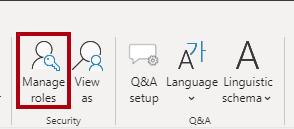
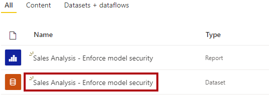
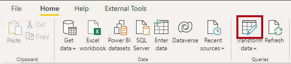
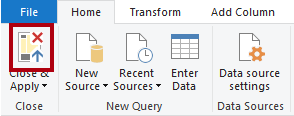
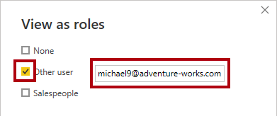

---
lab:
  title: Impor a segurança do modelo semântico
  module: Design and build tabular models
---

# Impor a segurança do modelo semântico

Nesse exercício, você atualizará um modelo de dados pré-desenvolvido para impor a segurança. Especificamente, os vendedores da empresa Adventure Works só devem poder ver os dados de vendas relacionados à região de vendas atribuída.

Neste exercício, você aprenderá a:

- Criar funções estáticas.
- Criar funções dinâmicas.
- Validar funções.
- Mapear entidades de segurança para funções de modelo semântico.

Esse laboratório leva cerca de **45** minutos para ser concluído.

> **Observação**: Você precisará uma [avaliação gratuita do Microsoft Fabric](https://learn.microsoft.com/fabric/get-started/fabric-trial) para concluir esse exercício.

## Introdução

Neste exercício, você preparará seu ambiente.

### Faça o download do arquivo inicial do Power BI

1. Baixe o [arquivo inicial da Análise de Vendas](https://aka.ms/fabric-security-starter) de `https://aka.ms/fabric-security-starter` e salve-o no computador local (em qualquer pasta).

1. Navegue até o arquivo baixado e abra-o no Power BI Desktop.

1. Quando solicitado, faça login com uma conta corporativa ou de estudante.

### Entrar no serviço do Power BI

Nesta tarefa, você entrará no serviço do Power BI, iniciará uma licença de avaliação e criará um workspace.

1. Em um navegador da Web, vá para `https://app.powerbi.com/`.

2. Conclua o processo de entrada com a mesma conta usada no Power BI Desktop.

    *Importante: você deve usar as mesmas credenciais usadas para entrar no Power BI Desktop.*

    *Dica: a experiência do navegador da Web do Power BI é conhecida como o **Serviço do Power BI**.*

### Criar um workspace

Nesta tarefa, você criará um workspace.

1. No serviço do Power BI, para criar um workspace, no painel de **navegação** (localizado à esquerda), selecione **Workspaces** e selecione **+ Novo workspace**.

2. No painel **Criar um workspace** (localizado à direita), na caixa **Nome**, insira um nome para o workspace.

    *O nome do workspace precisa ser exclusivo dentro do locatário.*

3. Escolha **Aplicar**.

    *Depois de criado, o workspace é aberto. Em um exercício posterior, você publicará um modelo semântico neste workspace.*

### Examinar o modelo de dados

Nesta tarefa, você revisará o modelo de dados.

1. No Power BI Desktop, alterne para a exibição de **Modelo** à esquerda.

    

2. Use o diagrama de modelo para examinar o design do modelo.

    

    *O modelo é composto por seis tabelas dimensionais e uma tabela de fatos. A tabela fatos de **Vendas** armazena os detalhes da ordem de venda do cliente. É um design clássico de esquema de estrelas.*

3. Em seguida abra e expanda a tabela **Território de Vendas**.

    

4. Observe que a tabela inclui uma coluna **Região**.

    *A coluna **Região** armazena as regiões de vendas da Adventure Works. Nessa organização, os vendedores só podem ver dados relacionados à região de vendas atribuída. Neste laboratório, você implementará duas técnicas de segurança em nível de linha diferentes para impor permissões de dados.*

## Criar funções estáticas

Neste exercício, você criará e validará funções estáticas e verá como mapear as entidades de segurança para as funções de modelo semântico.

### Criar funções estáticas

Nesta tarefa, você criará duas funções estáticas.

1. Alterne para a exibição de **Relatório**.

    

2. No visual do gráfico de colunas empilhadas, na legenda, observe (por enquanto) que é possível ver muitas regiões.

    

    *Por enquanto, o gráfico parece excessivamente cheio. Isso porque todas as regiões são visíveis. Quando a solução impõe a segurança em nível de linha, o consumidor do relatório verá apenas uma região.*

3. Para adicionar uma função de segurança, na guia **Modelagem** da faixa de opções, no grupo **Segurança**, selecione **Gerenciar Funções**.

    

4. Na janela **Gerenciar funções**, selecione **+ Novo**.

5. Para nomear a função, substitua o texto selecionado *Sem título* por **Austrália** e pressione **Enter**.

6. Na lista **Selecionar tabelas**, selecione **Região de Vendas** e, em seguida, na seção **Filtrar dados**, selecione **+ Novo**.
  
7. Na nova linha de regra, defina as seguintes configurações:
    * **Coluna**: Região
    * **Condição**: Igual a
    * **Valor**: Austrália

    

    *Essa regra filtra a coluna **Região** pelo valor **Austrália**.*

10. Para criar outra função, pressione **+ Novo** na seção **Funções**.

11. Repita as etapas nesta tarefa para criar uma função chamada **Canadá** que filtra a coluna **Região** por **Canadá**.

    

    *Neste laboratório, você criará apenas as duas funções. Considere, no entanto, que, em uma solução real, uma função deve ser criada para cada uma das 11 regiões da Adventure Works.*

12. Selecione **Salvar**.

### Validar as funções estáticas

Nesta tarefa, você validará funções estáticas.

1. Na guia **Modelagem** da faixa de opções, no grupo **Segurança**, selecione **Exibir como**.

    

2. Na janela **Exibir como funções**, selecione a função **Austrália**.

    

3. Selecione **OK**.

    

4. Na página do relatório, observe que o visual do gráfico de colunas empilhadas mostra apenas dados para a Austrália.

    

5. Na parte superior do relatório, observe a faixa amarela que confirma o papel imposto.

    

6. Para interromper a exibição usando a função, à direita do banner amarelo, selecione **Parar visualização**.

    

### Publicar o relatório

Nesta tarefa, você publicará o relatório.

1. Salve o arquivo do Power BI Desktop. Ao ser solicitado para aplicar as alterações pendentes, selecione **Aplicar mais tarde**.

    

2. Para publicar o relatório, na guia **Página Inicial** da faixa de opções, selecione **Publicar**.

    

3. Na janela **Publicar no Power BI**, selecione seu workspace e clique em **Selecionar**.

    

4. Quando a publicação for bem-sucedida, selecione **Entendi**.

    

### Configurar segurança em nível de linha (*opcional*)

Nesta tarefa, você verá como configurar a segurança em nível de linha no serviço do Power BI.

Essa tarefa depende da existência de um grupo de segurança **Salespeople_Australia** no locatário em que você está trabalhando. Esse grupo de segurança NÃO existe automaticamente no locatário. Se você tiver permissões em seu locatário, siga as etapas abaixo. Se você estiver usando um locatário fornecido a você no treinamento, não terá as permissões apropriadas para criar grupos de segurança. Leia as tarefas, mas observe que você não poderá concluí-las se não tiver o grupo de segurança. **Depois de ler, prossiga para a tarefa Limpar.**

1. Alterne para o serviço do Power BI (navegador da Web).

2. Na página de aterrissagem do workspace, observe o modelo semântico **Análise de Vendas – Impor a segurança do modelo**.

    

3. Passe o cursor sobre o modelo semântico e, quando as reticências forem exibidas, selecione as reticências e, em seguida, **Segurança**.

    

    *A opção **Segurança** dá suporte ao mapeamento de entidades de segurança do Microsoft Azure Active Directory (Azure AD), que inclui grupos de segurança e usuários.*

4. À esquerda, observe a lista de funções e que **Austrália** está selecionada.

    

5. Na caixa **Membros**, comece inserindo **Salespeople_Australia**.

    *As etapas 5 a 8 são apenas para fins de demonstração, pois dependem da criação ou existência de um grupo de segurança Salespeople_Australia. Se você tiver permissões e conhecimento para criar grupos de segurança, sinta-se à vontade para prosseguir. Caso contrário, vá para a tarefa Limpar.*

    

6. Selecione **Adicionar**.

    

7. Para concluir o mapeamento de função, selecione **Salvar**.

    

    *Agora, todos os membros do grupo de segurança Salespeople_Australia** são mapeados para a função Austrália **, que restringe o **acesso a dados para exibir apenas as **vendas australianas.*

    *Em uma solução real, cada função deve ser mapeada para um grupo de segurança.*

    *Essa abordagem de design é simples e eficaz quando existem grupos de segurança para cada região. No entanto, há desvantagens: requer mais esforço para criar e configurar. Também requer a atualização e a republicação do modelo semântico quando novas regiões são integradas.*

    *No próximo exercício, você criará uma função dinâmica orientada por dados. Essa abordagem de design pode ajudar a resolver essas desvantagens.*

8. Para retornar à página inicial do workspace, no painel **Navegação**, selecione o workspace.

### Limpar a solução

Nesta tarefa, você limpará a solução removendo o modelo semântico e as funções de modelo.

1. Para remover o modelo semântico, passe o cursor sobre o modelo semântico e, quando as reticências forem exibidas, selecione as reticências e, em seguida, **Excluir**.

    

    *Você publicará novamente um modelo semântico revisado no próximo exercício.*

2. Quando precisar confirmar a exclusão, selecione **Excluir**.

    

3. Alternar para o Power BI Desktop.

4. Para remover as funções de segurança, na guia **Modelagem** da faixa de opções, no grupo **Segurança**, selecione **Gerenciar Funções**.

    

5. Na janela **Gerenciar funções**, para remover a primeira função, selecione as reticências ao lado dela e, em seguida, selecione **Excluir**.

    

6. Remova também a segunda função.

7. Selecione **Salvar**.

## Criar função dinâmica

Neste exercício, você adicionará uma tabela ao modelo, criará e validará uma função dinâmica e mapeará uma entidade de segurança para a função de modelo semântico.

### Adicionar a tabela Vendedor

Nesta tarefa, você adicionará uma tabela **Vendedor** ao modelo.

1. Alterne para a exibição de **Modelo**.

    

2. Na guia **Página Inicial** da faixa de opções, dentro do grupo **Dados**, selecione o ícone **Transformar dados**.

    

    *Se você for solicitado a especificar como se conectar, **Edite as credenciais** e especifique como entrar.*

    

    *Selecione **Conectar***

     

    *Na página **Suporte à Criptografia**, selecione **OK**.*

3. Na janela do **Editor do Power Query**, no painel **Consultas** (localizado à esquerda), clique com o botão direito do mouse na consulta **Cliente** e selecione **Duplicar**.

    

    *Como a consulta **Cliente** já inclui etapas para conectar o data warehouse, duplicá-la é uma maneira eficiente de iniciar o desenvolvimento de uma nova consulta.*

4. No painel **Configurações de Consulta** (localizado à direita), na caixa **Nome**, substitua o texto por **Vendedor**.

    

5. Na lista **Etapas aplicadas**, clique com o botão direito do mouse na etapa **Outras colunas removidas** (terceira etapa) e selecione **Excluir Até o Fim**.

    

6. Quando precisar confirmar exclusão da etapa, selecione **Excluir**.

    

7. Para obter dados de uma tabela de data warehouse diferente, na lista **Etapas Aplicadas**, na **Navegação** (segunda etapa), selecione o ícone de engrenagem (localizado à direita).

    

8. Na janela **Navegação**, selecione a tabela **DimEmployee**.

    

9. Selecione **OK**.

    

10. Para remover colunas desnecessárias, na guia de faixa de opções **Página Inicial**, no grupo **Gerenciar Colunas**, selecione o ícone **Escolher Colunas**.

    

11. Na janela **Escolher Colunas**, desmarque o item **(Selecionar Todas as Colunas)**.

    

12. Marque as três seguintes colunas:

    - EmployeeKey

    - SalesTerritoryKey

    - EmailAddress

13. Selecione **OK**.

    

14. Para renomear a coluna **EmailAddress**, clique duas vezes no cabeçalho da coluna **EmailAddress**.

15. Substitua o texto por **UPN** e pressione **Enter**.

    *UPN é um acrônimo para Nome Principal do Usuário. Os valores nesta coluna correspondem aos nomes de conta do Azure AD.*

    

16. Para carregar a tabela no modelo, na guia **Página Inicial** da faixa de opções, selecione o ícone **Fechar &amp; Aplicar**.

    

17. Quando a tabela tiver sido adicionada ao modelo, observe que uma relação com a tabela **Território de Vendas** foi criada automaticamente.

### Configurar a relação

Nesta tarefa, você configurará as propriedades da nova relação.

1. Clique com o botão direito do mouse na relação entre as região tabelas **Vendedor ** e **Território de Vendas** e selecione **Propriedades**.

    

2. Na janela **Editar Relação**, na lista suspensa **Direção do filtro cruzado**, selecione **Ambas**.

3. Marque a caixa de seleção **Aplicar filtro de segurança em ambos os sentidos**.

    

    *Como há uma relação um para muitos da tabela **Território de Vendas** para a tabela **Vendedor**, os filtros se propagam somente da tabela **Território de Vendas** para a tabela **Vendedor**. Para forçar a propagação na outra direção, a direção do filtro cruzado deve ser definida como ambas.*

4. Selecione **OK**.

    

5. Para ocultar a tabela, no canto superior direito da tabela **Vendedor**, selecione o ícone de olho.

    

    *O objetivo da tabela **Vendedor** é impor permissões de dados. Quando ocultos, os autores do relatório e a experiência de Perguntas e Respostas não verão a tabela ou seus campos.*

### Criar função dinâmica

Nesta tarefa, você criará uma função dinâmica, que impõe permissões com base nos dados no modelo.

1. Alterne para a exibição de **Relatório**.

    

2. Para adicionar uma função de segurança, na guia **Modelagem** da faixa de opções, no grupo **Segurança**, selecione **Gerenciar Funções**.

    

3. Na janela **Gerenciar Funções**, selecione **Criar**.

    

4. Para nomear a função, substitua o texto selecionado por **Vendedor**.

    

    *Desta vez, apenas uma função precisa ser criada.*

5. Adicione um filtro à coluna **UPN** da tabela **Vendedor**.

    

6. Na caixa **Expressão DAX do filtro de tabela**, substitua **"Valor"** por `USERPRINCIPALNAME()`.

    

    *Essa expressão filtra a coluna **UPN** pela função USERPRINCIPALNAME, que retorna o nome principal do usuário (UPN ) do usuário autenticado.*

    *Quando o UPN filtra a tabela **Vendedor**, ele filtra a tabela **Território de Vendas**, que, por sua vez, filtra a tabela **Vendas**. Dessa forma, o usuário autenticado verá apenas os dados de vendas de sua região atribuída.*

7. Selecione **Salvar**.

    

### Validar a função dinâmica

Nesta tarefa, você validará a função dinâmica.

1. Na guia **Modelagem** da faixa de opções, no grupo **Segurança**, selecione **Exibir como**.

    

2. Na janela **Exibir como funções**, marque **Outro usuário**, e depois na caixa correspondente, digite: `michael9@adventure-works.com`.

    

    *Para fins de teste, **Outro usuário** é o valor que será retornado pela função USERPRINCIPALNAME. Observe que esse vendedor está alocado na região **Nordeste** .*

3. Marque a função **Vendedores**.

    

4. Selecione **OK**.

    

5. Na página do relatório, observe que o visual do gráfico de colunas empilhadas mostra apenas dados para a Nordeste.

    

6. Na parte superior do relatório, observe a faixa amarela que confirma o papel imposto.

    

7. Para interromper a exibição usando a função, à direita do banner amarelo, selecione **Parar visualização**.

    

### Finalizar o design

Nesta tarefa, você finalizará o design publicando o relatório e mapeando um grupo de segurança para a função.

*As etapas desta tarefa são deliberadamente breves. Para obter detalhes completos das etapas, consulte as etapas da tarefa do exercício anterior.*

1. Salve o arquivo do Power BI Desktop.

2. Publique o relatório no workspace criado no início do laboratório.

3. Feche o Power BI Desktop.

4. Alterne para o serviço do Power BI (navegador da Web).

5. Vá para as configurações de segurança do modelo semântico **Análise de Vendas – Impor a segurança do modelo**.

6. Mapeie o grupo de segurança **Vendedores** e a função **Vendedores**.

    

    *Agora todos os membros do grupo de segurança **Vendedores** estão mapeados para a função **Vendedores**. Desde que o usuário autenticado seja representado por uma linha na tabela **Vendedor**, o território de vendas atribuído será usado para filtrar a tabela de vendas.*

    *Essa abordagem de design é simples e eficaz quando o modelo de dados armazena os valores de nome principal do usuário. Quando os vendedores são adicionados ou removidos, ou são atribuídos a diferentes territórios de vendas, essa abordagem de design simplesmente funcionará.*
