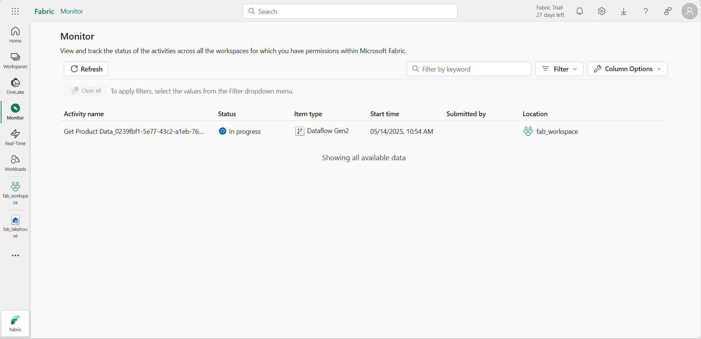

---
lab:
  title: Monitorar a atividade do Fabric no hub de monitoramento
  module: Monitoring Fabric
---

# Monitorar a atividade do Fabric no hub de monitoramento

O *hub de monitoramento* no Microsoft Fabric fornece um local central onde você pode monitorar a atividade. Você pode usar o hub de monitoramento para revisar eventos relacionados a itens que você tem permissão para exibir.

Este laboratório leva cerca de **30** minutos para ser concluído.

> **Observação**: para concluir este exercício, você precisa de um [locatário do Microsoft Fabric](https://learn.microsoft.com/fabric/get-started/fabric-trial).

## Criar um workspace

Antes de trabalhar com os dados no Fabric, crie um espaço de trabalho em um locatário com a capacidade do Fabric habilitada.

1. Na [página inicial do Microsoft Fabric](https://app.fabric.microsoft.com/home?experience=fabric) no `https://app.fabric.microsoft.com/home?experience=fabric`, selecione **Engenharia de Dados do Synapse**.
1. Na barra de menus à esquerda, selecione **Workspaces** (o ícone é semelhante a &#128455;).
1. Crie um workspace com um nome de sua escolha, selecionando um modo de licenciamento na seção **Avançado** que inclua a capacidade do Fabric (*Avaliação*, *Premium* ou *Malha*).
1. Quando o novo workspace for aberto, ele estará vazio.

    

## Criar um lakehouse

Agora que você tem um espaço de trabalho, é hora de criar um data lakehouse para seus dados.

1. Na home page da **Engenharia de Dados do Synapse**, crie um **Lakehouse** com um nome de sua escolha.

    Após alguns minutos, um lakehouse será criado:

    

1. Veja o novo lakehouse e observe que o painel do **Lakehouse Explorer** à esquerda permite que você navegue pelas tabelas e pelos arquivos no lakehouse:

    Atualmente, não há tabelas nem arquivos no lakehouse.

## Criar e monitorar um fluxo de dados

No Microsoft Fabric, você pode usar um fluxo de dados (Gen2) para ingerir dados de uma ampla variedade de fontes. Neste exercício, você usará um fluxo de dados para obter dados de um arquivo CSV e carregá-los em uma tabela no lakehouse.

1. Na **Página Inicial** do lakehouse, no menu **Obter dados**, selecione **Novo fluxo de dados Gen2**.

   Um novo fluxo de dados chamado **Dataflow 1** é criado e aberto.

    

1. No canto superior esquerdo da página de fluxo de dados, selecione **Dataflow 1** para ver os detalhes e renomear o fluxo de dados para **Obter dados do produto**.
1. No designer do fluxo de dados, selecione **Importar de um arquivo Text/CSV**. Conclua o assistente Obter Dados para criar uma conexão de dados vinculando-se a `https://raw.githubusercontent.com/MicrosoftLearning/dp-data/main/products.csv` usando autenticação anônima. Quando você concluir o assistente, uma visualização dos dados será mostrada no designer de fluxo de dados da seguinte forma:

    

1. Publique o fluxo de dados.
1. Na barra de navegação à esquerda, selecione **Monitorar** para exibir o hub de monitoramento e observe se o fluxo de dados está em andamento (caso contrário, atualize a exibição até vê-lo).

    

1. Aguarde alguns segundos e atualize a página até que o status do fluxo de dados seja **Bem-sucedido**.
1. No painel de navegação, selecione seu lakehouse. Em seguida, expanda a pasta **Tabelas** para verificar se uma tabela chamada **products** foi criada e carregada pelo fluxo de dados (talvez seja necessário atualizar a pasta **Tabelas**).

    

## Criar e monitorar um notebook do Spark

No Microsoft Fabric, você pode usar notebooks para executar o código do Spark.

1. No hub de navegação, selecione **Página Inicial**. Na página inicial de Engenharia de Dados, crie um novo **Notebook**.

    Um novo notebook chamado **Notebook 1** é criado e aberto.

    

1. No canto superior esquerdo do notebook, selecione **Notebook 1** para exibir os detalhes e altere o nome para **Query Pproducts**.
1. No editor do notebook, no painel **Explorer** , selecione **Lakehouses** e adicione o lakehouse que você criou anteriormente.
1. No menu **…** da tabela **Produtos**, selecione **Carregar dados** > **Spark**. Isso adiciona uma nova célula de código ao notebook, conforme mostrado aqui:

    

1. Selecione o botão **&#9655; Executar Tudo** para executar todas as células no notebook. Levará alguns instantes para iniciar a sessão do Spark e, em seguida, os resultados da consulta serão mostrados na célula de código.

    

1. Na barra de ferramentas, use o botão **&#9723;** (*Interromper a sessão*) para interromper a sessão do Spark.
1. Na barra de navegação, selecione **Monitorar** para exibir o hub de monitoramento e observe que a atividade do notebook está listada.

    

## Monitorar o histórico de um item

Alguns itens em um espaço de trabalho podem ser executados várias vezes. Você pode usar o hub de monitoramento para exibir o histórico de execução.

1. Na barra de navegação, retorne à página do seu espaço de trabalho. Em seguida, use o botão **&#8635;** (*Atualizar agora*) do fluxo de dados **Obter dados do produto** para executá-lo novamente.
1. No painel de navegação, selecione a página **Monitorar** para exibir o hub de monitoramento e verificar se o fluxo de dados está em andamento.
1. No menu **...** do fluxo de dados **Obter dados do produto**, selecione **Execuções históricas** para ver o histórico de execuções do fluxo de trabalho:

    

1. No menu **...** para qualquer uma das execuções históricas, selecione **Exibir detalhes** para ver os detalhes da execução.
1. Feche o painel **Detalhes** e use o botão **Voltar para a exibição principal** para retornar à página principal do hub de monitoramento.

## Personalizar exibições do hub de monitoramento

Neste exercício, você executou apenas algumas atividades, portanto, deve ser bastante fácil encontrar eventos no hub de monitoramento. No entanto, em um ambiente real, pode ser necessário pesquisar um grande número de eventos. O uso de filtros e outras personalizações de exibição pode facilitar isso.

1. No hub de monitoramento, use o botão **Filtro** para aplicar o seguinte filtro:
    - **Status**: Sucesso
    - **Tipo de item**: Fluxo de dados Gen2

    Com o filtro aplicado, somente execuções bem-sucedidas de fluxos de dados são listadas.

    

1. Use o botão **Opções de coluna** para incluir as seguintes colunas na exibição (use o botão **Aplicar** para aplicar as alterações):
    - Hora da atividade
    - Status
    - Tipo de item
    - Hora de início
    - Envio feito por
    - Location
    - Hora de término
    - Duration
    - Tipo de atualização

    Talvez seja necessário rolar horizontalmente para ver todas as colunas:

    

## Limpar os recursos

Neste exercício, você criou um lakehouse, um fluxo de dados e um notebook do Spark e usou o hub de monitoramento para exibir a atividade do item.

Se você tiver terminado de explorar seu lakehouse, exclua o workspace criado para este exercício.

1. Na barra à esquerda, selecione o ícone do workspace para ver todos os itens que ele contém.
2. No menu **…** da barra de ferramentas, selecione **Configurações do workspace**.
3. Na seção **Geral**, selecione **Remover este espaço de trabalho**.
