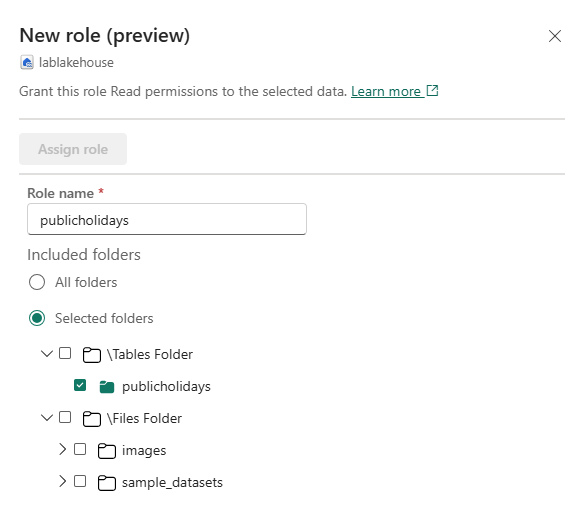
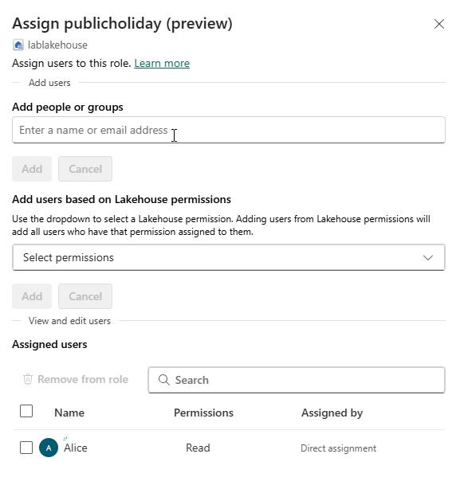

---
lab:
  title: Proteger o acesso aos dados no Microsoft Fabric
  module: Secure data access in Microsoft Fabric
---

# Proteger o acesso aos dados no Microsoft Fabric

O Microsoft Fabric tem um modelo de segurança de várias camadas para gerenciar o acesso a dados. A segurança pode ser definida para um espaço de trabalho inteiro, para itens individuais ou por meio de permissões granulares em cada mecanismo do Fabric. Neste exercício, você protegerá dados usando controles de acesso de workspace e item e funções de acesso a dados do OneLake.

Esse laboratório leva cerca de **45** minutos para ser concluído.

## Criar um workspace

Antes de trabalhar com os dados no Fabric, crie um workspace com a avaliação do Fabric habilitada.

1. Navegue até a [home page do Microsoft Fabric](https://app.fabric.microsoft.com/home?experience=fabric) em `https://app.fabric.microsoft.com/home?experience=fabric` em um navegador e entre com suas credenciais do Fabric.
1. Na barra de menus à esquerda, selecione **Workspaces** (o ícone é semelhante a &#128455;).
1. Crie um workspace com um nome de sua escolha selecionando um modo de licenciamento que inclua a capacidade do Fabric (*Avaliação*, *Premium* ou *Malha*).
1. Quando o novo workspace for aberto, ele estará vazio.

    

> **Observação**: Ao criar um workspace, você se torna automaticamente um membro da função de Administrador do Workspace.

## Criar um data warehouse

Em seguida, crie um data warehouse no workspace que você criou:

1. Clique em **+ Novo Item**. Na página *Novo item*, na seção *Armazenar dados*, selecione **Depósito de amostras** e crie um novo data warehouse com um nome de sua escolha.

     Após alguns minutos, um warehouse será criado:

    

## Criar um lakehouse
Em seguida, crie um lakehouse no workspace criado.

1. Na barra de menus à esquerda, selecione **Workspaces** (o ícone é semelhante a 🗇).
2. Selecione o workspace que você criou.
3. No espaço de trabalho, clique no botão **+ Novo item** e escolha **Lakehouse**. Crie um novo lakehouse com um nome de sua escolha.

   Após alguns minutos, um lakehouse será criado:

    

4. Selecione o bloco **Start with sample data** e selecione a amostra **Public holidays**. Depois de mais ou menos um minuto, o lakehouse será preenchido com dados.

## Aplicar controles de acesso do workspace

As funções de espaço de trabalho são usadas para controlar o acesso aos espaços de trabalho e o conteúdo dentro deles. As funções do workspace podem ser atribuídas quando os usuários precisam ver todos os itens em um workspace, quando precisam gerenciar o acesso ao workspace ou criar novos itens do Fabric ou quando precisam de permissões específicas para visualizar, modificar ou compartilhar conteúdo no workspace.  

Neste exercício, você adicionará um usuário a uma função do workspace, aplicará permissões e verá o que pode ser exibido quando cada conjunto de permissões é aplicado. Você abrirá dois navegadores e entrará como usuários diferentes. Em um navegador, você será **Administrador do workspace** e, no outro, entrará como um segundo usuário com menos privilégios. Em um navegador, o Administrador do workspace alterará as permissões para o segundo usuário e, no segundo navegador, você poderá ver os efeitos da alteração das permissões.  

1. Na barra de menus à esquerda, selecione **Workspaces** (o ícone é semelhante a &#128455;).
2. Em seguida, selecione o workspace que você criou.
3. No topo da tela, clique em **Gerenciar acesso**.

> **Observação**: você verá o usuário com o qual entrou, que é membro da função **Administrador do workspace** porque você criou o workspace. Nenhum outro usuário recebeu acesso ao workspace ainda.

4. Em seguida, você verá o que um usuário sem permissões no workspace pode visualizar. No navegador, abra uma janela InPrivate. No navegador Microsoft Edge, clique na reticência no canto superior direito e escolha **Nova Janela InPrivate**.
5. Insira https://app.fabric.microsoft.com e entre como o segundo usuário que você está usando para teste.  
6. No canto inferior esquerdo da tela, selecione **Microsoft Fabric** e, em seguida, **Data Warehouse**. Em seguida, selecione **Workspaces** (o ícone é semelhante a &#128455;).  

> **Observação:** o segundo usuário não tem acesso ao workspace e, por isso, não pode ser visualizado.

7. Em seguida, você atribuirá a função **Visualizador do workspace** ao segundo usuário e verá que a função concede acesso de leitura ao warehouse no workspace.  
8. Retorne à janela do navegador em que você entrou como administrador do workspace. Verifique se você ainda está na página que mostra o workspace que você criou. Os novos itens do workspace, bem como o warehouse e lakehouse de amostra, estarão listados na parte inferior da página.
9. Selecione **Gerenciar acesso** na parte superior direita da tela.
10. Selecione **Adicionar pessoas ou grupos**. Digite o email do segundo usuário com o qual você está testando. Selecione **Adicionar** para atribuir o usuário à função **Visualizador do workspace**.
11. Retorne à janela do navegador InPrivate em que você entrou como o segundo usuário e clique no botão Atualizar no navegador para atualizar as permissões de sessão atribuídas ao segundo usuário.
12. Clique no ícone **Workspaces** na barra de menu à esquerda (o ícone é semelhante a &#128455;) e selecione o nome do workspace que você criou como o usuário Administrador do workspace. O segundo usuário agora pode ver todos os itens no workspace porque recebeu a função **Visualizador do workspace**.

    

13. Clique no warehouse para abri-lo.
14. Clique na tabela a tabela **Data** e aguarde o carregamento das linhas. Você pode ver as linhas porque, como membro da função Visualizador do workspace, você tem as permissões CONNECT e ReadData nas tabelas do warehouse. Para mais informações sobre permissões concedidas à função Visualizador do workspace, consulte [Funções do workspace](https://learn.microsoft.com/en-us/fabric/data-warehouse/workspace-roles).
15. Em seguida, clique no ícone **Workspaces** na barra de menu à esquerda e selecione o lakehouse.
16. Quando o lakehouse for aberto, clique na caixa suspensa no canto superior direito da tela que diz **Lakehouse** e escolha **Ponto de extremidade de análise do SQL**.
17. Escolha a tabela **publicholidays** e aguarde a exibição dos dados. Os dados na tabela lakehouse podem ser lidos no ponto de extremidade de análise do SQL porque o usuário é membro da função Visualizador do workspace que concede permissões de leitura no ponto de extremidade de análise do SQL.

## Aplicar controle de acesso a itens

As permissões de item controlam o acesso a itens individuais do Fabric em um workspace, como warehouses, lakehouses e modelos semânticos. Neste exercício, você removerá as permissões **Visualizador do workspace** aplicadas no exercício anterior e, em seguida, aplicará permissões no nível do item no warehouse para que um usuário com menos privilégios possa visualizar apenas os dados do warehouse, não os dados do lakehouse.

1. Retorne à janela do navegador em que você entrou como Administrador do workspace. Clique em **Workspaces** no painel de navegação à esquerda. 
2. Escolha o workspace criado para abri-lo.
3. No parte superior da tela, clique em **Gerenciar acesso**.
4. Clique na palavra **Visualizador** debaixo do nome do segundo usuário. No menu exibido, clique em **Remover**.

   

5. Feche a seção **Gerenciar acesso**.
6. No workspace, passe o mouse sobre o nome do seu warehouse e uma elipse (**...**) será exibida. Clique na elipse e em **Gerenciar permissões**.

7. Clique em **Adicionar usuário** e insira o nome do segundo usuário. 
8. Na caixa exibida, em **Permissões adicionais**, marque **Ler todos os dados usando SQL (ReadData)** e desmarque todas as outras caixas.

    

9. Clique em **Conceder**.

10. Retorne à janela do navegador em que você entrou como o segundo usuário. Atualize a exibição do navegador.

11. O segundo usuário não tem mais acesso ao workspace, mas tem acesso apenas ao warehouse. Você não pode mais procurar workspaces no painel de navegação à esquerda para localizar o warehouse. Clique em **OneLake** no menu de navegação à esquerda para localizar o warehouse. 

12. Clique no warehouse. Na tela exibida, clique em **Abrir** na barra de menus superior.

13. Quando a exibição do warehouse aparecer, escolha a tabela **Data** para exibir os dados da tabela. As linhas podem ser visualizadas porque o usuário ainda tem acesso de leitura ao warehouse porque as permissões ReadData foram aplicadas usando permissões de item no warehouse.

## Aplicar funções de acesso a dados do OneLake em um lakehouse

As funções de acesso a dados do OneLake permitem que você crie funções personalizadas em um lakehouse e conceda permissões de leitura às pastas especificadas. Atualmente, as funções de acesso a dados do OneLake são um recurso de visualização.

Neste exercício, você atribuirá uma permissão de item e criará uma função de acesso a dados do OneLake e testará como eles funcionam juntos para restringir o acesso aos dados em um lakehouse.  

1. Permaneça no navegador em que você entrou como o segundo usuário.  
2. Clique em **OneLake** na barra de navegação à esquerda. O segundo usuário não vê o lakehouse.  
3. Retorne ao navegador em que você entrou como administrador do workspace.
4. No menu à esquerda, em APIs, clique em **Workspaces** e escolha seu workspace. Passe o mouse sobre o nome do lakehouse.  
5. Clique na reticência (**...**) à direita da reticência e clique em **Gerenciar permissões**

      

6. Na tela exibida, clique em **Adicionar usuário**. 
7. Atribua o segundo usuário ao lakehouse e certifique-se de que nenhuma das caixas de seleção na janela **Conceder acesso às pessoas** esteja marcada.  

      

8. Selecionar **Conceder**. O segundo usuário agora tem permissões de leitura no lakehouse. A permissão Leitura permite que o usuário veja apenas os metadados do lakehouse, mas não os dados subjacentes. Validaremos isso na sequência.
9. Retorne ao navegador em que você entrou como o segundo usuário. Atualize o navegador.
10. No painel de navegação à esquerda, escolha **OneLake**.  
11. Clique no lakehouse e abra-o. 
12. Clique em **Abrir** na barra de menu superior. Não é possível expandir as tabelas ou arquivos, mesmo que a permissão de leitura tenha sido concedida. Em seguida, você concederá ao segundo usuário acesso a uma pasta específica usando permissões de acesso a dados do OneLake.
13. Retorne ao navegador em que você entrou como administrador do workspace.
14. Clique em **Workspaces** na barra de navegação à esquerda.
15. Clique no nome do seu workspace.
16. Escolha o lakehouse.
1. Quando o lakehouse abrir, clique em **Gerenciar acesso a dados do OneLake** na barra de menu superior e ative o recurso clicando no botão **Continuar**.

      

14. Escolha a nova função na tela **Gerenciar acesso a dados do OneLake (versão prévia)** exibida.
  
      

15. Crie uma nova função chamada **publicholidays** que só pode acessar a pasta publicholidays, conforme mostrado na captura de tela abaixo.

      

16. Quando a função terminar de ser criada, clique em **Atribuir função** e atribua a função ao segundo usuário, clique em **Adicionar** e em **Salvar**.
 
       

17. Retorne ao navegador em que você entrou como o segundo usuário. Certifique-se de que você ainda está na página em que o lakehouse está aberto. Atualize o navegador.  
18. Escolha a tabela **publicholidays** e aguarde o carregamento dos dados. Somente os dados na tabela publicholidays podem ser acessados pelo usuário porque o usuário foi atribuído à função personalizada de acesso a dados do OneLake. A função permite que o usuário veja apenas os dados na tabela publicholidays, não os dados em nenhuma das outras tabelas, arquivos ou pastas.

## Limpar os recursos

Neste exercício, você protegeu dados usando controles de acesso ao workspace, controles de acesso a itens e funções de acesso a dados do OneLake.

1. Na barra de navegação à esquerda, selecione o ícone do workspace para ver todos os itens que ele contém.
2. No menu da barra de ferramentas superior, selecione **Configurações do workspace**.
3. Na seção **Geral**, selecione **Remover este espaço de trabalho**.
