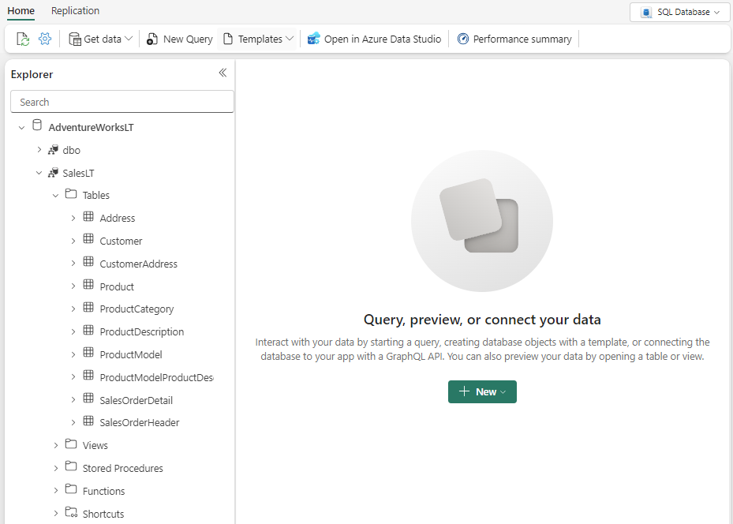

---
lab:
  title: Trabalhar com a API para GraphQL no Microsoft Fabric
  module: Get started with GraphQL in Microsoft Fabric
---

# Trabalhar com a API para GraphQL no Microsoft Fabric

A API do Microsoft Fabric para GraphQL é uma camada de acesso a dados que permite a consulta rápida e eficiente de várias fontes de dados com uma tecnologia de API amplamente adotada e familiar. A API permite abstrair as especificidades das fontes de dados de back-end para que você possa se concentrar na lógica do aplicativo e fornecer todos os dados de que um cliente precisa em uma única chamada. O GraphQL usa uma linguagem de consulta simples e conjuntos de resultados facilmente manipulados, o que minimiza o tempo necessário para que os aplicativos acessem seus dados no Fabric.

Este laboratório levará aproximadamente **30** minutos para ser concluído.

> **Observação**: Você precisará uma [avaliação gratuita do Microsoft Fabric](https://learn.microsoft.com/fabric/get-started/fabric-trial) para concluir esse exercício.

## Criar um workspace

Antes de trabalhar com os dados no Fabric, crie um workspace com a avaliação do Fabric habilitada.

1. Navegue até a [home page do Microsoft Fabric](https://app.fabric.microsoft.com/home?experience=fabric) em `https://app.fabric.microsoft.com/home?experience=fabric` em um navegador e entre com suas credenciais do Fabric.
1. Na barra de menus à esquerda, selecione **Novo workspace**.
1. Crie um workspace com um nome de sua escolha selecionando um modo de licenciamento que inclua a capacidade do Fabric (*Avaliação*, *Premium* ou *Malha*).
1. Quando o novo workspace for aberto, ele estará vazio.

    

## Criar um banco de dados SQL com dados de exemplo

Agora que você tem um workspace, é hora de criar um banco de dados SQL.

1. Na barra de menus à esquerda, selecione **Criar**. Na página *Novo*, na seção *Bancos de dados*, selecione **Banco de dados SQL**.

    >**Observação**: se a opção **Criar** não estiver fixada na barra lateral, você precisará selecionar a opção de reticências (**...**) primeiro.

1. Insira **AdventureWorksLT** como o nome do banco de dados e clique em **Criar**.
1. Depois de criar o banco de dados, você poderá carregar os dados de amostra no banco de dados com o cartão **Dados de amostra**.

    Depois de mais ou menos um minuto, seu banco de dados será preenchido com dados de amostra para seu cenário.

    

## Consultar um banco de dados SQL

O editor de consulta SQL dá suporte para IntelliSense, preenchimento de código, realce de sintaxe, análise no lado do cliente e validação. Você pode executar instruções de DDL (Linguagem de Definição de Dados), DML (Linguagem de Manipulação de Dados) e DCL (Linguagem de Controle de Dados).

1. Na página do banco de dados **AdventureWorksLT**, navegue até **Página Inicial** e clique em **Nova consulta**.
1. No novo painel de consulta em branco, insira e execute o seguinte código T-SQL.

    ```sql
    SELECT 
        p.Name AS ProductName,
        pc.Name AS CategoryName,
        p.ListPrice
    FROM 
        SalesLT.Product p
    INNER JOIN 
        SalesLT.ProductCategory pc ON p.ProductCategoryID = pc.ProductCategoryID
    ORDER BY 
    p.ListPrice DESC;
    ```
    
    Essa consulta une as tabelas `Product` e `ProductCategory` para exibir os nomes dos produtos, suas categorias e seus preços de lista, classificados por preço em ordem decrescente.

1. Feche todas as guias de consulta.

## Criar uma API para GraphQL

Primeiro, você configurará um ponto de extremidade do GraphQL para expor os dados da ordem de venda. Esse ponto de extremidade permitirá que você consulte pedidos de venda com base em vários parâmetros, como data, cliente e produto.

1. No portal do Fabric, navegue até seu espaço de trabalho e selecione **+ Novo item**.
1. Navegue até a seção **Desenvolver dados** e selecione **API para GraphQL**.
1. Forneça um nome e selecione **Criar**.
1. Na página principal da API para GraphQL, selecione **Selecionar fonte de dados**.
1. Se solicitado a escolher uma opção de conectividade, selecione **Conectar a fontes de dados do Fabric com autenticação de SSO (logon único)**.
1. Na página **Escolher os dados que deseja conectar**, selecione o banco de dados `AdventureWorksLT` criado anteriormente.
1. Selecione **Conectar**.
1. Na página **Escolher dados**, selecione a tabela `SalesLT.Product`. 
1. Visualize os dados e selecione **Carregar**.
1. Selecione **Copiar ponto de extremidade** e anote o link da URL pública. Não precisamos disso, mas é aqui que você iria copiar seu endereço de API.

## Desativar mutações

Agora que nossa API foi criada, queremos apenas expor os dados de vendas para operações de leitura neste cenário.

1. No **Gerenciador de esquemas** da API para GraphQL, expanda **Mutações**.
1. Selecione **...** (reticências) ao lado de cada mutação e selecione **Desativar**.

Isso impedirá modificações ou atualizações nos dados por meio da API. Isso significa que os dados serão somente leitura e os usuários só poderão exibir ou consultar os dados, mas não fazer nenhuma alteração neles.

## Consultar dados usando o GraphQL

Agora, vamos consultar os dados usando o GraphQL para encontrar todos os produtos cujos nomes começam com *"HL Road Frame".*

1. No editor de consultas GraphQL, insira a consulta a seguir.

```json
query {
  products(filter: { Name: { startsWith: "HL Road Frame" } }) {
    items {
      ProductModelID
      Name
      ListPrice
      Color
      Size
      ModifiedDate
    }
  }
}
```

Nessa consulta, products é o tipo principal e inclui campos para `ProductModelID`, `Name`, `ListPrice`, `Color`, `Size` e `ModifiedDate`. Essa consulta retornará uma lista de produtos cujos nomes começam com *"HL Road Frame."*.

> **Mais informações**: Consulte [O que é a API Microsoft Fabric para GraphQL?](https://learn.microsoft.com/fabric/data-engineering/api-graphql-overview) na documentação do Microsoft Fabric para saber mais sobre outros componentes disponíveis na plataforma.

Neste exercício, você criou, consultou e expôs dados de um banco de dados SQL usando o GraphQL no Microsoft Fabric.

## Limpar os recursos

Se você tiver terminado de explorar seu banco de dados, exclua o workspace criado para este exercício.

1. Na barra à esquerda, selecione o ícone do workspace para ver todos os itens que ele contém.
2. No menu **…** da barra de ferramentas, selecione **Configurações do workspace**.
3. Na seção **Geral**, selecione **Remover este espaço de trabalho**.

