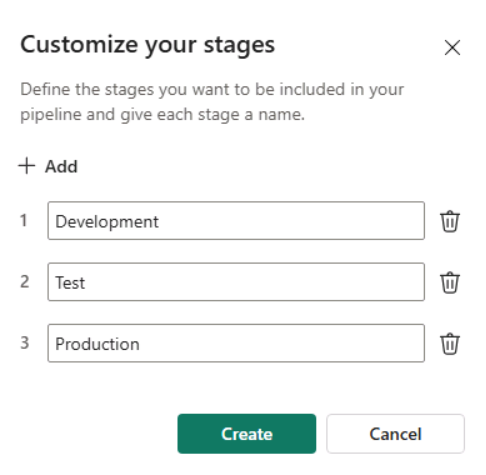
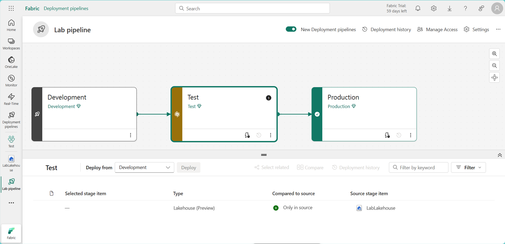

---
lab:
  title: Implementar pipelines de implantação no Microsoft Fabric
  module: Implement CI/CD in Microsoft Fabric
---

# Implementar pipelines de implantação no Microsoft Fabric

Os pipelines de implantação no Microsoft Fabric permitem automatizar o processo de cópia de alterações realizadas no conteúdo de itens do Fabric entre ambientes como desenvolvimento, teste e produção. Você pode usar pipelines de implantação para desenvolver e testar conteúdo antes que chegue aos usuários finais. Neste exercício, você criará um pipeline de implantação e atribuirá estágios ao pipeline. Em seguida, você criará algum conteúdo em um workspace de desenvolvimento e usará pipelines de implantação para implantá-lo entre os estágios do pipeline de Desenvolvimento, Teste e Produção.

> **Observação**: para concluir este exercício, você precisa ser membro da função de administrador do workspace do Fabric. Para atribuir funções, consulte [Funções em workspaces no Microsoft Fabric](https://learn.microsoft.com/en-us/fabric/get-started/roles-workspaces).

Esse laboratório leva cerca de **20** minutos para ser concluído.

## Criar espaços de trabalho

Criar três workspaces com a avaliação do Fabric habilitada.

1. Na [página inicial do Microsoft Fabric](https://app.fabric.microsoft.com/home?experience=fabric), em `https://app.fabric.microsoft.com/home?experience=fabric`, selecione **Microsoft Fabric** e **Engenharia de Dados** na barra de menus inferior esquerda.
2. Na barra de menus à esquerda, selecione **Workspaces** (o ícone é semelhante a &#128455;).
3. Crie um novo workspace chamado Desenvolvimento, selecionando um modo de licenciamento que inclua a capacidade do Fabric (*Avaliação*, *Premium* ou *Fabric*).
4. Repita as etapas 1 e 2, criando mais dois workspaces chamados Teste e Produção. Os workspaces são: Desenvolvimento, Teste e Produção.
5. Selecione o ícone **Workspaces** na barra de menus à esquerda e confirme se há três workspaces nomeados: Desenvolvimento, Teste e Produção

> **Observação**: se receber uma solicitação para inserir um nome exclusivo para os workspaces, acrescente um ou mais números aleatórios às palavras: Desenvolvimento, Teste ou Produção.

## Criar um pipeline de implantação

Em seguida, crie um pipeline de implantação.

1. Na barra de menus à esquerda, selecione **Espaços de Trabalho**.
2. Selecione **Pipelines de Implantação** e **Novo pipeline**.
3. Na janela **Adicionar um novo pipeline de implantação**, dê um nome exclusivo ao pipeline.
4. Aceite os padrões na janela **Personalizar seus estágios**.  

   

5. Selecione **Criar**.

## Atribuir workspaces a estágios de um pipeline de implantação

Atribua workspaces a estágios do pipeline de implantação.

1. Na barra de menus à esquerda, selecione o pipeline que você criou. 
2. Na janela exibida, escolha a palavra **Selecionar** em cada estágio de implantação e selecione o nome do workspace que corresponde ao nome do estágio.
3. Selecione **Atribuir um workspace** para cada estágio de implantação.

  

## Criar conteúdo

Os itens do Fabric ainda não foram criados nos workspaces. Em seguida, crie um lakehouse no workspace de desenvolvimento.

1. Na barra de menus à esquerda, selecione **Espaços de Trabalho**.
2. Selecione o workspace **Desenvolvimento**.
3. Selecione **Novo Item**
4. Na janela exibida, selecione **Lakehouse** e, na **janela Novo lakehouse**, nomeie o lakehouse: **"LabLakehouse"**.
5. Selecione **Criar**.
6. Na janela Lakehouse Explorer, selecione **Iniciar com dados de exemplo** para preencher o novo lakehouse com dados.

  

8. Na barra de menus à esquerda, selecione o pipeline criado.
9. No estágio de **Desenvolvimento**, selecione **>** até ver **Lakehouses**. O lakehouse aparece como novo conteúdo no estágio de Desenvolvimento. Entre os estágios de **Desenvolvimento** e **Teste**, há um **X** laranja dentro de um círculo. O ** X** laranja indica que os estágios de Desenvolvimento e Teste não estão sincronizados.
10. Selecione a seta para baixo abaixo do **X** laranja para comparar o conteúdo nos ambientes de Desenvolvimento e Teste. Selecione **Comparar**. O LabLakehouse só existe no estágio de Desenvolvimento.  

  

## Implantar conteúdo entre estágios

Implante o lakehouse do estágio de **Desenvolvimento** para os estágios de **Teste** e **Produção**.
1. Selecione o botão **Implantar** no estágio de **Desenvolvimento** do pipeline para copiar o lakehouse em seu estado atual para o estágio de texto. 
2. Na janela **Implantar no próximo estágio**, selecione **Implantar**.
3. Há um X laranja entre os estágios de Teste e Produção. Selecione a seta voltada para baixo abaixo do X laranja. O lakehouse existe nos estágios de Desenvolvimento e Teste, mas ainda não no estágio de Produção.
4. No estágio de **Teste**, selecione **Implantar**.
5. Na janela **Implantar no próximo estágio**, selecione **Implantar**. A marca de seleção verde entre os estágios indica que todos os estágios estão sincronizados e contêm o mesmo conteúdo.
6. O uso de pipelines de implantação para implantar entre estágios também atualiza o conteúdo nos workspaces correspondentes ao estágio de implantação. Vamos confirmar.
7. Na barra de menus à esquerda, selecione **Espaços de Trabalho**.
8. Selecione o workspace **Teste**. O lakehouse foi copiado lá.
9. Abra o workspace **Produção** no ícone **Workspaces** do menu à esquerda. O lakehouse também foi copiado para o workspace de Produção.

## Limpar

Neste exercício, você criou um pipeline de implantação e atribuiu estágios ao pipeline. Em seguida, você criou conteúdo em um workspace de desenvolvimento e o implantou entre os estágios do pipeline usando pipelines de implantação.

- Na barra de navegação à esquerda, selecione o ícone de cada workspace para ver todos os itens que contêm.
- No menu da barra de ferramentas superior, selecione Configurações do workspace.
- Na seção Geral, selecione Remover este espaço de trabalho.