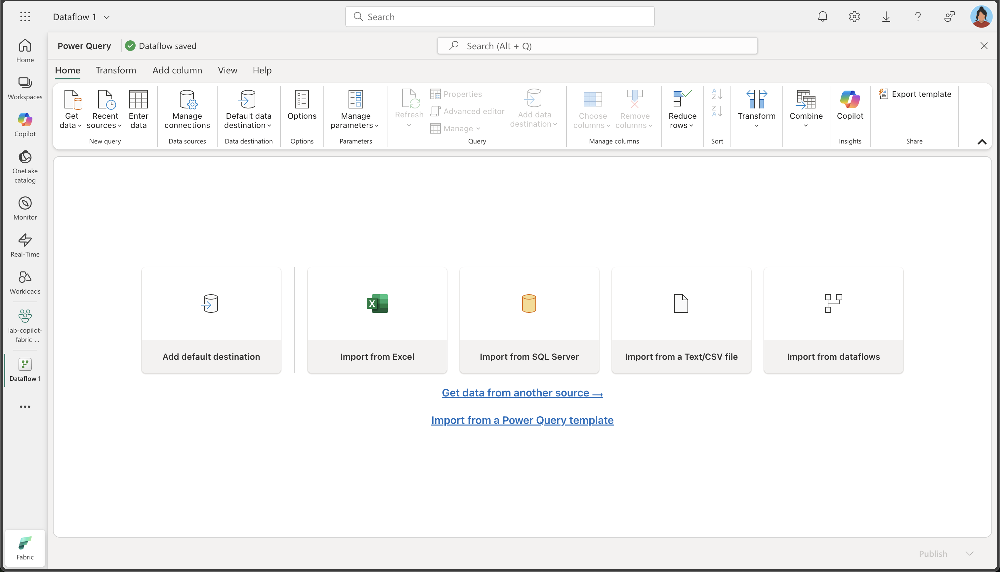
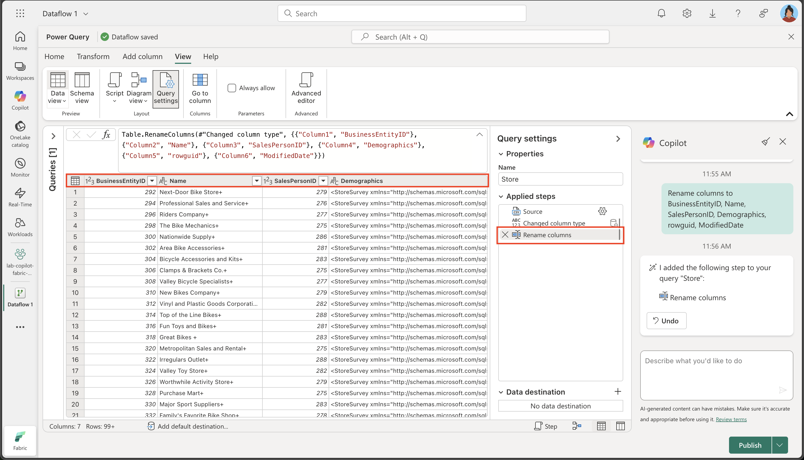
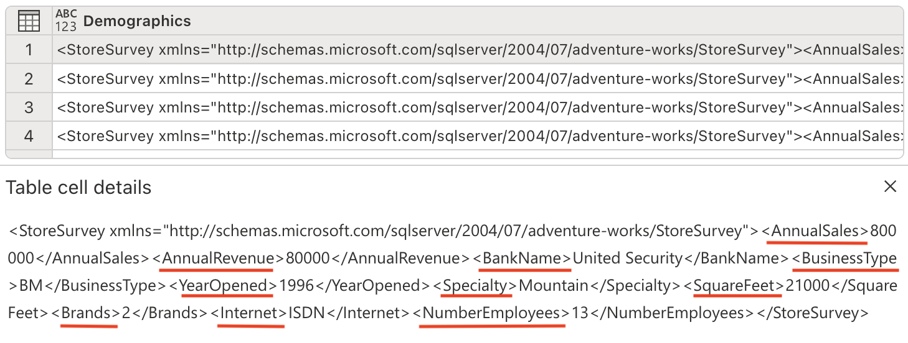
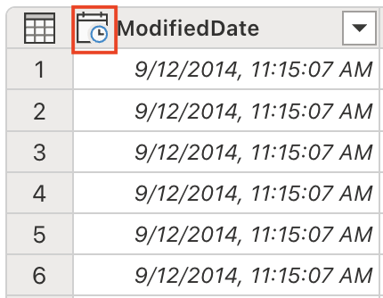
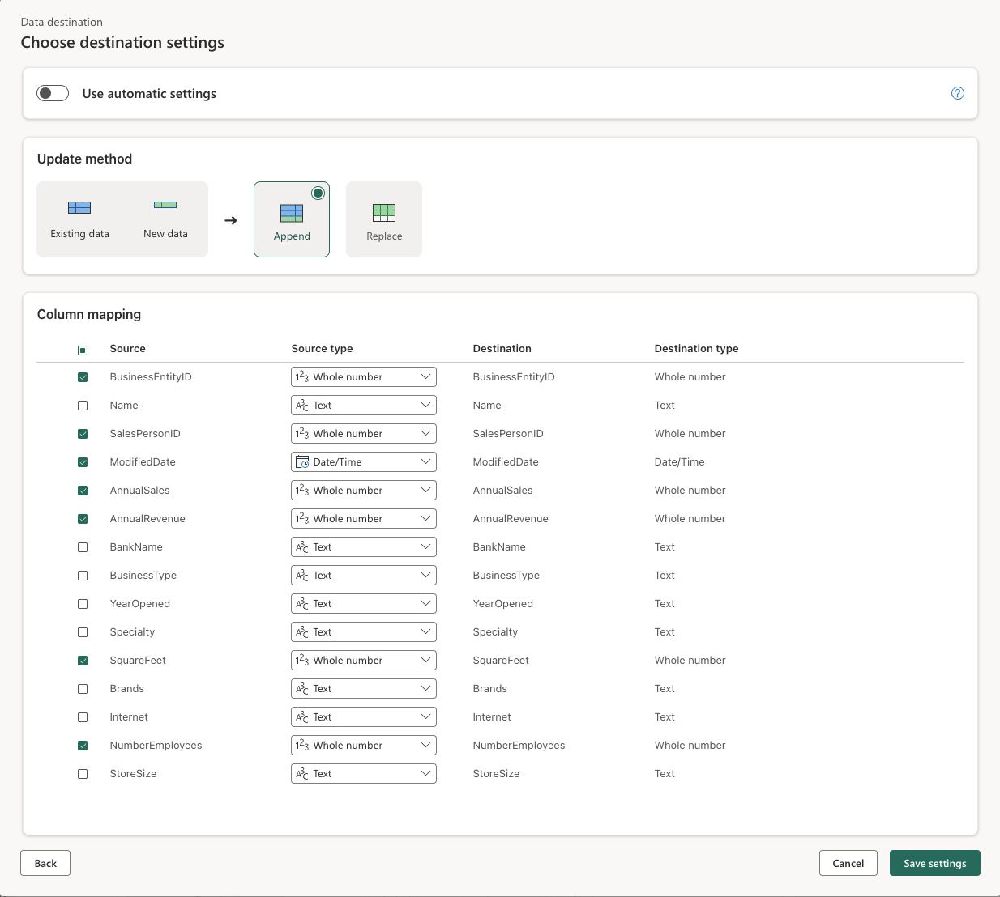

---
lab:
  title: Trabalhar de modo mais inteligente com o Copilot no Dataflow Gen2 do Microsoft Fabric
  module: Get started with Copilot in Fabric for data engineering
---

# Trabalhar de modo mais inteligente com o Copilot no Dataflow Gen2 do Microsoft Fabric

No Microsoft Fabric, os Fluxos de Dados (Gen2) se conectam a várias fontes de dados e executam transformações no Power Query Online. Em seguida, eles podem ser usados em pipelines de dados para ingerir dados em um lakehouse ou em outro repositório analítico ou para definir um conjunto de dados para um relatório do Power BI. Este laboratório apresenta uma introdução ao Copilot em Fluxos de Dados (Gen2), em vez de se concentrar na criação de uma solução empresarial complexa.

Este exercício deve levar aproximadamente **30** minutos para ser concluído.

## O que você aprenderá

Ao concluir este laboratório, você vai:

- Entender como usar o Copilot no Microsoft Fabric Dataflow Gen2 para acelerar as tarefas de transformação de dados.
- Saber como ingerir, limpar e transformar dados usando o Power Query Online com a assistência do Copilot.
- Aplicar as práticas recomendadas para a qualidade dos dados, incluindo renomear colunas, remover caracteres indesejados e definir tipos de dados apropriados.
- Obter experiência na análise e na expansão de dados XML em um fluxo de dados.
- Categorizar dados contínuos em grupos relevantes para análise.
- Publicar dados transformados em um lakehouse e validar os resultados.
- Reconhecer o valor da engenharia de dados assistida por IA para melhorar a produtividade e a qualidade dos dados.

## Antes de começar

Você precisa de uma [Capacidade do Microsoft Fabric (F2 ou superior)](https://learn.microsoft.com/fabric/fundamentals/copilot-enable-fabric) com Copilot habilitado para concluir este exercício.

## Cenário do exercício

A Contoso, uma empresa de varejo global, está modernizando sua infraestrutura de dados usando o Microsoft Fabric. Como engenheiro de dados, você é encarregado de preparar informações do repositório para análise. Os dados brutos são armazenados em um arquivo CSV e incluem campos XML inseridos, nomes de coluna inconsistentes e caracteres indesejados. Sua meta é usar o Copilot no Dataflow Gen2 para ingerir, limpar, transformar e enriquecer esses dados, preparando-os para relatórios e análises no lakehouse. Este exercício prático orientará você em cada etapa, demonstrando como o Copilot acelera e simplifica tarefas comuns de engenharia de dados.

## Criar um workspace

Antes de trabalhar com os dados no Fabric, crie um workspace com o Fabric habilitado. Um workspace serve como um contêiner para todos os itens do Fabric e fornece recursos de colaboração para equipes.

1. Navegue até a [home page do Microsoft Fabric](https://app.fabric.microsoft.com/home?experience=fabric) em `https://app.fabric.microsoft.com/home?experience=fabric` em um navegador e entre com suas credenciais do Fabric.

1. Na barra de menus à esquerda, selecione **Workspaces** (o ícone é semelhante a &#128455;).

1. Crie um workspace com um nome de sua escolha selecionando um modo de licenciamento que inclua a capacidade do Fabric (*Premium* ou *Fabric*). Observe que não há suporte para *Avaliação*.

    > **Importante**: os recursos do Copilot no Fabric exigem uma capacidade paga (F2 ou superior). Os workspaces de avaliação não dão suporte à funcionalidade do Copilot.

1. Quando o novo workspace for aberto, ele estará vazio.

    

## Criar um lakehouse

Agora que você tem um espaço de trabalho, é hora de criar um data lakehouse no qual você ingerirá os dados.

1. Na barra de menus à esquerda, selecione **Criar**. Na página *Novo*, na seção *Engenharia de Dados*, selecione **Lakehouse**. Dê um nome exclusivo de sua preferência.

    >**Observação**: se a opção **Criar** não estiver fixada na barra lateral, você precisará selecionar a opção de reticências (**...**) primeiro.

    Após alguns minutos, um lakehouse vazio será criado.

    

## Criar um Fluxo de Dados (Gen2) para ingerir dados

Agora que você tem um lakehouse, você precisa ingerir alguns dados nele. Uma forma de fazer isso é definir um fluxo de dados que encapsula um processo de ETL (*extração, transformação e carregamento*).

1. Na home page do seu workspace, selecione **Obter dados** > **Novo Fluxo de Dados Gen2**. Após alguns segundos, o editor do Power Query do novo fluxo de dados será aberto, conforme mostrado aqui.

    

1. Selecione **Importar de um arquivo de Texto/CSV** e crie uma fonte de dados com as seguintes configurações:

   - **Vincular ao arquivo**: *Selecionado*
   - **Caminho ou URL do arquivo**: `https://raw.githubusercontent.com/MicrosoftLearning/mslearn-fabric/refs/heads/main/Allfiles/Labs/22a/Store.csv`
   - **Conexão**: crie uma conexão
   - **gateway de dados**: (nenhum)
   - **Tipo de autenticação**: Anônimo
   - **Nível de privacidade**: Nenhum

1. Selecione **Avançar** para visualizar os dados do arquivo e **Criar** para criar a fonte de dados. O editor do Power Query mostra a fonte de dados e um conjunto inicial de etapas de consulta para formatar os dados, conforme mostrado aqui:

    

1. Na guia de faixa de opções **Início**, no grupo **Insights**, selecione **Copilot** como mostrado aqui:
    
    

1. No momento, os nomes de coluna são muito genéricos e não têm significado claro (provavelmente mostrados como Column1, Column2 etc.). Nomes de coluna relevantes são cruciais para a compreensão dos dados e o processamento downstream. Use o prompt a seguir para refiná-los e garantir que transmitam as informações desejadas com precisão:

    ```copilot-prompt
    Rename columns to BusinessEntityID, Name, SalesPersonID, Demographics, rowguid, ModifiedDate
    ```

    Observe que os nomes de coluna agora são precisos e descritivos. Além disso, uma etapa adicional foi incorporada à lista etapas aplicadas, mostrando como o Copilot gera automaticamente código M do Power Query nos bastidores:
    
    

1. Determinadas colunas contêm um caractere '+' no final dos valores de texto. Esse é um problema comum de qualidade de dados que pode interferir na análise de dados e no processamento downstream. 

    
    
    Vamos eliminar esses caracteres indesejados usando o seguinte prompt:
    
    ```copilot-prompt
    Delete the last character from the columns Name, Demographics, rowguid
    ```
    
    **Por que isso importa**: a remoção de caracteres desnecessários garante a consistência dos dados e evita problemas ao executar operações de cadeia de caracteres ou junções de dados mais adiante no processo.

1. A tabela contém algumas colunas redundantes que precisam ser removidas para simplificar o conjunto de dados e melhorar a eficiência do processamento. Use o seguinte prompt para refinar os dados adequadamente:

    
    
    ```copilot-prompt
    Remove the rowguid and Column7 columns
    ```
    
    **Observação**: a coluna `rowguid` normalmente é usada para operações internas de banco de dados e não é necessária para análise. `Column7` parece ser uma coluna vazia ou irrelevante que não agregar valor algum ao conjunto de dados.
    
1. A coluna Dados demográfico inclui um caractere Unicode invisível, a BOM (Marca de Ordem de Byte) \ufeff, que interfere na análise de dados XML. Precisamos removê-lo para garantir o processamento adequado. Insira o seguinte prompt no painel Copilot:

    ```copilot-prompt
    Remove the Byte Order Mark (BOM) \ufeff from the Demographics column
    ```
    
    **Noções básicas sobre BOM**: a Marca de Ordem de Byte é um caractere Unicode que pode aparecer no início dos arquivos de texto para indicar a ordem de byte da codificação de texto. Embora seja útil para a detecção de codificação de arquivos, ela pode causar problemas ao analisar dados estruturados como XML.
    
    Observe a fórmula gerada para remover o caractere:
    
    
    
1. Agora estamos preparados para analisar os dados XML e expandi-los para colunas separadas. A coluna Dados demográficos contém dados formatados em XML com informações valiosas do repositório, como vendas anuais, imagens quadradas e outras métricas de negócios.

    
    
    Insira o seguinte prompt no painel Copilot:
    
    ```copilot-prompt
    Parse this XML and expand it's columns
    ```
    
    **Noções básicas sobre análise XML**: XML (linguagem de marcação eXtensible) é um formato de dados estruturados comumente usado para armazenar informações hierárquicas. Ao analisar e expandir o XML, convertemos dados aninhados em uma estrutura simples e tabular mais fácil de analisar.
    
    Observe que novas colunas foram adicionadas à tabela (talvez seja necessário rolar para a direita).
    
    

1. Remova a coluna Demografia, já que não precisamos mais dela, pois extraímos todas as informações valiosas para colunas separadas. Insira o seguinte prompt no painel Copilot:

    ```copilot-prompt
    Remove the Demographics column.
    ```

    **Por que remover essa coluna**: agora que analisamos o XML e criamos colunas individuais para cada informação, a coluna Dados Demográficos original que contém o XML bruto é redundante e pode ser removida com segurança para manter o conjunto de dados limpo.

1. A coluna ModifiedDate tem um e comercial (&) no final de seus valores. Ela precisa ser removida antes da análise para garantir o processamento de dados adequado.

    
    
    Insira o seguinte prompt no painel Copilot:
    
    ```copilot-prompt
    Remove the last character from the ModifiedDate
    ```

1. Agora estamos prontos para converter seu tipo de dados em DateTime para análise e operações de data/hora adequadas. Insira o seguinte prompt no painel Copilot:

    ```copilot-prompt
    Set the data type to DateTime
    ```

    **Importância do tipo de dados**: converter no tipo de dados correto é crucial para habilitar a classificação, a filtragem e os cálculos baseados em data adequados na análise downstream.

    Observe que o tipo de dados ModifiedDate foi alterado para DateTime:
    
    
    
1. Ajuste os tipos de dados de várias colunas para valores numéricos para habilitar operações matemáticas e agregações adequadas. Insira o seguinte prompt no painel Copilot:

    ```copilot-prompt
    Set the data type to whole number for the following columns: AnnualSales, AnnualRevenue, SquareFeet, NumberEmployee
    ```
    
    **Por que converter em números**: ter tipos de dados numéricos permite cálculos matemáticos adequados, agregações (soma, média etc.) e análise estatística que dados baseados em texto não possibilitariam.
    
1. O campo SquareFeet contém valores numéricos de 6.000 a 80.000. Criar agrupamentos categóricos de dados numéricos contínuos é uma técnica analítica comum que facilita a interpretação e a análise dos dados.

    
    
    Vamos gerar uma nova coluna para categorizar adequadamente o tamanho do repositório. Insira o seguinte prompt no painel Copilot:
    
    ```copilot-prompt
    Add a column StoreSize, based on the SquareFeet:
        0 - 10000: Small
        10001 - 40000: Medium
        40001 - 80000: Large
    ```
    
    Observe que uma nova coluna StoreSize foi adicionada, com uma fórmula baseada na coluna SquareFeet. Observe também que o perfil de coluna tem três valores distintos: Pequeno, Médio e Grande.
    
    
    
1. Modifique os tipos de dados de colunas que atualmente não têm um tipo especificado. Insira o seguinte prompt no painel Copilot:

    ```copilot-prompt
    Set the datatype of the following columns to text: Name, BankName, BusinessType, YearOpened, Specialty, Brands, Internet, StoreSize
    ```
    
    **Consistência do tipo de dados**: definir explicitamente tipos de dados garante um comportamento previsível em processos downstream e impede a inferência automática de tipo que poderia levar a resultados inesperados.
    
## Explicação de código

1. Executamos várias transformações. Vamos solicitar que o Copilot resuma as etapas que seguimos:

    ```copilot-prompt
    Describe this query
    ```
    
    Observe que o resultado aparece no painel do Copilot. Abaixo está um exemplo da explicação fornecida. Seus resultados podem variar um pouco, pois o conteúdo gerado por IA pode ter erros.
    
    
    
    *Aqui está uma explicação para **Repositório**: carregue e transforme um arquivo CSV, analise dados XML e categorize repositórios por tamanho.*
    
    - _**Origem**: carregue um arquivo CSV de uma URL com um delimitador de pipe e codificação específica._
    - _**Tipo de coluna alterado**: altere os tipos de dados das colunas._
    - _**Renomear colunas**: renomeie as colunas para nomes significativos._
    - _**Personalizado**: remova o último caractere das colunas "Nome", "Dados demográficos" e "rowguid"._
    - _**Remover colunas**: remova as colunas "rowguid" e "Column7"._
    - _**Personalizado 1:** remova todos os caracteres especiais à esquerda da coluna "Dados demográficos"._
    - _**Personalizado 2**: analise a coluna "Dados demográficos" como XML e expanda-a em várias colunas._
    - _**Remover colunas 1**: remova a coluna "Dados demográficos" original._
    - _**Transformar colunas**: remova o último caractere da coluna "ModifiedDate"._
    - _**Transformar colunas 1**: converta a coluna "ModifiedDate" no tipo datetime._
    - _**Tipo de alteração**: altere os tipos de dados das colunas "AnnualSales", "AnnualRevenue", "SquareFeet" e "NumberEmployees" para inteiro._
    - _**Coluna condicional**: adicione uma coluna "StoreSize" com base no valor "SquareFeet", categorizando repositórios como "Pequeno", "Médio" ou "Grande"._
    - _**Tipo de alteração 1**: altere os tipos de dados de várias colunas para texto._
    
## Adicionar destino de dados ao fluxo de dados

1. Na faixa de opções da barra de ferramentas, selecione a guia **Página Inicial**. Em seguida, no menu suspenso **Adicionar destino de dados**, selecione **Lakehouse**.

    > **Observação:** se essa opção está esmaecida, talvez você já tenha um conjunto de destino de dados. Verifique o destino de dados na parte inferior do painel Configurações de consulta no lado direito do editor do Power Query. Se um destino já estiver definido, você poderá alterá-lo usando a engrenagem.

1. Na caixa de diálogo **Conectar-se ao destino de dados**, edite a conexão e conecte-se usando sua conta organizacional do Power BI para definir a identidade usada pelo fluxo de dados para acessar o lakehouse.

    

1. Selecione **Avançar** e, na lista de workspaces disponíveis, localize seu workspace e selecione o lakehouse que você criou nele no início deste exercício. Especifique uma nova tabela chamada **Repositório**:

    

1. Selecione **Avançar** e, na página **Escolher configurações de destino**, desabilite a opção **Usar configurações automáticas**, clique em **Anexar** e, em seguida, **Salvar configurações**.

    > **Observação:** sugerimos usar o editor do *Power Query* para atualizar tipos de dados, mas você também pode fazer isso nesta página, se preferir.

    

1. Selecione **Salvar e executar** para publicar o fluxo de dados. Em seguida, aguarde até que o fluxo de dados **Fluxo de dados 1** seja criado no seu workspace.

## Validar seu trabalho

Agora é hora de validar o processo de ETL do fluxo de dados e garantir que todas as transformações foram aplicadas corretamente.

1. Volte para o workspace e abra o lakehouse criado antes.

1. No lakehouse, localize e abra a tabela **Repositório**. (Talvez seja necessário aguardar alguns minutos para ela ser preenchida à medida que o fluxo de dados processa os dados.)

1. Observe os seguintes aspectos principais dos dados transformados:

   - **Nomes de colunas**: verifique se correspondem aos nomes relevantes especificados (BusinessEntityID, Name, SalesPersonID etc.)
   - **Tipos de dados**: verifique se as colunas numéricas são mostradas como números, se as colunas DateTime são mostradas como data/hora e se as colunas de texto são mostradas como texto
   - **Qualidade dos dados**: confirme se os caracteres indesejados (+, &) foram removidos
   - **Expansão XML**: observe as colunas individuais extraídas dos dados demográficos XML originais
   - **Categorização de StoreSize**: verifique se as categorias Pequeno/Médio/Grande foram criadas corretamente com base nos valores de SquareFeet
   - **Integridade de metadados**: verifique se nenhum dado crítico foi perdido no processo de transformação

   

    **Por que isso importa**: a tabela final deve conter dados limpos e bem estruturados com nomes de coluna relevantes, tipos de dados apropriados e a nova coluna categórica StoreSize. Isso demonstra como o Copilot pode ajudar a transformar dados brutos e confusos em um conjunto de dados limpo e pronto para análise.

## Limpar os recursos

Se você terminou de explorar os fluxos de dados no Microsoft Fabric, exclua o workspace criado para este exercício.

1. Navegue até o Microsoft Fabric no navegador.
1. Na barra à esquerda, selecione o ícone do workspace para ver todos os itens que ele contém.
1. Clique em **Configurações do espaço de trabalho** e, na seção **Geral**, role para baixo e selecione **Remover este espaço de trabalho**.
1. Clique em **Excluir** para excluir o espaço de trabalho.

