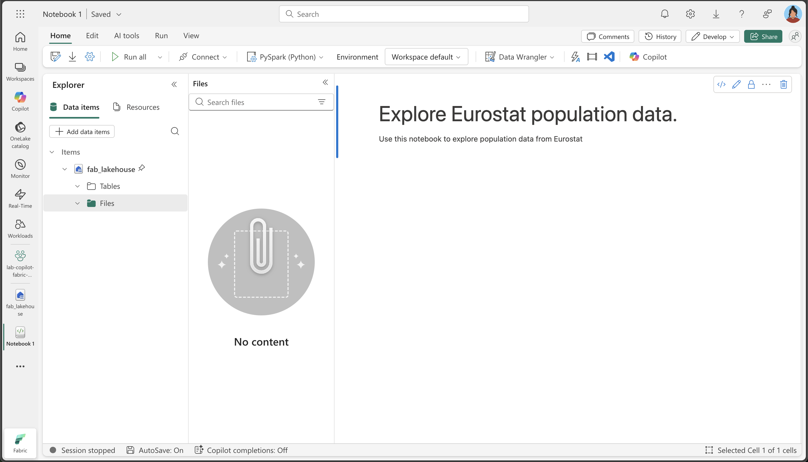
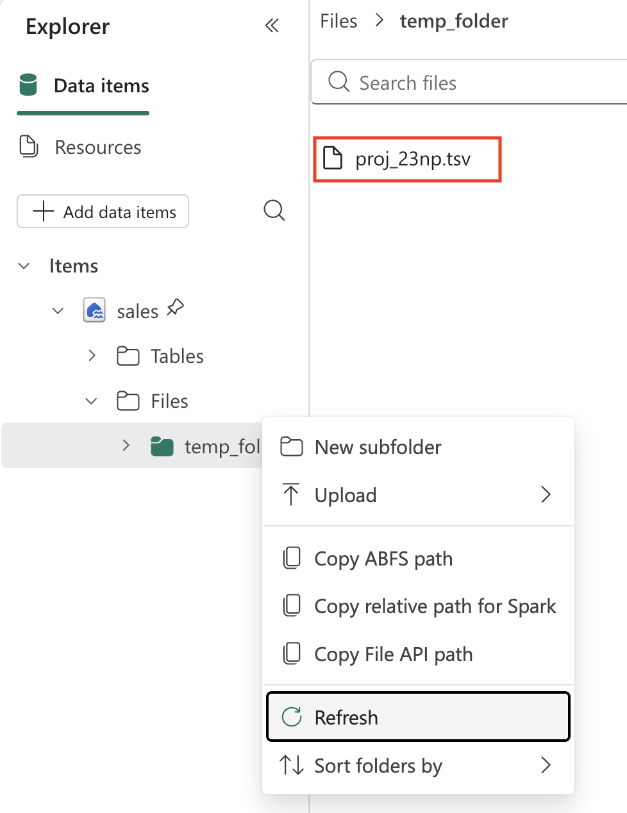
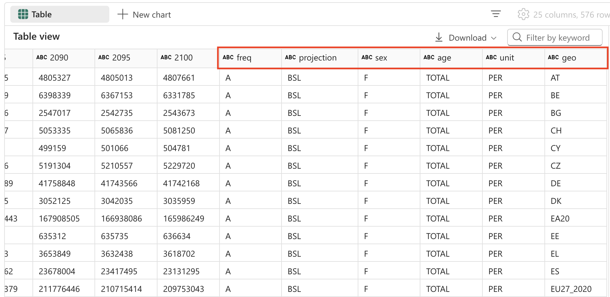
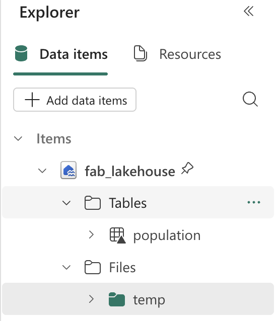

---
lab:
  title: Analisar dados com o Apache Spark e o Copilot em notebooks do Microsoft Fabric
  module: Get started with Copilot in Fabric for data engineering
---

# Analisar dados com o Apache Spark e o Copilot em notebooks do Microsoft Fabric

Neste laboratório, usamos o Copilot para Engenharia de Dados do Fabric para carregar, transformar e salvar dados em um Lakehouse usando um notebook. Os notebooks fornecem um ambiente interativo que combina código, visualizações e texto narrativo em um só documento. Esse formato facilita documentar seu fluxo de trabalho, explicar seu raciocínio e compartilhar resultados com outras pessoas. Usando notebooks, você pode desenvolver e testar código iterativamente, visualizar dados em cada etapa e manter um registro claro do processo de análise. Essa abordagem aprimora a colaboração, a reprodutibilidade e a compreensão, tornando os notebooks uma ferramenta ideal para tarefas de análise e engenharia de dados.

Tradicionalmente, trabalhar com notebooks para engenharia de dados exige que você escreva código em linguagens como Python ou Scala e tenha uma compreensão sólida de estruturas e bibliotecas como Apache Spark e pandas. Isso pode ser um desafio para desenvolvedores de programação iniciantes ou que não estão familiarizados com essas ferramentas. Com o Copilot nos notebooks do Fabric, você pode descrever suas tarefas de dados em linguagem natural e o Copilot gerará o código necessário para você, lidando com grande parte da complexidade técnica e permitindo que você foque a análise.

Este exercício deve levar aproximadamente **30** minutos para ser concluído.

## O que você aprenderá

Depois de concluir este laboratório, você será capaz de:

- Criar e configurar um workspace e um lakehouse do Microsoft Fabric para tarefas de engenharia de dados.
- Usar o Copilot em notebooks do Fabric para gerar código de prompts em linguagem natural.
- Ingerir, limpar e transformar dados usando fluxos de trabalho assistidos pelo Copilot e o Apache Spark.
- Normalizar e preparar conjuntos de dados estatísticos para análise dividindo, filtrando e convertendo tipos de dados.
- Salvar os dados transformados como uma tabela no lakehouse para análise downstream.
- Usar o Copilot para gerar consultas e visualizações para validação e exploração de dados.
- Entender as práticas recomendadas para limpeza de dados, transformação e análise colaborativa no Microsoft Fabric.

## Antes de começar

Você precisa de uma [Capacidade do Microsoft Fabric (F2 ou superior)](https://learn.microsoft.com/fabric/fundamentals/copilot-enable-fabric) com Copilot habilitado para concluir este exercício.

> **Observação**: para sua conveniência, um notebook com todos os prompts deste exercício está disponível para download em:

`https://github.com/MicrosoftLearning/mslearn-fabric/raw/refs/heads/main/Allfiles/Labs/22b/Starter/eurostat-notebook.ipynb`

## Cenário do exercício

Vamos imaginar que a Contoso Health, uma rede de hospital de várias especialidades, quer expandir seus serviços na UE e deseja analisar os dados de população projetos. Este exemplo usa o conjunto dados de projeção de população [Eurostat](https://ec.europa.eu/eurostat/web/main/home) (escritório estatístico da União Europeia).

Fonte: EUROPOP2023 População em 1º de janeiro por idade, sexo e tipo de projeção [[proj_23np](https://ec.europa.eu/eurostat/databrowser/product/view/proj_23np?category=proj.proj_23n)], última atualização em 28 de junho de 2023.

## Criar um workspace

Antes de trabalhar com os dados no Fabric, crie um workspace com o Fabric habilitado. Um workspace no Microsoft Fabric serve como um ambiente colaborativo em que você pode organizar e gerenciar todos os seus artefatos de engenharia de dados, incluindo lakehouses, notebooks e conjuntos de dados. Pense nele como uma pasta de projeto que contém todos os recursos necessários para sua análise de dados.

1. Navegue até a [home page do Microsoft Fabric](https://app.fabric.microsoft.com/home?experience=fabric) em `https://app.fabric.microsoft.com/home?experience=fabric` em um navegador e entre com suas credenciais do Fabric.

1. Na barra de menus à esquerda, selecione **Workspaces** (o ícone é semelhante a &#128455;).

1. Crie um workspace com um nome de sua escolha selecionando um modo de licenciamento que inclua a capacidade do Fabric (*Premium* ou *Fabric*). Observe que não há suporte para *Avaliação*.
   
    > **Por que isso importa**: o Copilot requer uma capacidade paga do Fabric para funcionar. Isso garante que você tenha acesso aos recursos baseados em IA que ajudarão a gerar código em todo o laboratório.

1. Quando o novo workspace for aberto, ele estará vazio.

    

## Criar um lakehouse

Agora que você tem um espaço de trabalho, é hora de criar um lakehouse no qual você ingerirá os dados. Um lakehouse combina os benefícios de um data lake (armazenamento de dados brutos em vários formatos) com um data warehouse (dados estruturados otimizados para análise). Ele servirá como o local de armazenamento para nossos dados brutos de população e o destino para nosso conjunto de dados limpo e transformado.

1. Na barra de menus à esquerda, selecione **Criar**. Na página *Novo*, na seção *Engenharia de Dados*, selecione **Lakehouse**. Dê um nome exclusivo de sua preferência.

    >**Observação**: se a opção **Criar** não estiver fixada na barra lateral, você precisará selecionar a opção de reticências (**...**) primeiro.


Após alguns minutos, um lakehouse vazio será criado.


## Criar um notebook

Agora você pode criar um notebook do Fabric para trabalhar com seus dados. Os notebooks fornecem um ambiente interativo em que você pode escrever e executar código, visualizar resultados e documentar seu processo de análise de dados. Eles são ideais para análise exploratória de dados e desenvolvimento iterativo, permitindo que você veja os resultados de cada etapa imediatamente.

1. Na barra de menus à esquerda, selecione **Criar**. Na página *Novo*, na seção *Engenharia de Dados*, selecione **Notebook**.

    Um novo notebook chamado **Notebook 1** é criado e aberto.

    

1. O Fabric atribui um nome a cada notebook criado, como Bloco de Notebook 1, Notebook 2, etc. Clique no painel de nome acima da guia **Página Inicial** no menu para alterar o nome para algo mais descritivo.

    

1. Selecione a primeira célula (que atualmente é uma célula de código) e, na barra de ferramentas no canto superior direito, use o botão **M↓** para convertê-la em uma célula Markdown. O texto contido na célula será então exibido como texto formatado.

    > **Por que usar células de markdown**: as células markdown permitem documentar sua análise com texto formatado, tornando o notebook mais legível e mais fácil de entender para outras pessoas (ou para você mesmo quando você retornar a ele mais tarde).

    

1. Use o botão 🖉 (Editar) para alternar a célula para o modo de edição e modifique o Markdown como mostrado abaixo.

    ```md
    # Explore Eurostat population data.
    Use this notebook to explore population data from Eurostat
    ```
    
    
    
    Quando terminar, clique em qualquer lugar no notebook fora da célula para parar de editá-lo.

## Anexar a lakehouse ao notebook

Para trabalhar com dados no lakehouse do notebook, você precisa anexar o lakehouse ao notebook. Essa conexão permite que seu notebook leia e grave no armazenamento lakehouse, criando uma integração perfeita entre o ambiente de análise e o armazenamento de dados.

1. Selecione seu novo espaço de trabalho na barra à esquerda. Você verá uma lista de itens contidos no espaço de trabalho, incluindo seu lakehouse e notebook.

1. Selecione o lakehouse para exibir o painel do Explorador.

1. No menu superior, clique em **Abrir notebook**, **Notebook existente** e, em seguida, abra o notebook criado anteriormente. O notebook abrirá ao lado do painel Explorer. Expanda Lakehouses e expanda a lista Arquivos. Observe que não há tabelas ou arquivos listados ainda ao lado do editor do notebook, portanto:

    

    > **O que você vê**: o painel do Explorador à esquerda mostra sua estrutura lakehouse. No momento, ele está vazio, mas à medida que carregamos e processemos dados, você verá arquivos aparecendo na seção **Arquivos** e tabelas aparecendo na seção **Tabelas**.


## Carregar dados

Agora, usaremos o Copilot para nos ajudar a baixar dados da API do Eurostat. Em vez de escrever código Python do zero, descreveremos o que queremos fazer em linguagem natural e o Copilot gerará o código apropriado. Isso demonstra um dos principais benefícios da codificação assistida por IA: você pode se concentrar na lógica de negócios, em vez de nos detalhes da implementação técnica.

1. Crie uma célula no notebook e copie a instrução a seguir para ela. Para indicar que queremos que o Copilot gere código, use `%%code` como a primeira instrução na célula. 

    > **Sobre o comando mágico `%%code`**: essa instrução especial informa ao Copilot que você deseja que ele gere código do Python com base em sua descrição de linguagem natural. É um dos vários "comandos mágicos" que ajudam você a interagir com o Copilot com mais eficiência.

    ```copilot-prompt
    %%code
    
    Download the following file from this URL:
    
    https://ec.europa.eu/eurostat/api/dissemination/sdmx/2.1/data/proj_23np$defaultview/?format=TSV
     
    Then write the file to the default lakehouse into a folder named temp. Create the folder if it doesn't exist yet.
    ```
    
1. Clique em ▷ **Executar célula** à esquerda da célula para executar o código.

    O Copilot gerou o código a seguir, que pode ser um pouco diferente dependendo do seu ambiente e das atualizações mais recentes do Copilot.
    
    
    
    > **Como o Copilot funciona**: observe como o Copilot converte sua solicitação de linguagem natural em código Python em funcionamento. Ele entende que você precisa fazer uma solicitação HTTP, manipular o sistema de arquivos e salvar os dados em um local específico em seu lakehouse.
    
    Aqui está o código completo para sua conveniência, caso você encontre exceções durante a execução:
    
    ```python
    #### ATTENTION: AI-generated code can include errors or operations you didn't intend. Review the code in this cell carefully before running it.
    
    import requests
    import os
    
    # Define the URL and the local path
    url = "https://ec.europa.eu/eurostat/api/dissemination/sdmx/2.1/data/proj_23np$defaultview/?format=TSV"
    local_path = "/lakehouse/default/Files/temp/"
    file_name = "proj_23np.tsv"
    file_path = os.path.join(local_path, file_name)
    
    # Create the temporary directory if it doesn't exist
    if not os.path.exists(local_path):
        os.makedirs(local_path)
    
    # Download the file
    response = requests.get(url)
    response.raise_for_status()  # Check that the request was successful
    
    # Write the content to the file
    with open(file_path, "wb") as file:
        file.write(response.content)
    
    print(f"File downloaded and saved to {file_path}")
    ```

1. Selecione ▷ **Executar célula** à esquerda da célula para executar o código e observe a saída. O arquivo deve ser baixado e salvo na pasta temporária do Lakehouse.

    > **Observação**: talvez seja necessário atualizar os Arquivos do lakehouse selecionando os três pontos ...
    
    

1. Agora que temos o arquivo de dados brutos no lakehouse, precisamos carregá-lo em um DataFrame do Spark para analisá-lo e transformá-lo. Crie uma célula no notebook e copie a instrução a seguir para ela.

    > **Informações**: um DataFrame é uma coleção distribuída de dados organizados em colunas nomeadas, semelhante a uma tabela em um banco de dados ou em uma planilha.

    ```copilot-prompt
    %%code
    
    Load the file 'Files/temp/proj_23np.tsv' into a spark dataframe.
    
    The fields are separated with a tab.
    
    Show the contents of the DataFrame using display method.
    ```

1. Selecione ▷ **Executar célula** à esquerda da célula para executar o código e observe a saída. O dataframe deve conter os dados do arquivo TSV. Veja um exemplo da aparência do código gerado:

    ```python
    #### ATTENTION: AI-generated code can include errors or operations you didn't intend. Review the code in this cell carefully before running it.
    
    # Load the file 'Files/temp/proj_23np.tsv' into a spark dataframe.
    # The fields have been separated with a tab.
    file_path = "Files/temp/proj_23np.tsv"
    
    spark_df = spark.read.format("csv").option("delimiter", "\t").option("header", "true").load(file_path)
    
    # Show the contents of the DataFrame using display method
    display(spark_df)
    ```

Aqui está um exemplo de como a saída pode ser:

| freq,projection,sex,age,unit,geo\TIME_PERIOD |      2022  |      2023  |   ...  |      2.100  |
| -------------------------------------------- | ---------- | ---------- | ------ | ---------- |
|                         A,BSL,F,TOTAL,PER,AT |   4553444  |   4619179  |   ...  |   4807661  |
|                         A,BSL,F,TOTAL,PER,BE |   5883978  |   5947528  |   ...  |   6331785  |
|                         A,BSL,F,TOTAL,PER,BG |   3527626  |   3605059  |   ...  |   2543673  |
|                                          ... |       ...  |       ...  |   ...  |   5081250  |
|                         A,BSL,F,TOTAL,PER,CY |    463622  |    476907  |   ...  |    504781  |

> **Noções básicas sobre a estrutura de dados**: observe que a primeira coluna contém diversos valores separados por vírgulas (frequência, tipo de projeção, sexo, idade, unidade e localização geográfica), enquanto as demais colunas representam anos com valores de população. Essa estrutura é comum em conjuntos de dados estatísticos, mas precisa ser limpa para análise eficaz.

## Transformar dados: dividir campos

Agora vamos transformar os dados. O primeiro campo deve ser dividido em colunas separadas. Além disso, também é preciso trabalhar com os tipos de dados corretos e aplicar a filtragem. 

> **Por que precisamos dividir os campos**: a primeira coluna contém várias informações concatenadas (frequência, tipo de projeção, sexo, faixa etária, unidade e código geográfico). Para uma análise adequada, cada informação deve estar em uma coluna própria. Esse processo é chamado de "normalização" da estrutura de dados.

1. Crie uma célula no notebook e copie a instrução a seguir para ela.


    ```copilot-prompt
    %%code
    
    From the currently loaded DataFrame, split the first field 'freq,projection,sex,age,unit,geo\TIME_PERIOD' using a comma into 6 separate fields.
    ```

1. Selecione ▷ **Executar célula** à esquerda da célula para executar o código e observe a saída. Aqui está um exemplo de como a saída pode ser:

    ```python
    #### ATTENTION: AI-generated code can include errors or operations you didn't intend. Review the code in this cell carefully before running it.
    
    from pyspark.sql.functions import split, col
    
    # Split the first field 'freq,projection,sex,age,unit,geo\TIME_PERIOD' into 6 separate fields
    spark_df = spark_df.withColumn("freq", split(col("freq,projection,sex,age,unit,geo\\TIME_PERIOD"), ",").getItem(0)) \
                       .withColumn("projection", split(col("freq,projection,sex,age,unit,geo\\TIME_PERIOD"), ",").getItem(1)) \
                       .withColumn("sex", split(col("freq,projection,sex,age,unit,geo\\TIME_PERIOD"), ",").getItem(2)) \
                       .withColumn("age", split(col("freq,projection,sex,age,unit,geo\\TIME_PERIOD"), ",").getItem(3)) \
                       .withColumn("unit", split(col("freq,projection,sex,age,unit,geo\\TIME_PERIOD"), ",").getItem(4)) \
                       .withColumn("geo", split(col("freq,projection,sex,age,unit,geo\\TIME_PERIOD"), ",").getItem(5))
    
    # Show the updated DataFrame
    display(spark_df)
    ```

1. Clique em ▷ **Executar célula** à esquerda da célula para executar o código. Talvez seja necessário rolar a tabela para a direita para ver os novos campos adicionados a ela.

    

## Transformar dados: remover campos

Alguns campos na tabela não agregam nenhum valor significativo, pois contêm apenas uma entrada distinta. Como prática recomendada, devemos removê-los do conjunto de dados.

> **Princípio de limpeza de dados**: Colunas com apenas um valor exclusivo não fornecem valor analítico e podem tornar seu conjunto de dados desnecessariamente complexo. Removê-las simplifica a estrutura de dados e melhora o desempenho. Nesse caso, "freq" (frequência), "age" (todos os registros mostram TOTAL) e "unit" (todos os registros mostram PER para pessoas) são constantes em todas as linhas.

1. Crie uma célula no notebook e copie a instrução a seguir para ela.

    ```copilot-prompt
    %%code
    
    From the currently loaded DataFrame, remove the fields 'freq', 'age', 'unit'.
    ```

1. Selecione ▷ **Executar célula** à esquerda da célula para executar o código e observe a saída. Aqui está um exemplo de como a saída pode ser:

    ```python
    #### ATTENTION: AI-generated code can include errors or operations you didn't intend. Review the code in this cell carefully before running it.
    
    # Remove the fields 'freq', 'age', 'unit'
    spark_df = spark_df.drop("freq", "age", "unit")
    
    # Show the updated DataFrame
    display(spark_df)
    ```

1. Clique em ▷ **Executar célula** à esquerda da célula para executar o código.

## Transformar dados: reposicionar campos

Organizar seus dados com as colunas de identificação mais importantes primeiro facilita a leitura e a compreensão. Na análise de dados, é uma prática comum posicionar colunas categóricas/dimensionais (como tipo de projeção, sexo e localização geográfica) antes das colunas numéricas/de medida (os valores de população por ano).

1. Crie uma célula no notebook e copie a instrução a seguir para ela.

    ```copilot-prompt
    %%code
    
    From the currently loaded DataFrame, the fields 'projection', 'sex', 'geo' should be positioned first.
    ```

1. Selecione ▷ **Executar célula** à esquerda da célula para executar o código e observe a saída. Aqui está um exemplo de como a saída pode ser:

    ```python
    #### ATTENTION: AI-generated code can include errors or operations you didn't intend. Review the code in this cell carefully before running it.
    
    # Reorder the DataFrame with 'projection', 'sex', 'geo' fields first
    new_column_order = ['projection', 'sex', 'geo'] + [col for col in spark_df.columns if col not in {'projection', 'sex', 'geo'}]
    spark_df = spark_df.select(new_column_order)
    
    # Show the reordered DataFrame
    display(spark_df)
    ```

1. Clique em ▷ **Executar célula** à esquerda da célula para executar o código.

## Transformar dados: substituir valores

No momento, o campo de projeção contém códigos criptográficos que não são amigáveis. Para melhor legibilidade e análise, substituiremos esses códigos por nomes descritivos que explicam claramente o que cada cenário de projeção representa.

> **Noções básicas sobre cenários de projeção**: as organizações estatísticas geralmente usam cenários diferentes para modelar futuras alterações de população. A linha de base representa o cenário mais provável, enquanto os testes de sensibilidade mostram como a população pode mudar sob suposições diferentes sobre taxas de fertilidade, taxas de mortalidade e padrões de migração.

1. Crie uma célula no notebook e copie a instrução a seguir para ela.


    ```copilot-prompt
    %%code
    
    The 'projection' field contains codes that should be replaced with the following values:
        _'BSL' -> 'Baseline projections'.
        _'LFRT' -> 'Sensitivity test: lower fertility'.
        _'LMRT' -> 'Sensitivity test: lower mortality'.
        _'HMIGR' -> 'Sensitivity test: higher migration'.
        _'LMIGR' -> 'Sensitivity test: lower migration'.
        _'NMIGR' -> 'Sensitivity test: no migration'.
    ```

1. Selecione ▷ **Executar célula** à esquerda da célula para executar o código e observe a saída. Aqui está um exemplo de como a saída pode ser:

    ```python
    #### ATTENTION: AI-generated code can include errors or operations you didn't intend. Review the code in this cell carefully before running it.
    
    from pyspark.sql.functions import when
    
    # Replace projection codes
    spark_df = spark_df.withColumn("projection", 
                                   when(spark_df["projection"] == "BSL", "Baseline projections")
                                   .when(spark_df["projection"] == "LFRT", "Sensitivity test: lower fertility")
                                   .when(spark_df["projection"] == "LMRT", "Sensitivity test: lower mortality")
                                   .when(spark_df["projection"] == "HMIGR", "Sensitivity test: higher migration")
                                   .when(spark_df["projection"] == "LMIGR", "Sensitivity test: lower migration")
                                   .when(spark_df["projection"] == "NMIGR", "Sensitivity test: no migration")
                                   .otherwise(spark_df["projection"]))
    
    # Display the updated DataFrame
    display(spark_df)
    ```

1. Clique em ▷ **Executar célula** à esquerda da célula para executar o código.

    
    
## Transformar dados: filtrar dados

A tabela de projeções de população contém 2 linhas para países que não existem: EU27_2020 (*totais da União Europeia - 27 países*) e EA20 (*área do Euro - 20 países*). Precisamos remover essas duas linhas, pois queremos manter os dados apenas com a granulação mais baixa.

> **Princípio de granularidade de dados**: para análise detalhada, é importante trabalhar com dados no nível mais granular possível. Valores agregados (como totais da UE) sempre podem ser calculados quando necessário, mas incluí-los em seu conjunto de dados base pode causar contagem duplicada ou confusão na análise.


1. Crie uma célula no notebook e copie a instrução a seguir para ela.

    ```copilot-prompt
    %%code
    
    Filter the 'geo' field and remove values 'EA20' and 'EU27_2020' (these are not countries).
    ```

1. Selecione ▷ **Executar célula** à esquerda da célula para executar o código e observe a saída. Aqui está um exemplo de como a saída pode ser:

    ```python
    #### ATTENTION: AI-generated code can include errors or operations you didn't intend. Review the code in this cell carefully before running it.
    
    # Filter out 'geo' values 'EA20' and 'EU27_2020'
    spark_df = spark_df.filter((spark_df['geo'] != 'EA20') & (spark_df['geo'] != 'EU27_2020'))
    
    # Display the filtered DataFrame
    display(spark_df)
    ```

1. Clique em ▷ **Executar célula** à esquerda da célula para executar o código.

    A tabela de projeto de população também contém um campo "sexo" com os seguintes valores distintos:
    
    - M: masculino
    - F: feminino
    - T: total (masculino + feminino)

    Novamente, precisamos remover os totais, portanto, manteremos os dados no nível mais baixo de detalhes.

    > **Por que remover os totais**: semelhante às agregações geográficas, queremos manter apenas as categorias de sexo individuais (masculino e feminino) e excluir os valores totais. Isso permite uma análise mais flexível. Você sempre pode somar valores masculinos e femininos para obter totais, mas não pode dividir totais de volta em componentes.

1. Crie uma célula no notebook e copie a instrução a seguir para ela.

    ```copilot-prompt
    %%code
    
    Filter the 'sex' field and remove 'T' (these are totals).
    ```

1. Selecione ▷ **Executar célula** à esquerda da célula para executar o código e observe a saída. Aqui está um exemplo de como a saída pode ser:

    ```python
    #### ATTENTION: AI-generated code can include errors or operations you didn't intend. Review the code in this cell carefully before running it.
    
    # Filter out 'sex' values 'T'
    spark_df = spark_df.filter(spark_df['sex'] != 'T')
    
    # Display the filtered DataFrame
    display(spark_df)
    ```

1. Clique em ▷ **Executar célula** à esquerda da célula para executar o código.

## Transformar dados: cortar espaços

Alguns nomes de campo na tabela de projeção de população têm um espaço no final. Precisamos aplicar uma operação de corte aos nomes desses campos.

> **Preocupação sobre qualidade de dados**: espaços extras em nomes de coluna podem causar problemas ao consultar dados ou criar visualizações. É um problema comum de qualidade de dados, especialmente quando os dados vêm de fontes externas ou são exportados de outros sistemas. A filtragem de espaços garante a consistência e evita problemas difíceis de depurar mais tarde.

1. Crie uma célula no notebook e copie a instrução a seguir para ela.

    ```copilot-prompt
    %%code
    
    Strip spaces from all field names in the dataframe.
    ```

1. Selecione ▷ **Executar célula** à esquerda da célula para executar o código e observe a saída. Aqui está um exemplo de como a saída pode ser:

    ```python
    #### ATTENTION: AI-generated code can include errors or operations you didn't intend. Review the code in this cell carefully before running it.
    
    from pyspark.sql.functions import col
    
    # Strip spaces from all field names
    spark_df = spark_df.select([col(column).alias(column.strip()) for column in spark_df.columns])
    
    # Display the updated DataFrame
    display(spark_df)
    ```

1. Clique em ▷ **Executar célula** à esquerda da célula para executar o código.

## Transformar dados: conversão de tipo de dados

Se quisermos analisar corretamente os dados mais tarde (usando o Power BI ou SQL, por exemplo), precisaremos verificar se os tipos de dados (como números e datetime) estão definidos corretamente. 

> **Importância dos tipos de dados corretos**: quando os dados são carregados de arquivos de texto, todas as colunas são inicialmente tratadas como cadeias de caracteres. A conversão de colunas de ano em inteiros permite operações matemáticas (como cálculos e agregações) e garante a classificação adequada. Essa etapa é crucial para ferramentas de análise e visualização downstream.

1. Crie uma célula no notebook e copie a instrução a seguir para ela.

    ```copilot-prompt
    %%code
    
    Convert the data type of all the year fields to integer.
    ```

1. Selecione ▷ **Executar célula** à esquerda da célula para executar o código e observe a saída. Aqui está um exemplo de como a saída pode ser:

    ```python
    #### ATTENTION: AI-generated code can include errors or operations you didn't intend. Review the code in this cell carefully before running it.
    
    from pyspark.sql.functions import col
    
    # Convert the data type of all the year fields to integer
    year_columns = [col(column).cast("int") for column in spark_df.columns if column.strip().isdigit()]
    spark_df = spark_df.select(*spark_df.columns[:3], *year_columns)
    
    # Display the updated DataFrame
    display(spark_df)
    ```
    
1. Clique em ▷ **Executar célula** à esquerda da célula para executar o código. Aqui está um exemplo da aparência da saída (colunas e linhas removidas para fins de brevidade):

|          projeção|sexo|geo|    2022|    2023|     ...|    2.100|
|--------------------|---|---|--------|--------|--------|--------| 
|Projeções de linha de base|  F| AT| 4553444| 4619179|     ...| 4807661|
|Projeções de linha de base|  F| BE| 5883978| 5947528|     ...| 6331785|
|Projeções de linha de base|  F| BG| 3527626| 3605059|     ...| 2543673|
|...                 |...|...|     ...|     ...|     ...|     ...|
|Projeções de linha de base|  F| LU|  320333|  329401|     ...|  498954|

>[!TIP]
> Talvez seja necessário rolar a tabela para a direita para observar todas as colunas.

## Salvar dados

Em seguida, queremos salvar os dados transformados em nosso lakehouse. 

> **Por que salvar os dados transformados**: após todo esse trabalho de limpeza e transformação de dados, queremos manter os resultados. Salvar os dados como uma tabela no lakehouse permite que nós e outras pessoas usem esse conjunto de dados limpo para vários cenários de análise sem necessidade de repetir o processo de transformação. Ele também permite que outras ferramentas no ecossistema do Microsoft Fabric (como Power BI, Ponto de Extremidade da Análise de SQL e Data Factory) funcionem com esses dados.

1. Crie uma célula no notebook e copie a instrução a seguir para ela.

    ```copilot-prompt
    %%code
    
    Save the dataframe as a new table named 'Population' in the default lakehouse.
    ```
    
1. Clique em ▷ **Executar célula** à esquerda da célula para executar o código. O Copilot gerou o código, que pode ser um pouco diferente dependendo do seu ambiente e das atualizações mais recentes do Copilot.

    ```python
    #### ATTENTION: AI-generated code can include errors or operations you didn't intend. Review the code in this cell carefully before running it.
    
    spark_df.write.format("delta").saveAsTable("Population")
    ```

1. Clique em ▷ **Executar célula** à esquerda da célula para executar o código.

## Validação: fazer perguntas

Agora vamos explorar o poder do Copilot para análise de dados. Em vez de escrever consultas SQL complexas ou código de visualização do zero, podemos fazer perguntas em linguagem natural do Copilot sobre nossos dados e ele gerará o código apropriado para respondê-las.

1. Para validar se os dados foram salvos corretamente, expanda as tabelas no Lakehouse e verifique o conteúdo (talvez seja necessário atualizar a pasta Tabelas selecionando os três pontos ...). 

    

1. Na faixa de opções da Página Inicial, selecione a opção Copilot.

    > **Interface do Copilot Chat**: o painel do Copilot fornece uma interface de conversa em que você pode fazer perguntas sobre seus dados em linguagem natural. Ela pode gerar código para análise, criar visualizações e ajudá-lo a explorar padrões em seu conjunto de dados.

    

1. Digite a seguinte solicitação:

    ```copilot-prompt
    What are the projected population trends for geo BE  from 2020 to 2050 as a line chart visualization. Make sure to sum up male and female numbers. Use only existing columns from the population table. Perform the query using SQL.
    ```

    > **O que isso demonstra**: este prompt demonstra a capacidade do Copilot de entender o contexto (nossa tabela População), gerar consultas SQL e criar visualizações. Ele é particularmente eficiente porque combina a consulta de dados com a visualização em uma só solicitação.

1. Examine a saída gerada, que pode ser um pouco diferente dependendo do seu ambiente e das atualizações mais recentes do Copilot. Copie o fragmento de código em uma nova célula.

    ```python
    #### ATTENTION: AI-generated code can include errors or operations you didn't intend. Review the code in this cell carefully before running it.
    
    import plotly.graph_objs as go
    
    # Perform the SQL query to get projected population trends for geo BE, summing up male and female numbers
    result = spark.sql(
        """
        SELECT projection, sex, geo, SUM(`2022`) as `2022`, SUM(`2023`) as `2023`, SUM(`2025`) as `2025`,
               SUM(`2030`) as `2030`, SUM(`2035`) as `2035`, SUM(`2040`) as `2040`,
               SUM(`2045`) as `2045`, SUM(`2050`) as `2050`
        FROM Population
        WHERE geo = 'BE' AND projection = 'Baseline projections'
        GROUP BY projection, sex, geo
        """
    )
    df = result.groupBy("projection").sum()
    df = df.orderBy("projection").toPandas()
    
    # Extract data for the line chart
    years = df.columns[1:].tolist()
    values = df.iloc[0, 1:].tolist()
    
    # Create the plot
    fig = go.Figure()
    fig.add_trace(go.Scatter(x=years, y=values, mode='lines+markers', name='Projected Population'))
    
    # Update the layout
    fig.update_layout(
        title='Projected Population Trends for Geo BE (Belgium) from 2022 to 2050',
        xaxis_title='Year',
        yaxis_title='Population',
        template='plotly_dark'
    )
    
    # Display the plot
    fig.show()
    ```

1. Clique em ▷ **Executar célula** à esquerda da célula para executar o código. 

    Observe o gráfico que ele criou:
    
    
    
    > **O que você realizou**: você usou o Copilot para gerar uma visualização que mostra tendências de população para a Bélgica ao longo do tempo. Isso demonstra o fluxo de trabalho de engenharia de dados de ponta a ponta: ingestão, transformação, armazenamento e análise de dados, tudo com assistência de IA.

## Limpar os recursos

Neste exercício, você aprendeu a usar o Copilot e o Spark para trabalhar com os dados no Microsoft Fabric.

Se você tiver terminado de explorar seus dados, encerre a sessão do Spark e exclua o espaço de trabalho criado para este exercício.

1.  No menu do notebook, selecione **Parar sessão** para encerrar a sessão do Spark.
1.  Na barra à esquerda, selecione o ícone do workspace para ver todos os itens que ele contém.
1.  Clique em **Configurações do espaço de trabalho** e, na seção **Geral**, role para baixo e selecione **Remover este espaço de trabalho**.
1.  Clique em **Excluir** para excluir o espaço de trabalho.
