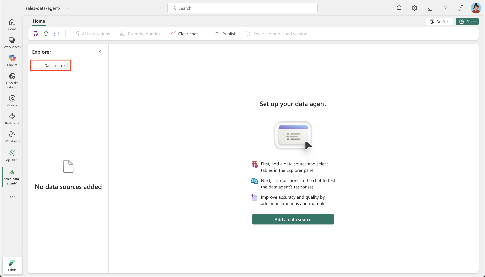

---
lab:
  title: Converse com seus dados usando os agentes de dados do Microsoft Fabric
  module: Implement Fabric Data Agents
---

# Converse com seus dados usando os agentes de dados do Microsoft Fabric

Um agente de dados do Microsoft Fabric permite a interação natural com seus dados, possibilitando que você faça perguntas em inglês simples e receba respostas estruturadas e legíveis por humanos. Ao eliminar a necessidade de entender linguagens de consulta como SQL (linguagem SQL), DAX (Data Analysis Expressions) ou KQL (Linguagem de Consulta Kusto), o agente de dados torna os insights de dados acessíveis em toda a organização, não importa o nível de habilidade técnica.

Este exercício deve levar aproximadamente **30** minutos para ser concluído.

## O que você aprenderá

Ao concluir este laboratório, você vai:

- Entenda a finalidade e os benefícios dos agentes de dados do Microsoft Fabric para análise de dados em linguagem natural.
- Saiba como criar e configurar um workspace do Fabric e data warehouse.
- Obtenha experiência prática carregando e explorando um conjunto de dados de vendas de esquema em estrela.
- Veja como os agentes de dados convertem perguntas simples em inglês em consultas SQL.
- Desenvolver habilidades para fazer perguntas analíticas eficazes e interpretar os resultados gerados por IA.
- Criar confiança ao aproveitar as ferramentas de IA para democratizar o acesso e os insights de dados.

## Antes de começar

Você precisa de uma [Capacidade do Microsoft Fabric (F2 ou superior)](https://learn.microsoft.com/fabric/fundamentals/copilot-enable-fabric) com Copilot habilitado para concluir este exercício.

## Cenário do exercício

Neste exercício, criaremos uma lista de data warehouse, carregaremos alguns dados nele e criaremos um agente de dados do Fabric. Depois, faremos várias perguntas e exploraremos como o agente de dados converte a linguagem natural em consultas SQL para gerar insights. Essa abordagem prática demonstrará o poder da análise de dados assistida por IA sem exigir conhecimento profundo de SQL. Vamos começar!

## Criar um workspace

Antes de trabalhar com os dados no Fabric, crie um workspace com o Fabric habilitado. Um workspace no Microsoft Fabric serve como um ambiente colaborativo em que você pode organizar e gerenciar todos os seus artefatos de engenharia de dados, incluindo lakehouses, notebooks e conjuntos de dados. Pense nele como uma pasta de projeto que contém todos os recursos necessários para sua análise de dados.

1. Navegue até a [home page do Microsoft Fabric](https://app.fabric.microsoft.com/home?experience=fabric) em `https://app.fabric.microsoft.com/home?experience=fabric` em um navegador e entre com suas credenciais do Fabric.

1. Na barra de menus à esquerda, selecione **Workspaces** (o ícone é semelhante a &#128455;).

1. Crie um workspace com um nome de sua escolha selecionando um modo de licenciamento que inclua a capacidade do Fabric (*Premium* ou *Fabric*). Observe que não há suporte para *Avaliação*.
   
    > **Por que isso importa**: o Copilot requer uma capacidade paga do Fabric para funcionar. Isso garante que você tenha acesso aos recursos baseados em IA que ajudarão a gerar código em todo o laboratório.

1. Quando o novo workspace for aberto, ele estará vazio.


## Criar um data warehouse

Agora que você tem um espaço de trabalho, é hora de criar um data warehouse. Um data warehouse é um repositório centralizado que armazena dados estruturados de várias fontes, otimizados para relatórios e consultas analíticas. Em nosso caso, criaremos um data warehouse de vendas simples que servirá como base para nossas interações com o agente de dados. Localize o atalho para criar um depósito:

1. Na barra de menus à esquerda, selecione **Criar**. Na página *Novo*, na seção *Data Warehouse*, selecione **Warehouse**. Dê um nome exclusivo de sua preferência.

    >**Observação**: se a opção **Criar** não estiver fixada na barra lateral, você precisará selecionar a opção de reticências (**...**) primeiro.

    Após alguns minutos, um warehouse será criado:

    

## Criar tabelas e inserir dados

Um warehouse é um banco de dados relacional no qual você pode definir tabelas e outros objetos. Para tornar nosso agente de dados útil, precisamos preenchê-lo com amostras de dados de vendas. O script que executaremos cria um esquema de data warehouse típico com tabelas de dimensões (contendo atributos descritivos) e uma tabela de fatos (contendo eventos de negócios mensuráveis). Esse design de esquema em estrela é otimizado para consultas analíticas que o agente de dados gerará.

1. Na guia do menu **Página Inicial**, use o botão **Nova Consulta SQL** para criar uma consulta. Em seguida, copie e cole o código Transact-SQL de `https://raw.githubusercontent.com/MicrosoftLearning/mslearn-fabric/refs/heads/main/Allfiles/Labs/22d/create-dw.txt` no novo painel de consulta.

    > **O que esse script faz**: o script cria um conjunto de vendas data warehouse com informações do cliente, detalhes do produto, dimensões de data e transações de vendas. Esse conjunto de dados realista permitirá fazer perguntas comerciais relevantes ao agente de dados.

1. Execute a consulta, que criará um esquema de data warehouse simples e carregará alguns dados. O script levará cerca de 30 segundos para ser executado.

1. Use o botão **Atualizar** da barra de ferramentas para atualizar a exibição. Em seguida, no painel do **Explorer**, verifique se o esquema **dbo** no data warehouse já contém as quatro seguintes tabelas:
   
    - **DimCustomer**: contém informações do cliente, incluindo nomes, locais e dados de contato
    - **DimDate**: contém atributos relacionados à data, como anos fiscais, trimestres e meses para análise baseada em tempo
    - **DimProduct**: contém informações sobre o produto, incluindo nomes, categorias e preços
    - **FactSalesOrder**: contém as transações de vendas reais que vinculam clientes, produtos e datas

    > **Dica**: se o esquema demorar um pouco para ser carregado, basta atualizar a página do navegador.

## Como criar um agente de dados do Fabric

Um agente de dados do Fabric é um assistente habilitado para IA que pode entender perguntas em linguagem natural sobre seus dados e gerar automaticamente as consultas apropriadas para responder a eles. Isso elimina a necessidade de os usuários conhecerem a sintaxe SQL, KQL ou DAX enquanto ainda fornecem insights precisos e controlados por dados. Vamos criar e configurar nosso agente de dados:

1. Crie um agente de dados.
   
    

1. Dê a ele um nome como **`sales-data-agent`**.

    > **Por que a nomenclatura importa**: um nome descritivo ajuda você e sua equipe a entender a finalidade e o escopo desse agente de dados, especialmente ao gerenciar vários agentes para domínios de dados distintos.
    
    

1. Selecione **Adicionar uma fonte de dados**. 

    

1. Escolha o data warehouse criado antes.

    > **Como conectar-se aos seus dados**: o agente de dados precisa acessar suas tabelas para entender o esquema e os relacionamentos. Com isso, o agente pode gerar consultas SQL precisas com base nas perguntas.

1. Expanda o data warehouse e marque **DimCustomer**, **DimDate**, **DimProduct** e **FactSalesOrder**.

    > **Estratégia de seleção de tabela**: ao selecionar todas as quatro tabelas, estamos dando ao agente de dados acesso ao modelo de dados completo. Com isso, o agente consegue responder a perguntas complexas que abrangem várias tabelas, como tendências de vendas por localização do cliente ou desempenho do produto ao longo do tempo.

    

## Faça perguntas

Agora é a hora de começar a experimentar e fazer perguntas ao agente de dados. Esta seção demonstra como a linguagem natural pode ser transformada em consultas SQL, tornando a análise de dados acessível aos usuários que não têm conhecimento técnico de SQL. Cada pergunta mostrará a resposta e a consulta subjacente gerada.

1. Faça uma pergunta digitando no seguinte prompt: 

    ```copilot-prompt
    How many products did we sell by fiscal year?
    ```

    Observe a resposta resultante: Vendemos um total de 12.630 produtos no ano fiscal de 2021 e 13.336 produtos no ano fiscal de 2022.

1. Expanda a etapa concluída e sua subetapa. Isso revela a consulta SQL gerada pelo agente de dados para responder à pergunta.

    > **Oportunidade de aprendizado**: examinando o SQL gerado, você pode entender como o agente de dados interpretou sua pergunta e aprender sobre os relacionamentos de dados subjacentes. Essa transparência gera confiança nos resultados que a IA produz.
    
    
    
    O Copilot gerou o código SQL a seguir, que pode ser um pouco diferente dependendo do seu ambiente e das atualizações mais recentes do Copilot.
    
    ```sql
    SELECT d.Year, SUM(f.Quantity) AS TotalProductsSold
    FROM dbo.FactSalesOrder f
    JOIN dbo.DimDate d ON f.SalesOrderDateKey = d.DateKey
    GROUP BY d.Year
    ORDER BY d.Year;
    ```

    > **Explicação em SQL**: essa consulta une a tabela de fatos (FactSalesOrder) com a dimensão de data (DimDate) para agrupar as vendas por ano e somar as quantidades. Observe como o agente de dados entendeu automaticamente que "produtos vendidos" se refere ao campo Quantidade e "ano fiscal" mapeia para o campo Ano na dimensão de data.

1. Continue com a seguinte pergunta: 

    ```copilot-prompt
    What are the top 10 most popular products all time?
    ```

    > **O que esperar:** essa pergunta demonstrará como o agente de dados pode executar operações de classificação, unindo as informações sobre o produto com os dados das vendas para identificar os mais vendidos.

1. Acompanhe esta pergunta: 

    ```copilot-prompt
    What are the historical trends across all my data?
    ```

    > **Análise avançada**: essa pergunta mais ampla mostrará como o agente de dados pode fornecer análise de tendência em várias dimensões, potencialmente incluindo padrões baseados em tempo sobre vendas, comportamento do cliente e desempenho do produto.

1. Tente fazer mais perguntas para explorar diferentes aspectos dos seus dados:

    ```copilot-prompt
    In which countries are our customers located?
    ```
    
    ```copilot-prompt
    How many products did we sell in the United States?
    ```
    
    ```copilot-prompt
    How much revenue did we make in FY 2022?
    ```
    
    ```copilot-prompt
    How much was our total sales revenue, by fiscal year, fiscal quarter and month name?
    ```

    > **Dica profissional**: cada uma destas perguntas é direcionada a diferentes cenários analíticos: análise geográfica, agregações filtradas, cálculos de receita e análise hierárquica de tempo. Experimente variações para ver como o agente de dados se adapta a diferentes estilos de pergunta.

## Noções básicas sobre sua estrutura de dados

À medida que você experimenta perguntas, lembre-se destas características de dados para fazer perguntas mais direcionadas:

- **Momento do ano fiscal**: o ano fiscal começa em julho (o 7º mês). Portanto, o T1 vai de julho a setembro, o T2 vai de outubro a dezembro, o T3 vai de janeiro a março e o T4 vai de abril a junho.

- **Identificação do cliente**: o campo CustomerAltKey contém endereços de email do cliente, que podem ser úteis para consultas específicas do cliente.

- **Moeda**: todos os preços de lista e totais de vendas são denominados em GBP (libras esterlinas).

- **Relacionamentos de dados**: a tabela FactSalesOrder conecta clientes, produtos e datas por meio de chaves estrangeiras, permitindo uma análise multidimensional complexa.

> **Experimente mais**: tente fazer perguntas que combinem elementos como "Qual foi a receita no primeiro trimestre de 2022?" ou "Quais clientes no Reino Unido compraram os produtos mais caros?". O agente de dados manipulará automaticamente as junções complexas e os cálculos necessários para responder a estas perguntas.

## Resumo

Parabéns! Você teve êxito em:

- **Criou um workspace** e data warehouse do Fabric com um conjunto de dados de vendas realista
- **Criou e configurou um agente de dados** que consegue entender as perguntas em linguagem natural sobre seus dados
- **Experimentou a análise de dados com IA** fazendo perguntas em linguagem simples e vendo como elas se convertem em consultas SQL
- **Explorou vários tipos de perguntas analíticas** desde agregações simples até análise de tendência complexa

### Principais aspectos a serem lembrados

- **Democratizou o acesso a dados**: os agentes de dados tornam a análise acessível aos usuários sem exigir conhecimento de SQL
- **Transparência e confiança**: você sempre pode inspecionar o SQL gerado para entender como as perguntas são respondidas
- **Flexibilidade de linguagem natural**: a IA pode lidar com variações na frase e até mesmo pequenos erros de digitação nas perguntas
- **Geração de consulta complexa**: o agente processa automaticamente junções, agregações e filtros com base na entrada em linguagem natural

### Próximas etapas

Considere explorar:

- **Instruções personalizadas**: adicione contexto específico de negócios para melhorar as respostas do agente de dados
- **Fontes de dados adicionais**: conecte mais tabelas ou conjuntos de dados para expandir o conhecimento do agente
- **Perguntas avançadas**: experimente cenários analíticos mais complexos que envolvem vários períodos, segmentos de clientes ou categorias de produtos
- **Integração**: insira insights do agente de dados em relatórios, dashboards ou aplicativos de negócios

O agente de dados do Fabric representa uma etapa relevante para tornar os insights de dados de fato acessíveis em toda a organização, criando uma ponte entre os dados e a tomada de decisões.
